# GeoView Mapping Tools #

This documentation describes the GeoView software component,
which is a Java library used to implement map interfaces for software.

* [Overview](#overview)
* [GeoView Terminology](#geoview-terminology)
* [The GeoView Panel](#the-geoview-panel)
* [Interacting with the GeoView Map](#interacting-with-the-geoview-map)
* [Setting GeoView Properties](#setting-geoview-properties)
* [Viewing a Layer’s Attributes](#viewing-a-layers-attributes)
* [Using GeoView with a Software Application](#using-geoview-with-a-software-application)
* [Limitations](#limitations)
* [GeoView Configuration - the GeoView Project File](#geoview-configuration-the-geoview-project-file)
	+ [Color Specification](#color-specification)
	+ [Color Tables](#color-tables)
	+ [Symbol Style - Point Data](#symbol-style-point-data)
	+ [Classification](#classification)
* [GeoView Project File Examples](#geoview-project-file-examples)

--------------

## Overview ##

The GeoView package contains integrated software components
that can be used with software to enable map-based interfaces.
The main purpose of the GeoView package is to provide simple and
flexible map displays that can be used in a variety of software applications with little or no reconfiguration.

The GeoView package has been developed by the Open Water Foundation using Java technology.
GeoView interfaces can be embedded in Java applications (e.g.,
use GeoView as the main window interface), can be enabled as a separate
floating window (e.g., to support an application's features without being embedded in the main window),
and can be used in web pages either as embedded map applets or stand-alone map windows.  GeoView tools operate similarly on various operating systems.

This appendix describes general GeoView features and can be used as a
reference for how to configure and use GeoView components.
Specific uses of GeoView in a software program are discussed in the
documentation for the specific software.
Some of the figures shown in this documentation were generated using
GeoView with the TSTool software and consequently title bars include TSTool in the wording.

## GeoView Terminology ##

GeoView terminology is similar to other GIS product terminology.
Important terms are shown in the following table, listed in conceptual order.
These terms are used infrequently in most user interfaces and
applications but are visible at times in property dialogs and configuration files.

**<p style="text-align: center;">
GeoView Terminology
</p>**

|**Term**&nbsp;&nbsp;&nbsp;&nbsp;&nbsp;&nbsp;&nbsp;&nbsp;&nbsp;&nbsp;&nbsp;&nbsp;&nbsp;&nbsp;&nbsp;&nbsp;&nbsp;&nbsp;&nbsp;&nbsp;&nbsp;&nbsp;&nbsp;&nbsp;&nbsp;&nbsp;&nbsp;&nbsp;&nbsp;&nbsp;&nbsp;&nbsp;|**Description**|
|--|--|
|*GeoView*|The visible map window where maps are displayed.  Currently there can be only one main GeoView.  A reference GeoView may be used to show the zoom extents in the main GeoView.|
|*GeoLayer*|A data layer, in its "raw" form (e.g., an Esri Shapefile).  The more generic term "layer" is often used.|
|*GeoLayerView*|A view of a GeoLayer, with symbol properties for visualization.  The more generic term "layer view" is often used.  This is equivalent to a "theme" in some software packages.|
|*Feature*|A general term describing an item on the map, consisting of shape and attribute data.|
|*Shape*|A general term defining the type of feature (e.g., point, polygon).  The shape type defines the ways that a feature can be symbolized and used in analysis.  Shape types can typically be determined automatically from input data.|
|*Attributes*|A general term defining non-shape data that are associated with a feature.  Often, attributes are stored in a tabular form, such as a relational database table.  Attributes are usually associated with a shape using some type of index number (shape index).|
|*Symbol*|The combination of properties used to visualize a layer (e.g., symbol style, color, labeling, classification).  The feature shape type controls how the feature can be symbolized.|
|*GeoView Project*|A GeoView Project file (.gvp) can be used to define the layers and global viewing properties for a GeoView.  The contents of this file are described in more detail in the [GeoView Configuration – the GeoView Project File section](#geoview-configuration-the-geoview-project-file) at the end of this appendix.|
|*Application Layer Type*|Because GeoView is a generic tool, it has no implicit understanding of the types of data that are important to an application.  The AppLayerType is a property that can be assigned to layers in a GeoView Project file to help an application know that a layer is important to the application.  An application layer type of "BaseLayer" indicates that a layer should be used for background information and is not specific to the application.  See the [Using GeoView with a Software Application section](#using-geoview-with-a-software-application) below for more information.|

 
## The GeoView Panel ##

An example GeoView interface is shown in the following figure.
This example uses a floating GeoView window.
Some programs use a GeoView that is embedded in the main application window,
and some rely on secondary map windows (as shown below).
If the map is in the main window, the menus at the top of the window will be those
specific to the software (whereas below the single GeoView ***File ***menu is shown).
<a href="../GeoView_Frame.png">See also the full-size image.</a>

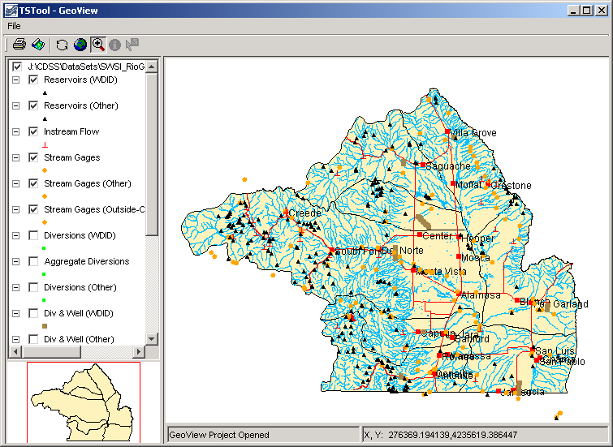

**<p style="text-align: center;">
Example GeoView Interface (from TSTool)
</p>**

The GeoView Panel is a self-contained component that offers a
standard map-based interface that can be used in many applications.
In the above figure, the GeoView Panel includes everything shown,
except for the top menu bar (with the ***File*** menu).
The general purpose GeoView Frame includes the menu bar and a GeoView Panel.  The GeoView Panel contains the following components: 

**<p style="text-align: center;">
GeoView Components
</p>**

|**Component**&nbsp;&nbsp;&nbsp;&nbsp;&nbsp;&nbsp;&nbsp;&nbsp;&nbsp;&nbsp;&nbsp;&nbsp;&nbsp;&nbsp;&nbsp;&nbsp;&nbsp;&nbsp;&nbsp;&nbsp;&nbsp;&nbsp;&nbsp;&nbsp;&nbsp;&nbsp;&nbsp;&nbsp;&nbsp;&nbsp;|**Description**|
|--|--|
|Table of Contents (left edge)|The table of contents displays a list of layer views, showing the top-most layer at the top of the legend.  Layers can be enabled/disabled by toggling the check box.  A layer can be selected/deselected by clicking on the layer in the table of contents.  Layers that are selected can be acted on (e.g., properties can be viewed).  The table of contents also indicates the symbol for the layer.|
|Main GeoView (large map)|The main GeoView displays the enabled layers and allows you to interact with the map using the mouse and keyboard (e.g., zoom, select).|
|Reference (overview) GeoView (lower left)|The reference GeoView displays layers that have the property `ReferenceLayer` set to true.  This view shows the current zoom extent relative to the maximum extent of the data and can also be used to initiate a zoom to a region on the main map (the reference map is always in zoom mode).|
|Tools (top, below menu bar)|Tools to perform actions on the visible map (see table below).|
|Message Areas (bottom)|The message areas are used to display the mouse coordinates and provide other feedback.|

**<p style="text-align: center;">
GeoView Tools 
</p>**
	
|**Tool Icon**|**Tool**|**Description**|
|--|--|--|
|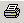|***Print***|Print the visible map.  You will be able to pick the printer and orientation.|
|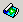|***Save Image***|Saves the map as a Portable Network Graphics (PNG), JPEG, or other supported graphic file format.|
|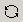|***Refresh***|Refresh the map display by redrawing features in enabled layers that are in the visible window.  This does not re-read the original data.  GeoView normally refreshes automatically as needed.|
|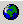|***Zoom Out***|Zoom to the maximum data extents.|
| 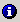 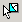|***Select the Mode as Zoom, Info, or Select***|Select the interaction mode.  The ***Zoom*** mode allows a rectangle to be drawn on the map to zoom to the specified region and is the default mode if no layer is selected.  The ***Info*** mode allows features to be selected (by clicking on or drawing a box around), after which geographic information about the features is displayed.  The ***Select*** mode is similar to ***Info***; however, its purpose is to select features for an additional action (e.g., exporting data or performing a query).  The ***Info*** and ***Select*** modes are only enabled if one or more layers are selected in the table of contents.<br><br>See the next section for more information about using these features.|
	
The GeoView Panel components work with each other to provide interaction with the maps, as described below.

## Interacting with the GeoView Map ##

The layers shown on the map are initially displayed according to the GeoView Project settings.
Once displayed, you can interact with the map in the following ways:

**<p style="text-align: center;">
GeoView Interactions 
</p>**

|**Action**|**Description**|
|--|--|
|Disable/Enable a layer view|Layers can be enabled/disabled to make the map more readable or useful:<br><ol><li>Use the check boxes in the table of contents to disable and enable layer views, as appropriate.  The map will automatically refresh, resulting in a slight delay as the map is redrawn.</li><li>If necessary, use the ***Refresh*** tool ( to cause the map to be updated (automatic refresh may be disabled for some applications, due to performance reasons).</li></ol>|
|Change layer view order|**Currently the layer view order can only be changed by editing the GeoView Project file.**|
|Zoom in/out|Zooming is useful make symbols and labels more readable.  To zoom in:<br><ol><li>Set the GeoView interaction mode to "zoom" by selecting the zoom tool ( at the top of the window.</li><li>Use the mouse to draw a box around an area of interest (left mouse button down to start, move the mouse, and then release).  The main GeoView map will zoom to the selected region and the reference map will show the zoom extent.</li><li>Use the ***Zoom Out*** tool ( to zoom to the full extent or use the reference GeoView to zoom to a different region.</li></ol>|
|Change symbols for a layer view|To change the symbols and labels for a layer view:<br><ol><li>Select the layer view in the table of contents</li><li>Right-click and select the ***Properties*** menu.  See the [Setting GeoView Properties section](#setting-geoview-properties) below for information about the properties.</li></ol>|
|Display geographic information for features|The GeoView interface can display information about geographic features (shape and attribute data) from the original geographic data.  To do so:<br><ol><li>Select layer views in the table of contents that are to be searched for information.</li><li>Set the GeoView interaction mode to Info ().</li><li>Click near the feature or draw a box around multiple features.  The layers will be searched and the following dialog will be shown.</li></ol><br>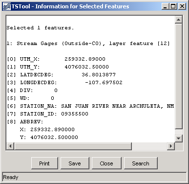<br>The resulting dialog will show information about the selected features, including basic layer information, and information about the specific shapes and attributes.  **The display is for geographic data only.  Attribute names and values are as they appear in the original data.  Additional application-specific data are typically provided by a separate software interface.**|
|Select features|Features can be selected for a number of reasons.  Currently, GeoView has limited select tools, which are mainly used internally when integrated with an application (e.g., an application can select features internally, which are then highlighted on the map).  In the future, interfaces to select features from the GeoView interface using query criteria may be added.<br>Features can be selected ( similar to the ***Info*** mode described above.  The selected features are highlighted on the map.  In the past, yellow, or cyan have been used to highlight selected features.  However, yellow is not clearly visible when earth-tone colors are used for background layers and cyan is not clearly visible when water-tone colors are used for background layers.  Therefore, GeoView is phasing in a magenta/pink selection color, which is rarely used for background layers.

## Setting GeoView Properties ##

GeoView properties are initially set in a GeoView Project file or are assigned internally by the software.
Most properties control how layers are displayed (colors, labels, etc).
To view general GeoView properties, right click on the GeoView map and select the ***Properties*** menu.
Some properties are currently view-only.
Refer to the [GeoView Configuration – the GeoView Project File](#geoview-configuration-the-geoview-project-file)
section below for a complete list of properties that can be defined in a GeoView Project file.
<a href="../GeoView_Props.png">See also the full-size image.</a>

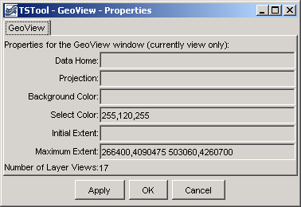

**<p style="text-align: center;">
Main GeoView Properties
</p>**

GeoView properties, as shown in the above figure,
apply to the main GeoView and are shared between layers.
These properties are typically not edited by end users.
One important property is the projection property.
If all data layers are projected consistently (e.g., for Esri shapefiles)
then a projection does not need to be defined.
However, if the layers have different projects, a GeoView projection and projections
for each layer can be defined to allow the GeoView to project data consistently for visualization.

If the ***OK*** or ***Apply*** buttons are pressed, the GeoView properties
will be updated in memory (the GeoView Project file is not updated) and the map will redraw.
Pressing ***OK*** will additionally close the properties dialog.
The ***Cancel*** button causes the dialog to close, without updating the properties.

To view or change properties for a layer, select a layer view in the table of contents,
right-click and select the Properties menu item.
The following tabbed dialog will be displayed for the first selected layer view.
The tabbed panels are discussed below the each figure.  

GeoView layer properties, as shown in the following figure, apply to the input source.
Currently these properties are used for information purposes and cannot be interactively edited.
<a href="../GeoView_Props_Layer.png">See also the full-size image.</a>

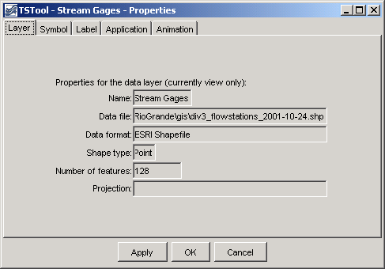

**<p style="text-align: center;">
GeoView Layer Properties
</p>**

Symbol properties, as shown in the following figure, indicate how the layer is to be
drawn (symbolized) on the map and in the table of contents.
A sample of the symbol is shown in the dialog, although it may appear slightly different on the map and table of contents.
Symbol terminology corresponds to standard GIS tools.
<a href="../GeoView_Props_Symbol.png">See also the full-size image.</a>

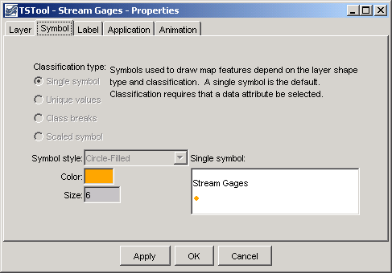

**<p style="text-align: center;">
Layer View Symbol Properties
</p>**

Label properties, as shown in the following figure, can be modified to label
features with attribute data or literal strings.
Currently, only point features can be labeled.
Labels can consist of a combination of attribute values.
To label features, select the attribute fields from the available choices,
in the order that they should appear in the label.
<a href="../GeoView_Props_Label.png">See also the full-size image.</a>


**<p style="text-align: center;">
Layer View Label Properties
</p>**
 
The label format, if not specified, defaults to the use the full field with of the attribute.
For example, if an attribute field is defined as being twenty characters wide,
the label may be the full width, including leading and trailing spaces.
More often, it is desirable to omit the spaces.
To do so, or to format numbers using a more appropriate format than the full.
width default, use the ***Label Format*** information.
The dialog box notes illustrate valid formats.
For example, if a string field and an integer field are available,
the following label format would show the labels with only a comma and one space between the values: 

```
%s, %d
```
 
Layer application properties as shown in the following figure are used to link a layer's data to an application.
This process allows general GeoView features to be used more specifically by specific software programs.
The [Using GeoView with a Software Application section](#using-geoview-with-a-software-application)
describes this functionality in more detail.
<a href="../GeoView_Props_Application.png">See also the full-size image.</a>

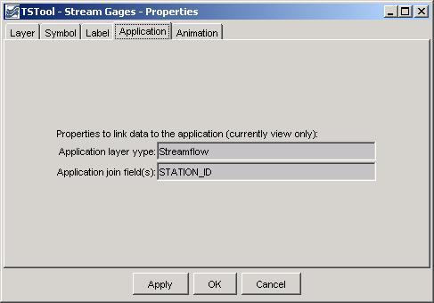

**<p style="text-align: center;">
Application Layer Type
</p>**

Layer view animation properties, as shown in the following figure, are currently under development.
Animation properties will define, for example,
the time series data that are used for symbolization during animation.
<a href="../GeoView_Props_Animation.png">See also the full-size image.</a>


**<p style="text-align: center;">
Layer View Animation Properties
</p>**

## Viewing a Layer’s Attributes ##

Each feature in a layer includes geographic shape information
(e.g., the coordinates that define a polygon).
Each feature also can have attribute data, which are typically represented in a tabular fashion.
To view the attributes for a layer, first select the layer in the table of contents,
then right-click and press the ***View Attribute Table*** menu choice.
A window similar to the following will be shown.
<a href="../GeoView_Attributes.png">See also the full-size image.</a>

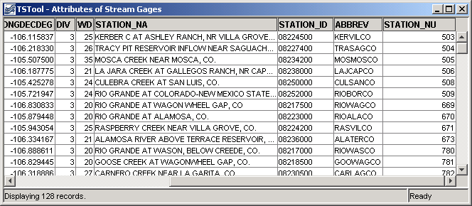

**<p style="text-align: center;">
Attributes Table for a Layer
</p>**

The attributes are displayed in the order and format determined from the input data.
Attribute names in Esri shapefiles are limited to ten characters.
Information in the table can be selected (use ***Ctrl-a*** to select all) and can be copied to other software.

## Using GeoView with a Software Application ##

Software developers integrate the GeoView components with software applications and
typically the software user does not need to know how GeoView works with the application.
However, this section describes a few important concepts that will help facilitate setting up data for use by an application.

Basic GeoView implementations involve defining a GeoView Project
(see the [GeoView Configuration – the
GeoView Project File section](#geoview-configuration-the-geoview-project-file)
for details on project file properties) and then interacting with the GeoView interface when the map is displayed.
In a basic application, a GeoView can be added to show maps for reference purposes only.
For example, the application may be an interface to a database containing location information.
If a GeoView project file is defined with only base layers,
then the zooming and features will allow a user to zoom into a region of interest,
but there will be no interaction between the GeoView and the application.

In a more advanced application, layers in the GeoView Project file are assigned an `AppLayerType` property,
which is recognized by the application.
For example, a layer may be assigned an application type of "Streamflow" to indicate a streamflow gage.
Additionally, the `AppJoinField` property can be defined to allow the application to join its data to the geographic data.
This assignment in and of itself causes no effect in the GeoView.
However, the application can now interact with the GeoView by asking for the "Streamflow" layer.
This allows features in the GeoView to be selected from the
application (e.g., in a database query screen) and allows the GeoView to provide information about the layer to the application.
For this type of implementation, it is important that the application layer types,
feature (shape) type, and the required join fields are documented;
consequently, new data layers can be used with the application with only a few configuration changes.

Some applications may automatically update the map interface by zooming to selected areas,
selecting features, etc.  Standard GeoView features are typically still available, as previously described.

## Limitations ##

The GeoView components have been developed not to serve as full-featured GIS components,
but to support many common GIS activities like selection, zooming, and symbolization.
The components have been developed to integrate with existing applications and use other tool sets,
including time series viewing tools.
Basic features have been implemented to address important needs for applications;
however, additional features are implemented as requirements change.
The GeoView components are not envisioned as a replacement for
pure GIS tools like Esri's ArcGIS products.
In many cases, Esri or other tools can be used to develop the data for use with GeoView.

Currently, properties that are changed interactively cannot be saved to the GeoView Project file.

GeoView software currently does not examine projection files
optionally distributed with Esri shapefiles.
Projections must be defined in the project file (or, if omitted, the projection
is assumed to be consistent for data layers).
Only a few projections are recognized, as needed by specific GeoView software implementations.

## GeoView Configuration – the GeoView Project File ##

A GeoView display is configured mainly by using a GeoView Project (`.gvp`) file,
which is either read at software startup or when selected by the user.
The purpose of the file is to persistently store the configuration of a map display
so that it can be loaded again without redefining the configuration.
The file format is simple text properties and can be read by applications
implemented in various technologies running in various environments.
An example of the file is shown below.

```text
# Main properties global to the GeoView
# The format is:
# [Prefix]
# Prop=value
[GeoView]
GeoDataHome = .

# Properties for each GeoLayerView (data source and
# symbols)...
[GeoLayerView 1]
GeoLayer = xxx.shp

[GeoLayerView 2]
GeoLayer = xxx.shp
```

The GeoLayerViews listed first in the project file are drawn first and are therefore behind other layers on the map.
For all properties, the comma is used as an internal delimiter and the semi-colon
is used as a second layer of separation, as appropriate.
Most properties will default to appropriate values if not specified (see tables below).
The most important properties, as shown in the example above, are the `GeoDataHome`,
which defines where data can be found, and `GeoLayer`,
which defines where the data file is for each layer.
Recognized layer file formats are listed in the following table and are described further in separate appendices.
Support for additional layer types can be added as necessary.

**<p style="text-align: center;">
Supported GeoView Layer File Types
</p>**

|**Layer Type**|**Description**|
|--|--|
|Esri shapefile|Esri shapefiles are commonly used with Esri software such as ArcView, ArcMap, and ArcExplorer.  GeoView determines the type by looking for the `.shp` file extension and checking the internal file format.  No projection is assumed but the `Projection` property for the GeoView and individual layers can be used to indicate the projection.|
|NWSRFS GeoData files|The National Weather Service River Forecast System (NWSRFS) uses ASCII and binary files defining various geographic layers.  This format is detected by checking the file names, which are predefined for NWSRFS.  The `Projection property` is defined as `Geographic` if ASCII data and HRAP if binary data.||
|NWS XMRG Radar Files|XMRG files are gridded radar files produced by the National Weather Service.  GeoView treats these files as grid files.  This format is detected by looking for an “xmrg” string in the filename.  The `Projection` property is defined as `HRAP`.|

The following main GeoView properties can be defined in the project file.
Graphical user interfaces to allow interactive editing of all properties are being implemented.

**<p style="text-align: center;">
GeoView Properties (listed alphabetically)
</p>**

|**GeoView Property**&nbsp;&nbsp;&nbsp;&nbsp;&nbsp;&nbsp;&nbsp;&nbsp;&nbsp;&nbsp;&nbsp;&nbsp;&nbsp;&nbsp;|**Description**|**Default Value**|
|--|--|--|
|`Color`|Background color for map.  See the discussion after the properties tables for a discussion of how to define colors.|`White`|
|`FontName`|Name of font to use for GeoView components (e.g., buttons).  This property currently can only be set internally with software.|System-specific.|
|`FontSize`|Size of font, in points, to use for GeoView components (e.g., buttons).  This property currently can only be set internally with software.|System-specific.|
|`FontStyle`|Font style to use for GeoView components (e.g., buttons).  This property currently can only be set internally with software.|System-specific.|
|`GeoDataHome`|Directory where the GIS data exist.  This directory will be prepended to layer files if they are not absolute paths already.|If not specified or if specified as `"."`, the directory will be set as the home of the GeoView Project file.|
|`InitialExtent`|Initial extent of the map display, in data coordinates.  The coordinates should be specified as `"XMIN,YMIN  XMAX,YMAX"`, where the first pair is the lower-left corner of the extents and the second pair is the upper right.  This property has not been implemented.  See the `MaximumExtent` property.|No default.  The initial extent will be the maximum data extent.|
|`MaximumExtent`|Maximum extent of the map display when zoomed out, in data coordinates.  The coordinates should be specified as `“XMIN,YMIN XMAX,YMAX”`, where the first pair is the lower-left corner of the extents and the second pair is the upper right.	No default.  The maximum extent will be the maximum data extent.|
|`Projection`|Projection for the GeoView.   The projection definition varies depending on the projection (some projections require more parameters).  The following projections are currently supported:<br><ul><li>`Geographic` - no projection (decimal degrees)</li><li>`HRAP` - used by National Weather Service</li><li>`UTM,Zone[,Datum,FalseEasting],`<br>`[FalseNorthing][,CentralLongitude]`<br>`[,OriginLatitude][,Scale]` - Universal Transverse Mercator.  The Zone is required (e.g., `13` for Colorado).  Datum defaults to `NAD83`.  The `FalseEasting` defaults to `500000`.  The `FalseNorthing` defaults to `0`.  The `CentralLongitude` is computed from the `Zone`.  The `OriginLatitude` defaults to `0`.  The `Scale` defaults to `.9996`.|No default.  All data are assumed to be the same projection.|
|`ProjectAtRead`|Indicates whether layer features are projected at read-time to the GeoView projection.  This slows down the application initially but increases performance later during map refreshes.|`false` (it is usually best to project all data to a common projection rather than relying on GeoView to do projections)|
|`SelectColor`|Color to use for selected features.  See the discussion after this table for examples of how to specify colors.|`Yellow`<br>A more distinctly visible magenta/pink color with RGB `255,120,255` is being considered.|

The following GeoLayerView properties can be defined, corresponding to each data layer/file:

**<p style="text-align: center;">
GeoLayerView Properties (listed alphabetically)
</p>**

|**GeoLayer View Property**&nbsp;&nbsp;&nbsp;&nbsp;&nbsp;&nbsp;&nbsp;&nbsp;&nbsp;&nbsp;&nbsp;&nbsp;&nbsp;&nbsp;&nbsp;&nbsp;&nbsp;&nbsp;&nbsp;&nbsp;&nbsp;&nbsp;&nbsp;&nbsp;&nbsp;&nbsp;&nbsp;&nbsp;&nbsp;&nbsp;&nbsp;&nbsp;&nbsp;&nbsp;&nbsp;|**Description**|**Default Value**
|--|--|--|
|`AppJoinField`|Specify the field(s) that should be used by an application to join the layer data to application data.  If multiple fields are necessary, separate the field names by commas (e.g., `“wd,id”`).|None.|
|`AppLayerType`|Indicate a layer type to be handled by an application.  For example, a layer may be tagged as `“Streamflow”`.  The application can then use this information to treat the layer differently (e.g., to know how to join the data to application data).  Valid `AppLayerType` values must be defined and understood by the application.|None.|
|`Color`|Color for features when the `SymbolClassification` is `SingleSymbol`.  If point data, this is the main color for the symbol.  If line data, this is the line color.  If polygon data, this is the fill color.  See the discussion after this table for examples of how to specify colors.|Random.|
|`ColorTable`|Used when the `SymbolClassification` property is `ClassBreaks` or `UniqueValues` and requires more than a single color.  The number of colors should be one more than the number of class break values if `SymbolClassBreaks` is used and equal the number of class values if `UniqueValues` is used.  Color tables can be defined in three ways:<ol><li>`ColorTableName;NumColors`<br><br>Predefined tables include `Gray`, `BlueToCyan`, `BlueToMagenta`, `BlueToRed`, `CyanToYellow`, `MagentaToCyan`, `MagentaToRed`, `YellowToMagenta`, and `YellowToRed`.  These named tables choose primary colors where necessary to provide clean color breaks.</li><li>`Ramp;NumColors;Color1;Color2;...`</li><li>`Custom;NumColors;Color1;...;ColorN`</li></ol><br>**Only the first option is currently enabled. See the discussion after this table for examples of how to specify colors**.|Named color table using `Gray`.|
|`EventLayerView`|Indicates if the layer view is an event layer (Esri Map Object notation).  **This property is not currently used in the Java tools**.|`false`|
|`GeoLayer`|Name of file for the data layer, typically with the file extension.  If an Esri shapefile, specify the `.shp` file.  If a relative path, the `GeoView.GeoDataHome` property will be prepended to the file name. This property is used to detect a break in the GeoLayerView numbering, indicating the end of layer views.|No default.  Should always be specified.|
|`IgnoreDataOutside`|Indicate a range of values that should be considered.  Currently this applies only to grid layer types.  Specifying a range can be used, for example, to draw only cells with positive data values.  The range should be specified as two numbers separated by a comma (e.g., `.00001,100.0`).|All cells are considered.|
|`LabelField`|Specify one or more fields to be used for the label, separated by commas.  If a `LabelFormat` property is specified, use it to format the label; otherwise, format each field according to the field specifications from the attribute data source.|No default.  Specify one or more fields for the label.|
|`LabelFontName`|Font to use for labels.  This property has not been enabled.|`Helvetica`|
|`LabelFontSize`|Label font height, points.  This property has not been enabled.|`10`|
|`LabelFormat`|Specify a C-style format string to format the fields.  The format specifications must agree with the data types being formatted.  For example, if two floating-point fields are specified with the `LabelField` property, the corresponding format may be `"%10.1f, %5.2f"`. |If not specified, the label will be formatted using the field width and precision determined from the data table, with values separated by commas.|
|`LabelPosition`|Label position.  If point data, the position is relative to the point coordinates.  If line or polygon data, the position is relative to the centroid coordinates.  The position of the text will be offset to not overwrite a symbol and can be `UpperRight`, `Right`, `LowerRight`, `Below`, `LowerLeft`, `Left`, `UpperLeft`, or `Above`.|`Right`|
|`Name`|The layer view name that should be displayed in the legend.|No default.  If not specified, the file name will be used in the legend.|
|`OutlineColor`|Outline color for point or polygon symbols. See the discussion after this table for examples of how to specify colors.|Default to the same as main color).|
|`Projection`|Projection (coordinate reference system) for the layer's data.  See the main GeoView Projection property for available values.|No default.  It is assumed that all data in a project have a consistent projection.|
|`ProjectAtRead`|Indicates whether features are projected at read-time to the GeoView projection.  This slows down the application initially but increases performance later during map refreshes.  This property can be set once in the GeoView main properties.|`false` (it is usually best to project all data to a common projection rather than relying on GeoView to do projections)|
|`ReadAttributes`|Indicates whether attributes should be read when the data are read.  If possible, based on the layer data format, attributes will be read on the fly as needed.  Reading the attributes (true) takes more memory but will result in faster performance.|`false`|
|`ReferenceLayer`|Indicates whether the layer should be drawn in the reference GeoView.  Indicate as true or false.  Typically only the most general boundary information should be used in the reference layer.|`false`|
|`SelectColor`|Specify the color to be used when drawing selected features.  This property is useful if the default select color does is not easily viewed.|Use the GeoView `SelectColor` property.|
|`SkipLayerView`|Can be set to true to skip the layer altogether when reading the project file (useful for commenting out layers during development).  If this property is used, the number sequence for the layer views can be kept the same.|`false` (the layer view will be displayed)||
|`SymbolClassBreaks`|Class breaks that correspond to the `SymbolClassification=ClassBreaks` property.  The number of values should be one less than the number of values in the `ColorTable` property for the classification.|No default, although an application may suggest values.|
|`SymbolClassField`|Attribute data field that is used when the `SymbolClassification` property is `ClassBreaks` or `UniqueValues`.|No default, although an application may suggest a value based on the available attributes.|
|`SymbolClassification`|Indicates how data are to be classified when displaying the shape symbols.  Values can be `SingleSymbol` (e.g., single point symbol, line style, or polygon fill color), `UniqueValues` (display a unique symbol style for each value, currently not implemented), or `ClassBreaks` (display a unique symbol style for groupings of values - requires specification of the `SymbolClassField` and `SymbolClassBreaks` properties).|`SingleSymbol`|
|`SymbolSize`|For point data, specify the symbol size in pixels.  For line data specify the line width in pixels.  Not used for polygon data.  This property may need to be expanded to properly handle printed output (might need to use points rather than pixels or allow the units of measure to be set in the property).  **This property is currently not enabled**.|6 pixels for points, 1 pixel for lines.|
|`SymbolStyle`|Indicates the symbol style.  If point symbols, the style is the symbol identifier (e.g., `CircleFilled`).  If line data, the symbol style is the line style (currently only `Solid` is supported).  If polygon data, the symbol style is the fill pattern (currently only `FillSolid` is supported).  See below for a full discussion of symbol styles.|None for points, Solid for lines, `FillSolid` for polygons.|

### Color Specification ###

Colors are specified for a number of different properties,
including the feature color and outline color.
In order to allow flexibility in specifying colors, a number of formats are supported:

* Named color.  Available colors are: `None` (transparent), `Black`, `Blue`, `Cyan`, `DarkGray`, `Gray`, `Green`, `LightGray`, `Magenta`, `Orange`, `Pink`, `Red`, `White`, `Yellow`
* Comma-separated Color Triplets as 0-255 (e.g., `255,0,0`) or 0.0-1.0 (e.g., `1.0,0.0,0.0`).
* Hexadecimal:  `0xRRGGBB` (e.g., `0xFF0000` for red)

### Color Tables ###

Color tables are simply a list of colors.
Typically the symbol maintains a color table if the classification is other than `SingleSymbol`.
The symbol will also keep track of unique values or class breaks and
use this information to determine a color to display for a shape.
A number of predefined color tables are supported but and user-defined tables is supported in the property format.

### Symbol Style - Point Data ###

Symbol styles for point data are the same as for time series viewing tools.
The following styles are available:

* `None`
* `Arrow-Down`, `Arrow-Left`
* `Asterisk`
* `Circle-Hollow`, `Circle-Filled`
* `Diamond-Hollow`, `Diamond-Filled`
* `Plus`, `Plus-Square`
* `Square-Hollow`, `Square-Filled`
* `Triangle-Down-Hollow`, `Triangle-Down-Filled`, `Triangle-Left-Hollow`, `Triangle-Left-Filled`, `Triangle-Right-Hollow`, `Triangle-Right-Filled`, `Triangle-Up-Hollow`, `Triangle-Up-Filled`
* `X-Cap`, `X-Diamond`, `X-Edge`, `X-Square`

### Classification ###

Classification is used to symbolize data.  The following classifications are supported:

|**Classification Type**&nbsp;&nbsp;&nbsp;&nbsp;&nbsp;&nbsp;&nbsp;&nbsp;&nbsp;&nbsp;&nbsp;&nbsp;&nbsp;&nbsp;&nbsp;&nbsp;&nbsp;&nbsp;&nbsp;&nbsp;&nbsp;&nbsp;&nbsp;&nbsp;|**Description**|
|--|--|
|`SingleSymbol`|This is the default for all layers if not specified.  For point data, a single symbol is used, centered on the location.  For line data, a single line width and color is used.  For polygon data, single fill and outline colors are used.|
|`UniqueValues`|The data values for the field specified with the `SymbolClassField` property is sorted and checked for unique values.  Each value is then assigned a color in the color table.|
|`ClassBreaks`|The number of class breaks should be one less than number of colors in the color table for the symbol.  Breaks are defined by using a groupings of features based on the values of the field specified with the `SymbolClassField` property:<br><br>< first value<br>>= first value < second value<br>...<br> last value|
 
## GeoView Project File Examples ##

This section provides several examples, extracted from GeoView Project files.

The following example illustrates how to configure base layers in a GeoView Project file:

```text
# GeoView project file for Rio Grande basin.

# Main GeoView properties.

[GeoView]

# Main home for data
# If a directory is not specified, the directory will be determined when the
# GeoView project file is selected.
#GeoDataHome = "C:\cdss\statemod\data\rgtwday\gis"
# ArcView/ArcExplorer Default...
#SelectColor = Yellow 
# Arc 8...
#SelectColor = Cyan
# All-purpose (magenta/pink)
SelectColor = "255,120,255" 
MaximumExtent = "266400,4090475 503060,4260700"

# Now list the layer views.  A layer view consists of specifying a data layer
# (e.g., shapefile) and view information (e.g., symbol).  This is equivalent to
# the Esri "theme" concept.  The layers specified first are drawn on the bottom.
# Start with number 1 and increase the layer number sequentially as layers are
# added on top.

[GeoLayerView 1]
GeoLayer = div3_districts.shp
Name = "Water Districts"
# RGB 153 204 50 - green-yellow
#Color = "0x99CC32"
# tan
Color = "255,240,190"
OutlineColor = black
ReferenceLayer = true
AppLayerType = "BaseLayer"

[GeoLayerView 2]
GeoLayer = div3_lakes.shp
#GeoLayer = div3_lakes.shp
Name = "Lakes"
# - blue
Color = "165,250,254"
OutlineColor = "0,130,254"
AppLayerType = "BaseLayer"

[GeoLayerView 3]
Name = "Rivers"
GeoLayer = div3_rivers.shp
#GeoLayer = div3_rivers.shp
# RGB - blue
Color = "0,188,253"
AppLayerType = "BaseLayer"

[GeoLayerView 4]
GeoLayer = div3_highways.shp
Name = "Roads and Highways"
Color = "255,0,0"
AppLayerType = "BaseLayer"

[GeoLayerView 5]
GeoLayer = div3_cities.shp
Name = "Cities and Towns"
SymbolStyle = "Square-Filled"
SymbolSize = 6
Color = "red"
LabelField = "Name"
LabelPosition = RightCenter
AppLayerType = "BaseLayer"
```

The following example illustrates how to display point data layers.
These properties should be inserted at the appropriate location in a GeoView Project file.

```text
[GeoLayerView 15]
#SkipLayerView = true
GeoLayer = div3_flowstations_2001-10-24.shp
Name = "Stream Gages"
# orange
Color = "254,167,0"
SymbolStyle = "Circle-Filled"
SymbolSize = 6
AppLayerType = "Streamflow"
AppJoinField = "STATION_ID"
#LabelField = "STATION_NA, STATION_NA"
#LabelFormat = "%s, %s"

[GeoLayerView 18]
#SkipLayerView = true
GeoLayer = div3_reservoirs_2001-10-24.shp
Name = "Reservoirs (WDID)"
# black
Color = "black"
SymbolStyle = "Triangle-Up-Filled"
SymbolSize = 6
AppLayerType = "Reservoir"
AppJoinField = "ID_LABEL_6"
```
