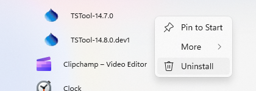

# TSTool / Install TSTool #

This appendix describes how to install TSTool.
TSTool was originally developed for [CDSS (Colorado's Decision Support Systems)](http://cdss.state.co.us)
to process water resources data for modeling and analysis.
However, TSTool can be used outside of CDSS and also can be used to analyze data other than water resources.

* [Overview](#overview)
* [File Locations](#file-locations)
* [Installing TSTool](#installing-tstool)
* [Uninstalling TSTool Software](#uninstalling-tstool-software)
* [Running TSTool](#running-tstool)
* [TSTool Configuration](#tstool-configuration)
* [Map Configuration](#map-configuration)

-------

## Overview ##

CDSS consists of the HydroBase database, modeling, and data viewing/editing software.
TSTool can be used within this system to process time series from the HydroBase database,
CDSS model files, and other databases and files.
Alternatively, TSTool can be installed independently of CDSS,
in which case the only connection is that the installation folder on Windows defaults to `C:\CDSS\TSTool-Version`.
TSTool can also be installed on Linux, typically in `/opt/TSTool-Version`.

## File Locations ##

Standard locations of TSTool software files are as follows.
Files are normally installed on Windows on the `C:` drive but can be installed in a shared location on a server.
Note that the following list of software `*.jar` files may be different from the current TSTool version.
In the future separate documentation may be provided explaining software components and licenses.

```
C:\CDSS\TSTool-Version                      Windows top-level install directory.
/opt/TSTool-version                         Linux top-level install directory.
  bin/                                      Software program files directory.
    Blowfish*.jar                           Used for encryption/security.
    cdss*.jar                               CDSS components.
    h2*.jar                                 H2 embedded database.
    jcommon.jar, jfreechart.jar             Plotting package.
    jsr173_1.0_api.jar, libXMLJava.jar      XML support.
    jython.jar                              Jython support.
    sqljdbc4.jar                            Microsoft SQL Server packages.
    NWSRFS_DMI*.jar                         National Weather Service River Forecast System (NWSRFS) package.
    cdss-lib-dmi-riversidedb*.jar           Riverside Technology, inc., RiversideDB database package.
    cdss-lib-dmi-statmonsys*.jar            State of Colorado Satellite Monitoring System package.
    cdss-li-processor-ts-java*.jar          Time series command processor package.
    tstool                                  Shell script to run TSTool on Linux and Mac.
    TSTool.bat                              Batch file to run TSTool using the JRE software, not typically used.
    TSTool.exe                              Executable program to run TSTool using the JRE software, recommended over batch file.
    TSTool.l4j.ini                          Configuration file for TSTool.exe launcher.
    TSTool*.jar                             TSTool program components.
  doc/TSTool/UserManual/                    Main documentation directory for TSTool.
    TSTool.pdf                              TSTool documentation as PDF.
  examples/                                 Example data and command files.
  jre*\                                     Java Runtime Environment used by TSTool
  logs/                                     Folder for TSTool log files (should be writable).  See also user files below.
  system/                                   Folder for system files.
    CDSS.cfg                                CDSS configuration file for HydroBase database configuration.
    DATAUNIT                                Data units file.
    TSTool.cfg                              Configuration file to modify TSTool defaults.  See also user files below.
    *.cfg                                   Shared datastore configuration files. See also user files below.
```

In addition to the software installation files above,
user files are saved in a `.tstool` folder under the user’s home folder and
provide user-specific customization of the TSTool installation.
Folders names beginning with a period are by default hidden on Linux computers.
These files apply to all versions of TSTool and therefore allow settings to
persist even when newer TSTool software versions are installed.
User configuration files will override the installation configuration
file settings when configuration setting values are found in both places.


**<p style="text-align: center;">
TSTool User Configuration Files (<a href="../Config_UserFiles.png">see also the full-size image</a>)
</p>**

**The following design has been implemented in TSTool 12.xx.xx in order to
enable plugin datastores and commands.
The initial design envisioned that configuration and plugins could be used across all installed TSTool versions.
However, based on experience, it is likely that future TSTool updates will
user versioned user files, for example consistent within a major version.
In this case, files might be moved across versions through "import" functionality,
which will be implemented in the TSTool user interface.**

TSTool user configuration files:

```
C:\Users\UserID\.tstool\                Windows user TSTool configuration files.
/home/UserID/.tstool/                   Linux user TSTool configuration files.
  batchServerHotFolder/                 If TSTool is run with -batchServer and -batchServerHotFolder FolderName,
                                        TSTool will look for command files in this folder, process them, and then delete the files.
  command-file-history.txt              History of opened command files, used to populate choices in the File / Open / Command file menu.
  ui-state.txt                          Properties describing the user interface state, such as last selected choices.
  log/*.log                             Startup log file, which will be used until StartLog commands specify a different log file.
  datastore/
    *.cfg                               User’s datastore configuration files.  Unlike the installation datastore files (in TSTool system folder),
                                        these files stand on their own and do not require a reference in the TSTool.cfg file.
                                        Use the Enabled=True property in a datastore configuration file to enable the datastore and
                                        Enabled=False to disable the datastore.  Other options to disable the datastore are
                                        delete the datastore file or move out of the ./tstool/datastore folder.
  plugin-command/                       Plugin commands.
    CommandName/                        CommandName matching the command name in TSTool.
      bin/                              Contains a jar file with code for plugin command (see plugin developer documentation).
      bin-depend/                       Contains jar file(s) needed by plugin.
      doc/                              Contains command documentation as HTML, which is accessed from plugin command editors.
        images/
          *.png, etc.
        include/
          *.css, etc.
        CommandName.html
  plugin-datastore/                     Plugin datastores.
    DatastoreName/                      DatastoreName matching the datastore type TSTool, which is the value of the Type property in the datastore configuration file.
      bin/                              Contains jar file with code for plugin datastore (see plugin developer documentation).
      bin-depend/                       Contains jar file(s) needed by plugin.
      doc/                              Contains command documentation as HTML, which is accessed from the TSTool user interface.
        images/
          *.png, etc.
        include/
          *.css, etc.
          CommandName.html
  system/
    TSTool.cfg                          User’s TSTool configuration settings.  This file is mainly used to enable/disable datastore types that are of interest to the user.  See the example below. 
  template-graph/                       Folder containing template graphs, which are shown in the lower right of the ensemble and time series results next to the Graph with template: buttons.
```

```
# ./tstool/system/TSTool.cfg
#
# TSTool configuration file containing user settings, shared between TSTool versions
# This file indicates which datastore software features should be enabled.
# Disabling datastore types that are not used can improve TSTool performance and simplifies the user interface.
# Refer to the TSTool.cfg file under the software installation folder for global configuration properties.
# User settings in this file will override the installation settings.

HydroBaseEnabled = true
#HydroBaseEnabled = false
ReclamationHDBEnabled = true
```

## Installing TSTool ##

TSTool can be installed either as part of the HydroBase Tools DVD installation, or as a separate installation.
In both cases, is recommended that the normal CDSS file structure be used.

### Installing TSTool from the “HydroBase data set Analysis Query Tools DVD” ###

If you acquired a HydroBase DVD or downloaded the image, TSTool will be installed during the DVD install process.
Refer to the installation instructions for that distribution.
The version that is installed may be older than the version available on the CDSS web site;
however, multiple TSTool versions can be installed and run independently.

### Installing TSTool from the TSTool Setup File ###

Use the following instructions to install TSTool using the `TSTool_CDSS_Version_Setup.exe` installer program,
for example if TSTool software was downloaded from the [CDSS web site](http://cdss.state.co.us):

#### 1. Run the `TSTool_CDSS_Version_Setup.exe` file by selecting from Windows Explorer, the ***Start / Run...***  menu, or from a command shell. ####

You must be logged into the computer using an account with administrator privileges.
Otherwise, the following warning will be displayed:


If you have administrative privileges, the following welcome will be displayed, and the installation can continue:


Press ***Next*** to continue with the installation.
 


TSTool is distributed with CDSS with no license restrictions.  However the disclaimer must be acknowledged.
Press ***I Agree*** to continue with the installation.
 
#### 2. Several components can be selected for the install as shown in the following dialog. ####

Position the mouse over a component to see its description.


Select the components to install and press ***Next***.

#### 3. The following dialog is then shown and is used to select the installation location for TSTool.####

Multiple versions of TSTool can be installed and there are no dependencies between the versions.
It is recommended that the default install location shown is used.


After selecting the install location, press ***Next***.

Note that this location will be saved as a Windows registry setting
(`HKEY_LOCAL_MACHINE\Software\State of Colorado\TSTool-Version\Path`)
to allow future updates to check for and default to the same install location,
and to allow the standard software uninstall procedure to work correctly.

#### 4. The following dialog will be shown to select the menu for the software: ####


After selecting the folder, press ***Install***.

#### 5. The following dialog will show the progress of the installation:####


Press ***Show details*** to see the files that were installed or press Next to continue.

#### 6. If the CDSS Base Components were selected for install, the following dialog will be displayed: ####


TSTool and other CDSS software can utilize HydroBase running on the local computer as well as other computers.
Press ***Yes*** if HydroBase has been installed on another computer in the
network environment and may be used by the software (then continue to the next step).
Also press ***Yes*** if TSTool will be run in batch mode because the specific
HydroBase name must be specified in configuration files.  Otherwise, press ***No*** (skip to step 8). 

#### 7. The following dialog allows additional HydroBase servers to be specified for use by CDSS software

The example below configures CDSS software to list the dwrappsdb HydroBase
server in choices and defaults to HydroBase on the local computer.
The dialog will initially show previous settings from the `\CDSS\TSTool-Version\system\CDSS.cfg`
file and settings typically only need to be changed after installing a new HydroBase version.


After entering the name of a HydroBase server and the default server to use, press ***Done***.

#### 8. The following dialog will then be shown asking whether the TSTool software should be run: ####


Press ***Yes*** to run the software or ***No*** to exit the installation procedure.

#### 9. Import Old CDSS Configuration File ####

TSTool is distributed with a default configuration for CDSS.
If you have edited the configuration properties, you can import the old configuration file using the
***Help / Import Configuration...*** menu.  See also the TSTool ***Tools / Options*** menu.

## Installing TSTool on a File Server ##

TSTool can be installed on a file server, which allows software updates to be made in one location,
thereby eliminating the need to install software on individual machines.
As of TSTool 11.09.00 user configuration files will be saved under the user’s folder to
facilitate persistence of user settings between software updates.
For this type of installation, all computers that access the software
should typically have similar configuration, including network configuration.
The standard installer described in this documentation focuses on individual installs on user computers.
To make TSTool software installed on a server available to other computers,
perform the following (this is typically performed by system administrators):

1. Run the `TSTool_CDSS_Version_Setup.exe` installer as described above.
During installation specify the TSTool installation home using a drive letter and
path for the server or specify a Universal Naming Convention (UNC) path (e.g., `\\ServerName\CDSS\TSTool-Version`).
2. Or...Copy the files from a local installation to a network location.
The TSTool software will detect the file location when run using the `TSTool.exe` file.
If the `TSTool.bat` file is used to run the software,
it may need to be modified to specify the location of files on the server.

The menus and shortcuts will only be configured for the computer from which the installation was run.
Therefore, menus and shortcuts for other computers will need to be manually configured.

If TSTool has been installed on a local computer and it is also available on the network,
the network version can be run by running the software in the `ServerName\CDSS\TSTool-Version\bin folder`.
The software will expect that file locations use the same drives as when the software was installed.

## Uninstalling TSTool Software ##

The process to uninstall TSTool changed as of TSTool 12.06.00.
First make sure that TSTool is not running.

### Uninstall TSTool 12.06.00 and Later ###

As of TSTool 12.06.00, the software uninstall process has been simplified
to take advantage of Windows features.

The first way to uninstall is to right-click on the TSTool software version in the ***Start***
menu and select the ***Uninstall*** menu, as shown in the following image.
The next steps are similar to those described below.



The second way to uninstall TSTool is as follow.
Use the windows ***Run*** search field (lower left of desktop).
Enter `uninstall`.  This should display an option to open ***Add or remove programs***.


Search for `TSTool` as shown above.
Select the version of TSTool to uninstall and press ***Uninstall***.
A confirmation will be requested.
The uninstall will then continue as shown in images in the next section.

After uninstalling, the software files will have been removed from `C:\CDSS\TSTool-Version`.
However, any files that exist in the users' files will remain.
This allows datastore configurations, plugins, and other user-configured files to be shared with
other TSTool version installations.

### Uninstall TSTool 12.05.00 and Earlier ###

To uninstall TSTool 12.05.00 and earlier versions, select the ***CDSS / Uninstall / TSTool*** from the ***Start*** menu and confirm the uninstall.
CDSS components that are used by other software (e.g., CDSS Base component software) as well as user data will remain installed.


Press ***Uninstall*** to uninstall the software.

The following dialog shows the status of the uninstall process.


Press ***Show details*** to see the list of files that were removed.  Press ***Done*** to exit the uninstall.

## Running TSTool ##

TSTool can be started in several ways as described below.

### CDSS Menu ###

The ***Start / All Programs / CDSS / TSTool-Version*** (or ***Start / Programs / CDSS / TSTool-Version***)
menu can be used to start the software.  This runs the `TSToolInstallHome\bin\TSTool.exe` software.

### Command Line Executable ###

The installation process does NOT add the `TSToolInstallHome\bin` folder to the path;
however, this addition can be made by the user, allowing the TSTool software to be started anywhere by running TSTool.
Running TSTool from any location will result in the software being run in the installation location.
Specifying a command file on the command line or interactively will reset the working directory to that of the command file.

### TSTool Batch File – Windows ###

A batch file can be used to run the `TSTool.exe` program,
for example using the `–commands command` line parameter to specify a command file.
In this case it may be necessary to specify the absolute path to the command file to ensure that the software can locate related files.

## TSTool Configuration ##

TSTool requires minimal configuration after installation.
This section describes TSTool configuration files that can be customized for a system.
Configuration is specified for each TSTool installation and as of TSTool 11.09.00 several user configuration files.

### TSTool Configuration File ###

The `system\TSTool.cfg` file under the main installation directory contains top-level configuration information for TSTool.  The format of the file is as follows:

```
#
# Configuration file for TSTool

[TSTool]

ColoradoSMSEnabled = true
DateValueEnabled = true
HydroBaseEnabled = true
RiverWareEnabled = true
StateCUEnabled = true
StateModEnabled = true
... etc ...

# Program to use for file differences, intended to be graphical file difference
# viewer. The program will be called as DiffProgram File1 File2.
# It is up to the user to install KDiff3 on the computer or change the following
# to a different program.
DiffProgram = "C:\Program Files\KDiff3\kdiff3.exe"

# Set for the user interface look and feel.  Default is SystemLookAndFeel.  See:
#    http://docs.oracle.com/javase/tutorial/uiswing/lookandfeel/plaf.html
# For example, the following can be used on Linux if Motif is not desired
#UILookAndFeel = "com.sun.java.swing.plaf.gtk.GTKLookAndFeel"

MapLayerLookupFile = "\cdss\gis\co\TimeSeriesMapLookup.csv"

################################################################################
# Begin configuration of data stores that will be opened when TSTool starts
#  - the data store name in the data store configuration (*.cfg)
#    file takes precedence; by convention the names should match
#  - the data stores will be opened only if the data store type is enabled above
#  - alphabetize the data stores by type below
#  - also see the "Enabled" property in the configuration files, for finer
#    control
#  - see also user configuration files for datastores
################################################################################

# Data store for Colorado Water HBGuest web service
#(active if ColoradoWaterHBGuestEnabled=true above)
[DataStore:ColoradoWaterHBGuest]
ConfigFile = "ColoradoWaterHBGuest.cfg"

# The license information will be removed as TSTool moves to open source licensing

LicenseOwner = "CDSS"
LicenseType = CDSS
LicenseCount = NoLimit
LicenseExpires = Never
LicenseKey = 00-77960bdfb1dde707-1dd052fe0327a332-a07266ee645e8845-7560192d374235c5-1dd052fe0327a332
```
**<p style="text-align: center;">
Example TSTool Installation Configuration File
</p>**

The example illustrates the format of the file.
The `*Enabled` properties can be used to enable/disable input types.
Common formats are enabled by default and more specialized formats are disabled by default,
if not specified in the file.
For example, use `HydroBaseEnabled = false` to disable the automatic HydroBase login that
occurs with the HydroBase input type (e.g., if HydroBase is unavailable for some reason).
Each input type can have additional properties,
although only a few currently do, as described below.
Use the ***Tools / Options*** menu for a dialog that helps with editing the `*Enabled` properties.

The optional `MapLayerLookupFile` property indicates the name
of the time series to map layer lookup file.
See the [Map Configuration](#map-configuration) section below.

The user configuration file `./tstool/system/TSTool.cfg` under the user’s home folder provides additional configuration,
for example to disable datastores based on the user’s preferences:

```
# TSTool configuration file containing user settings, shared between TSTool versions
# This file indicates which datastore software features should be enabled.
# Disabling datastore types that are not used can improve TSTool performance and
# simplifies the user interface.
# Refer to the TSTool.cfg file under the software installation folder for global 
# configuration properties.
# User settings in this file will override the installation settings.

HydroBaseEnabled = true
```
**<p style="text-align: center;">
Example TSTool User Configuration File
</p>**

### Data Units File ###

The `system\DATAUNIT` file under the main installation directory contains data unit
information that defines conversions and output precision.
In most cases the default file can be used but additional units may need to be added for a
user's needs (in this case please notify the developers so the units can be
added to the default file distributed with installations).
Currently, the `DATAUNIT` file is the only source for units information – in
the future units may be determined from the various input sources.

### HydroBase Configuration ###

The following properties can be defined in the installation `TSTool.cfg` file in a `[HydroBase]`
section to control how TSTool interacts with HydroBase.
See also the [CDSS Configuration File](#cdss-configuration-file) section below.
These properties may be moved to a HydroBase datastore configuration file in the future.

**<p style="text-align: center;">
TSTool HydroBase Configuration Properties
</p>**

|**Property**&nbsp;&nbsp;&nbsp;&nbsp;&nbsp;&nbsp;&nbsp;&nbsp;&nbsp;&nbsp;&nbsp;&nbsp;|**Description**|**Default**|
|--|--|--|
|`AutoConnect`|If `False`, a HydroBase login dialog will be shown at startup.  If `True`, the default database information in the CDSS configuration file (see next section) will be used to automatically connect to the database, and the login dialog will not be shown.|`False`|
|`WDIDLength`|Indicates the length of water district identifiers (WDIDs) constructed from separate WD and ID data, when creating time series identifiers.  Because time series identifier strings are compared literally, it is important that the WDIDs are consistent within a commands file.|`7`|
 
### CDSS Configuration File ###

By default, TSTool will automatically look for HydroBase databases on the current (local) machine and the State servers.
State server databases are typically only accessible to State of Colorado computers.
If SQL Server or MSDE HydroBase versions have been installed on a different machine,
the `\cdss\TSTool-Version\system\CDSS.cfg` file can be used to indicate the database servers.
An example of the configuration file is as follows.
These properties may be moved to a HydroBase datastore configuration file in the future.

```
[HydroBase]

ServerNames="ServerName,local"
DefaultServerName="ServerName"
DefaultDatabaseName="HydroBase_CO_20080730"

[ColoradoSMS]

ServerNames="ServerName,local"
DefaultServerName="ServerName"
DefaultDatabaseName="RealtimeStreamflow"
UserLogin="UserLogin"
```

The ColoradoSMS input type is being used to support annotation of
real-time data graphs with alert information, within the State of Colorado’s offices.

Properties can be specified on the TSTool command line using the notation `Property=Value`
and will in some cases override the values in the configuration file.  These features are under development as necessary.

The CDSS configuration properties are described in the following tables:

**<p style="text-align: center;">
CDSS HydroBase Database Configuration Properties
</p>**

|**Property**&nbsp;&nbsp;&nbsp;&nbsp;&nbsp;&nbsp;&nbsp;&nbsp;&nbsp;&nbsp;&nbsp;&nbsp;&nbsp;&nbsp;&nbsp;&nbsp;&nbsp;&nbsp;&nbsp;&nbsp;&nbsp;&nbsp;&nbsp;&nbsp;&nbsp;&nbsp;|**Description**|**Default**|
|--|--|--|
|`ServerNames`|A comma-separated list of server names to list in the HydroBase login dialog.|The state server is listed.|
|`DefaultServerName`|The default HydroBase server name to use.  This allows the HydroBase login dialog to preselect a default that applies to most users in the system.  If TSTool is run in batch mode and the HydroBase input type is enabled, use this property to make a default connection to HydroBase, for use with other commands in the batch run.|`greenmtn.state.co.us`|
|`DefaultDatabaseName`|The default HydroBase database name to use.  This allows the HydroBase login dialog to preselect a default that applies to most users in the system.  If TSTool is run in batch mode and the HydroBase input type is enabled, use this property to make a default connection to HydroBase, for use with other commands in the batch run.||
|`DatabaseEngine`|Reserved for internal use.||
|`DatabaseName`|The database name to use for the initial connection.  This overrides the default server.||
|`DatabaseServer`|The server name to use for the initial connection.  This overrides the default server.||
|`SystemLogin`|Reserved for internal use.||
|`SystemPassword`|Reserved for internal use.||
|`UserLogin`|Reserved for internal use.||

**<p style="text-align: center;">
CDSS Satellite Monitoring System (ColoradoSMS) Database Configuration Properties
</p>**

|**Property**&nbsp;&nbsp;&nbsp;&nbsp;&nbsp;&nbsp;&nbsp;&nbsp;&nbsp;&nbsp;&nbsp;&nbsp;&nbsp;&nbsp;&nbsp;&nbsp;&nbsp;&nbsp;&nbsp;&nbsp;&nbsp;&nbsp;&nbsp;&nbsp;&nbsp;&nbsp;|**Description**|**Default**|
|--|--|--|
|`ServerNames`|A comma-separated list of server names to list in the SMS login dialog.|The state server is listed.|
|`DefaultServerName`|The default SMS database server name to use.  This allows the SMS login dialog to preselect a default that applies to most users in the system.  If TSTool is run in batch mode and the ColoradoSMS input type is enabled, use this property to make a default connection to the SMS database, for use with other commands in the batch run.|`greenmtn.state.co.us`|
|`DefaultDatabaseName`|The default SMS database name to use.  This allows the SMS login dialog to preselect a default that applies to most users in the system.  If TSTool is run in batch mode and the ColoradoSMS input type is enabled, use this property to make a default connection to the SMS database, for use with other commands in the batch run.||
|`DatabaseEngine`|Reserved for internal use.||
|`DatabaseName`|The database name to use for the initial connection.  This overrides the default server.||
|`DatabaseServer`|The server name to use for the initial connection.  This overrides the default server.||
|`SystemLogin`|Reserved for internal use.||
|`SystemPassword`|Reserved for internal use.||
|`UserLogin`|The user login, for use with TSTool batch runs.  The ColoradoSMS.UserLogin parameter can be specified on the command line and will be used when making the initial SMS database connection.||

 
The SMS database cannot currently be opened with a login dialog.
Therefore, correct information must be specified in the CDSS configuration file and the TSTool command line.

## Map Configuration ##

TSTool can display maps configured as GeoView project files,
although this functionality is experimental and has not been widely utilized.
See the [GeoView Mapping Tools Appendix](../appendix-geoview/geoview.md) for more information about these files.
To allow a link between time series and map layers,
use the `TimeSeriesMapLayerLook` property in the `TSTool.cfg` file to specify a time series to
map layer lookup file (see the [TSTool Configuration File](#tstool-configuration-file) section above).
The following example file illustrates the contents of the lookup file:

```
# This file allows time series in TSTool to be linked to stations in spatial
# data layers.  The columns are used as appropriate, depending on the direction
# of the select (from time series list or from the map).
#
# This file has been tested with the \CDSS\GIS\CO\co_TSTool.gvp file.  Not all
# possible combinations of time series and map layers have been defined - only
# enough to illustrate the configuration.
# Additional attributes need to be added to the point files to allow more
# extensive functionality.  For example, if attributes for data interval (time
# step) and data source are added to the attributes, then a definition query
# can be defined on the layer for displays to use the same data file.  The
# configuration below can then use the different names to configure the link
# to time series.
#
# TS_InputType - the time series input type, as used in TSTool
# TS_DataType - the data type shown in TSTool, specific to an input type
#                For example, TSTool uses "Streamflow" for HydroBase, whereas
#                for other input types a different data type string may be used.
# TS_Interval - time series interval of interest (e.g.,"Month", "Day", "1Hour"
#                "Irregular")
# Layer_Name - the layer name used in the map layer list
# Layer_Location - the attribute that is used to identify a location, to be
#                matched against the time series data location
# Layer_DataType - the attribute that is used to indicate the data type for a
#                station's time series (CURRENTLY NOT USED - UNDER EVALUATION)
# Layer_Interval - the attribute that is used to indicate the interval for a
#                station's time series
# Layer_DataSource - the attribute that is used to indicate the data source for
#                a station's time series.
#
# When matching time series in the TSTool time series query list with features
# on the map, the TS_* values are matched with the time series identifier
# values and the Layer_* attributes are matched against specific time series.
#
# Data layers are listed from largest interval to smallest.
"TS_InputType","TS_DataType","TS_Interval","Layer_Name","Layer_Location","Layer_DataSource"
HydroBase,DivTotal,Day,"Diversions",id_label_7,""
HydroBase,DivTotal,Month,"Diversions",id_label_7,""
HydroBase,EvapPan,Day,"Evaporation Stations",station_id,""
HydroBase,EvapPan,Month,"Evaporation Stations",station_id,""
HydroBase,Precip,Irregular,"Precipitation Stations",station_id,""
HydroBase,Precip,Day,"Precipitation Stations",station_id,""
HydroBase,Precip,Month,"Precipitation Stations",station_id,""
HydroBase,RelTotal,Day,"Reservoirs",id_label_7,""
HydroBase,RelTotal,Month,"Reservoirs",id_label_7,""
HydroBase,Streamflow-DISCHRG,Irregular,"Streamflow Gages - Real-time",station_id,""
HydroBase,Streamflow,Day,"Streamflow Gages - Historical",station_id,""
HydroBase,Streamflow,Month,"Streamflow Gages - Historical",station_id,""
```

**<p style="text-align: center;">
Example Time Series Map Layer Lookup File
</p>**

The columns in the lookup file indicate how information in the time series input/query
list can be matched against time series in map layers.
In particular, the `TS*` columns define values that are seen in the TSTool interface and the `Layer*`
columns define the layer and attribute names for map layers.
The `Layer_Interval` and `Layer_DataSource` are optional but if
specified result in more specific links between time series and map layers.
