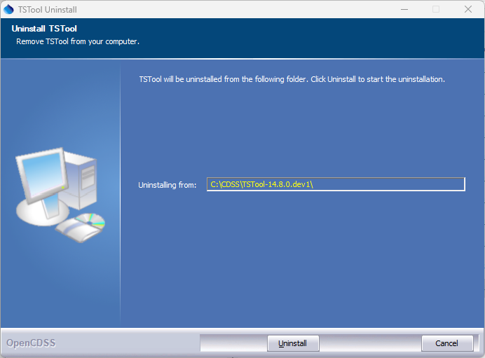
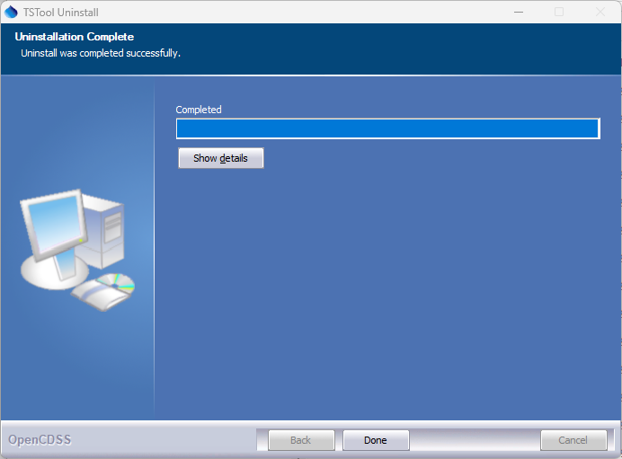

# TSTool / Install TSTool #

This appendix describes how to install TSTool.
TSTool was originally developed for [CDSS (Colorado's Decision Support Systems)](https://cdss.colorado.gov/)
to process water resources data for modeling and analysis.
However, TSTool can be used outside of CDSS and also can be used to analyze data other than water resources.
In all cases, it is recommended to install in the default location to avoid confusion.

*   [Overview](#overview)
*   [File Locations](#file-locations)
    +   [Installation Files](#installation-files)
    +   [User Files](#user-files)
*   [Installing TSTool](#installing-tstool)
    +   [Install TSTool on Windows](#install-tstool-on-windows)
    +   [Install TSTool on a Windows File Server](#install-tstool-on-a-windows-file-server)
    +   [Install TSTool from the “HydroBase data set Analysis Query Tools DVD”](#install-tstool-from-the-hydrobase-data-set-analysis-query-tools-dvd)
    +   [Windows TSTool Installation Technical Details](#windows-tstool-installation-technical-details)
    +   [Install TSTool on Linux](#install-tstool-on-linux)
*  [Uninstalling TSTool](#uninstalling-tstool)
    +   [Uninstall TSTool on Windows](#uninstall-tstool-on-windows)
    +   [Uninstall TSTool on Linux](#uninstall-tstool-on-linux)
*   [Running TSTool](#running-tstool)
    +   [Running TSTool on Windows](#running-tstool-on-windows)
    +   [Running TSTool on Linux](#running-tstool-on-linux)
*   [TSTool Configuration](#tstool-configuration)
*   [Map Configuration](#map-configuration)

-------

## Overview ##

CDSS consists of the HydroBase database, modeling, and data viewing/editing software.
TSTool can be used within this system to process time series from the HydroBase database,
CDSS model files, and other databases and files.
Alternatively, TSTool can be installed independently of CDSS,
in which case the only connection is that the installation folder on Windows defaults to `C:\CDSS\TSTool-Version`.
TSTool can also be installed on Linux, typically in `/opt/TSTool-Version`.

## File Locations ##

Standard locations of TSTool software files are as follows.

### Installation Files ###

These files are referred to the "installation files".

TSTool software is normally installed on Windows on the `C:` drive but can be installed in a shared location on a server
if the software is provided in a shared environment (in this case it is recommended to install in `C:` first and
then copy the `TSTool-Version` folder to the server).
Note that the following list of software `*.jar` files may be different from the current TSTool version.
In the future separate documentation may be provided explaining software components and licenses.

```
C:\CDSS\TSTool-Version                      Windows top-level install folder.
/opt/TSTool-version                         Linux top-level install folder.
  bin/                                      Software program files folder.
    Blowfish*.jar                           Used for encryption/security.
    cdss*.jar                               CDSS components.
    h2*.jar                                 H2 embedded database.
    jcommon.jar, jfreechart.jar             Plotting package.
    jsr173_1.0_api.jar, libXMLJava.jar      XML support.
    jython.jar                              Jython support.
    sqljdbc4.jar                            Microsoft SQL Server packages.
    NWSRFS_DMI*.jar                         National Weather Service River Forecast System (NWSRFS) package.
    cdss-lib-dmi-riversidedb*.jar           Riverside Technology, inc., RiversideDB database package.
    cdss-lib-dmi-statmonsys*.jar            State of Colorado Satellite Monitoring System package.
    cdss-li-processor-ts-java*.jar          Time series command processor package.
    tstool                                  Shell script to run TSTool on Linux and Mac.
    TSTool.bat                              Batch file to run TSTool using the JRE software, not typically used.
    TSTool.exe                              Executable program to run TSTool using the JRE software, recommended over batch file.
    TSTool.l4j.ini                          Configuration file for TSTool.exe launcher.
    TSTool*.jar                             TSTool program components.
  datastores/                               Datastore configuration files for databases and web services.
                                            Note that in versions before 13.00.00 these files were located in the "system" folder.
    *.cfg                                   See also user files below.
  doc/TSTool/UserManual/                    Main documentation folder for TSTool.
    TSTool.pdf                              TSTool documentation as PDF.
  examples/                                 Example data and command files.
  jre*\                                     Java Runtime Environment used by TSTool
  logs/                                     Folder for TSTool log files (should be writable).  See also user files below.
  plugins/                                  Plugins for datastores and commands.
    plugin-folder/                          Folder for plugin files.
      *.jar                                 Jar file for plugin.
  system/                                   Folder for system files.
    CDSS.cfg                                CDSS configuration file for HydroBase database configuration.
    DATAUNIT                                Data units file.
    TSTool.cfg                              Configuration file to modify TSTool defaults.  See also user files below.
    *.cfg                                   Shared datastore configuration files. See also user files below.
```

### User Files ###

These files are referred to the "user files".

In addition to the software installation files above,
user files are saved in a `.tstool` folder under the user’s home folder and
provide user-specific customization of the TSTool installation.
Folder names beginning with a period are by default hidden on Linux computers.
As of TSTool 13.00.00, the user files are separated by major TSTool version,
meaning that files for version 13.00.00, 13.00.01, 13.01.00, etc. are all stored under `.tstool/13`.
This allows sharing of configuration file in major version while allowing TSTool features and configuration files to evolve over time.
User configuration files will override the installation configuration
file settings when configuration setting values are found in both places, in particular:

* user `.tstool/N/system/TSTool.cfg` properties will override install `system/TSTool.cfg`
* user `.tstool/N/datastores/*.cfg` datastore configuration files will override install `datastores/*.cfg`

The following design was implemented in TSTool 13.00.00, with partial implementation in 12.06.00 and earlier versions.

TSTool user configuration files:

```
C:\Users\user\.tstool\          Windows user TSTool configuration files.
/home/user/.tstool/             Linux user TSTool configuration files.
  N/                            TSTool major version, e.g., 13
    batchServerHotFolder/       If TSTool is run with -batchServer and -batchServerHotFolder FolderName,
                                TSTool will look for command files in this folder, process them, and then delete the files.
    command-file-history.txt    History of opened command files, used to populate choices in the File / Open / Command file menu.
    datastores/
      *.cfg                     User’s datastore configuration files.
                                Use the Enabled=True property in a datastore configuration file to enable the datastore and
                                Enabled=False to disable the datastore.  Other options to disable the datastore are
                                delete the datastore file or move out of the ./tstool/datastores folder.
    logs/*.log                  Startup log file, which will be used until StartLog commands specify a different log file.
    plugins/                    Plugin datastores and commands.
      PluginName/               Folder to differentiate plugins.
        bin/                    Contains a jar file with code for plugin (see plugin developer documentation).
        bin-depend/             Contains jar file(s) needed by plugin.
        doc/                    Contains command documentation as Markdown, which is accessed from plugin command editors.
                                This is being evaluated.
          images/
            *.png, etc.
          include/
            *.css, etc.
          CommandName.md
    system/
      TSTool.cfg                User’s TSTool configuration settings.  This file is mainly used to enable/disable
                                datastore types that are of interest to the user.  See the example below. 
    template-graph/             Folder containing template graphs, which are shown in the lower right of the
                                ensemble and time series results next to the Graph with template: buttons.
    ui-state.txt                Properties describing the user interface state, such as last selected choices.
```

The following is an example user `TSTool.cfg` configuration file and is discussed more in the
[TSTool Configuration](#tstool-configuration) section.
Before 13.03.00 the `[TSTool]` was not used.
For versions 13.03.00 and later, the `[TSTool]` line can be used to be consistent with main configuration file,
or can be omitted.

```
# ./tstool/N/system/TSTool.cfg
#
# TSTool configuration file containing user settings, shared between TSTool versions
# This file indicates which datastore software features should be enabled.
# Disabling datastore types that are not used can improve TSTool performance and simplifies the user interface.
# Refer to the TSTool.cfg file under the software installation folder for global configuration properties.
# User settings in this file will override the installation settings.

[TSTool]

HydroBaseEnabled = true
#HydroBaseEnabled = false
ReclamationHDBEnabled = true
```

## Installing TSTool ##

TSTool can be installed in various environments, including:

1. on a Windows desktop computer, using the CDSS TSTool installer
2. on a Windows server, using the CDSS TSTool installer
3. on Linux, using the CDSS TSTool installer
4. as part of the HydroBase Tools DVD installation, used in the past but typically not currently used.

In all cases, is recommended that the normal installation file structure is used.
The following sections describe installation in various environments.

### Install TSTool on Windows ###

Use the following instructions to install TSTool on Windows using the `TSTool_CDSS_Version_Setup.exe` installer program,
for example if TSTool software was downloaded from the [CDSS website](https://www.colorado.gov/pacific/cdss/tstool)
or [OpenCDSS website](https://opencdss.state.co.us/tstool/):

#### 1. Run the `TSTool_CDSS_Version_Setup.exe` file by selecting from Windows Explorer, the ***Start / Run /***  menu, or from a command shell. ####

Prior to TSTool 14.8.0, administrator privileges were required to install TSTool.
Administrator privileges are not required for TSTool 14.8.0 and later.
The following dialog will be shown.

**<p style="text-align: center;">

</p>**

**<p style="text-align: center;">
TSTool Install - Welcome (<a href="../Install_Welcome.png">see full-size image</a>)
</p>**

Press ***Next*** to continue with the installation.
 
**<p style="text-align: center;">

</p>**

**<p style="text-align: center;">
TSTool Install - License Agreement (<a href="../Install_License.png">see full-size image</a>)
</p>**

TSTool is distributed with CDSS with GPL v3+ license.
Press ***I Agree*** to continue with the installation.
 
#### 2. Several components can be selected for the install as shown in the following dialog. ####

Position the mouse over a component to see its description.

**<p style="text-align: center;">

</p>**

**<p style="text-align: center;">
TSTool Install - Choose Components (<a href="../Install_SelectComponents.png">see full-size image</a>)
</p>**

Select the components to install and press ***Next***.

#### 3. The following dialog is then shown and is used to select the installation location for TSTool.####

Multiple versions of TSTool can be installed and there are no dependencies between the versions.
It is recommended that the default install location shown is used.

**<p style="text-align: center;">

</p>**

**<p style="text-align: center;">
TSTool Install - Choose Install Location (<a href="../Install_SelectFolder.png">see full-size image</a>)
</p>**

After selecting the install location, press ***Next***.

#### 4. The following dialog will be shown to select the Start menu for the software: ####

**<p style="text-align: center;">

</p>**

**<p style="text-align: center;">
TSTool Install - Choose Start Menu Folder (<a href="../Install_StartMenuFolder.png">see full-size image</a>)
</p>**

After selecting the folder, press ***Install***.

#### 5. The following dialog will show the progress of the installation:####

**<p style="text-align: center;">

</p>**

**<p style="text-align: center;">
TSTool Install - Installation Complete (<a href="../Install_Complete.png">see full-size image</a>)
</p>**

Press ***Show details*** to see the files that were installed or press ***Next*** to continue.

#### 6. If the CDSS Base Components were selected for install, the following dialog will be displayed: ####

**<p style="text-align: center;">

</p>**

**<p style="text-align: center;">
TSTool Setup - HydroBase Configuration Question (<a href="../Install_HydroBaseQuestion.png">see full-size image</a>)
</p>**

TSTool and other CDSS software can utilize HydroBase running on the local computer as well as other computers.
Press ***Yes*** if HydroBase has been installed on another computer in the
network environment and may be used by the software (then continue to the next step).
Also press ***Yes*** if TSTool will be run in batch mode because the specific
HydroBase name must be specified in configuration files.  Otherwise, press ***No*** (skip to step 8). 

#### 7. The following dialog allows additional HydroBase servers to be specified for use by CDSS software

The example below configures CDSS software to list the `dwrappsdb` HydroBase
server in choices and defaults to HydroBase on the local computer.
The dialog will initially show previous settings from the `\CDSS\TSTool-Version\system\CDSS.cfg`
file and settings typically only need to be changed after installing a new HydroBase version.

**<p style="text-align: center;">

</p>**

**<p style="text-align: center;">
TSTool Setup - Configure HydroBase Settings (<a href="../Install_HydroBaseConfiguration.png">see full-size image</a>)
</p>**

After entering the name of a HydroBase server and the default server to use, press ***Done***.

#### 8. The following dialog will then be shown indicating how to run the software: ####

**<p style="text-align: center;">

</p>**

**<p style="text-align: center;">
TSTool Setup - Run Software Instructions (<a href="../Install_RunTSToolInstructions.png">see full-size image</a>)
</p>**

Press ***Yes*** to run the software or ***No*** to exit the installation procedure.

#### 9. Import Old CDSS Configuration File ####

TSTool is distributed with a default configuration for CDSS.
If the configuration file properties have been edited in a previous release,
the properties can be imported from the old configuration file using the
***Help / Import Configuration...*** menu.  See also the TSTool ***Tools / Options*** menu.

**This feature will be updated in the future to handle configuration files with the 13.00.00+ file structure.**

### Install TSTool on a Windows File Server ###

TSTool can be installed on a Windows file server, which allows software updates to be made in one location,
thereby eliminating the need to install software on individual machines.
As of TSTool 11.09.00 user configuration files will be saved under the user’s folder to
facilitate persistence of user settings between software updates.
For this type of installation, all computers that access the software
should typically have similar configuration, including network configuration.
The standard installer described in this documentation focuses on individual installs on user computers.
To make TSTool software installed on a server available to other computers,
perform the following (this is typically performed by system administrators):

1.  Run the `TSTool_CDSS_Version_Setup.exe` installer as described above.
    During installation specify the TSTool installation home using a drive letter and
    path for the server or specify a Universal Naming Convention (UNC) path (e.g., `\\ServerName\CDSS\TSTool-Version`).
2.  Or...Copy the `C:\Users\user\CDSS\TSTool-Version` files from a local installation to a network location.
    The TSTool software will detect the file location when run using the `TSTool.exe` file.

The menus and shortcuts will only be configured for the computer from which the installation was run.
Therefore, menus and shortcuts for other computers will need to be manually configured.

If TSTool has been installed on a local computer and it is also available on the network,
the network version can be run by running the software in the `ServerName\CDSS\TSTool-Version\bin folder`.
The software will expect that file locations use the same drives as when the software was installed.

### Install TSTool from the “HydroBase data set Analysis Query Tools DVD” ###

If you acquired a HydroBase DVD or downloaded the DVD image,
TSTool will be installed during the DVD install process.
Refer to the installation instructions for that distribution.
The version that is installed may be older than the version available on the CDSS web site;
however, multiple TSTool versions can be installed and run independently.

### Windows TSTool Installation Technical Details ###

This section provides technical details about the TSTool Windows installation,
which is useful for troubleshooting.
TSTool 14.8.0 is used as an example,
which is the first version where the installer did not require administrative privileges.

The TSTool installer configures the following:

1.  ***Start*** menu is configured:
    *   Right-click on the menu item and ***More / Open file location*** to see where
        the menu link is saved, for example:
        `C:\Users\steve\AppData\Roaming\Microsoft\Windows\Start Menu\Programs\CDSS\TSTool-14.8.0`.
        Prior to TSTool 14.8.0 the link was saved as:
        `C:\ProgramData\Microsoft\Windows\Start Menu\Programs\CDSS\TSTool-14.8.0`.
    *   The above is a link to the program to run.
        Right-click on the link and press ***Properties***.
        The ***Shortcut*** tab will show the ***Target***,
        for example `C:\CDSS\TSTool-14.8.0\bin\TSTool.exe`,
        which will be run when the menu is selected.
2.  Windows registry keys are set indicating software installation basic information.
    (the `HKEY_CURRENT_USER` tree is used because the installation is for a normal user,
    without requring running with administrative privileges).  See:
    `Computer\HKEY_CURRENT_USER\Software\State of Colorado\CDSS\TSTool-14.8.0`.
3.  Windows registry keys are set indicating software uninstall information
    (the `HKEY_CURRENT_USER` tree is used because the installation is for a normal user,
    without requring running with administrative privileges).
    This information allows TSTool to know how to uninstall the software.

    **<p style="text-align: center;">
    
    </p>**

    **<p style="text-align: center;">
    TSTool Uninstall Registry Settings (<a href="../Uninstall_Registry.png">see full-size image</a>)
    </p>**

If the TSTool uninstall program does not remove the ***Start Menu***,
***File Explorer*** can be used to remove the link.
Registry settings can be edited using the `regedit` program.

### Install TSTool on Linux ###

TSTool for Linux is available from the Open Water Foundation.
See the [OWF Software](https://software.openwaterfoundation.org/) website.
Follow the instructions on the download page.

## Uninstalling TSTool ##

The process to uninstall TSTool changed as of TSTool 12.06.00.

### Uninstall TSTool on Windows ###

#### Uninstall TSTool 12.06.00 and Later from Windows ####

As of TSTool 12.06.00, the software uninstall process has been simplified
to take advantage of Windows features.  Make sure that TSTool is not running.

The first way to uninstall is to right-click on the TSTool software version in the ***Start***
menu and select the ***Uninstall*** menu, as shown in the following image.
The next steps are similar to those described below.

**<p style="text-align: center;">

</p>**

The second way to uninstall TSTool is as follows.
Use the windows ***Run*** search field (lower left of desktop).
Enter `uninstall`.  This should display Windows settings for ***Apps * features*** (or ***Apps*** on Windows 11).

**<p style="text-align: center;">

</p>**

Search for `TSTool` as shown above.
Select the version of TSTool to uninstall and press ***Uninstall***.
A confirmation will be requested.

The third way to uninstall TSTool is to run the `C:\CDSS\TSTool-14.7.0\Uninstall_TSTool-14.7.0.exe` (or similar)
using ***File Explorer*** or a command shell.

All of the above three options will display a confirmation similar to the following:
 
**<p style="text-align: center;">

</p>**

**<p style="text-align: center;">
TSTool Uninstall - Confirmation (<a href="../Install_Confirmation.png">see full-size image</a>)
</p>**

After uninstalling has completed, the following will be shown:

**<p style="text-align: center;">

</p>**

**<p style="text-align: center;">
TSTool Uninstall - Complete (<a href="../Install_Complete.png">see full-size image</a>)
</p>**

The uninstall process does the following:

1.  Removes the software files from `C:\CDSS\TSTool-Version`.
    Any files that exist in the user's files (`.tstool` folder) will remain.
    This allows datastore configurations, plugins, and other user-configured files to be shared with
    other TSTool version installations.
2.  Remove the TSTool version from the ***Start / CDSS*** menu.
3.  Remove registry settings so that the TSTool version is not listed in Windows Apps.

#### Uninstall TSTool 12.05.00 and Earlier from Windows ####

To uninstall TSTool 12.05.00 and earlier versions, select the ***CDSS / Uninstall / TSTool*** from the ***Start*** menu and confirm the uninstall.
CDSS components that are used by other software (e.g., CDSS Base component software) as well as user data will remain installed.

### Uninstall TSTool on Linux ###

TSTool can be uninstalled from Linux simply by removing the 
software files that were installed.
The TSTool Linux installer does not currently add a menu.

## Running TSTool ##

See the following sections for basic information about running TSTool.
See also the [Running TSTool in Various Modes](../appendix-running/running.md) appendix.

### Running TSTool on Windows ###

TSTool can be started in several ways as described below.

#### CDSS Menu ####

The ***Start / All Programs / CDSS / TSTool-Version*** (or ***Start / Programs / CDSS / TSTool-Version***)
menu can be used to start the software.  This runs the `TSToolInstallHome\bin\TSTool.exe` software.

#### Command Line Executable ####

The installation process does NOT add the `TSToolInstallHome\bin` folder to the path;
however, this addition can be made by the user, allowing the TSTool software to be started anywhere by running TSTool.
Running TSTool from any location will result in the software being run in the installation location.
Specifying a command file on the command line or interactively will reset the working directory to that of the command file.

#### TSTool Batch File ####

A batch file can be used to run the `TSTool.exe` program,
for example using the `–commands command` line parameter to specify a command file.
In this case it may be necessary to specify the absolute path to the command file to ensure that the software can locate related files.

### Running TSTool on Linux ###

TSTool can be run on Linux using the `tstool` script,
which is found in the `bin` folder where TSTool was installed.

## TSTool Configuration ##

TSTool requires minimal configuration after installation.
This section describes TSTool configuration files that can be customized for a system.
Configuration is specified by installation files for each TSTool installation.
As of TSTool version 11.09.00, user configuration files are saved in the user's `.tstool` folder,
which allows overriding the installation files configuration files.

### TSTool Configuration File ###

The `system\TSTool.cfg` file can be specified in the following two locations on Windows:

*   Installation files:
    +   Windows:  `C:\CDSS\TSTool-Version\system\TSTool.cfg`
    +   Linux:  `/opt/TSTool-Version/system/TSTool.cfg`
* User files (`N` below is the TSTool major version number, e.g., `13`):
    +   Windows:  `C:\Users\user\.tstool\N\system\TSTool.cfg`
    +   Linux:  `/home/user/.tstool/N/system/TSTool.cfg`

The `TSTool.cfg` file installation folder contains top-level configuration information for TSTool.
User file configuration properties take precedence over the installation configuration properties.
The format of the file is as follows:

```
#
# Configuration file for TSTool
# - sets controlling configuration properties
# - see also the "../datastores" folder for datastore configuration
# - properties in this file can be overridden by user's ".tstool/N/system/TSTool.cfg" file
# - the "CDSS.cfg" file provides configuration information for HydroBase selection/login dialog
# - HydroBase configuration will move to a datastore at some point

[TSTool]

# Enable/disable datastores and input types globally, which will turn on/off software features.
# - if properties are not specified then internal defaults will apply
# - defaults generally support use in Colorado because of historical use of the software
# - see documentation for datastores for more information

DateValueEnabled = true
HydroBaseEnabled = true
RiverWareEnabled = true
StateCUEnabled = true
StateModEnabled = true
... etc ...

# Program to use for file differences, intended to be graphical file difference viewer.
# The program will be called as DiffProgram File1 File2.
# Specify programs separated by commas if more than one proram name or location is possible.
# It is up to the user to install KDiff3 on the computer or change the following to a different program.
DiffProgram = "C:\Program Files\KDiff3\kdiff3.exe,C:\Program Files\KDiff3\bin\kdiff3.exe"
DiffProgram.Windows = "C:\Program Files\KDiff3\kdiff3.exe,C:\Program Files\KDiff3\bin\kdiff3.exe"
DiffProgram.Linux = "/usr/bin/kdiff3"

# Online documentation home.
# - the first is the primary documentation root for the latest software version
# - the second is a backup and allows transition from one server to another
# - the documentation viewer will first try using the specific software version rather than 'latest'
#   and if not found will use 'latest'
UserDocumentationUri = "https://opencdss.state.co.us/tstool/latest/doc-user/"
UserDocumentationUri2 = "https://learn.openwaterfoundation.org/cdss-app-tstool-doc-user/"
```
**<p style="text-align: center;">
Example TSTool Installation Configuration File
</p>**

The example illustrates the format of the file.
The `*Enabled` properties can be used to enable/disable input types.
Common formats are enabled by default and more specialized formats are disabled by default.
For example, use `HydroBaseEnabled = false` to disable the automatic HydroBase login that
occurs with the HydroBase input type (e.g., if HydroBase is unavailable for some reason).

The optional `MapLayerLookupFile` property indicates the name
of the time series to map layer lookup file.
See the [Map Configuration](#map-configuration) section below.

The user configuration file `./tstool/system/TSTool.cfg` under the user’s home folder provides additional configuration,
for example to disable datastores based on the user’s preferences.
Before 13.03.00 the `[TSTool]` was not used.
For versions 13.03.00 and later, the `[TSTool]` line can be used to be consistent with main configuration file,
or can be omitted.

```
# TSTool configuration file containing user settings, shared between TSTool versions
# This file indicates which datastore software features should be enabled.
# Disabling datastore types that are not used can improve TSTool performance and
# simplifies the user interface.
# Refer to the TSTool.cfg file under the software installation folder for global 
# configuration properties.
# User settings in this file will override the installation settings.

[TSTool]

HydroBaseEnabled = true
```
**<p style="text-align: center;">
Example TSTool User Configuration File
</p>**

### Data Units File ###

The `system\DATAUNIT` file under the main installation folder contains data unit
information that defines conversions and output precision.
In most cases the default file can be used but additional units may need to be added for a
user's needs (in this case please notify the developers so the units can be
added to the default file distributed with installations).
Currently, the `DATAUNIT` file is the only source for units information.

### HydroBase Configuration ###

The following properties can be defined in the installation `TSTool.cfg` file in a `[HydroBase]`
section to control how TSTool interacts with HydroBase.
See also the [CDSS Configuration File](#cdss-configuration-file) section below.
These properties may be moved to a HydroBase datastore configuration file in the future.

**<p style="text-align: center;">
TSTool HydroBase Configuration Properties
</p>**

|**Property**&nbsp;&nbsp;&nbsp;&nbsp;&nbsp;&nbsp;&nbsp;&nbsp;&nbsp;&nbsp;&nbsp;&nbsp;|**Description**|**Default**|
|--|--|--|
|`AutoConnect`|If `False`, a HydroBase login dialog will be shown at startup.  If `True`, the default database information in the CDSS configuration file (see next section) will be used to automatically connect to the database, and the login dialog will not be shown.|`False`|
|`WDIDLength`|Indicates the length of water district identifiers (WDIDs) constructed from separate WD and ID data, when creating time series identifiers.  Because time series identifier strings are compared literally, it is important that the WDIDs are consistent within a commands file.|`7`|
 
### CDSS Configuration File ###

By default, TSTool will automatically look for HydroBase databases on the current (local) machine and the State servers.
State server databases are typically only accessible to State of Colorado computers.
If SQL Server HydroBase versions have been installed on a different machine,
the `\cdss\TSTool-Version\system\CDSS.cfg` file can be used to indicate the database servers.
An example of the configuration file is as follows.
These properties may be moved to a HydroBase datastore configuration file in the future.

```
[HydroBase]

ServerNames="ServerName,local"
DefaultServerName="ServerName"
DefaultDatabaseName="HydroBase_CO_20080730"
```

Properties can be specified on the TSTool command line using the notation `Property=Value`
and will in some cases override the values in the configuration file.
New properties are added as necessary.

The CDSS configuration properties are described in the following table:

**<p style="text-align: center;">
CDSS HydroBase Database Configuration Properties
</p>**

|**Property**&nbsp;&nbsp;&nbsp;&nbsp;&nbsp;&nbsp;&nbsp;&nbsp;&nbsp;&nbsp;&nbsp;&nbsp;&nbsp;&nbsp;&nbsp;&nbsp;&nbsp;&nbsp;&nbsp;&nbsp;&nbsp;&nbsp;&nbsp;&nbsp;&nbsp;&nbsp;|**Description**|**Default**|
|--|--|--|
|`ServerNames`|A comma-separated list of server names to list in the HydroBase login dialog.|The state server is listed.|
|`DefaultServerName`|The default HydroBase server name to use.  This allows the HydroBase login dialog to preselect a default that applies to most users in the system.  If TSTool is run in batch mode and the HydroBase input type is enabled, use this property to make a default connection to HydroBase, for use with other commands in the batch run.|`greenmtn.state.co.us`|
|`DefaultDatabaseName`|The default HydroBase database name to use.  This allows the HydroBase login dialog to preselect a default that applies to most users in the system.  If TSTool is run in batch mode and the HydroBase input type is enabled, use this property to make a default connection to HydroBase, for use with other commands in the batch run.||
|`DatabaseEngine`|Reserved for internal use.||
|`DatabaseName`|The database name to use for the initial connection.  This overrides the default server.||
|`DatabaseServer`|The server name to use for the initial connection.  This overrides the default server.||
|`SystemLogin`|Reserved for internal use.||
|`SystemPassword`|Reserved for internal use.||
|`UserLogin`|Reserved for internal use.||

## Map Configuration ##

TSTool can display maps configured as GeoView project files,
although this functionality is experimental and has not been widely utilized.
See the [GeoView Mapping Tools Appendix](../appendix-geoview/geoview.md) for more information about these files.
To allow a link between time series and map layers,
use the `TimeSeriesMapLayerLook` property in the `TSTool.cfg` file to specify a time series to
map layer lookup file (see the [TSTool Configuration File](#tstool-configuration-file) section above).
The following example file illustrates the contents of the lookup file:

```
# This file allows time series in TSTool to be linked to stations in spatial
# data layers.  The columns are used as appropriate, depending on the direction
# of the select (from time series list or from the map).
#
# This file has been tested with the \CDSS\GIS\CO\co_TSTool.gvp file.  Not all
# possible combinations of time series and map layers have been defined - only
# enough to illustrate the configuration.
# Additional attributes need to be added to the point files to allow more
# extensive functionality.  For example, if attributes for data interval (time
# step) and data source are added to the attributes, then a definition query
# can be defined on the layer for displays to use the same data file.  The
# configuration below can then use the different names to configure the link
# to time series.
#
# TS_InputType - the time series input type, as used in TSTool
# TS_DataType - the data type shown in TSTool, specific to an input type
#                For example, TSTool uses "Streamflow" for HydroBase, whereas
#                for other input types a different data type string may be used.
# TS_Interval - time series interval of interest (e.g.,"Month", "Day", "1Hour"
#                "Irregular")
# Layer_Name - the layer name used in the map layer list
# Layer_Location - the attribute that is used to identify a location, to be
#                matched against the time series data location
# Layer_DataType - the attribute that is used to indicate the data type for a
#                station's time series (CURRENTLY NOT USED - UNDER EVALUATION)
# Layer_Interval - the attribute that is used to indicate the interval for a
#                station's time series
# Layer_DataSource - the attribute that is used to indicate the data source for
#                a station's time series.
#
# When matching time series in the TSTool time series query list with features
# on the map, the TS_* values are matched with the time series identifier
# values and the Layer_* attributes are matched against specific time series.
#
# Data layers are listed from largest interval to smallest.
"TS_InputType","TS_DataType","TS_Interval","Layer_Name","Layer_Location","Layer_DataSource"
HydroBase,DivTotal,Day,"Diversions",id_label_7,""
HydroBase,DivTotal,Month,"Diversions",id_label_7,""
HydroBase,EvapPan,Day,"Evaporation Stations",station_id,""
HydroBase,EvapPan,Month,"Evaporation Stations",station_id,""
HydroBase,Precip,Irregular,"Precipitation Stations",station_id,""
HydroBase,Precip,Day,"Precipitation Stations",station_id,""
HydroBase,Precip,Month,"Precipitation Stations",station_id,""
HydroBase,RelTotal,Day,"Reservoirs",id_label_7,""
HydroBase,RelTotal,Month,"Reservoirs",id_label_7,""
HydroBase,Streamflow-DISCHRG,Irregular,"Streamflow Gages - Real-time",station_id,""
HydroBase,Streamflow,Day,"Streamflow Gages - Historical",station_id,""
HydroBase,Streamflow,Month,"Streamflow Gages - Historical",station_id,""
```

**<p style="text-align: center;">
Example Time Series Map Layer Lookup File
</p>**

The columns in the lookup file indicate how information in the time series input/query
list can be matched against time series in map layers.
In particular, the `TS*` columns define values that are seen in the TSTool interface and the `Layer*`
columns define the layer and attribute names for map layers.
The `Layer_Interval` and `Layer_DataSource` are optional but if
specified result in more specific links between time series and map layers.
