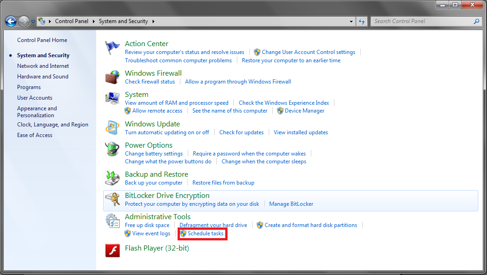
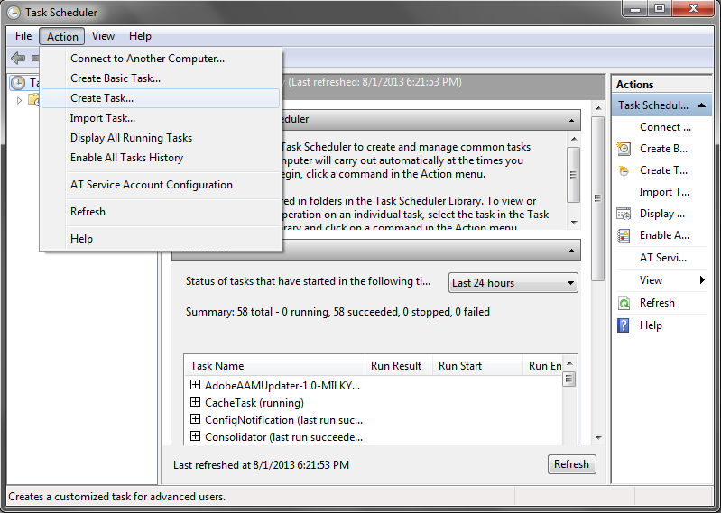
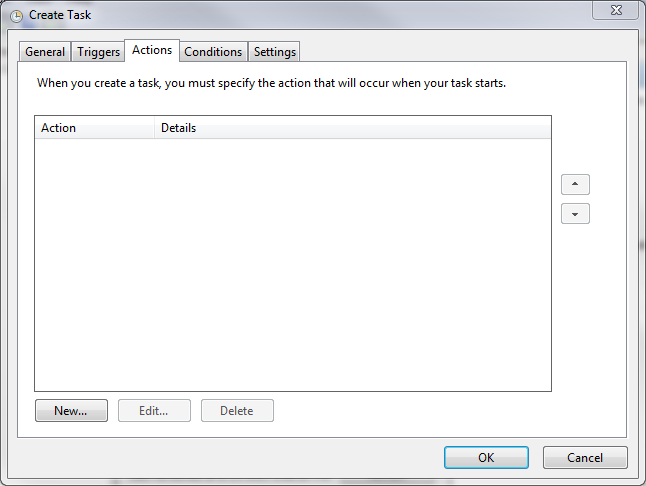
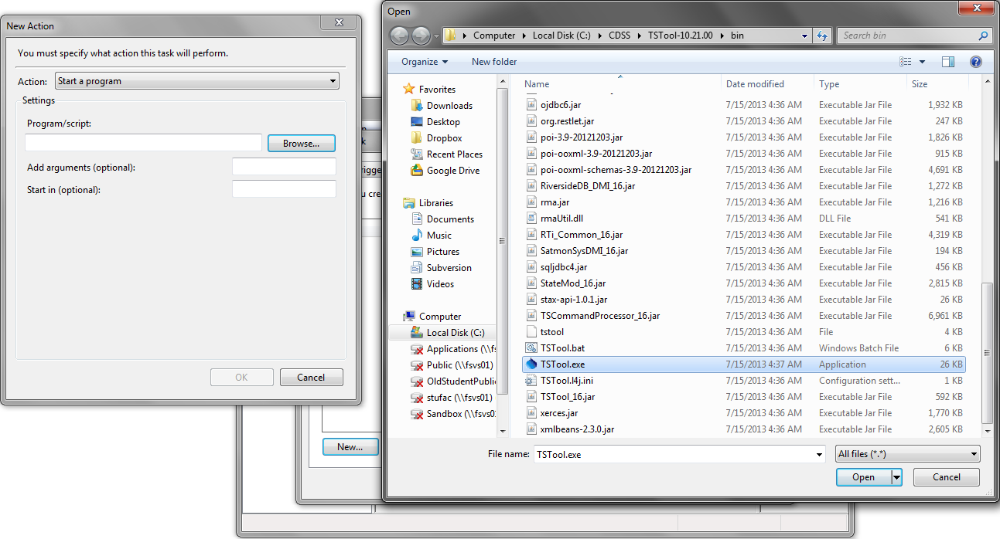
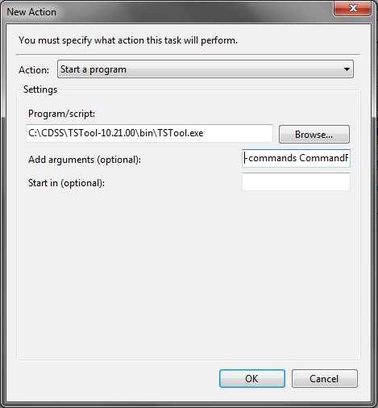
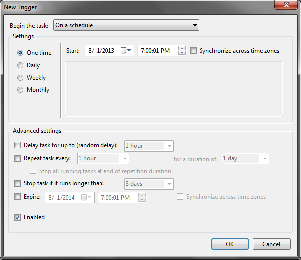

# TSTool / Running TSTool in Various Modes #

*   [Overview](#overview)
*   [Running TSTool in Interactive Mode](#running-tstool-in-interactive-mode)
*   [Running TSTool in Limited Interactive Mode](#running-tstool-in-limited-interactive-mode)
*   [Running TSTool in Command Line Batch Mode](#running-tstool-in-command-line-batch-mode)
    +   [TSTool Command Line Parameters](#tstool-command-line-parameters)
    +   [Running TSTool in Command Line Batch Mode - Windows](#running-tstool-in-command-line-batch-mode-windows)
    +   [Running TSTool in Command Line Batch Mode - Linux](#running-tstool-in-command-line-batch-mode-linux)
*   [Running TSTool as a Scheduled Task](#running-tstool-as-a-scheduled-task)
    +   [Running TSTool as a Scheduled Task - Windows](#running-tstool-as-a-scheduled-task-windows)
    +   [Running TSTool as a Scheduled Task - Linux](#running-tstool-as-a-scheduled-task-linux)
*   [Running TSTool as a Web Server](#running-tstool-as-a-web-server)
*   [Running TSTool as a Batch Server](#running-tstool-as-a-batch-server)
*   [Running TSTool as a REST Web Server](#running-tstool-as-a-rest-web-server)
*   [Running TSTool as a Web Browser Applet](#running-tstool-as-a-web-browser-applet)
*   [Substitute Datastore Examples](#substitute-datastore-examples)
    + [Automated Web Services Tests Use Specific Datastore Name and Subtitute Uses a General Datastore Name](#automated-web-services-tests-use-specific-datastore-name-and-subtitute-uses-a-general-datastore-name)
    + [Automated Database Tests Use a General Datastore Name and Substitute Uses a Specific Datastore Name](#automated-database-tests-use-a-general-datastore-name-and-substitute-uses-a-specific-datastore-name)

------------------------------

## Overview ##

TSTool is commonly run as an interactive desktop application using the graphical user interface (GUI).
However, the TSTool design allows the software to be run in various modes, as described in this document:

1.  Desktop application
    1.  Interactive graphical user interface
    2.  Limited graphical user interface (e.g., no main GUI but graph windows display in support of other applications)
    3.  Command line batch mode (e.g., Windows command shell or Linux shell script)
2.  Scheduled task (e.g., Windows scheduler or Linux cron)
3.  Web server application (e.g., run headless processing in support of website)
4.  Batch server to process command files in a hot folder (`-batchServer` mode)
5.  REST web server (e.g., run TSTool as a stand-alone REST web server)
6.  Web browser applet

The following sections focus on each run mode for various operating systems.
In addition to these run modes, the TSTool installation configuration may involve the
software being installed on a local computer for one user or a server that
provides access to multiple desktop computers and users.
It is possible for any of the run modes to be configured on a desktop computer,
given the proper supporting software and expertise;
however, it is likely that server-oriented run modes will be configured on servers.
The following sections describe how to run TSTool in various modes.
It is assumed that TSTool has been properly installed and configured based on information in other appendices.

## Running TSTool in Interactive Mode ##

Running TSTool in interactive mode using the graphical user interface
(GUI) is the primary run mode for most users, in particular when editing and running command workflows.
The [Getting Started chapter](../getting-started/getting-started.md) and other chapters
in the TSTool documentation focus on this run mode and are not discussed further here.

Often as TSTool processing becomes integrated with an organization’s business processes,
it is appropriate to run TSTool command files in batch mode for
efficiency or as a scheduled task to support other tasks.
The following sections describe how such processing can be implemented.
Because the command files are the same regardless of whether TSTool is run in interactive or batch mode,
the interactive tool can be used to modify and troubleshoot command files, as appropriate.

## Running TSTool in Limited Interactive Mode ##

It may be useful to run TSTool in support of other applications.
For example, TSTool has been integrated with Geographic Information System (GIS)
desktop applications where clicking on a map feature results in running
TSTool to process data to produce an interactive graph.
In this case, TSTool is run in batch mode (see following sections) and
the `–nomaingui` command line parameter is used to indicate the special run mode.
The user can interact with the displayed visualization window as if the window had been created from the normal GUI,
including changing between graph, table, and summary views, changing view properties, and printing.

Potential issues with this approach are:

*   Error-handling and feedback to the user are more difficult because TSTool
    is not fully integrated with the calling software.
    The [`StartLog`](../command-ref/StartLog/StartLog.md) command can be used to ensure
    that a log file is created in a location that is integrated with the overall system.
*   There may be a slight delay displaying the view window because TSTool starts each time.
    To improve performance, a specific configuration for TSTool may be required (see the `–config` command line parameter).
    For example, disable all datastores that are not necessary for the application
    because the time required to connect to databases will slow down TSTool startup.
    Another option is to point to data products (time series graphs, etc.) provided by a web server.
    This involves implementing TSTool on a web server, which his discussed in a section below;
    however, such an approach requires implementing more technology components.
*   It can be confusing to specify the location of configuration information and input files.
    Using absolute paths limits flexibility in changing the configuration.
    However, relative paths must be “anchored” to a starting location.
    For example, TSTool assumes an initial working directory depending on software
    startup and then sets the working directory to the location of the command file.
    It generally is best to utilize the top-level application to provide the working directory,
    and then pass the information to TSTool dynamically if possible.

## Running TSTool in Command Line Batch Mode ##

“Command line batch mode” refers to running TSTool from a command prompt,
such as the Windows command shell or Linux command line.
The TSTool GUI is useful because it provides immediate feedback on whether
commands are properly defined and input data are available.
However, once a command file has been defined,
it may be appropriate to process the commands in an automated “headless mode”, without the GUI.
Run TSTool on the command line as follows on Windows:

```
[PathToTSTool]tstool –commands [PathToCommandFile]commands.TSTool [TSTool parameters]
```

Run TSTool on the command line as follows on Linux (note the double dash parameter,
which separates the `tstool` script parameters from TSTool program parameters):

```
[PathToTSTool]tstool -- –commands [PathToCommandFile]commands.TSTool [TSTool parameters]
```

See the following sections for specific issues that may occur on different operating systems.
The following are potential issues on any operating system:

*   TSTool relies on a “working directory”, which is the root location to which relative paths are referenced.
    Normally the working directory is the location of the command file once opened.
    However, when running TSTool in batch mode, there are a number of folders involved:
    the location of the TSTool executable, the location from which TSTool is run, and the location of the command file.
    These multiple locations can make it difficult to troubleshoot.
    One option is to use absolute paths in the TSTool command line for the executable
    and the command file so it is very clear where the TSTool executable and command file are located.
    These paths can be coded into a batch file (`*.bat` on Windows, or shell script on Linux).
*   TSTool can be run in headless mode and still create graph windows
    (e.g., when TSTool supports the functionality of another application).
    Make sure to evaluate whether the `–nomaingui` parameter is needed in addition to `–commands` (see the previous section).
*   The TSTool default log file under the logs folder of the installation is used when TSTool first starts up.
    If a [`StartLog`](../command-ref/StartLog/StartLog.md) command is used in the command file,
    it will be used when the command file is run.  Refer to the appropriate log file when troubleshooting.

## TSTool Command Line Parameters ##

The following table lists the TSTool command line parameters.
If [running on Linux](#running-tstool-in-command-line-batch-mode-linux) using the `tstool` script,
the parameters should be specified after `--` parameter.

**<p style="text-align: center;">
TSTool Command Line Parameters
</p>**

|**Command Line Parameter**&nbsp;&nbsp;&nbsp;&nbsp;&nbsp;&nbsp;&nbsp;&nbsp;&nbsp;&nbsp;&nbsp;&nbsp;&nbsp;&nbsp;&nbsp;&nbsp;&nbsp;&nbsp;&nbsp;&nbsp;&nbsp;&nbsp;&nbsp;&nbsp;&nbsp;&nbsp;&nbsp;&nbsp;&nbsp;&nbsp;&nbsp;&nbsp;&nbsp;&nbsp;&nbsp;&nbsp;|**Description**|**Default**|
|--|--|--|
|`CommandFile`|The command file can be specified without `–commands` to start up the TSTool GUI and load the command file.  This behavior occurs when selecting a `*.TSTool` file in Windows Explorer.  See also `-runcommandsonload.`||
|`Property=Value`|Define TSTool global application property (similar to the configuration file).  These properties typically are used during development to test specific features.||
|`Property==Value`|Define global processor properties (similar to the `SetProperty` command).  These properties are initialized for each command file run and are useful for configuring an environment when starting TSTool from a script, such as running in a Linux environment.||
| | |
|`-batchServer`<br>`--batchServer`|Run TSTool in headless mode to process command files that are copied into the hot folder (see `-batchServerHotFolder`).  TSTool will exit when a command file named stop is placed in the hot folder.||
|`-batchServerHotFolder Folder`<br><br>`--batchServerHotFolder Folder`|Specify the hot folder to use with the `-batchServer` parameter.||
|`-batchTimeout TimeoutSeconds`<br><br>`--batchTimeout TimeoutSeconds`|Timeout in seconds.  If TSTool command processing takes longer, TSTool will exit.  This may be appropriate as a final fallback if other timeout controls do not work.  Warning – this will leave processing incomplete.  May be removed in future.|Do not time out.|
|`-commands CommandFile`<br><br>`--commands CommandFile`|Specify the name of the command file to run in batch mode.  TSTool will process the commands and exit.|Start TSTool in interactive mode.|
|`-config ConfigFile`<br><br>`--config ConfigFile`|Start TSTool using the specified configuration file.  This is useful in software test environments.|Start TSTool using the `system/TSTool.cfg` file under the software installation.|
|`-dTerm,Log`|Specify the debug level (0+) for terminal and log file debug messages.  This is useful for printing troubleshooting messages at startup.  One or both values can be specified.|No debug messages are generated.|
|`--datastore-substitute=`<br>`DatastoreNameToUse`,<br>`DatastoreNameInCommands`|Substitute a datastore name to use for a datastore name used in commands.  For example, all automated tests may use a datastore name `datastore-test` in command files and a production system's `DatastoreNameToUse` can be specified as a substitute using `--datastore-substitute=DatastoreNameToUse,datastore-test`. See the [Substitute Datastore Examples](#substitute-datastore-examples) documentation. | No substitutes - the datastore name in command files must match a configured datastore name. |
|`-home InstallFolder`<br><br>`--home InstallFolder`|Specify the install folder.  This parameter is used internally by the TSTool launcher (Launch4J) and in the software development environment to specify the TSTool home, in order to locate other files.|Should always be set by the TSTool launcher.|
|`-httpServer`<br>`--httpServer`|Run TSTool in headless mode to act as an HTTP server.  Experimental||
|`-nodiscovery`<br>`--nodiscovery`|Do not run discovery on commands as they are loaded.  This can be used for large command files that will not be edited interactively, in order to decrease load time.|Run discovery on commands as they are loaded.|
|`-nomaingui`<br>`--nomaingui`|Do not show the TSTool main GUI when running commands, but do allow graph windows to be displayed.  Closing the last visible graph window will close the TSTool application.|If `–commands` is specified, do not show any windows.  If `-nomaingui` also is specified, allow graph windows to show.|
|`-runcommandsonload`<br>`--runcommandsonload`|Load and run the commands, used to start the GUI with a specific command file.||
|`-server`<br>`--server`|Start TSTool as a REST restlet server (under development).||
|`-test`<br>`--test`|Run TSTool in test mode, for developers.||
| `-ui-titlemod=TitleMod` | Set the TSTool main UI window title to ***TSTool - TitleMod - ....***.  This is useful for helping users identify custom TSTool configurations, for example when running a test suite that requires a Linux `sudo` login. | |

### Running TSTool in Command Line Batch Mode – Windows ###

To run TSTool in batch mode on Windows, first open a command prompt application (`cmd`).
Then run the TSTool program as follows.

```
[PathToTSTool]tstool –commands [PathToCommandFile]commands.TSTool [TSTool parameters]
```

Issues specific to Windows include:

*   If the folder containing the TSTool executable (`tstool.exe`)
    is in the `PATH` environment variable, then no leading path is needed.
    However, because different versions of TSTool may be installed on the system,
    specifying the leading path to the executable is often be appropriate.
*   Entering the TSTool command line in a ***Command Prompt*** window causes the prompt to be immediately returned,
    even though TSTool is still running.
    This can be disconcerting in particular because it may be difficult
    to know when TSTool has finished processing the command file.
    Placing the command in a batch file (`*.bat` or `*.cmd`) can help.

### Running TSTool in Command Line Batch Mode – Linux ###

To run TSTool in batch mode on Linux, first open a command shell window.
Then run the TSTool program as follows.

```
[PathToTSTool]tstool -- –commands [PathToCommandFile]commands.TSTool [TSTool parameters]
```

Issues specific to Linux include:

*   If the folder containing the TSTool executable (`tstool` script)
    is in the `PATH` environment variable, then no leading path is needed.
    However, because different versions of TSTool may be installed on the system or may not be in the `PATH`,
    it may be necessary to specify the leading path to the `tstool` executable.
    It may be useful to use symbolic links to provide access to the current version as tstool,
    for example:

```
/usr/bin/tstool -> /opt/tstool-13.03.00/bin/tstool
```

The linux `tstool` script provides the following command parameters.
The `--help` parameter should be used to print the current usage.

**<p style="text-align: center;">
`tstool` Script Command Parameters
</p>**

|**Parameter**&nbsp;&nbsp;&nbsp;&nbsp;&nbsp;&nbsp;&nbsp;&nbsp;&nbsp;&nbsp;&nbsp;&nbsp;&nbsp;&nbsp;&nbsp;&nbsp; | **Description** | **Default** |
| -- | -- | -- |
| `--addpath=path` | **Exploratory** - add a folder/file to the class path. | The TSTool software install folder `/plugins` folder and user's `.tstool/NN/plugins` folders are used to load plugin `jar` files. |
| `--dev` | Run using software development files in the Eclipse development environment, used with automated testing. This allows TSTool to be run with development files rather than building and running the installer. | Use production files. | 
| `--headless` | Run in headless mode, used on Linux when running batch and unattended processes.  The `-Djava.awt.headless=true` parameter is used to run Java. | |
| `-h`<br>`--help` | Print the program usage.  The help for this script is printed and then TSTool program is run with `--help`. TSTool command parameters are documented in online documentation. | |
| `--java-xmx=NNNNm` | Set the Java program `-Xmx` option to indicate the maximum memory to use, for example `--java-xmx=1024m` for 1024 MB. | `1024m`|
| `-v`<br>`--version` | Print the program version.  The version for this script is printed and then TSTool program is run with `--version`. | |
| `--` | All command parameters after double dash are ignored by the `tstool` script and are passed to the TSTool software. |

### Running TSTool in Command Line Batch Mode – Mac ###

TSTool execution on Mac computers is similar to Linux. 

## Running TSTool as a Scheduled Task ##

Examples of running TSTool as a scheduled task include automatically processing real-time data,
and creating data products prior to viewing (rather than creating upon request).
The following sections describe how to configure TSTool to run as a scheduled task.

### Running TSTool as a Scheduled Task – Windows ###

Windows has a task scheduling function, which can be used to run TSTool.
These instructions are for Windows 7.  However, all versions of Windows have similar features.
The following references can be consulted for other Windows versions:

* [Windows 10](https://www.digitalcitizen.life/how-create-task-basic-task-wizard)

To define a task, first go to the ***System and Security*** subpanel of the ***Control Panel***, then click on ***Schedule tasks***.

**<p style="text-align: center;">

</p>**

**<p style="text-align: center;">
Running TSTool – Schedule as a Task (<a href="../RunningTSTool_ScheduleTasks.png">see also the full-size image</a>)
</p>**

A screen showing currently scheduled tasks will appear. Click on the ***Action*** menu in the upper left, and the ***Create Task...*** option.
 
**<p style="text-align: center;">

</p>**

**<p style="text-align: center;">
Running TSTool – Creating a Task in the Task Scheduler (<a href="../RunningTSTool_TaskScheduler.png">see also the full-size image</a>)
</p>**

A tabbed dialog will appear.  Go to the ***Actions*** tab, and click ***New...*** to create a new task.

**<p style="text-align: center;">

</p>**

**<p style="text-align: center;">
Running TSTool – Create a New Task
</p>**

Specify the program to run by using the ***Browse...*** button to pick the TSTool executable program, as shown below.
The example shown on the right is a typical location for the install (specify an appropriate version number).

**<p style="text-align: center;">

</p>**

**<p style="text-align: center;">
Running TSTool – Specify Program to Run for Task (<a href="../RunningTSTool_NewTask1.png">see also the full-size image</a>)
</p>**

Specifying the absolute path to the command (starting at the drive) is recommended.
Also specify that TSTool should run without the user interface and specify command file to
use (`-commands CommandFileName`), as shown in the following figure:

**<p style="text-align: center;">

</p>**

**<p style="text-align: center;">
Running TSTool – Specify Program and Command Line Parameters to Run for Task
</p>**

TSTool log files will by default be in the logs folder under the TSTool installation.
Use the [`StartLog`](../command-ref/StartLog/StartLog.md) command to control the log file location.

To actually run the task, define a trigger in the ***Triggers*** tab of the ***Create Task*** dialog (press ***New...*** to create a trigger):

**<p style="text-align: center;">

</p>**

**<p style="text-align: center;">
Running TSTool – Specify Trigger to Indicate Run Task Schedule
</p>**

Any number of triggers can be chosen, and it can be run at almost any interval, from every five minutes upward.
Conditions that will prevent the program from running can also be chosen (***Conditions*** tab).
Output files will be overwritten on each run unless the filename is dynamic, such as using the date/time.

### Running TSTool as a Scheduled Task – Linux ###

These instructions apply to variants of Linux and UNIX.

Cron is a background system process that checks every minute to see if any process should be run.
To schedule a run, the `crontab` command is used.
It creates or edits an entry in the user’s `crontab` configuration file.
Each user can only have one `crontab` in most variants of Unix (Debian is slightly different; check the man page for more information).

The command `crontab -e` will edit an existing `crontab` or create a new one if none exists.
If this is the first time a `crontab` has been created on the system,
the command may present a list of editors to choose from. The choice is not important to the functioning of the command.

The syntax of a crontab entry is as follows:

```
minute  hour  day_of_month  month  day_of_week  command
```

A `*` in any of the first five fields will run the process at every instance,
and a range (e.g. `1-5` or `5,10,15`) can be entered into any of the first five fields.
For example, to run once an hour, the entry would be as follows:

```
0 * * * * (command)
```

To run TSTool as a cron process, command should be specified as follows:

```
/PathToInstallation/bin/tstool -- --commands PathToCommandFile
```

The paths should be specified as absolute path because cron does not necessarily have a home directory.  

The log files will by default be in the logs folder under the TSTool installation.
The [`StartLog`](../command-ref/StartLog/StartLog.md) command can be used to configure the log file location.

Output files will be overwritten at each execution of the command unless the names are determined dynamically.

For more information, see:

* [man cron](https://man7.org/linux/man-pages/man8/cron.8.html) - information about cron options and system variations
* [man crontab](https://linux.die.net/man/1/crontab) - information about options and system variations
* [man 5 crontab](https://linux.die.net/man/5/crontab) - information about syntax and limitations

## Running TSTool as a Web Server ##

If TSTool is started with the `–-httpServer` option it will run as a web server on port 8000.
This functionality is experimental and requires additional development.
This may replace or be combined with the experimental REST servlet describe below.

## Running TSTool as a Batch Server ##

If TSTool is started with the `–-batchServer` option it will run continuously in headless mode.
Use the `-batchServerHotFolder Folder` command line parameter to specify the hot folder for command files.
This is an experimental feature.

*   Each command file that is copied into the folder will be executed and then removed.
    If necessary, use the [`StartLog`](../command-ref/StartLog/StartLog.md)
    command to create a log file in a different folder to troubleshoot.
*   Create a file named stop in the hot folder to cause TSTool to stop processing and exit.
*   In the future additional features will be added.

## Running TSTool as a REST Web Server ##

It is possible to use the [Restlet package](https://restlet.talend.com/)
or similar to implement a REST API wrapper around TSTool’s batch features.
Consequently, TSTool can be started as a REST server, listen for requests, process data, and return resources.
Preliminary work has been done to implement this capability but much more effort is needed to provide production features.

## Running TSTool as a Web Browser Applet ##

It is possible to integrate TSTool with a web application to run TSTool as an applet.
In this case, the web browser runs the Java TSTool application within a Java Runtime Environment within the web browser.
This approach was evaluated early in TSTool development as is still enabled in some form,
although it has not been used for years.
The main challenges with applets are the security issues of accessing local files from the applet.
Because TSTool is used for heavy processing using local data, the applet approach was not suitable.
Enabling TSTool as an applet, using remote data (such as web services)
is possible but will require additional development and testing.

## Substitute Datastore Examples ##

Datastore names can be substituted to facilitate implementing automated processes.  This is used in automated testing.
The following examples illustrate cases that have been used.
In all cases, the `--datastore-substitute=DatastoreNameToUse,DataStoreNameInCommands` syntax expects that the first datastore is enabled and working.
The second datastore does not need to be defined or enabled given that it is a substitute name that will point to the original datastore name.
The TSTool main interface can interact with either datastore as long as a datastore is defined, enabled, and working.

### Automated Web Services Tests Use Specific Datastore Name and Subtitute Uses a General Datastore Name

Command files can be written to use a specific datastore name because tests were written for a specific system,
for example matching the operational system's database used by web services.
This allows read-only (non-destructive) testing command files to be run on a production system to confirm functionality and performance.
A datastore substitute can be used to point the datastore used with testing to an appropriate server-side configuration,
such as a copy of a production system's database.
Using a system-specific datastore name helps avoid confusion because specific tests are clearly identified for a specific system.

To execute the tests in the development environment,
the datastore used for the testing framework must be used.
Web services software typically points to one database and consequently,
the database on the web services server used in the testing environment must be swapped to match tests.
The TSTool [`#@require`](../command-ref/Comment/Comment.md) comment can be used to ensure that the appropriate database is used.

The following approach is used to configure datastores for testing:

* Datastore configuration 1:
    +   The datastore is configured and enabled for `datastore1` (a more specific name would be used) to point to a production system:
        -   allows read-only command file to be tested on the production system
        -   the datastore matches the production system because tests are specific to the system
        -   station identifiers and other data are specific to the system and tests
    +   Test command files use specific datastore name `datastore1`, indicating tests that are specific to the system.
    +   The testing framework uses a general datastore name pointing to the development web services, for example `wsname-osname-dev`,
        where `wsname` and `osname` are specific to the web services and operating system
        and indicate a web services datastore on a specific operating system version, in development environment.
        For example, the web services back-end may use Java Hibernate to point to a specific database,
        and the URL on the testing machine is the same regardless of which back-end database is used.
* Datastore configuration N:
    + Repeat the above.
    + Datastores are configured for each production system.
    + Testing framework uses a generic datastore name pointing to the development web services, shared among all datastores.

The overall testing approach is then:

1.  Configure datastores to point to production systems (see above).
2.  Create test command files that use the production system datastore names (`datastore1`).
3.  Configure a datastore to point to the testing server using a general name (e.g., `wsname-osname-dev`),
    where `wsname` and `osname` are specific to the web services and operating system.
    The datastore name will be reused.
4.  Run TSTool to run tests:
    1.  Use command parameters such as `--datastore-substitute=wsname-osname-dev,datastore1` and
        to cause the datastore `datastore1` found in command files
        to be replaced with substutute `wsname-osname-dev` (the datastore name ot use) when run.
        A shell script is typically implemented to specify these parameters in the development environment.
        Datastore substitutes are typically NOT used in a production environment,
        although they could be used to run read-only tests on a production system
        to evaluate functionality and performance.
    2.  Implement a mechanism to reset the web service server-side database to point to a system-specific database,
        available through web services via the general datastore name (`wsname-osname-dev`).
        For example, a special web service endpoint can be implemented to change the server-side database
        and restart web services, available only in development mode.
    3.  Run the test suite for a specific system database, using a script to run TSTool and command files from step 2.

The TSTool main interface behavior is as follows. If a `--datastore-substitute` parameter is used:

* if the `datastore1` datastore is used in the TSTool interface, the `wsname-osname-dev` datastore will be used instead
* the `wsname-osname-dev` datastore can also be used directly

### Automated Database Tests Use a General Datastore Name and Substitute Uses a Specific Datastore Name

Automated tests can be written using a generic datastore name,
for example when the tests are intended to be run on any database, including an empty database.
This is appropriate when the tests do not depend on the contents of a database.
In this case, the data in the database are synthetic and should not conflict with any production database.

The following approach is used to configure datastores for testing:

* Datastore configuration for general (empty) database using a specific name:
    + Use a general datastore name such as `system-test-general`, where `system` is a specific system/product name.
      This datastore name can be used generally for testing or a system-specific datastore could be used (see below)
    + An empty testing database will be used to run tests.
    + The testing environment should mimic a production system as much as possible.
* (Optional) - Datastore configuration for system database:
    + Configure a datastore for a local production database
    + This will allow running tests on a copy of a production database,
      such as restored from a database backup.
    + The testing environment should mimic a production system as much as possible.
* Datastore substitute:
    + See the following approach.

The following approach can be implemented to allow flexibility to run the tests on any database,
including the generic empty database and system-specific databases.

1.   Configure a datastore to point to the testing server using a general name (e.g., `system-test-general`),
     where `system` is a specific system/product name.
2.   Create test command files that use a general datastore name (e.g., `system-test`),
     where `system` is a specific system/product name.
     This name **is not** the same as the datastore name configured above
     in order to provide flexibility for substitution.
     These tests will work on any database because the data are synthetic.
3.   Run TSTool to run tests:
    1.   Use command parameters such as `--datastore-substitute=system-test-general,system-test`
         to cause the datastore `system-test` found in command files
         to be replaced with substutute `system-test-general` datastore name when run.
         A script is typically implemented to specify command line parameters in the development or testing environment.
    2.   Run the general test suite, using the command files from step 2.
    3.   If appropriate, use a production system database backup for testing,
         with the first datastore name used with `--datastore-substitute` corresponding to the databae.

The TSTool main interface behavior is as follows. If a `--datastore-substitute` parameter is used:

* if the `system-test` datastore is used in the TSTool interface, the `system-test-general` datastore will be used instead
* the `system-test` datastore will not be listed in TSTool because it is not configured as a datastore (it is a placeholder in command files)
