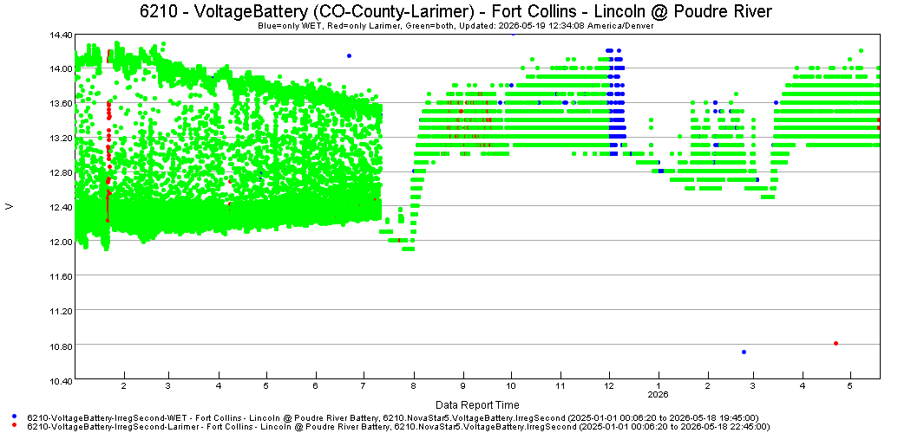

# TSView Time Series Viewing Tools / Examples / Overview#

*   [Introduction](#introduction)
*   [Compare Data Using a Point Graph](#compare-data-using-a-point-graph)

-------------------------

## Introduction ##

This documentation provides examples of time series graphs.
In some cases, a full working example with TSTool commands is provided.
In other cases, only a time series product is provided.

In all cases, time series must first be read and then a
[`ProcessTSProduct`](../../command-ref/ProcessTSProduct/ProcessTSProduct.md)
or
[`ProcessRasterGraph`](../../command-ref/ProcessRasterGraph/ProcessRasterGraph.md)
command is run to create the visualization.

## Compare Data Using a Point Graph ##

The following example shows how to compare two time series using a point graph.
This is useful for irregular interval data such as sensor data.

*   If a value exists in only one time series, a point symbol is shown for the specific time series.
*   If a value exists in both time series (same date/time and data value to tolerance of .0001 by default),
    a point symbol is drawn using the `Compare*` properties.

**<p style="text-align: center;">

</p>**

**<p style="text-align: center;">
Example - Compare Time Series Using a Point Graph (<a href="../6210-VoltageBattery-IrregSecond.png">see full-size image</a>)
</p>**

The time series product file is as follows
and uses properties to dynamically fill in some of the content.
Note the use of the `Compare*` properties.

```
# Graph template:
# - compare two time series
# - output is points with different color based on whether data are in one or both systems
# - draw WET on the bottom (first) since it will likely have the most data reports
# - the time series alias is used to match the time series
# - data values are compared to two decimals

[Product]

ProductType = "Graph"
TotalWidth = "1050"
TotalHeight = "500"
MainTitleString = "${LocationId} - ${DataType}${DataTypeSuffix}${DataTypeSuffix2} (${SystemId}) - ${StationName}"
SubTitleString = "Blue=only WET, Red=only Larimer, Green=both, Updated: ${CurrentTime}"

[SubProduct 1]

GraphType = "Point"
LeftYAxisTitlePosition = "LeftOfAxis"
LeftYAxisTitleRotation = "270"
LeftYAxisTitleString = "${DataUnits}"
RightYAxisGraphType = "None"
RightYAxisIgnoreUnits = "false"
BottomXAxisTitleString = "Data Report Time"

[Data 1.1]

Color = "Blue"
TSAlias = "${LocationId}-${DataType}${DataTypeSuffix}${DataTypeSuffix2}-IrregSecond-WET"
SymbolStyle = "Circle-Filled"
SymbolSize = "5"
CompareColor = "Green"
CompareSymbolStyle = "Circle-Filled"
CompareSymbolSize = 5
CompareTolerance = .01

[Data 1.2]

TSAlias = "${LocationId}-${DataType}${DataTypeSuffix}${DataTypeSuffix2}-IrregSecond-Larimer"
Color = "Red"
SymbolStyle = "Circle-Filled"
SymbolSize = "5"
CompareColor = "Green"
CompareSymbolStyle = "Circle-Filled"
CompareSymbolSize = 5
CompareTolerance = .01
```
