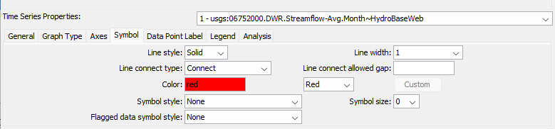

# TSView Time Series Viewing Tools #

*   [Overview](#overview)
*   [Time Series Terminology](#time-series-terminology)
*   [Time Series Properties Interface](#time-series-properties-interface)
    +   [Time Series Properties - General](#time-series-properties-general)
    +   [Time Series Properties - Comments](#time-series-properties-comments)
    +   [Time Series Properties - Period](#time-series-properties-period)
    +   [Time Series Properties - Limits](#time-series-properties-limits)
    +   [Time Series Properties - History](#time-series-properties-history)
    +   [Time Series Properties - Data Flags](#time-series-properties-data-flags)
*   [Time Series Traces](#time-series-traces)
*   [Time Series Views](#time-series-views)
    +   [Time Series Graph View](#time-series-graph-view)
        -   [Area Graph](#area-graph)
        -   [Area (Stacked) Graph](#area-stacked-graph)
        -   [Bar Graph](#bar-graph)
        -   [Double Mass Curve](#double-mass-curve)
        -   [Duration Graph](#duration-graph)
        -   [Line Graph](#line-graph)
        -   [Line Graph (Log Y Axis)](#line-graph-log-y-axis)
        -   [Period of Record Graph](#period-of-record-graph)
        -   [Predicted Value Graph](#predicted-value-graph)
        -   [Predicted Value Residual Graph](#predicted-value-residual-graph)
        -   [Raster Graph](#raster-graph)
        -   [XY-Scatter Graph](#xy-scatter-graph)
    +   [Time Series Product Properties](#time-series-product-properties)
        -   [Product Properties - General](#product-properties-general)
        -   [Product Properties - Titles](#product-properties-titles)
        -   [Product Properties - Layout](#product-properties-layout)
        -   [Graph Properties - General](#graph-properties-general)
        -   [Graph Properties - Graph Type](#graph-properties-graph-type)
        -   [Graph Properties - Titles](#graph-properties-titles)
        -   [Graph Properties - X Axis](#graph-properties-x-axis)
        -   [Graph Properties - Y Axis](#graph-properties-y-axis)
        -   [Graph Properties - Data Point Label](#graph-properties-data-point-label)
        -   [Graph Properties - Legend](#graph-properties-legend)
        -   [Graph Properties - Zoom](#graph-properties-zoom)
        -   [Graph Properties - Analysis](#graph-properties-analysis)
        -   [Graph Properties - Annotations](#graph-properties-annotations)
        -   [Time Series Properties - General](#time-series-properties-general)
        -   [Time Series Properties - Graph Type](#time-series-properties-graph-type)
        -   [Time Series Properties - Axes](#time-series-properties-axes)
        -   [Time Series Properties - Symbol](#time-series-properties-symbol)
        -   [Time Series Properties - Label](#time-series-properties-label)
        -   [Time Series Properties - Legend](#time-series-properties-legend)
        -   [Time Series Properties - Analysis](#time-series-properties-analysis)
    +   [Changing a Graph Page Layout](#changing-a-graph-page-layout)
    +   [Time Series Summary View](#time-series-summary-view)
    +   [Time Series Table View](#time-series-table-view)
*   [Time Series Product File Reference](#time-series-product-file-reference)
    +   [Time Series Product File Format](#time-series-product-file-format)
    +   [Time Series Product File - JSON Format](#time-series-product-file-json-format)
    +   [Time Series Product File - Product Properties](#time-series-product-file-product-properties)
    +   [Time Series Product File - Graph Properties](#time-series-product-file-graph-properties)
    +   [Time Series Product File - Report Properties](#time-series-product-file-report-properties)
    +   [Time Series Product File - Time Series Properties](#time-series-product-file-time-series-properties)
    +   [Time Series Product File - Annotation Properties](#time-series-product-file-annotation-properties)
    +   [Time Series Product File - Color Specification](#time-series-product-file-color-specification)
    +   [Time Series Product File - Color Tables](#time-series-product-file-color-tables)
    +   [Time Series Product File - Symbol Tables](#time-series-product-file-symbol-tables)
*   [Time Series Graph Templates](#time-series-graph-templates)

-------------------------
 
## Overview ##

The TSView package contains integrated software components that can be used
with software applications to enable time series viewing capabilities.
The main purpose of the TSView package is to provide simple, consistent,
and flexible displays that can be used in a variety of applications with little or no reconfiguration.
TSView also provides features to configure and process time series products (e.g., graphs),
where the time series data are stored separately from the configuration information.

The TSView package has been developed using Java technology.
TSView interfaces can be embedded in Java applications and can be used in web pages
either as embedded applets or stand-alone windows.
TSView tools operate similarly on various operating systems.

This appendix describes general TSView features and can be used as a
reference for how to configure and use TSView components.
Software program documentation may include specific information about using TSView features.

## Time Series Terminology ##

The TSView package treats time series as objects that can be read, manipulated, and output in various formats.
A time series is defined as having header information (attributes) and data,
which usually consists of a series of date/time versus data pairs.
Internally, time series are considered to have either regular interval (equal spacing of date/time)
or irregular interval (e.g., occasional observations).
Regular time series lend themselves to simpler storage and faster processing
because date/time information can be stored only for the endpoints.
The following basic attributes are stored for each time series: 

*   Data interval as an interval base (e.g., `Month`, `Hour`) and multiplier
    (e.g., `1` for month, or `24` for hour) - in many cases,
    the multiplier is `1` and is not shown in output (e.g., `Month` rather than `1Month`)
*   Data type (e.g., `Streamflow`), which ideally can be checked to determine
    whether a time series contains mean, instantaneous, or accumulated values
*   Units (e.g., `CFS`), which ideally can be used to make units conversions and look up precision for output
*   Period of record, using dates that are of an appropriate precision for the interval
*   Data limits (the maximum, minimum, etc.)
*   Description (generally a station, structure, or sensor name)
*   Missing data value (used internally to mark missing data and trigger data filling, often `-999`, `NaN`, etc.)
*   Comments (often station comments, if available)
*   Genesis history (a list of comments about how the time series was created)

In order to uniquely and consistently identify time series,
a multi-part time series identifier is employed, having the following parts:

*   Location type (optional)
*   Location (or location-sublocation)
*   Data source
*   Data type (or datatype-subdatatype)
*   Data interval (time step)
*   Scenario

and optionally:

*   Sequence number for ensemble
*   Datastore identifier (or legacy input type)
*   Input name

These time series attributes are typically concatenated into a time series identifier string.
The following example illustrates how the basic identifier parts can be used (without input type and name):

```
12345678.USGS.Streamflow.DAY.HIST
```

The above example identifies a USGS streamflow gage identified as location `12345678`,
at which historic average daily flow data are available.
If possible, data types appropriate for the input type should be used to avoid confusion;
however, time series file input types often do not contain a simple data type
abbreviation (see the [input type appendices](../datastore-ref/overview) for more information).
The above example illustrates that the scenario can be used to qualify the
data (in this case as historic data, `HIST`).  The scenario is often omitted.
When the scenario is used, it often indicates some specific condition
(e.g., `FLOOD`, `DROUGHT`, `HIST`, `FILLED`).

The optional datastore identifier (or input type and input name) are used to specify
the time series input format and storage location,
especially in cases where the identifier is saved in a file and the input type is needed for later processing.  For example:

```
12345678.USGS.Streamflow.DAY.HIST~USGSNWIS~C:\data\12345678.txt
12345678.USGS.Streamflow.DAY~HydroBase
```

The first example illustrates a time series identifier for a USGS National Water Information System data file.
The second example illustrates the identifier for the same time series, in the HydroBase database.
Using the input parts of the identifier allows software to transparently locate the data,
and for the above examples, would allow the time series to be read from each input source and compared.

The use of the datastore is being phased into TSView and related components.
The TSTool appendices describe supported datastores and input type, and identify issues with compatibility.
Using the above time series identifier convention omits use of time series
attributes like the period of record and the units,
even though these attributes could conceivably be used to distinguish between time series that are otherwise the same.
Instead, it is assumed that the period of record and units can be
determined from the input and do not need to be part of the identifier.
If necessary, different input files can be used to further differentiate time series.

The TSView components use the time series identifiers extensively to locate and manage time series.
For example, graph properties for each time series are cross-referenced to time series by using the identifiers.
Perhaps most importantly, the time series identifiers as simple strings can be stored
in files and can be used by a variety of software to consistently and reliably locate data for processing.

The following table summarizes important time series terminology.

**<p style="text-align: center;">
Time Series Terminology (listed alphabetically)
</p>**

|**Term**&nbsp;&nbsp;&nbsp;&nbsp;&nbsp;&nbsp;&nbsp;&nbsp;&nbsp;&nbsp;&nbsp;&nbsp;&nbsp;&nbsp;&nbsp;&nbsp;&nbsp;&nbsp;&nbsp;&nbsp;&nbsp;&nbsp;&nbsp;&nbsp;&nbsp;&nbsp;&nbsp;&nbsp;&nbsp;&nbsp;&nbsp;&nbsp;|**Description**|
|--|--|
|Data Interval|Time interval between time series data values.  If a regular time series, the interval is constant.  If an irregular time series, the interval can vary.  Intervals are represented as an optional multiplier followed by a base interval string (e.g., `1MONTH`, `24HOUR`) or `IRREGULAR` for irregular time series.|
|Data Source|A string abbreviation for a data source, which is part of the time series identifier and typically indicates the origin of the data (e.g., an agency abbreviation, or a model name if the result of a simulation).|
|Data Type|A string abbreviation for a data type, which is part of the time series identifier (e.g., `Streamflow`).|
|Date/Time Precision|Date/time objects used with time series have a precision that corresponds to the time series data interval.  The precision is typically handled transparently but it is important that the precision is consistent (e.g., monthly data should not use date/time objects with daily precision).  Displaying time series with various precision usually results in the smallest time unit being used for labels. |
|Datastore|A datastore identifier, corresponding to a database, web service, etc., used for new functionality instead of input type.|
|Input Name|A string input name corresponding to an input type, which is part of a time series identifier.  For database input types, the name may be omitted or may be the name of the database connection (e.g., `ARCHIVE`).  For input files, the name is typically the name of the file.|
|Input Type|A string abbreviation that indicates the input type (persistent format) for a time series, and is part of a time series identifier.  This is often the name of a database (e.g., `HydroBase`) or a standard data file format type (e.g., `StateMod`, `MODSIM`, `RiverWare`).|
|Location|A string identifier that is part of a time series identifier and typically identifies a time series as being associated with a location (e.g., a stream gage or sensor identifier).  The location may be used with certain input types to determine additional information (e.g., station characteristics may be requested from a database table using the location).|
|Scenario|A string label that is part of a time series identifier, and serves as a modifier for the identifier (e.g., `HIST` for historical).|
|Sequence Number|A number indicating the sequence position of a time series in a series.  For example, possible time series traces may be identified with a sequence number matching the historical year for the data.  The use of sequence numbers with traces is being evaluated.|
|Time Series Product|A graph or report that can be defined and reproduced.  See the [Time Series Product File Reference](#time-series-product-file-reference) section.|
|Time Step|See Data Interval.|
 
## Time Series Properties Interface ##

Time series properties are displayed in a tabbed panel as appropriate in applications
(e.g., the TSTool application can display the properties after time series are read and listed in the TSTool interface).
Differences between time series input types may result in variations in the
properties (e.g., some input types do not have descriptions for time series).
The following figures describe the properties tabs.
The size of each tabbed panel is set to the size of the largest tab;
therefore, some tabbed panels are not completely filled.

### Time Series Properties - General ###

**<p style="text-align: center;">

</p>**

**<p style="text-align: center;">
Time Series Properties - General
</p>**

General time series properties are as follows:

*   ***Identifier*** - The five-part time series identifier without the input type and name.
    This identifier is often used internally in applications to manage time series.
    See the [Time Series Terminology](#time-series-terminology) section for a complete explanation of time series identifiers.
*   ***Identifier (with input)*** - The full identifier, including the input type and name (if available).
    The datastore identifier (or input type and name) indicate the format and storage of the data.
*   ***Alias*** - A time series may be assigned an alias to facilitate processing (e.g.,
    the alias is used by the TSTool application in time series commands).
*   ***Sequence (ensemble trace) ID*** - If the time series is part of a series of traces,
    the sequence number is used to identify the trace.  Often it is the year for the start of the trace.
*   ***Description*** - The description is a mid-length phrase (i.e.,
    longer than the location but shorter than comments) describing the time series (e.g., `XYZ RIVER AT ABC`).
*   ***Units (Current)*** - The units that are currently used for data.
    The units may have been converted from the original.
*   ***Units (Original)*** - The units in the original data source.

### Time Series Properties - (Dynamic) Properties ###
 
**<p style="text-align: center;">

</p>**

**<p style="text-align: center;">
Time Series Properties – (Dynamic) Properties
</p>**

Whereas the other properties tabs show built-in time series properties,
the ***Properties*** tab lists dynamic properties that are associated with a time series.
For example, a TSTool command file may assign properties to time series
from the original data source, or based on quality control or other analysis.  

### Time Series Properties - Comments ###

**<p style="text-align: center;">

</p>**

**<p style="text-align: center;">
Time Series Properties - Comments
</p>**

Comments for time series can be created a number of ways and may be formatted specifically for an application.
Common ways of creating comments are:

*   Read comments from the original data source - this is ideal; however,
    electronic comments may not be available (e.g., the USGS previously published comments
    for data stations in hard copy water reports; however, comments may not be available electronically),
*   Format comments from existing data (e.g.,
    the figure illustrates a standard set of comments for State of Colorado data, using the
    [HydroBase input type](../datastore-ref/CO-HydroBase/CO-HydroBase.md)).

In the future, the time series dynamic properties may be used more and text comments less.
 
### Time Series Properties - Period ###

**<p style="text-align: center;">

</p>**

**<p style="text-align: center;">
Time Series Properties - Period
</p>**

Properties related to the period are as follows:

*   ***Current (reflects manipulation)*** - The current period is used to allocate computer memory for the time series data.
    This period may be set by an application (e.g., when creating model input files a specific period may be used).
    The precision of the date/time objects should generally be consistent with the time series data interval.
*   ***Original (from input)*** - The original period can be used to indicate the full period available from a database.
    Setting the original period can sometimes be complicated by how missing data are handled
    (e.g., a database or file may indicate a certain period but a much shorter period is actually available).
*   ***Total Points*** - Total number of data points.  If a regular time series, this is computed from the period.
    If an irregular time series, the number of points is the count of all data values.
    The data points may include missing data – see the data limits for additional information.
 
### Time Series Properties - Limits ###
 
**<p style="text-align: center;">

</p>**

**<p style="text-align: center;">
Time Series Properties - Limits
</p>**

Time series limits are determined for both the current data (top in figure)
and the original data (bottom in figure).
This is useful because the original data may contain missing data, which are later filled.
The data limits are displayed consistent with the data interval.
In the example shown, limits are computed for each month.
For other time series having other intervals, only overall data limits may be computed.
The monthly limits are used for filling with historical averages,
but this does not make as much sense for smaller time series data intervals.  

Theoretically, it is possible that a daily time series could have day limits
(e.g., max/min values for each day of the year),
month limits (e.g., computed as an average of the daily values by month),
and year limits (e.g., computed as an average of all daily values in a year).
However, automatically including this level of detail decreases performance and
it is difficult to automatically make the right decisions (e.g., about whether to average or total values).
Consequently, the limits are currently computed in a basic fashion on the raw data (no interval changes).

### Time Series Properties - History ###

**<p style="text-align: center;">

</p>**

**<p style="text-align: center;">
Time Series Properties - History
</p>**

The time series history (sometimes called the genesis history) is a list of comments
indicating how the time series has been processed.
The completeness of this history is totally dependent on the time series input/output and manipulation software.
Although efforts have been made to add appropriate comments as time series are processed,
enhancements to the history comments are always being considered.

At the bottom of the history list (see ***Read From***) is the input name that was actually used to read the data.
This input name may or may not be exactly the same as the input name in the time series identifier.
For example, if reading from a [HydroBase database](../datastore-ref/CO-HydroBase/CO-HydroBase.md),
the time series identifier may specify an input type of `HydroBase` and no input name
(because the software knows from the other parts of the time series identifier which database tables to read).
However, it is also useful to know the actual table that is read
in order to help users and developers understand the data flow, and reference documentation.
If reading from a file input type, the ***Read From*** information will show the full path to the file;
however, the input name in the time series identifier may only include a relative path.
 
### Time Series Properties - Data Flags ###

**<p style="text-align: center;">

</p>**

**<p style="text-align: center;">
Time Series Properties - Data Flags
</p>**

Time series data flags contain information that describe the quality of a data point.
The missing data value indicates a special value that is used to
indicate that a data value is missing at a point.
Currently only floating point values are recognized; however the `NaN` (not a number)
value is generally supported for input types that use the convention and is being
phased in where possible because there is less potential that a value such as `-999` could be an actual value.
All time series are typically assigned a missing data value.

The ***Has Data Flags*** checkbox indicates whether the time series has data flags.
Data flags will generally be used, based on whether an input type supports data flags.
The [USGS NWIS RDB file format](../datastore-ref/USGS-NWIS-RDB/USGS-NWIS-RDB.md) is an example
of an input type that supports data flags (e.g., `e` is used to indicate estimated data).
The data flags can be displayed as labels on graphs and as superscript (or similar) on tabular data.
Unfortunately, data flags are not universally consistent and care
must be taken to understand their meaning, especially when using data from multiple sources.
 
## Time Series Traces ##

In general, the term time series traces refers to a group of time series,
often shown in overlapping fashion.  Common uses of time series traces are:

*   Separate a full time series into annual traces and plot them on top of each other,
    shifted so that they all start at the same date/time,
*   Run a model or analytical tool multiple times, with input being a series of input traces,
    and generating a series of output traces, in order to produce probabilistic simulations.

The power of using traces is that a large amount of data can be used to
visualize and study statistical qualities of the data, as shown in the following figure.

**<p style="text-align: center;">

</p>**

**<p style="text-align: center;">
Example Graph for Time Series Traces
</p>**

The TSView package supports time series traces at various levels.
Time series properties include a sequence number that can be used to
identify a time series as being in a group of traces, shown as `[SequenceNumber]` in time series identifiers.
Many TSTool commands process ensembles in addition to individual time series.
Leap year is handled by specific commands and visualization tools,
depending on whether the data sequence should be preserved, or should adhere to historical day.
For example, if data are represented in a non-leap year, then February 29 may be discarded.
If data are represented in a leap-year, missing values may be shown for February 29 for traces that did not occur in leap years.
 
Currently, applications like TSTool include features to create time series
traces and TSView tools can be used to view the time series as if they were separate time series.

The following sections describe the different time series views that are available in TSView.
Although most illustrations use simple time series, most features also are available for use with ensemble traces.

## Time Series Views ##

The main components of the TSView package are configured to provide multiple views for time series data.
The three main views that are available are:

1.  ***Graph*** - line, bar, or other graph
2.  ***Summary*** - text report suitable for the data type and interval
3.  ***Table*** - spreadsheet-like table with scrolling, suitable for export to other tools

The initial view for a time series list is typically determined from the actions of the software user.
For example, a ***Graph*** button may be displayed on a screen,
which when pressed will result in a graph being displayed.
The time series that are displayed in the view can typically contain one or
more time series (some graph types may have a restriction on the number of graph types).
To increase performance and capacity, the TSView package as much as possible
uses a single copy of the time series data for visualization.
For example, to generate graphs, the data for the time series objects are used
directly rather than being copied into a graphing tool's data space.
This also allows TSView to more easily display different data intervals
on the same view because the data do not need to be forced into a consistent grid data structure.

The following sections describe the three time series views.
The graph view type requires more extensive explanation due to the variety of graph properties.

### Time Series Graph View ###

The graph view for time series supports a variety of graph types.
The features of the various graph types will be discussed in detail in the following sections,
starting with basic graph types, followed by more specific types.

Typically, the graph type is selected in the application (e.g., menus are available
in TSTool for selecting the graph type for a list of time series).
In many applications, the graph type often defaults to a line graph.
The following figure illustrates a line graph for two monthly streamflow time series showing the default appearance.
Additional properties such as titles can be defined by editing product properties.

**<p style="text-align: center;">

</p>**

**<p style="text-align: center;">
Example Line Graph for Monthly Streamflow
</p>**

The graph view is divided into the following main areas:

*   ***Graph Page*** - The graph page (drawing canvas) is the area where the graph and legend are drawn.
    This area is used to interact with the graph via the mouse cursor.
    More than one graph can be drawn in the page (see the
    [Time Series Product File Reference](#time-series-product-file-reference) section for additional details).
    If zooming is supported for the graph, a box can be drawn with the mouse to zoom in to a shorter period.
    Right-click over a graph of interest to show the popup menu for graph
    properties and analysis details (e.g., regression results).  The graph page is essentially a preview of a printed graph.
*   ***Overview Graph*** - The overview (also called reference) graph below the main graph
    canvas shows the current view extent (the white area in reference graph in the figure above).
    The overview graph is only shown for graph types that support zooming.
    If shown, it can be used for zooming, similar to the main graph.
    The time series with the longest period of record is drawn in the
    reference graph to illustrate variations in the data over time.
*   ***Page/Zoom Buttons*** - Under the graph areas is a layer of buttons used for zooming.
    The buttons facilitate paging (scrolling) through data as described below.
    For all paging operations, the visible graph extent (or page) is maintained during the paging.
    Paging can use the buttons or keys described below.
    To use the keyboard, first click in the main graph canvas to shift focus to that area.
    +   ***|<*** or ***Start*** - Scroll the visible window to the start of the period.
    +   ***<<*** or ***Page Down*** - Scroll the visible window one full page to the left (earlier in time).
    +   ***<*** or ***Left Arrow*** - Scroll the visible window 1/2 page to the left.
    +   ***>*** or ***Right Arrow*** - Scroll the visible window 1/2 page to the right (later in time).
    +   ***>>*** or ***Page Up*** - Scroll the visible window a full page to the right.
    +   ***>|*** or ***End*** - Scroll the visible window to the end of the period.
    +   ***Zoom Out*** - Zoom to the full time period.
*   ***Tracker*** - Indicate the main behavior of the mouse tracker.  See also the time series product tracker properties to control features.
    +   ***Nearest*** – highlight the nearest point to the mouse.
    +   ***NearestTime*** – highlight the nearest point to the mouse on each time series, considering only time for proximity.
    +   ***None*** – do not show tracker.
*   ***Main Buttons*** The bottom row of buttons provides features for displaying other views, printing, and exporting:
    +   ***Summary*** Display the summary view for the time series (see the [Time Series Summary View](#time-series-summary-view) section).
    +   ***Table*** Display the table view for the time series (see the [Time Series Table View](#time-series-table-view) section).
    +   ***Print*** Print the graph.  Because the physical extents of the printed page are different from the visible window,
        the printed graph may not exactly match the viewed version (e.g., more or less axis labels may be used).
    +   ***Save*** Save the graph as a Portable Network Graphic (PNG), JPEG graphic,
        a [DateValue file](../datastore-ref/DateValue/DateValue.md) (a useful time series format),
        Time Series Product file (see the [Time Series Product File Reference](#time-series-product-file-reference) section),
        or other formats, by selecting from the choices.
        Depending on the main application, saving to a database as a time series product may also be enabled.
    +   ***Close*** Close the graph window.  If related summary or table windows are still visible,
        the graph view can be quickly re-displayed by pressing the ***Graph*** button on the other view windows.
        If the graph properties have been changed but have not been saved, a warning will be displayed asking whether to save the changes.
*   ***Status Message Area*** The lower-left status message area is used to provide general user instructions and feedback.
*   ***Mouse Tracker Area*** The lower-right status message area is used to indicate the position of the mouse on a graph, in data units.
    The coordinates are typically shown using an appropriate precision as determined from the time series date/time precision and data units.
    If a right y-axis is enabled in the graph, then both left and right y-axis tracker information will be shown.

Within each graph page it is possible to draw more than one graph, each with its own titles, legend, etc.
The [Time Series Product Properties](#time-series-product-properties) section (below)
provides an example and discusses how to edit graph properties.
The [Time Series Product File Reference](#time-series-product-file-reference) section
describes in detail the format of Time Series Product files.
These files, when saved from the graph view,
can be used to recreate a graph interactively or in batch mode, at a later time.

Because TSView is a general tool, a number of rules are in place when viewing time series in graphs
(see the [Time Series Product Properties](#time-series-product-properties)
section for information on changing specific graph properties to override the defaults):

1.  Time series plotted on the same graph should generally have the
    same units or have units that can be readily converted.
    If the units are not consistent,
    a warning will be displayed and the units will be displayed in the legend rather on the axis.
2.  Time series can have different data intervals (e.g., daily data can be plotted with monthly data).
    However, other output options, such as reports, may not allow the same flexibility.
    It is important to understand the data type characteristics.
    For example, some data are instantaneous (e.g., real-time streamflow)
    whereas other data are accumulated (e.g., precipitation) or mean (e.g., mean temperature).
    Therefore, the representation of the data may need to be selected with care to ensure consistency.
    For example, some data intervals and types may be better represented as bars and others as lines or points.
3.  Data values are plotted at exactly the point that they are recorded.
    The plot positions are determined using the year as the whole number and months, days, etc.
    to determine the fractional part of the plot position.
    The numerical positions are typically not evident because labeling uses data units, including dates.
    The plot positions are determined from the dates associated with data and no adjustments
    are made to plot in the middle an interval.
    For example, monthly data are plotted at the first day of the month (not day 15).
    Properties to override this convention may be implemented in the future.
    Bar graph properties can be used to indicate whether the bars are
    drawn to the left or right of the date, or centered on the date.
    This allows flexibility to show a period over which a value was recorded, if appropriate.
4.  The mouse coordinates that are displayed by the mouse tracker
    are computed by interpolating screen pixels back to data coordinates
    (which involves a conversion of the plot position to date/time notation).
    Consequently, the values shown may be rounded off (depending on the zoom extent and data precision).
    The mouse coordinates are displayed based on the precision of the time series data.
    When moved, the mouse will display the same date until the date changes within the given precision.
    For example, for monthly data, moving the mouse left to right,
    the mouse coordinate will display as `1999-01` as soon as the date changes from `1998-12` to `1999-01`.
    The label will remain at `1999-01` until `1999-02` is encountered.
    Because data values are drawn at points, to ensure that the date/time is correctly displayed,
    position the mouse slightly to the right of the point to see the date corresponding to the value.
    This is very important for bar graphs because the bar may extend over several dates.
    If specific values need to be determined, use the summary or table views.
5.  Labels for axes are determined automatically in most cases based on the font requirements,
    available display space, and data range.
    Major and minor tic marks are drawn to help determine the data coordinates.
    Labels are redrawn as the visible period is changed.
6.  The legend lists the time series in the graph.  Left and right y-axis legends are shown.
    Clicking on a time series in the legend will highlight the time series in the graph and clicking on again will un-highlight.
    This feature is implemented for line graphs and will be expanded to other graph types in the future.
7.  Graphs that can be zoomed do not allow the vertical axis to be re-scaled on the fly.
    This capability is being evaluated.
8.  Currently, graph types cannot be universally mixed for time series on a graph.
    In other words, a graph cannot contain a bar graph for one time series and a line graph for another time series.
    However, this functionality is being added over time.
    For example time series can be drawn using line graph type on top of stacked area graph.
    A work-around is to use multiple graphs on a page or right y-axis
    (see the [Time Series Product Properties](#time-series-product-properties) section for an example).
9.  The precision used to format graph labels is determined from data unit information provided by the application.
    This generally produces acceptable graphs.
    However, in some cases, the range of values being plotted results in
    inappropriate labels where label values are truncated and/or repeated.
10. Graph types can be changed after the initial display, with limitations.
    Graphs can be switched between simple types like line and bar graphs;
    however, simple graphs cannot be changed to more complex types.
    Additional functionality is being added to allow complete flexibility in the product properties editor.

The following sections describe various graph types supported by the TSView package.
Graph properties are mentioned in some sections.
The discussion of how to change graph properties is included in the
[Time Series Product Properties](#time-series-product-properties) section after the graph type descriptions.

#### Area Graph ####

An area graph draws each time series by filling in the area under the graph with a solid color.
The time series are drawn in the order that they are specified and therefore this graph
is most suitable for cases where the first time series has values that are larger than subsequent time series.

An alternative to the area graph is a bar graph where `BarOverlap=True`
(by default multiple time series in a bar graph shows bars that are parallel at a point in time).

**<p style="text-align: center;">

</p>**
 
#### Area (Stacked) Graph ####

A stacked area graph is similar to the simple area graph in that it draws each time series by
filling in the area under the graph with a solid color.
However, instead of drawing the original data values (as per area graph),
the cumulative values of the time series are used for the plotting coordinates.
The time series are drawn in the order that they are specified (first on bottom).
The legend order agrees with the representation of the graph.
The following example is for reservoir storage and also indicates data issues on the right side.

**<p style="text-align: center;">

</p>**
 
#### Bar Graph ####

The bar graph type by default produces a graph with parallel vertical bars, as shown in the following example:

**<p style="text-align: center;">

</p>**

**<p style="text-align: center;">
Example Bar Graph showing Daily Precipitation
</p>**

The above example illustrates that at the given zoom extent
(which is a small part of the full period - see the white area in the reference graph),
labels are drawn for months.  Zooming in more would display the day in the labels.
The mouse tracker in all cases shows days since that is the precision of the data.
Characteristics of the bar graph are as follows:

*   Bars can be plotted centered on, to the left of, or to the right of the dates.
    If multiple time series are plotted, the overall total width of the bars will correspond to one data interval.
    If drawn to the left of the date, the bars for all graphed time series are drawn to the left of the date.
    If drawn to the right of the date, the bars for all graphed time series are drawn to the right of the date.
    If centered on the date, half the bars are drawn to the left of the date, and half to the right
*   Bar widths are determined based on the number of time series being plotted.
    Monthly time series use a slightly narrower bar (larger gap between bars) because the number of days in a month varies.
    To make bars stand out better, a white line may be drawn to separate adjacent bars.
    If bars are very narrow the line is not drawn.
    Bars will always be drawn at least one pixel wide, even if this obscures neighboring bars (zoom in to see more detail).
    Round-off in drawing bars may result in some bars being slightly wider or narrower than other bars.
*   Bars always end at the zero value on the Y axis.  In other words, bars extend up or down from zero.
*   The mouse cursor display dates relative to the axis and does not determine the data value relative to edges of the bars.
    For example, if bars are plotted centered on dates, 1/2 of the bar will actually be in the previous date, according to the mouse tracker.

#### Double Mass Curve ####

Double mass curves are currently disabled.
An alternative is to use the TSTool application and generate cumulative time series,
which can be viewed in a line graph.  Double mass graphs may be enabled in the future.

#### Duration Graph ####

A duration graph indicates the range of values in a time series and how often they occur, as shown in the following example:

**<p style="text-align: center;">

</p>**

**<p style="text-align: center;">
Example Duration Graph showing Maximum Daily Air Temperatures
</p>**

The algorithm for calculating and graphing a duration curve was taken from the book
Handbook of Applied Hydrology (edited by Ven Te Chow):
“When the values of a hydrologic event are arranged in the order of their descending magnitude,
the percent of time for each magnitude to be equaled or exceeded can be computed.
A plotting of the magnitudes as ordinates against the corresponding percents of
time as abscissas results in a so-called duration curve.
If the magnitude to be plotted is the discharge of a stream,
the duration curve is known as a flow-duration curve.”  Features of duration graphs are as follows:

*   The zoom feature is disabled for this graph type.
*   Although duration curves have traditionally been applied to streamflow or reservoir data,
    duration graphs can be created for any time series data.
*   Noticeable breaks in the curve are caused by a limited number of
    data points and/or values that are measured as rounded values.

#### Line Graph ####

Line graph features have been illustrated in previous discussion.
The line graph type is also used to generate graphs with only points by setting the
line style to `None` (for example, software that displays daily data where gaps are expected may default to using symbols and no line).

**<p style="text-align: center;">

</p>**
 
#### Line Graph (Log Y Axis) ####

Log-axis line graphs are similar to simple line graphs. The following figure illustrates a typical graph.

**<p style="text-align: center;">

</p>**

**<p style="text-align: center;">
Example Log Y Axis Graph showing Monthly Streamflow
</p>**

Characteristics of the log plot are:

* If the minimum data value is <= 0.0, then `.001` is used for the minimum plotting value
(the original value is retained in the time series data for table, summary, and other output).
 
#### Period of Record Graph ####

The period of record graph is used to display the availability of data over a period, as shown in the following figure:

**<p style="text-align: center;">

</p>**

**<p style="text-align: center;">
Example Period of Record Graph showing Monthly Streamflow
</p>**

Characteristics of the period of record graph type are:

*   Horizontal lines are drawn for each time series, with breaks in the line indicating missing data.
*   Zooming is fully enabled, however, it may be difficult to see small breaks in the lines – it may
    be necessary to display symbols at the data points.
    The data limits properties of each time series can also be used to check for missing data.
    The TSTool application provides reporting features to summarize data coverage.
*   Because data values are not plotted, the y-axis is labeled with a legend index number.
    This also allows the graph window to be compressed vertically, if desired.
 
#### Predicted Value Graph ####

The ***Predicted Value*** graph uses ordinary least squares regression to estimate the
equation of best fit and then calculates the dependent value for the entire period.
This plot has limited value because functionality like the TSTool
[`FillRegression`](../command-ref/FillRegression/FillRegression.md) command provides
parameters to control the calculations,
but it is difficult to provide all of these options in the graph properties.
In the future, the predicted value time series may be created by this command
and then it can be processed and visualized using other software features.

#### Predicted Value Residual Graph ####

The ***Predicted Value Residual*** graph uses ordinary least squares
regression to estimate the equation of best fit, calculates the dependent value for the entire period,
and then computes the difference between the actual value and the estimated value,
to given an indication of errors in the estimate.
This plot has limited value because functionality like the TSTool
[`FillRegression`](../command-ref/FillRegression/FillRegression.md) command provides
parameters to control the calculations,
but it is difficult to provide all of these options in the graph properties.
In the future, the predicted value time series may be created by this command
and then it can be processed and visualized using other software features.

#### Raster Graph ####

The ***Raster Graph*** (also called a "heat map") provides a visualization technique 
where the entire period of record is displayed in a grid with “pixels” colored according to a scale.
Currently only month and day interval data are supported,
although other small intervals may be added in the future.
The following are characteristics of the raster graph:

*   Time is represented on both axes, with one axis representing years, and the other time within the year.
*   The colors represent time series values.
    The default is to find "nice" value breaks depending on the range of input values.
    The color table can be specified by creating a time series product and processing
    with the [`ProcessRasterGraph`](../command-ref/ProcessRasterGraph/ProcessRasterGraph.md) command.

**<p style="text-align: center;">

</p>**

**<p style="text-align: center;">
Example Raster Graph showing Daily Streamflow
</p>**

#### XY-Scatter Graph ####

The ***XY-Scatter*** graph type can be used to compare data having the
same data interval (units can be different).
This graph type is often used for the following comparisons:

1.  The dependent time series (Y) requires filling and multiple independent time series (X)
    are analyzed to find the best time series to use as the independent time series.
    One or more independent time series can be plotted on the same graph.
2.  The dependent time series (Y) contains observed data and one or more
    independent simulated time series (X) are analyzed to determine which simulation is closed to actual observations.
3.  The independent (X) and dependent (Y) time series are compared to
    determine whether any time of relationship exists between data points.
    In this case, a single dependent time series may be compared with multiple independent time series on the same graph.

Currently the XY-Scatter graph can have only a single dependent time series
but can have one or more independent time series.  The following figure shows a typical graph.

**<p style="text-align: center;">

</p>**

**<p style="text-align: center;">
Example XY Scatter Graph showing Monthly Streamflow
</p>**

Characteristics of the XY Scatter graph are:

*   Labels and legend are automatically generated.
    See the [Time Series Product Properties](#time-series-product-properties)
    section below for information about changing the appearance of the graph.
*   Simple linear regression is initially performed to determine a line of best fit.
    See the ***Analysis*** tab in the [Time Series Product Properties](#time-series-product-properties)
    section below for information about curve fit methods.
*   A 45-degree line is currently not displayed because time series of different types and units may be compared.
    Graph properties do allow the line of best fit to be forced to zero.
    The limits on the axes are not automatically set to equal values for the same reason;
    however, a property to force the values to be the same will be added.
*   Zooming is disabled.
*   Two or more time series must be specified and must have the same interval.
*   Confidence intervals can be turned on, as shown in the following figure:
 
**<p style="text-align: center;">

</p>**

The confidence intervals provide a useful way for assessing the quality of a point estimate.
When a regression line is of interest, the confidence interval on the line as a
whole permits one to make confidence statements about a number of values of the predictor variables simultaneously.
Confidence limits for the line are a function of the level of confidence (e.g., gamma = 95% or 99%),
and the F-test statistic (2, n-2 degrees of freedom, and level of significance =1-gamma).
The equations used to plot the confidence intervals are shown below (note that
because the curves depend on the data points, the shape and smoothness of the curves will depend on the number of points;
the points are sorted to generate a continuous line).

**<p style="text-align: center;">

</p>**

*   The best-fit line can be turned off.
*   Right-clicking on the graph displays the ***Analysis Details*** menu, that,
    if selected, displays curve fit information about the time series, as illustrated in the following figure:

**<p style="text-align: center;">

</p>**

**<p style="text-align: center;">
Example Analysis Details
</p>**

The RMS error (or RMSE) is calculated in the following way:

*SSE* = Σ(Xi – Yi)2 = Sum of Square Errors<br>
*MSE* = SSE/N = Mean of Sum of Square Errors<br>
*RMSE* = √MSE = Square Root of the MSE<br>

The RMSE can have different meanings, depending on how the data are being analyzed:

1.  If a measured (X) and a simulated (Y) time series are being compared to determine,
    for example, to determine how well a model is simulating actual observations,
    then the RMSE indicates the error of a simulation when compared to the actual (comparing the values).
2.  If two time series are evaluated to determine if the relationship between the
    time series can be used to estimate missing values in one of the time series,
    then the difference between estimated values (*Yest*) and the line of best fit (e.g., *A + BX*) is used to compute the RMSE.
    For a perfect fit, the RMSE would be zero.  Values of RMSE can be used to evaluate the estimator for data filling.

To provide as much information as possible for multiple uses,
the ***XY-Scatter Graph Analysis Details*** provides both RMSE values.
The default is to display a line of best fit, which is usually desirable information.
The graph properties allow the analysis to be done for data filling, if desired.

### Time Series Product Properties ###

A time series product is one or more time series graphs, tables, or reports on a “page”,
although currently TSView focuses on graph products.
Time series product properties can be displayed by right clicking on a graph of
interest and selecting the ***Properties*** menu item from the popup menu.
Interactively changing properties allows graphs to be configured as desired.
The following figure illustrates a time series product that has two graphs (see the
[Time Series Product File Reference](#time-series-product-file-reference) section for
information about how to define time series product files, which can be used to save a product).

**<p style="text-align: center;">

</p>**

**<p style="text-align: center;">
Example Graph Product showing Precipitation and Streamflow
</p>**

In many cases, a graph product will consist of only a single graph (which may show one or more time series).
However, it is also useful to display multi-graph products, especially when related data types are used.
The TSView interface includes features to construct multi-graph products interactively,
and the product files described in the
[Time Series Product File Reference](#time-series-product-file-reference) section can be created and processed.
The TSTool application, for example, can interactively create or read a product
file and display a graph similar to the one shown above.  Important considerations for multi-graph products are:

*   The product page has its own set of properties (e.g., titles and size).
*   Each graph area has its own properties (e.g., titles, labels, graph type, legend).
    These properties comprise most of the properties for a product.
*   Each time series has its own properties (e.g., symbol, color).
*   If zooming is enabled (the default), then zooming in one graph causes the same zoom to occur in related graphs.
    Each graph (and the reference graph) is assigned a zoom group number.
    This is used to indicate which graphs should zoom together.  Currently, all graphs are in the same zoom group.

Right clicking on a graph and pressing the ***Properties*** item in the popup menu will display the properties for the graph.
The following figures illustrate the properties tabbed panel:

**<p style="text-align: center;">

</p>**

**<p style="text-align: center;">
Tabbed Panel to Edit Time Series Product Properties
</p>**

The time series product properties display as three layers of tabbed panels.
Characteristics of the properties window are:

*   The window is divided into a layout area (top-left) and tabs for different groups of properties.
    The layout window shows the overall layout of graphs on a page and allows
    manipulation of the time series product by dropping time series onto the layout.
*   The top layer of tabs (***Product Properties***) is associated with product properties (the page).
*   The middle layer of tabs (***Graph Properties***) is associated with subproduct properties (graphs on the page).
    The graph of interest is selected using the drop-down choice that shows the graph number and graph main title.
    When initially displayed, the selected graph is the one that was clicked on to display the Properties menu.
*   The bottom layer of tabs (***Time Series Properties***) is associated with data (time series) properties.
    A time series within a graph is selected using the drop-down choice that shows the
    time series number within the graph, and the time series identifier.
    When initially displayed, the first time series for the selected graph is selected.
*   The ***Apply*** button will apply the current properties and update the graph(s).
    It is generally best to press Apply before changing tables or selecting new graphs or
    time series because auto-saving properties does not occur (this may be enhanced in the future).
*   The ***Close*** button will apply the current properties, update the graph(s), and close the properties window.
*   Only properties read from an original time series product file or that are
    set by the user will be saved if a time series product is saved.  Internal defaults are not saved.
    This minimizes the size and complexity of product definition files.

The remaining discussion in this section illustrates each of the tabbed panels.
The text-based properties that are displayed in the panels are described in the
[Time Series Product File Reference](#time-series-product-file-reference) section.

#### Product Properties - General ####

**<p style="text-align: center;">

</p>**

**<p style="text-align: center;">
Example Product General Properties
</p>**

The above figure illustrates the product ***General*** properties.
The ***Product Enabled*** checkbox indicates whether the product is enabled (currently view-only).
The ***Product ID*** is used when saving the product definition to a database.
The ***Product Name*** is also used to when displaying lists of products.

#### Product Properties - Titles ####

**<p style="text-align: center;">

</p>**

**<p style="text-align: center;">
Example Product Title Properties
</p>**

***Product Titles*** properties include title and subtitle.  If blank, no title will be shown.
Because graphs (subproducts) also have a title and subtitle,
the product titles are often only used when multiple graphs are included on a page.

#### Product Properties - Layout ####
 
**<p style="text-align: center;">

</p>**

**<p style="text-align: center;">
Example Product Layout Properties
</p>**

Product ***Layout*** properties describe how graphs are laid out on the page.
Currently, graphs can only be organized in a vertical stack, although the design will support multiple columns.
The layout properties are updated automatically as graphs are added to or deleted from the layout window at the left.
The relative size of each graph on the page is controlled by using the
`LayoutYPercent` general property for each graph on the page (see below).

#### Product Properties - Developer ####

**<p style="text-align: center;">

</p>**

**<p style="text-align: center;">
Example Product Developer Properties
</p>**

Product ***Developer*** properties provide useful tools for software developers:

* ***Show drawing area outline*** – will draw boxes on the graph showing drawing area locations for different components
* ***Show Product Properties*** – will display all the product properties, rather than just the ones that are saved by the ***Save*** button
* ***Show Drawing Area Properties*** – will display drawing area properties such as the location of the drawing areas in the window

#### Graph Properties - General ####
 
**<p style="text-align: center;">

</p>**

**<p style="text-align: center;">
Example Graph General Properties
</p>**

The above figure illustrates graph ***General*** properties.
The ***Graph Enabled*** checkbox indicates whether the graph is enabled (currently view-only).
The vertical size of the graph on the page (percent) can also be specified (the default is to size all the graphs on the page equally).

#### Graph Properties - Graph Type ####

**<p style="text-align: center;">

</p>**

**<p style="text-align: center;">
Example Graph Graph Type Properties
</p>**

Graph ***Type*** properties control the overall display of the data.
The graph type can be changed after the initial display only when switching between simple graph types (e.g., line and bar graphs).
Some graph types may have specific properties (e.g., bar width for bar graphs).
If necessary, to change the graph type, select the type from a main application, and generate a new graph.
The right y-axis graph type will be the default for how time series are displayed for the right y-axis.
Use time series properties to indicate which axis is associated with the time series.

#### Graph Properties - Titles ####

**<p style="text-align: center;">

</p>**

**<p style="text-align: center;">
Example Graph Title Properties
</p>**

Graph ***Titles*** properties include title and subtitle.  If blank, no title will be shown.
Font properties can also be specified.  After applying a change to the main title, the title will be added in the list of graphs.

#### Graph Properties - X Axis ####
 
**<p style="text-align: center;">

</p>**

**<p style="text-align: center;">
Example Graph X Axis (Bottom) Properties
</p>**

Graph ***X Axis (Bottom)*** properties include title, label, and grid properties.
The ***Major grid color*** can be specified by selecting from the available choices,
which then fill in the text field with the given color selection.

#### Graph Properties - Y Axis ####

**<p style="text-align: center;">

</p>**

**<p style="text-align: center;">
Example Graph Y Axis (Left) Properties
</p>**

Graph ***Y Axis (Left)*** properties include the following:

*   ***Title*** – this may be set to the data units but can be specified (the Y axis title is currently always placed at the top of the Y axis).
*   ***Position*** – the location of axis title
*   ***Rotation*** – the rotation (clockwise degrees) of the title text (generally use `270` for left, if specified)
*   ***Label*** - the font for labels and precision of numerical labels can be specified.
*   ***Axis Type*** - currently this is view-only.
*   ***Min Value***, ***Max Value*** - currently this is view-only but can be set in time
    series product definition files (see the [Time Series Product File Reference](#time-series-product-file-reference) section).
*   ***Units***, ***Ignore Units*** - currently these are view-only.
    If time series with incompatible units are graphed, ***Ignore Units*** will be checked and the units may be shown in the legend.

#### Graph Properties - Y Axis (Right) ####

**<p style="text-align: center;">

</p>**

**<p style="text-align: center;">
Example Graph Y Axis (Right) Properties
</p>**

Graph ***Y Axis (Right)*** properties include the following,
and will only be used if the ***Graph Type*** for the right y-axis is other than None:

*   ***Title*** – this may be set to the data units but can be specified (the Y axis title is currently always placed at the top of the Y axis).
*   ***Position*** – the location of axis title
*   ***Rotation*** – the rotation (clockwise degrees) of the title text (generally use `90` for right, if specified)
*   ***Label*** - the font for labels and precision of numerical labels can be specified.
*   ***Axis Type*** - currently this is view-only.
*   ***Min Value***, ***Max Value*** - currently this is view-only but can be set in
    time series product definition files (see the [Time Series Product File Reference)(#time-series-product-file-reference) section).
*   ***Units***, ***Ignore Units*** - currently these are view-only.
    If time series with incompatible units are graphed, ***Ignore Units*** will be checked and the units may be shown in the legend.

#### Graph Properties - Data Point Label ####

**<p style="text-align: center;">

</p>**

**<p style="text-align: center;">
Example Data Point Label Properties
</p>**

Data points are not labeled by default because there are usually too many data labels to be legible.
However, for plots with limited data, or after zooming in, labels can be useful to
identify points without referring to tabular data.
The label format can be defined using the choices next to the text field or by entering literal text.
For an XY Scatter plot, repeat the `%v` format (e.g., `%v, %v`) to show the independent (X) and dependent (Y) data values.
See the ***DataLabel*** properties in the
[Time Series Product File-Reference](#time-series-product-file-reference) section for label options.

#### Graph Properties - Legend ####

**<p style="text-align: center;">

</p>**

**<p style="text-align: center;">
Example Graph Legend Properties
</p>**

Graph ***Legend*** properties include format and font properties.
If the ***Legend Format*** is `Auto`, a default legend format will be constructed from the time series description,
identifier, and period of record.  See the `LegendFormat` property in the
[Time Series Product File Reference](#time-series-product-file-reference) section for legend formatting options.
The right legend will only be drawn if the Graph Type properties specify that the right y-axis type is other than None.
 
#### Graph Properties - Zoom ####
 
**<p style="text-align: center;">

</p>**

**<p style="text-align: center;">
Example Graph Zoom Properties
</p>**

Graph ***Zoom*** properties are currently view-only.
Zoom will be enabled for graph types that support it (e.g., duration graphs do not).
The ***Zoom group*** indicates how graphs should respond when other
related graphs on a page are zoomed and currently defaults to 1 for all graphs.

#### Graph Properties - Analysis ####
 
**<p style="text-align: center;">

</p>**

**<p style="text-align: center;">
Example Graph Analysis Properties
</p>**

Graph ***Analysis*** properties are available if the graph requires some type of
analysis to produce the result (e.g., curve fitting).  See also the analysis tab for individual time series.
For help with input, place the mouse cursor over a field and a tool tip will be shown.

#### Graph Properties - Annotations ####

**<p style="text-align: center;">

</p>**

**<p style="text-align: center;">
Example Graph Annotation Properties
</p>**

Graph ***Annotations*** properties are used to add annotation objects to a graph.
Annotations are text, line, or other simple shapes and are stored as simple text
properties in time series products (see the
[Time Series Product File Reference](#time-series-product-file-reference) section below for more information).
Annotations are placed on a graph using data units or a percent of the graph dimension.
This allows annotations to move if a graph uses real-time data.

To add an annotation, press the ***Add Annotation*** button.
Then select the ***Shape Type*** and specify annotation properties, as appropriate.
It may be necessary to use annotations in combination,
for example to draw a horizontal line for a critical level, and a second annotation with the label.

#### Graph Properties - Developer ####
 
**<p style="text-align: center;">

</p>**

**<p style="text-align: center;">
Example Graph Developer Properties
</p>**

Graph ***Developer*** properties are currently view-only and provide information useful to software developers.

#### Time Series Properties - General ####
 
**<p style="text-align: center;">

</p>**

**<p style="text-align: center;">
Example Time Series General Properties
</p>**

Time series ***General*** properties are currently view-only and indicate whether the time series is enabled for the graph.

#### Time Series Properties - Graph Type ####

**<p style="text-align: center;">

</p>**

**<p style="text-align: center;">
Example Time Series Graph Type Properties
</p>**

Time series ***Graph Type*** properties are currently disabled.
Currently all time series in a graph must have the same graph type,
although graph type can be edited in the product properties file to override,
in particular for area (stacked) graphs.

#### Time Series Properties - Axes ####
 
**<p style="text-align: center;">

</p>**

**<p style="text-align: center;">
Example Time Series Axes Properties
</p>**

Time series ***Axes*** properties indicate the graph axes to which a time series is associated.
Currently only bottom x-axis is allowed but the time series can be associated with the right y-axis graph if appropriate.

#### Time Series Properties - Symbol ####
 
**<p style="text-align: center;">

</p>**

**<p style="text-align: center;">
Example Time Series Symbol Properties
</p>**

Time series ***Symbol*** properties define the graphical appearance of time series data.
Properties are enabled/disabled based on the graph type (e.g., the ***Symbol Style*** will be disabled if the graph type is `Bar`).

#### Time Series Properties - Data Point Label ####

**<p style="text-align: center;">

</p>**

**<p style="text-align: center;">
Example Time Series Label Properties
</p>**

Time series ***Data Point Label*** properties allow the data label to be changed.
Data points are not labeled by default because there are usually too many data labels to be legible.
However, for plots with limited data, or after zooming in, labels can be useful
to identify points without referring to tabular data.
The label format can be defined using the choices next to the text field or by entering literal text.
For an XY Scatter plot, repeat the `%v` format to show the independent (X) and dependent (Y) data values.
See the DataLabel properties in the
[Time Series Product File Reference](#time-series-product-file-reference) section for label options.

#### Time Series Properties - Legend ####

**<p style="text-align: center;">

</p>**

**<p style="text-align: center;">
Example Time Series Legend Properties
</p>**

Time series ***Legend*** properties allow the legend format to be changed.
This is useful if the time series is to have different legend labeling that the other time series in the graph.
If the ***Legend Format*** is `Auto`, a default legend format will be constructed from the time series description, identifier, and period of record.
See the `LegendFormat` property in the
[Time Series Product File Reference](#time-series-product-file-reference) section for legend formatting options.

#### Time Series Properties - Analysis ####

**<p style="text-align: center;">

</p>**

**<p style="text-align: center;">
Example Graph Analysis Properties
</p>**

Time series ***Analysis*** properties are available if the graph requires some
type of analysis to produce the result (e.g., curve fitting).

### Changing a Graph Page Layout ###

The default page layout for graphs is to display all time series in one graph.
In this configuration, the layout area at the top-left corner of the time series product window will display as shown below:

**<p style="text-align: center;">

</p>**

**<p style="text-align: center;">
Layout Window Showing One Graph
</p>**

The layout area can be used to split the single graph into multiple graphs on the page.
For example, two graphs may be needed because of different units, time step, or graph type.
Left clicking on a graph in the layout area will select the graph – the selected graph is shown in gray.
Right clicking on the layout area displays a menu with available options:

**<p style="text-align: center;">

</p>**

**<p style="text-align: center;">
Layout Window Menu
</p>**

The actions taken by the menus are described below:

*   ***Add Graph Above Selected*** - Add a new graph above the selected graph, renumbering the graphs as needed.

*   ***Add Graph*** - Add a new graph below the selected graph, renumbering the graphs as needed.

*   ***Add Graph at Bottom*** - Add a new graph below all existing graphs, giving the new graph the next number in the sequence.

*   ***Remove Graph*** - Remove the selected graph, renumbering the graphs as needed.

*   ***Move Graph Up*** - Move the graph up one in the sequence, renumbering the graphs as needed.
    The menu is enabled only when multiple graphs are available.

*   ***Move Graph Down*** - Move the graph down one in the sequence, renumbering the graphs as needed.
    The menu is enabled only when multiple graphs are available.

When a new graph is added, it will not have any specific properties, time series data, or annotations,
other than the default properties that are assigned (e.g., the default graph type is `Line`),
and when drawn it will appear as a blank area.
To see the graph, it will be necessary to set the graph’s properties
and provide it with data (and optionally, annotations).
Properties and annotations are defined using the properties tabs as documented in previous sections –
use the ***Apply*** button to apply and view the changes.
To set graph properties, the graph to be modified should be selected from the choices at the
top of the ***Graph Properties*** tab panel (or by selecting the graph in the layout window).

To add time series data to the new graph (or an existing graph), two approaches can be taken:

1.  Find the time series to be moved using the list in the time series properties panel.
    It may be necessary to select a graph to find the time series – selecting a graph
    will not impact the ability to move the time series to a different graph.
    In the list of time series, hold the left mouse button down over a time series choice and
    drag the time series to a graph on the layout area.  During this process, the cursor will change to a new shape, as shown below:<br>
    <br>
    Release the mouse over the graph in the layout area that is to receive the time series.
    The time series will then be removed from the original graph and will be
    inserted into the new graph as the last time series in the list.
2.  Some software programs will allow dragging a time series from a display to the time series product properties window.
    Similar to above, drag the time series onto the receiving graph in the layout area.
    Refer to documentation for the specific software program for additional information about whether this feature is available.

After adding a new graph and moving time series,
it may be necessary to change the graph type for a graph.
For example, the top graph may show precipitation and the bottom graph may show streamflow resulting from the precipitation.
Precipitation is normally shown as bars and streamflow as a line.
The graph will initially be shown using the graph type that was originally selected.
Change the graph type in the new configuration, as appropriate,
by selecting the graph to be changed and then use the ***Graph Type*** tab.

### Time Series Summary View ###

The time series summary view can be selected from the graph or table view using the ***Summary*** button.
Additionally, applications that use the TSView package may allow displaying a summary from a menu or button option.
A time series summary view can usually be produced quickly, whereas the table view uses more resources.
The following figure illustrates a typical summary view.

**<p style="text-align: center;">

</p>**

**<p style="text-align: center;">
Example Summary View showing Monthly Streamflow
</p>**

The summary view has the following characteristics:

*   The graph view can be displayed using the ***Graph*** button and the table view can be displayed using the ***Table*** button.
*   Each time series interval (e.g., `Month`, `Day`, `Hour`) has a default summary report format suitable for the interval.
    This format may be made more specific if time series are read from specific data types (e.g.,
    if daily diversion time series are read from the [HydroBase input type](../datastore-ref/CO-HydroBase/CO-HydroBase.md),
    the summary report will use the State of Colorado diversion coding report format).
*   The contents of the view can be printed.
*   The summary can be saved as a text file or [DateValue time series file](../datastore-ref/DateValue/DateValue.md).
*   Limited search capabilities are available to search for a string in the text area.

### Time Series Table View ###

The time series table view can be selected from the graph or summary view using the ***Table*** button.
Additionally, applications that use the TSView package may allow displaying a table from a menu or button option.
The table view is useful for viewing date and data values in a spreadsheet-like display.
A time series table view for a long period or many time series may require extra time
to display (especially if irregular interval time series), but usually only a few seconds are required.
The following figure illustrates a typical table view.

**<p style="text-align: center;">

</p>**

**<p style="text-align: center;">
Example Table View showing Monthly Streamflow
</p>**

Characteristics of the table view are:

*   The summary view can be displayed using the ***Summary*** button and the graph view can be displayed using the ***Graph*** button.
*   If any of the time series have data flags, the ***Flags*** choice will be enabled and allow showing the time series values with flags.
*   The precision of date/times in the first column matches the data interval for the time series.
    For irregular time series the precision will match that of the time series start date/time.
*   If time series with different intervals are selected, multiple tables will be displayed in the window.
    For irregular time series, a separate table will be shown for each date/time precision.
*   The table contents can be saved as delimited or [DateValue file](../datastore-ref/DateValue/DateValue.md).
*   Column headings by default indicate alias if set (or location otherwise),
    sequence number (used with ensembles), data type and units.
    If the `TableViewHeaderFormat` time series property is set, it will be used to format the header.
    The format can contain `%` specifiers and `${ts:Property}` properties.
*   For irregular time series:
    +   Prior to displaying time series, a unique list of date/times is created for all the time series values.
        This is cached to allow fast lookups of data.  Long irregular time series periods will take longer to determine the list of date/times.
    +   The starting date/time is used to determine the date/time precision and whether a time zone is used.
        If the date/times have precision of hour or minute and time zones are the same,
        the time zone is displayed with the date/time column.  If multiple time zones are found (including no time zone),
        then no time zone is displayed in the date/time column.
        In any case, the time zone can be displayed by mousing over the column headings.

## Time Series Product File Reference ##

A time series product is a report, table, or graph, although currently TSView focuses on graph products.
Examples of time series products and their use are:

*   Reports and graphs generated from a database to perform quality checks.
*   Reports and graphs generated from model input and output to check a calibration or model results.
*   Reports and graphs generated from a database for real-time data products,
    to monitor current conditions or to create products for a web site.

The TSView package contains features to process time series product files in
interactive and batch mode to produce time series products.  Currently, only graph products are supported.
The time series graph view allows a graph to be saved as a time series product file.
This file describes the layout and contents of the product but does not include the time series data itself;
therefore, the time series product is relatively small.

### Time Series Product File Format ###

The time series product definition file format consists of comments (lines that start with `#`),
sections (indicated by `[   ]`), and simple `property=value` pairs.
The following example illustrates the parts of a product file:  

```
# Example Time Series Product file
# Comments start with #
# Sections are enclosed in [] and must be included

[Product]

# product properties - surround with double quotes if values contain spaces
xxxxx="xxxxxx   xx"

[SubProduct 1]

# "sub-product", e.g., a graph on a page (page is product and may have
# multiple graphs)

[Data 1.1]

# First data item in the SubProduct (e.g., first time series).
TSID = ...

[Data 1.2]

# Second data item in the SubProduct (e.g., first time series).
TSID = ...

[SubProduct 2]

[Data 2.1]

# Annotations are associated with a SubProduct
[Annotation 2.1]

Annotation properties...
... etc. ...
```
**<p style="text-align: center;">
Example Time Series Product File
</p>**

Most properties, if not specified in the file, will default to reasonable values.
The most important property is `TSID`, which indicates time series identifier to be read for data.
The time series identifier follows the conventions described in the [Time Series Terminology](#time-series-terminology) section.
Some tools, like TSTool, will match the TSID against time series that have already been read into memory,
or, if necessary, read the time series from a file or database if not in memory.
The normal convention is to use a .tsp extension for time series product file names.

The list of properties that can be used in a time series product definition file is
quite extensive and new properties are added as new features are enabled.
As shown in the previous section, properties are defined as simple `property=value` pairs.
These properties are used internally by the graph view (and its properties window)
regardless of whether the graph originated from a product file or interactively.

### Time Series Product File - JSON Format ###

As of version 13.03.00, TSTool allows saving the time series product as a JSON file.
All the properties described in this documentation are included in the output,
which allows consuming software such as web applications to implement
time series visualizations that are consistent with TSTool.

### Time Series Product File - Product Properties ###

The following tables list the properties that are currently
supported or envisioned to be enabled in the future.
The first set of properties are used to define the overall product (the full page).

**<p style="text-align: center;">
Top-level Time Series Product Properties
</p>**

|**Product Property**&nbsp;&nbsp;&nbsp;&nbsp;&nbsp;&nbsp;&nbsp;&nbsp;&nbsp;&nbsp;&nbsp;&nbsp;&nbsp;&nbsp;&nbsp;&nbsp;&nbsp;&nbsp;&nbsp;&nbsp;&nbsp;&nbsp;&nbsp;&nbsp;&nbsp;&nbsp;&nbsp;&nbsp;&nbsp;&nbsp;&nbsp;&nbsp;&nbsp;&nbsp;&nbsp;&nbsp;&nbsp;&nbsp;&nbsp;&nbsp;|**Description**|**Default**|
|--|--|--|
|`CurrentDateTime`|The current date and time to be drawn as a vertical line on all graphs. If the property is not specified, no current date/time line will be drawn. If specified as Auto, the current system time will be used for the date/time. If specified as a valid date/time string (e.g., `2002-02-05 15`), the string will be parsed to obtain the date/time.  This property is often specified internally by the application at run time.|Not drawn.|
|`CurrentDateTimeColor`|Color to use to draw the current date and time.  See the [Color Specification](#time-series-product-file-color-specification) section.|Green|
|`Enabled`|Indicates whether the product should be processed. Specify as `True` or `False`.|`True`|
|`LayoutNumberOfColumns`|The number of columns in the product.|Currently always `1`.|
|`LayoutNumberOfRows`|The number of rows in the product.|Currently equal to the number of graphs.|
|`LayoutType`|Indicates how the graphs in a product are laid out.  Only `Grid` is supported.|`Grid`|
|`MainTitleFontName`|Name of font to use for main title (`Arial`, `Courier`, `Helvetica`, `TimesRoman`).|`Arial`|
|`MainTitleFontSize`|Size, in points, for main title.|`20`|
|`MainTitleFontStyle`|Font style (`Bold`, `BoldItalic`, `Plain`, `PlainItalic`).|`Plain`|
|`MainTitleString`|Main title for the product, centered at the top of the page.|No main title.|
|`OutputFile`|Output file when graph product is generated in batch mode.  This property is often set at run time by the application.  This property is ignored for `ProductType=Report` and must be specified at a subproduct level.|`C:\TEMP\tmp.png` on windows, `/tmp/tmp.png` on Linux.|
|`Owner`|An identifier that indicates the owner of the TSProduct, used internally when saving TSProduct definitions to a database that implements permissions.|None – can be blank if permissions are not important.|
|`PeriodEnd`|Ending date for time series data in the product. The date should be formatted according to common conventions (e.g., `YYYY-MM-DD HH:mm`), and should ideally be of appropriate precision for the data being queried.  This property is often set at run time by the application.  See `VisibleStart`.|Full period is read.|
|`PeriodStart`|Starting date for time series data in the product. The date should be formatted according to common conventions (e.g., `YYYY-MM-DD HH:mm`), and should ideally be of appropriate precision for the data being queried.  This property is often set at run time by the application.  See `VisibleEnd`.|Full period is read.|
|`PreviewOutput`|Indicates whether the product should be visually previewed before output. This property is often set at run time by the application and is used to override generation of the `OutputFile`.|`False`|
|`ProductType`|Time series product type, one of:<br><ul><li>`Graph` – graph (see graph subproduct properties).</li><li>`Report` – report (see report subproduct properties).</li></ul>|`Graph`|
|`ShowDrawingAreaOutline`|Indicate whether drawing area outlines should be shown.  Drawing areas are the logical areas on a graph where content is drawn.  This property is useful for development and troubleshooting.|`False`|
|`SubTitleFontName`|Name of font to use for subtitle (see MainTitleFontName for font list).|`Arial`|
|`SubTitleFontSize`|Size, in points, for subtitle.|`10`|
|`SubTitleFontStyle`|Font style (see `MainTitleFontStyle` for style list).|`Plain`|
|`SubTitleString`|Subtitle for the product.|No subtitle.|
|`TemplateProcessCommandFile`|This property is used by TSTool when processing time series results further before displaying in graphs.  See the [Time Series Graph Templates](#time-series-graph-templates) section of this appendix for more information.|No time series preprocessing will occur.|
|`TotalHeight`|Height of the total drawing space, which may include multiple graphs, pixels.|`400`|
|`TotalWidth`|Width of the total drawing space, which may include multiple graphs, pixels.|`400`|
|`TrackerType`|Indicate the type of tracker to use for the display window:<br><ul><li>`Nearest` – highlight the data point nearest the mouse</li><li>`NearestSelected` – highlight the data point nearest the mouse, considering only selected time series (selected from legend)</li><li>`NearestTime` – highlight the data point(s) on each time series, considering only time proximity</li><li>`NearestTimeSelected` – highlight the data point(s) on each time series, considering only time proximity and selected time series</li><li>`None` – do not display the mouse tracker</li></ul>|`None`|
|`VisibleStart`|The product visualization will be limited to the specified start date/time (`YYYY-MM-DD HH:mm` to appropriate precision).|Full period is visualized.|
|`VisibleEnd`|The product visualization will be limited to the specified date/time (`YYYY-MM-DD HH:mm` to appropriate precision).|Full period is visualized.|

The subproduct properties are associated with the graphs on a page or report files.
There can be one or more graphs on a page, each with different properties.
It is envisioned that graphs can be grouped into several zoom groups,
where zooming in on one graph will cause all graphs to scale similarly.
However, at this time, all graphs in a product are placed in a single zoom group.
It is also envisioned that graphs could be placed anywhere on the page;
however, at this time, multiple graphs on a page can only be stacked vertically, each using the full width of the page.

### Time Series Product File - Graph Properties ###

The following tables describe the subproduct (graph) properties.

**<p style="text-align: center;">
Subproduct (Graph) Properties
</p>**

|**Subproduct (Graph) Property**&nbsp;&nbsp;&nbsp;&nbsp;&nbsp;&nbsp;&nbsp;&nbsp;&nbsp;&nbsp;&nbsp;&nbsp;&nbsp;&nbsp;&nbsp;&nbsp;&nbsp;&nbsp;&nbsp;&nbsp;&nbsp;&nbsp;&nbsp;&nbsp;&nbsp;&nbsp;&nbsp;&nbsp;&nbsp;&nbsp;&nbsp;&nbsp;&nbsp;&nbsp;&nbsp;&nbsp;&nbsp;&nbsp;|**Description**|**Default**|
|--|--|--|
|`BarOverlap`|For use with bar graphs (left axis). This property controls how bars are positioned relative to each other, one of:<br><ul><li>`False` – bars will not overlap and will be side by side with space between.</li><li>`True` – bars will overlap.  Time series should be specified so that time series with the largest values are drawn first.</li></ul>|`False`|
|`BarPosition`|For use with bar graphs (left axis). This property controls how bars are positioned relative to the date and can have the values `CenteredOnDate`, `LeftOfDate`, or `RightOfDate`.|`CenteredOnDate`|
|`BottomXAxisLabelFontName`|Name of font for bottom x-axis labels (see Product `MainLabelFontName`).|`Arial`|
|`BottomXAxisLabelFontSize`|Bottom x-axis labels font size, points.|`10`|
|`BottomXAxisLabelFontStyle`|Bottom x-axis labels font style (see Product `MainLabelFontStyle`).|`Plain`|
|`BottomXAxisTitleFontName`|Name of font for bottom x-axis title (see Product `MainTitleFontName`).|`Helvetica`|
|`BottomXAxisTitleFontSize`|Bottom x-axis title font size, points.|`12`|
|`BottomXAxisTitleFontStyle`|Bottom x-axis title font style (see Product `MainTitleFontStyle`).|`Plain`|
|`BottomXAxisLabelFormat`|Format for X-axis labels.  Currently this is confined to date/time axes and only `MM-DD` is recognized.|Determined automatically.|
|`BottomXAxisMajorGridColor`|Color to use for the major grid.  See the [Color Specification](#time-series-product-file-color-specification) section.|Most graph types automatically set to `None`.|
|`BottomXAxisMinorGridColor`|Color to use for the minor grid. This property is not implemented.  See the [Color Specification](#time-series-product-file-color-specification) section.|`None`|
|`BottomXAxisTitleString`|Bottom X-axis title string.|As appropriate for the graph type (often `None` if dates).|
|`DataLabelFontName`|Name of font for data labels (see Product `MainLabelFontName`).|`Arial`|
|`DataLabelFontSize`|Data label font size, points.|`10`|
|`DataLabelFontStyle`|Data label font style (see Product `MainLabelFontStyle`).|`Plain`|
|`DataLabelFormat`|Format specifiers to use for labeling data points.  If blank, no labels will be drawn.  If specified, labels are drawn for line graphs and XY scatter plots.  The following format specifiers are available (all other text in the format is treated literally).  The last three specifiers are related to time series data and all others are related to the date for a point.  The %v specifier can be specified twice for XY Scatter plots to display the X and Y values.  If specified and the time series data property is not specified, the graph property will be used.<br><ul><li>`%%` - Literal percent.</li><li>`%a` - Weekday name abbreviation.</li><li>`%A` - Weekday name.</li><li>`%B` - Month name.</li><li>`%b` - Month name abbreviation.</li><li>`%d` - Day number.</li><li>`%H` - Hour (0-23), 2-digit.</li><li>`%I` - Hour (1-12), 2-digit.</li><li>`%J` - Day of year.</li><li>`%m` - Month 2-digit.</li><li>`%M` - Minute, 2-digit.</li><li>`%p` - AM, PM.</li><li>`%S` - Second, 2-digit.</li><li>`%y` - Year, 2-digit.</li><li>`%Y` - Year, 4-digit.</li><li>`%Z` - Time zone.</li><li>`%v` - Data value, formatted according to units.</li><li>`%U` - Data units.</li><li>`%q` - Data flag (e.g., character that indicates quality).</li></ul>|Blank (no data point labels).|
|`DataLabelPosition`|Indicates the position of data labels, relative to the data point: `UpperRight`, `Right`, `LowerRight`, `Below`, `LowerLeft`, `Left`, `UpperLeft`, `Above`, `Center`.  If specified and the time series data property is not specified, the graph property will be used.|`Right`|
|`Enabled`|Indicates whether the sub-product should be processed. Specify as `True` or `False`.|`True`|
|`GraphHeight`|Graph height in pixels.  Currently this property is ignored (use Product `TotalHeight` instead).|Product `TotalHeight` (minus space for titles, etc.) if one graph, or an even fraction of Product `TotalHeight` (minus space for titles, etc.) if multiple graphs.|
|`GraphType`|Indicates the left y-axis graph type for all data in a graph product (left axis). Available options are: `Area`, `AreaStacked`, `Bar`, `Duration`, `Line`, `PeriodOfRecord`, `Point`, `Raster`, `XY-Scatter`.|`Line`|
|`GraphWidth`|Graph width in pixels.   Currently this property is ignored (use Product `TotalWidth` instead).|Product `TotalWidth` (minus space for titles, etc.).|
|`LayoutXPercent`|For the product grid layout, the width of the graph as a total width of the product, percent.|100 divided by the number of columns in the layout.|
|`LayoutYPercent`|For the product grid layout, the height of the graph as a total width of the product, percent.|100 divided by the number of rows in the layout.|
|`LeftYAxisIgnoreUnits`|Indicates whether to ignore units for the left Y-axis.  Normally, units are checked to make sure that data can be plotted consistently. If this property is set, then the user will not be prompted at run-time to make a decision.  Specify as `True` or `False`.|If not specified, the units will be checked at run-time and, if not compatible, the user will be prompted to indicate whether to ignore units in the graphs. The property will not be reset automatically but will be handled internally using the interactively supplied value.|
|`LeftYAxisDirection`|Use `Normal` to indicate normal direction (minimum y-value at bottom) and `Reverse` to indicate reversed y-axis (maximum value at bottom).|`Normal`|
|`LeftYAxisLabelFontName`|Name of font for left y-axis labels (see Product `MainLabelFontName`).|`Arial`|
|`LeftYAxisLabelFontSize`|Left y-axis labels font size, points.|`10`|
|`LeftYAxisLabelFontStyle`|Left y-axis labels font style (see Product `MainLabelFontStyle`).|`Plain`|
|`LeftYAxisLabelPrecision`|If numeric data, the number of digits after the decimal point in labels.|Automatically determined from graph type and/or data units.|
|`LeftYAxisLabel1000Separator`|The character to use for number 1000’s separator:<br><ul><li>`None` – do not use a separator</li><li>`,` – use comma as separator</li><li>`.` – use period as separator</li><li>Space – use a space as separator</li></ul><br>In the future a locale setting may be added.|`None`|
|`LeftYAxisMajorGridColor`|Color to use for the major grid.  See the [Color Specification](#time-series-product-file-color-specification) section.|Most graph types automatically set to `lightgray`.|
|`LeftYAxisMajorTickColor`|Color to use for the major ticks.  See the [Color Specification](#time-series-product-file-color-specification) section.|Typically `None` because grid is used instead.|
|`LeftYAxisMax`|Maximum value for the left Y-Axis.|`Auto`, automatically determined. If the actual data exceed the value, the property will be ignored.|
|`LeftYAxisMin`|Minimum value for the left Y-Axis.|`Auto`, automatically determined. If the actual data exceed the value, the property will be ignored.|
|`LeftYAxisMinorGridColor`|Color to use for the minor grid. This property is not implemented.  See the [Color Specification](#time-series-product-file-color-specification) section.|`None`|
|`LeftYAxisTitleFontName`|Name of font for left y-axis title (see Product `MainTitleFontName`).|`Arial`|
|`LeftYAxisTitleFontSize`|Left y-axis title font size, points.|`12`|
|`LeftYAxisTitleFontStyle`|Left y-axis title font style (see Product `MainTitleFontStyle`).|`Plain`|
|`LeftYAxisTitlePosition`|Position of the left y-axis title:  `AboveAxis`, or `LeftOfAxis`.|`AboveAxis`|
|`LeftYAxisTitleRotation`|Clockwise rotation from horizontal for y-axis title.  Typical values are `0` for horizontal and `270` for vertical.|`0`|
|`LeftYAxisTitleString`|Left y-axis title string.|As appropriate for the graph type (often the data units).|
|`LeftYAxisType`|Left y-axis type (`Log`, or `Linear`).|`Linear`|
|`LeftYAxisUnits`|Left y-axis units. See also `LeftYAxisIgnoreUnits`.|Units from first valid time series, or as appropriate for the graph type.|
|`LegendFontName`|Name of font for legend (see Product `MainTitleFontName`).|`Arial`|
|`LegendFontSize`|Legend font size, points.|`10`|
|`LegendFormat`|The legend format is composed of literal characters and/or time series data format specifiers, as follows.|`Auto`, which uses `Description`, `Identifier`, `Units`, `Period`|No legend will be displayed.<br><ul><li>`${ts:Property}` - The specified time series property will be inserted as a string.</li><li>`%%` - Literal percent.</li><li>`%A` - Time series alias.</li><li>`%D` - Description (e.g., `RED RIVER BELOW MY TOWN`).</li><li>`%F` - Full time series identifier (e.g., `XX_FREE.USGS.QME.24HOUR.Trace1`).</li><li>`%I` - Full interval part of the identifier (e.g., `24Hour`).</li><li>`%b` - Base part of the interval (e.g., `Hour`).</li><li>`%m` - Multiplier part of the interval (e.g., `24`).</li><li>`%L` - Full location part of the identifier (e.g., `XX_FREE`).</li><li>`%l` - Main part of the location (e.g., `XX`).</li><li>`%w` - Sub-location (e.g., `FREE`).</li><li>`%S` - The full source part of the identifier (e.g., `USGS`).</li><li>`%s` - Main data source (e.g., `USGS`).</li><li>`%x` - Sub-source (reserved for future use).</li><li>`%T` - Full data type (e.g., `QME`).</li><li>`%t` - Main data type.</li><li>`%k` - Sub-data type.</li><li>`%U` - Data units (e.g., `CFS`).</li><li>`%z` - Sequence number (used with traces).</li><li>`%Z` - Scenario part of identifier (e.g., `Trace1`).|Blank|
|`LegendPosition`|Position of the legend relative to the graph:  `Bottom`, `InsideLowerLeft`, `InsideLowerRight`, `InsideUpperLeft`, `InsideUpperRight`, `Left`, `None`, `Right`.|`Bottom`|
|`MainTitleFontName`|Name of font to use for graph main title (see Product `MainTitleFontName`).|`Arial`|
|`MainTitleFontSize`|Size, in points, for graph main title.|`10`|
|`MainTitleFontStyle`|Graph main title font style (see Product `MainTitleFontStyle`).|`Plain`|
|`MainTitleString`|Main title for the graph.|`None`, or appropriate for graph type.|
|`PeriodEnd`|Ending date for time series data in the sub-product. The date should be formatted according to common conventions (e.g., `YYYY-MM-DD HH:mm`), and should ideally be of appropriate precision for the data being queried.  This property is often set at run time.|Full period is read.|
|`PeriodStart`|Starting date for time series data in the sub-product. The date should be formatted according to common conventions (e.g., `YYYY-MM-DD HH:mm`), and should ideally be of appropriate precision for the data being queried.  This property is often set at run time.|Full period is read.|
|`RightYAxisBarOverlap`|For use with bar graphs (right axis). This property controls how bars are positioned relative to each other, one of:<br><ul><li>`False` – bars will not overlap and will be side by side with space between.</li><li>`True` – bars will overlap.  Time series should be specified so that time series with the largest values are drawn first.</li></ul>|`False`|
|`RightYAxisBarPosition`|For use with bar graphs (right axis). This property controls how bars are positioned relative to the date and can have the values `CenteredOnDate`, `LeftOfDate`, or `RightOfDate`.|`CenteredOnDate`|
|`RightYAxisDirection`|Use `Normal` to indicate normal direction (minimum y-value at bottom) and `Reverse` to indicate reversed y-axis (maximum value at bottom).|`Normal`|
|`RightYAxisGraphType`|Graph type for right y-axis, used for drawing time series unless the time series `GraphType` property specifies a different graph type.  Allowed values are: `Area`, `Bar`, `Line`, `Point`|`Line`|
|`RightYAxisIgnoreUnits`|Indicates whether to ignore units for the right Y-axis.  Normally, units are checked to make sure that data can be plotted consistently. If this property is set, then the user will not be prompted at run-time to make a decision.  Specify as `True` or `False`.|If not specified, the units will be checked at run-time and, if not compatible, the user will be prompted to indicate whether to ignore units in the graphs. The property will not be reset automatically but will be handled internally using the interactively supplied value.|
|`RightYAxisLabelFontName`|Name of font for right y-axis labels (see Product `MainLabelFontName`).|`Arial`|
|`RightYAxisLabelFontSize`|Right y-axis labels font size, points.|`10`|
|`RightYAxisLabelFontStyle`|Right y-axis labels font style (see Product `MainLabelFontStyle`).|`Plain`|
|`RightYAxisTitlePosition`|Position of the right y-axis title:  `AboveAxis`, `None`, or `RightOfAxis`.|`None`|
|`RightYAxisTitleRotation`|Clockwise rotation from horizontal for y-axis title.  Typical values are `0` for horizontal and `90` for vertical.|`0`|
|`RightYAxisMajorGridColor`|Color to use for the major grid.  See the [Color Specification](#time-series-product-file-color-specification) section.|`None`|
|`RightYAxisMajorTickColor`|Color to use for the major ticks.  See the [Color Specification](#time-series-product-file-color-specification) section.|`None`|
|`RightYAxisMax`|Maximum value for the right Y-Axis.|`Auto`, automatically determined. If the actual data exceed the value, the property will be ignored.|
|`RightYAxisMin`|Minimum value for the right Y-Axis.|`Auto`, automatically determined. If the actual data exceed the value, the property will be ignored.|
|`RightYAxisTitleFontName`|Name of font for right y-axis title (see Product `MainTitleFontName`).|`Arial`|
|`RightYAxisTitleFontSize`|Right y-axis title font size, points.|`12`|
|`RightYAxisTitleFontStyle`|Right y-axis title font style (see Product `MainTitleFontStyle`).|`Plain`|
|`RightYAxisTitleString`|Right y-axis title string.||
|`RighttYAxisType`|Right y-axis type (`Log`, or `Linear`).|`Linear`|
|`RightYAxisUnits`|Right y-axis units. See also `RightYAxisIgnoreUnits`.|Units from first valid time series, or as appropriate for the graph type.|
|`SelectedTimeSeriesLineWidth`|If a time series has been selected by clicking on the legend, then this property is used to adjust the original `LineWidth` property to highlight the time series:<br><ul><li>`N` – line width, pixels `N`</li><li>`xN` – multiply the original line width by `N`</li><li>`+N` – add `N` pixels to the original width`x2`</li></ul>||
|`SubTitleFontName`|Name of font to use for graph Sub title (see Product `MainTitleFontName`).|`Arial`|
|`SubTitleFontSize`|Size, in points, for graph sub title.|`10`|
|`SubTitleFontStyle`|Graph sub title font style (see Product `MainTitleFontStyle`).|`Plain`|
|`SubTitleString`|Sub title for the graph.|No subtitle.|
|`TopXAxisLabelFontName`|Name of font for Top x-axis labels (see Product `MainLabelFontName`).  This property is not enabled.|`Arial`|
|`TopXAxisLabelFontSize`|Top x-axis labels font size, points.  This property is not enabled.|`10`|
|`TopXAxisLabelFontStyle`|Top x-axis labels font style (see Product `MainLabelFontStyle`).  This property is not enabled.|`Plain`|
|`TopXAxisTitleFontName`|Name of font for Top x-axis title (see Product `MainTitleFontName`).  This property is not enabled.|`Arial`|
|`TopXAxisTitleFontSize`|Top x-axis title font size, points. This property is not enabled.|`12`|
|`TopXAxisTitleFontStyle`|Top x-axis title font style (see Product `MainTitleFontStyle`).  This property is not enabled.|`Plain`|
|`TopXAxisTitleString`|Top X axis title string. This property is not enabled.|As appropriate for the graph type.|
|`XYScatterAnalyzeForFilling`|Indicate whether the analysis should be used to analyze for filling.  If true, then the `XYScatterIntercept`, `XYScatterFillPeriodStart`, and `XYScatterFillPeriodEnd` properties may be specified.|`False`|
|`XYScatterDependentAnalysisPeriodEnd`|Specify the ending date/time for the period to analyze the dependent time series data, to determine the best-fit line.|Blank (analyze full period).|
|`XYScatterDependentAnalysisPeriodStart`|Specify the starting date/time for the period to analyze the dependent time series data, to determine the best-fit line.|Blank (analyze full period).|
|`XYScatterFillPeriodEnd`|When `XYScatterAnalyzeForFilling=true`, indicates the ending date/time of the period to fill, using standard date/time string.|Blank (fill full period).|
|`XYScatterFillPeriodStart`|When `XYScatterAnalyzeForFilling=true`, indicates the starting date/time of the period to fill, using standard date/time string.|Blank (fill full period).|
|`XYScatterIndependentAnalysisPeriodEnd`|Specify the ending date/time for the period to analyze the independent time series data, to determine the best-fit line.|Blank (analyze full period).|
|`XYScatterIndependentAnalysisPeriodStart`|Specify the starting date/time for the period to analyze the independent time series data, to determine the best-fit line.|Blank (analyze full period).|
|`XYScatterIntercept`|The value of `A` in the best-fit equation `A + bX`.  If specified, the value of B is adjusted accordingly.  This property cannot be used with transformed data and if specified must be `0`.|Blank (do not force the intercept).|
|`XYScatterMethod`|Curve fit method used when analyzing data for the XY Scatter graph (`OLSRegression` or `MOVE2`).|`OLSRegression`|
|`XYScatterMonth`|One or more month numbers used when analyzing data for the XY Scatter graph, separated by commas or spaces (`1`=Jan).|Blank (analyze all)|
|`XYScatterNumberOfEquations`|Number of equations used when analyzing data for the XY Scatter graph (`OneEquation` or `MonthlyEquations`).|`OneEquation`|
|`XYScatterTransformation`|Data transformation used when analyzing data for the XY Scatter graph (`None` or `Log`).  This property is not enabled.|`None`|
|`ZoomEnabled`|Indicates whether the graph can be zoomed (`true`) or not (`false).|Graph types are evaluated and the property is automatically set. XY-Scatter and Duration graphs can't zoom.|
|`ZoomGroup`|Indicate a group identifier that is used to associate graphs for zooming purposes. For example, there may be more than one distinct group of graphs, each with its own overall period or data limits. The graph types may also be incompatible for zooming. This is an experimental feature and should currently not be specified in product files.|All graphs are assigned to zoom group 1.|

### Time Series Product File - Report Properties ###

The following table describes the subproduct (report) properties.
Limited support for report products are currently enabled.
Reports are defined as any format other than graphical output,
including raw data formats like delimited and [DateValue files](../datastore-ref/DateValue/DateValue.md).
The number of properties for reports will continue to be expanded as additional features are enabled.
An example of a report product file is as follows (in this case for NWSRFS FS5Files input type time series):

```text
[Product]

ProductType = Report
Enabled = true

[SubProduct 1]

OutputFile = C:\Report_6_Hour
ReportType = DateValue

[Data 1.1]
TSID = FZRDR.NWSRFS.SPEL.6HOUR~NWSRFS_FS5Files

[SubProduct 2]

OutputFile = C:\Report_24_Hour
ReportType = DateValue

[Data 2.1]
TSID = FZRDR.NWSRFS.PELV.24HOUR~NWSRFS_FS5Files
```

**<p style="text-align: center;">
Subproduct (Report) Properties
</p>**

|**Subproduct (Report) Property**&nbsp;&nbsp;&nbsp;&nbsp;&nbsp;&nbsp;&nbsp;&nbsp;&nbsp;&nbsp;&nbsp;&nbsp;&nbsp;&nbsp;|**Description**|**Default**&nbsp;&nbsp;&nbsp;&nbsp;&nbsp;&nbsp;&nbsp;&nbsp;&nbsp;&nbsp;&nbsp;&nbsp;&nbsp;&nbsp;|
|--|--|--|
|`OutputFile`|Output file when report product is generated in batch mode.  If a relative path is given, the file will be written relative to the working directory for the software.  This property is often set at run time by the application.|`C:\TEMP\tmp_report_N` on windows, `/tmp/tmp_report_N` on UNIX|
|`Enabled`|Indicates whether the sub-product should be processed.  Specify as `true` or `false`.|`true`|

### Time Series Product File - Time Series Properties ###

Each subproduct (graph) includes time series data, and the presentation of each time
series can be configured using data (time series) properties.
In some cases, properties are layered, allowing a property to be defined for the
subproduct (graph) for use by all time series (e.g., legend text).

The following tables list data (time series) properties.

**<p style="text-align: center;">
Data (Time Series) Properties
</p>**

|**Data (Time Series) Property**&nbsp;&nbsp;&nbsp;&nbsp;&nbsp;&nbsp;&nbsp;&nbsp;&nbsp;&nbsp;&nbsp;&nbsp;&nbsp;&nbsp;&nbsp;&nbsp;&nbsp;&nbsp;&nbsp;&nbsp;&nbsp;&nbsp;&nbsp;&nbsp;&nbsp;&nbsp;&nbsp;&nbsp;&nbsp;&nbsp;&nbsp;&nbsp;&nbsp;&nbsp;&nbsp;&nbsp;&nbsp;&nbsp;&nbsp;&nbsp;&nbsp;&nbsp;&nbsp;&nbsp;|**Description**|**Default**&nbsp;&nbsp;&nbsp;&nbsp;&nbsp;&nbsp;&nbsp;&nbsp;&nbsp;&nbsp;|
|--|--|--|
|`Color`|Color to use when drawing the data. See the [Color Specification](#time-series-product-file-color-specification) section.|Repeating, using common colors.|
|`DataLabelFormat`|Data label format specifiers.  See the graph DataLabelFormat property.  If the graph property is specified and the time series property is not, the graph property will be used.|Blank (no labels).|
|`DataLabelPosition`|Data label position.  See the graph `DataLabelPosition` property.  If the graph property is specified and the time series property is not, the graph property will be used.|`Right`|
|`Enabled`|Indicates whether the data should be processed. Specify as `true` or `false`.|`true`|
|`FlaggedDataSymbolStyle`|Symbol style for data points that have non-empty data flag string.  See the `SymbolStyle` property for possible values.|Same as `SymbolStyle`|
|`FlaggedDataSymbolTable`|It is envisioned that this property will be enabled in the future to allow fine-grained control of symbols when data flags are used.|Property not enabled.|
|`GraphType`|Indicates the graph type for the data in a graph product. Available options are: `Area`, `AreaStacked`, `Bar`, `Duration`, `Line`, `PeriodOfRecord`, `Point`, `XY-Scatter`. This functionality is being phased in, with initial development focusing on allowing lines to be drawn on area graphs.|Property enabled only for area graphs.|
|`LegendFormat`|The legend for the data can be specified and will override the SubProduct `LegendFormat` property (see that property for details).  The time series property `tsp:LegendFormat` will be used if found.|`Auto`|
|`LineStyle`|Line style. Currently only `None` (e.g., for symbols only) and `Solid` are allowed.|`Solid`|
|`LineWidth`|Line width, pixels.|`1`|
|`PeriodEnd`|Ending date for time series data in the data item. The date should be formatted according to common conventions (e.g., `YYYY-MM-DD HH:mm`), and should ideally be of appropriate precision for the data being queried.  This property is often set at run time.|Full period is read.|
|`PeriodStart`|Starting date for time series data in the data item. The date should be formatted according to common conventions (e.g., `YYYY-MM-DD HH:mm`), and should ideally be of appropriate precision for the data being queried. This property is often set at run time.|Full period is read.|
|`RasterGraphLegendPosition` | The position of raster graph legend.  See values for the `LegendPosition` property.  Currently only `Right` is supported.  The normal legend showing the time series can be displayed in addition to the raster graph legend. | `Right` |
|`RegressionLineEnabled`|Indicates whether the regression line should be shown (currently only used with the XY-Scatter graph type). The line is drawn in black (there is currently not a property to set the line color).|`true`|
|`SymbolSize`|Symbol size in pixels.|`0` (no symbol)|
|`SymbolStyle`|Symbol style. Recognized styles are:<br><ul><li>`None`</li><li>`Arrow-Down`</li><li>`Arrow-Left`</li><li>`Arrow-Right`</li><li>`Arrow-Up`</li><li>`Asterisk`</li><li>`Circle-Hollow`</li><li>`Circle-Filled`</li><li>`Diamond-Hollow`</li><li>`Diamond-Filled`</li><li>`Plus`</li><li>`Plus-Square`</li><li>`Square-Hollow`</li><li>`Square-Filled`</li><li>`Triangle-Down-Hollow`</li><li>`Triangle-Down-Filled`</li><li>`Triangle-Left-Hollow`</li><li>`Triangle-Left-Filled`</li><li>`Triangle-Right-Hollow`</li><li>`Triangle-Right-Filled`</li><li>`Triangle-Up-Hollow`</li><li>`Triangle-Up-Filled`</li><li>`X, X-Cap`</li><li>`X-Diamond`</li><li>`X-Edge`</li><li>`X-Square`</li></ul>|`None`|
|`SymbolTablePath`| Path to a file containing symbol table, used with a raster graph.  If a relative path is specified, it is relative to the time series product file. | Default symbol table is used. |
|`TSAlias`|Time series alias to match, will override `TSID`.|Specify `TSAlias` or `TSID`.|
|`TSID`|Time series identifier to match, will be overrules by `TSAlias`.|Specify `TSAlias` or `TSID`.|
|`XAxis`|X-axis to use (Bottom or Top). This currently always defaults to bottom.|`Bottom`|
|`XYScatterConfidenceInterval`|This property is only used with XY scatter plots.  If not blank, the value indicates that confidence level lines should be drawn on the XY Scatter plot for the given confidence interval, percent.  Currently only 99 and 95 percent confidence intervals are supported.  The lines will only be drawn if the curve fit line is drawn (see `RegressionLineEnabled`).|Blank (do not draw).|
|`YAxis`|Y-axis to use (`Left` or `Right`).|`Left`|

### Time Series Product File - Annotation Properties ###

Annotations are associated with subproducts (graphs) and are implemented as simple shapes that are drawn on normal graphs.
It is envisioned that all shapes supported by the drawing package will eventually
be supported but currently only text labels and lines can be specified as annotations.

To allow flexibility, annotations can be placed using two coordinate systems.
For example, if a product is generated using real-time data, the date/time axis will have a different range over time.
Therefore, placing an annotation using a fixed coordinate would cause the annotation to scroll off the graph as time passes.
To resolve this issue and still allow absolute positioning of annotations, as appropriate,
the following coordinate systems are supported, as specified by the `XAxisSystem` and `YAxisSystem` properties:

*   ***Data*** - When using the data coordinate system,
    it is expected that the coordinates used to define the annotation will agree with the data units being drawn.
    For example, for a normal time series graph, the x-axis coordinate would be specified as a
    date/time to the necessary precision and the y-axis coordinate would be specified using data values.

    It is envisioned that a notation `+NNN` and `–NNN` will be implemented in the future to allow offsets from the edges of the graph, in data units.

*   ***Percent*** - When using the percent coordinate system,
    it is expected that the coordinates used to define the annotation are specified
    as a percent of the graph width or height, with `0` being the lower/left and `100` being the upper/right.

Each axis can have a different coordinate system (e.g., the y-axis value can be set
using data units and the x-axis value can be set using percent).

The following tables list annotation properties.

**<p style="text-align: center;">
Annotation Properties (All Shape Types)
</p>**

|**Annotation Property**&nbsp;&nbsp;&nbsp;&nbsp;&nbsp;&nbsp;&nbsp;&nbsp;&nbsp;&nbsp;&nbsp;&nbsp;&nbsp;&nbsp;&nbsp;&nbsp;&nbsp;&nbsp;&nbsp;&nbsp;&nbsp;&nbsp;|**Description**|**Default**&nbsp;&nbsp;&nbsp;&nbsp;&nbsp;&nbsp;&nbsp;&nbsp;&nbsp;&nbsp;&nbsp;&nbsp;|
|--|--|--|
|`AnnotationID`|A string that identifies the annotation, to be used in software displays.  If there are many annotations, this helps identify them when editing.|Annotation + annotation number (1+) (e.g., `Annotation1`).|
|`AnnotationName`|May be implemented in future since shown in the property editor.||
|`AnnotationTableID`|The table identifier that annotation data should be taken from.  Annotation tables allow many annotations to be provided in a table using shared configuration properties.  If specified, the corresponding table must have been passed in from the software application.  The `Point` and `Points` property for the annotation can be specified using the form `${tablecolumnvalue:ColumnName}`, which will cause a look-up of the points in the table column.  Any table annotations that fall within the viewable graph will be drawn.|If not specified then normal annotation properties are used for annotation data.|
|`Color`|Color to use when drawing the annotation. See the [Color Specification](#time-series-product-file-color-specification) section. |`Black`|
|`Order`|The drawing order for the annotation:<br><ul><li>`BehindAxes` to draw behind axes.</li><li>`BehindData` to draw behind time series data.</li><li>`OnTopOfData` to draw on top of time series data.</li></ul>|`OnTopOfData`|
|`ShapeType`|The type of shape to be drawn for the annotation.  Currently accepted values are Line, `Rectangle`, `Symbol`, and `Text`.  See the following tables for properties for each annotation shape type.|None – must be specified.|
|`XAxisSystem`|Indicates the system for X coordinates:<br><ul><li>If `Data`, the X coordinates that are specified will be in data units.  If the x-axis is date/time, specify the value as `YYYY-MM-DD` or as appropriate for precision of date/time (future feature).</li><li>If `Percent`, the X coordinates are percent of the graph (0% is left and 100% is right).|`Data`|
|`YAxis`|Indicate which axis the annotation is associated with, either Left or Right.|`Left`|
|`YAxisSystem`|Indicates the system for Y coordinates:<br><ul><li>If `Data`, the Y coordinates that are specified will be in data units.</li><li>If `Percent`, the Y coordinates are percent of the graph (0% is bottom and 100% is top).|`Data`|

**<p style="text-align: center;">
Annotation Properties (ShapeType=Line)
</p>**

|**Annotation Property**|**Description**|**Default**|
|--|--|--|
|`LineStyle`|Line style.  Currently only `None` and `Solid` are allowed.|`Solid`|
|`LineWidth`|Line width, pixels.|`1`|
|`Points`|X and Y coordinates for the line endpoints, as follows:  `X1,Y1,X2,Y2`.|`None` – must be specified.|

**<p style="text-align: center;">
Annotation Properties (ShapeType=Rectangle)
</p>**

|**Annotation Property**|**Description**|**Default**|
|--|--|--|
|`FillPattern`|Envisioned for future.  Pattern to use other than default solid fill.||
|`OutlineColor`|Envisioned for future.  The `Color` property is used for fill color.See the [Color Specification](#time-series-product-file-color-specification) section. ||
|`Points`|X and Y coordinates for the rectangle corners, as follows:  `X1,Y1,X2,Y2`.|None – must be specified.|
|`Transparency`|Envisioned for future.||

**<p style="text-align: center;">
Annotation Properties (ShapeType=Symbol)
</p>**

|**Annotation Property**&nbsp;&nbsp;&nbsp;&nbsp;&nbsp;&nbsp;&nbsp;&nbsp;&nbsp;&nbsp;&nbsp;&nbsp;&nbsp;&nbsp;&nbsp;&nbsp;&nbsp;&nbsp;|**Description**|**Default**|
|--|--|--|
|`Point`|X and Y coordinates for the symbol position, as follows:  `X1,Y1`|None – must be specified.|
|`SymbolPosition`|Indicates the position of symbol, relative to the point: `UpperRight`, `Right`, `LowerRight`, `Below`, `LowerLeft`, `Left`, `UpperLeft`, `Above`, `Center`.|`Center`|
|`SymbolSize`|Size of symbol in pixels.|`0`|
|`SymbolStyle`|Symbol style from provided choices.|`None`|

**<p style="text-align: center;">
Annotation Properties (ShapeType=Text)
</p>**

|**Annotation Property**&nbsp;&nbsp;&nbsp;&nbsp;&nbsp;&nbsp;&nbsp;&nbsp;&nbsp;&nbsp;&nbsp;&nbsp;&nbsp;&nbsp;&nbsp;&nbsp;&nbsp;&nbsp;|**Description**|**Default**|
|--|--|--|
|`FontSize`|Annotation text font size, points.|`10`|
|`FontStyle`|Annotation text font style (see Product `MainLabelFontStyle`).|`Plain`|
|`FontName`|Annotation font name (see Product `MainTitleFontName`).|`Arial`|
|`Point`|X and Y coordinates for the text position, as follows:  `X1,Y1`|None – must be specified.|
|`Text`|The string to display.|Blank|
|`TextPosition`|Indicates the position of text, relative to the point: `UpperRight`, `Right`, `LowerRight`, `Below`, `LowerLeft`, `Left`, `UpperLeft`, `Above`, `Center`.|`Right`|

### Time Series Product File - Color Specification ###

Colors are specified for a number of different properties,
including the feature color and outline color.
In order to allow flexibility in specifying colors, a number of formats are supported:

*   Named color.  Available colors are: `None` (transparent), `Black`, `Blue`, `Cyan`, `DarkGray`, `Gray`, `Green`, `LightGray`, `Magenta`, `Orange`, `Pink`, `Red`, `White`, `Yellow`.
*   Comma-separated Color Triplets as 0-255 (e.g., `255,0,0`) or 0.0-1.0 (e.g., `1.0,0.0,0.0`).
*   Hexadecimal:  `0xRRGGBB` (e.g., `0xFF0000` for red).
*   Hexadecimal:  `#RRGGBB` (e.g., `#FF0000` for red).
*   All colors accept optional fourth value indicating the opacity (alpha) value.
    Opacity is the opposite of transparency and therefore an opacity of `0.0` (`0`) is fully transparent
    and `1.0` (`255`) is fully opaque.

### Time Series Product File - Color Tables ###

Color tables are simply a list of colors.
Current design is focusing on symbol tables, which include more properties than color,
as discussed in the next section.

### Time Series Product File - Symbol Tables ###

Symbol tables contain color and other properties to be used when visualizing data values in multiple ranges.
For example, the time series property `SymbolTablePath` is used with raster graphs to 
specify the colors to use for the raster graph.
The following is an example of a symbol table file.

```
# Symbol table for air temperature raster graph with high temperature being bad.
# TODO smalers 2021-08-29 need to find official NWS color scale or other values.
valueMin,  valueMax, color,   opacity, fillColor, fillOpacity, comment
-Infinity, <0,       #0000ff, 1.0,     #0000ff,   1.0,         blue
>=0,       <32,      #00ffff, 1.0,     #00ffff,   1.0,         cyan
>=32,      <50,      #00ff00, 1.0,     #00ff00,   1.0,         green
>=50,      <70,      #ffff00, 1.0,     #ffff00,   1.0,         yellow
>=70,      <80,      #ffa500, 1.0,     #ffa500,   1.0,         orange
>=80,      <90,      #ff0000, 1.0,     #ff0000,   1.0,         red
>=90,      <100,     #ff00ff, 1.0,     #ff00ff,   1.0,         magenta
>=100,     Infinity, #990099, 1.0,     #990099,   1.0,         purple
NoData,    NoData,   #ffffff, 1.0,     #ffffff,   1.0,         white
```

Symbol table file properties include the following, listed the order typically used in the file.
Each line of the file corresponds to a range of values and color that is used for visualization.
An operator is included with each value to ensure that the ranges are distinct and do not overlap.
Lines beginning with `#` are optional comments.
The first non-comment line contains the column names.
Columns are separated by commas and can contain surrounding spaces, which will be removed when the file is read.

**<p style="text-align: center;">
Symbol Table File Properties
</p>**

| **Property**&nbsp;&nbsp;&nbsp;&nbsp;&nbsp;&nbsp;&nbsp;&nbsp;&nbsp;&nbsp;&nbsp;&nbsp;&nbsp;&nbsp;&nbsp;&nbsp; | **Description** |
| -- | -- |
| `valueMin` | Minimum value in the range using syntax similar to the following.  The operator convention shown in the above example is recommended to implement consistent visualizations. <ul><li>`-Infinity` - use to indicate lower bound on values</li><li>`>= 123` - indicate the lower bound of the range</li><li>`NoData` - indicator for no data (software should detect missing values and use this color</li></ul> |
| `valueMax` | Maximum value in the range using syntax similar to the following.  The operator convention shown in the above example is recommended to implement consistent visualizations. <ul><li>`< 123` - indicate the upper bound of the range</li><li>`Infinity` - use to indicate upper bound on values</li><li>`NoData` - indicator for no data</li></ul>|
| `color` | Outline color for the range.  See the [Color Specification](#time-series-product-file-color-specification) section. |
| `opacity` | Opacity for the outline color, in the range `0.0` to `1.0`. |
| `fillColor` | Fill color for the range.  See the [Color Specification](#time-series-product-file-color-specification) section. |
| `fillOpacity` | Opacity for the fill color, in the range `0.0` to `1.0`. |
| Others | Ignored. |

## Time Series Graph Templates ##

TSTool version 12.00.00 implemented a new graph template feature,
which provides flexibility for creating default graphs that can be generally
applied as well as the ability to create specialized graph types.
The main benefit of graph templates is that they allow time series result to be displayed
in full products without having to edit graph properties each time.
The TSTool features can be implemented similarly in other software that uses the TSView software.
The following discussion focuses on TSTool as an example of graph template implementation.
For example, assume that one or more time series have been generated and are listed in the ***Time Series Results*** area, as shown below.

**<p style="text-align: center;">

</p>**

Graph templates utilizes the following process:

1.  Normal TSTool command features are used to create time series.
    The command file can be very basic, using only time series identifiers or commands to read time series.
    Or, the command file can be more complex, as needed for a workflow process.
2.  One or more time series (or time series ensembles) are selected in the ***TSTool Results***
    area and the ***Graph*** with template button is used, with a corresponding graph template.
    The graph template is a time series product file (`*.tsp`) containing properties described in the previous sections,
    but typically will also contain Freemarker template syntax as described below.
    Graph templates need to be stored in the folder in the user's files (`/home/user` on Linux or `C:\Users\user` on Windows).
    *   TSTool 13+:  `.tstool/NN/template-graphs` folder under the user’s files, where `NN` is the TSTool major version
    *   TSTool 13+:  `.tstool/template-graph` folder under the user’s files
3.  If the specified graph template includes a `TemplatePreprocessCommandFile` property,
    then the specified command file will be run with the selected time series as input
    (all other time series in TSTool’s main interface will NOT be used),
    and properties passed as described below.
    If the property is not defined, then the time series are used as is in the following steps with no additional processing.
4.  The resulting processed results are passed to the Freemarker template engine
    to expand the graph template file to a temporary file.
    This step is similar to the [`ExpandTemplateFile`](../command-ref/ExpandTemplateFile/ExpandTemplateFile.md) TSTool command.
5.  The expanded temporary time series product file is used with the time series from step 3 to produce the graph.

Graph templates processed in step 4 from above use the [FreeMarker templating software](https://freemarker.apache.org).
Freemarker is also used by the TSTool
[`ExpandTemplateFile`](../command-ref/ExpandTemplateFile/ExpandTemplateFile.md) command.
The main benefit of FreeMarker is that it provides advanced template processing features
and minimizes the need to develop such features in the TSTool software.
TSTool currently uses a simple FreeMarker data model to pass data to the Freemarker data model, as follows:

*   TSTool processor properties are passed to FreeMarker in their native form.
    These properties are listed in TSTool in the results area in the ***Properties*** tab.
    To pass additional properties, define them in the main TSTool command file.
*   To facilitate template processing, TSTool passes the following additional properties to Freemarker:
    +   Currently none but can be added if appropriate.
*   TSTool also passes a number of lists to Freemarket, which can be used with the Freemarker `<#list>` directive.
    These lists are of general use for graph templates:
    +   `TemplateTSIDList` – the list of TSID for the time series that are provided to the graph template.
        These identifiers DO include the trailing datastore name or input type. 
    +   `TemplateTSIDShortList` – the list of TSID for the time series that are provided to the graph template.
        These identifiers DO NOT include the trailing datastore name or input type.
    +   `TemplateTSAliasList` – the list of time series alias for the time series that are provided to the graph template.
    +   `TemplateTSLocationIDList` – the list of location identifiers for the time series that are provided to the graph template.
    +   `TemplateTSDescriptionList` – the list of descriptions for the time series that are provided to the graph template, which are useful to set the graph title.
    +   `TemplateTSUnitsList` – the list of data units for the time series that are provided to the graph template, which are useful for graph title and labeling axes.
    +   `TemplateTSEnsembleIDList` – the list of time series ensemble identifiers for ensembles that are provided to the graph template.
    +   `TemplateTSEnsembleNameList` – the list of time series ensemble names for ensembles that are provided to the graph template.

The above data can be referenced in Freemarker templates using its variable syntax
(variable name is used as in within a FreeMarker directive, and as `${variable}` in other template file text).

The following sections provide examples of using the graph templates.
These examples (or similar versions) are available in the TSTool software installation folder
under the `examples/template-graphs` folder (version 13 and later, and `examples/template-graph` for version 12)
and can be copied to the user’s files as described above.

### Time Series Graph Template ###

The following example illustrates the configuration of a graph template for a single time series,
in order to create a standard time series graph.

The following graph template file `.tstool/template-graphs/TSDefault.tsp` describes the graph for a single time series,
serving mainly to pick a proper title and y-axis label.

```text
# TSDefault.tsp
#
# Default graph template to be used with individual time series.
# Select a time series in TSTool and use the "Graph with template:" button with
#  "TSDefault.tsp" template.

[Product]

ProductType = "Graph"
TotalWidth = "600"
TotalHeight = "400"
<#assign TemplateTSDescription = TemplateTSDescriptionList[0]>
<#assign TemplateTSLocationID = TemplateTSLocationIDList[0]>
MainTitleString = "${TemplateTSDescription} (${TemplateTSLocationID})"

# This is probably not needed by default for single time series
#TemplatePreprocessCommandFile = "TSDefault.TSTool"

[SubProduct 1]

GraphType = "Line"
LeftYAxisTitlePosition = "LeftOfAxis"
LeftYAxisTitleRotation = "270"
RightYAxisGraphType = "None"
RightYAxisIgnoreUnits = "false"

# The following uses TSID without the trailing ~DataStore (or ~InputType)
# so read is not attempted

<#list TemplateTSAliasList as TemplateTSAlias>
[Data 1.${TemplateTSAlias_index + 1}]

<#assign TemplateTSIDShort = TemplateTSIDShortList[TemplateTSAlias_index]>
TSID = "${TemplateTSIDShort}"
TSAlias = "${TemplateTSAlias}"

</#list>
```

The above template does not use the `TemplatePreprocessCommandFile` property because the
single time series is already in a form that can be directly used to produce the graph.
The lists that are passed in are used to reference properties using array notation [0],
since Freemarker lists use 0-index reference.  The following is an example of the resulting graph.

**<p style="text-align: center;">

</p>**

**<p style="text-align: center;">
Example Time Series Graph Created using Graph Template
</p>**

#### Time Series Ensemble Graph Template – Time Series as Input ####

The following example illustrates the configuration of a graph template for a single time series,
converted to an ensemble, in order to create a standard ensemble graph.

The following graph template file `.tstool/template-graphs/TSAsEnsembleCalcStatsDefault.tsp`
describes the ensemble graph for a single time series,
serving mainly to pick a proper title and y-axis label, and legend position.

```text
# TSAsEnsembleCalcStatsDefault.tsp
#
# Default graph template to be used with times series converted to an ensemble on
# the fly.
# Select a time series in TSTool and use the "Graph with template: 
# TSAsEnsembleDefault.tsp" choice.
# The TSAsEnsembleCalcStatsDefault.TSTool command file will be run to convert the
# time series to an ensemble, and also calculate some standard statistics.
# The resulting time series traces will be graphed using this template.

[Product]

ProductType = "Graph"
TotalWidth = "700"
TotalHeight = "550"
<#assign TemplateTSDescription = TemplateTSDescriptionList[0]>
<#assign TemplateTSLocationID = TemplateTSLocationIDList[0]>
#MainTitleString = "${TemplateTSDescription} (${TemplateTSLocationID})"
# The TemplateGraphTitle property is set in TSAsEnsembleCalcStatsDefault.TSTool
MainTitleString = "${TemplateGraphTitle}"
TemplatePreprocessCommandFile = "TSAsEnsembleCalcStatsDefault.TSTool"

[SubProduct 1]

GraphType = "Line"
LeftYAxisLegendPosition = "Right"
LeftYAxisTitlePosition = "LeftOfAxis"
LeftYAxisTitleRotation = "270"
LegendFormat = "%z"
LeftYAxisLabelPrecision = "0"
RightYAxisGraphType = "None"
RightYAxisIgnoreUnits = "false"

<#list TemplateTSAliasList as TemplateTSAlias>
[Data 1.${TemplateTSAlias_index + 1}]

<#assign TemplateTSID = TemplateTSIDList[TemplateTSAlias_index]>
TSID = "${TemplateTSID}"
TSAlias = "${TemplateTSAlias}"

</#list>
```

Note in the above case that the `TemplatePreprocessCommandFile` is specified.
Consequently, the file `./tstool/template-graphs/TSAsEnsembleCalcStatsDefaul.TSTool` (shown below)
must exist and will be run to preprocess the graph time series into an ensemble that is used by the template.
Note also that the following command file uses commands to set processor properties that are useful to the template.
The following command file calculates mean and median statistic time series for use in the graph product.
The combination of the preprocess command file and the graph template provides flexibility in processing the data and configuring the graph.

```text
# Command file to convert single time series into ensemble for use by TSAsEnsembleCalcStatsDefault.tsp
# This command file is intended to operate on a single input time series that can be selected with TSList=AllTS (default).
#
# Set properties that will be available in the graph template
# - main graph title that does not have "trace" or other extra information
# - taken from the selected time series passed to this command file, which is the original (not a trace)
SetPropertyFromTimeSeries(TSList=FirstMatchingTSID,TSID="*",PropertyName="TemplateGraphTitle",PropertyValue="%D")
#
# Set properties needed below to implement a generic template
# - TSID for the first time series since it is used as input below
SetPropertyFromTimeSeries(TSList=FirstMatchingTSID,TSID="*",PropertyName="TemplateGraphFirstTSID",PropertyValue="%F")
# ----------------------------------------------------------------------------------
# Set the start of the water year for the reference date.
# - Could simplify this with additional TSTool enhancement but for now use logic below
SetProperty(PropertyName="CurrentDayDate",PropertyType=DateTime,PropertyValue="CurrentToDay")
FormatDateTimeProperty(PropertyName="CurrentDateYearAsString",DateTimePropertyName="CurrentDayDate",Format="%Y")
FormatDateTimeProperty(PropertyName="CurrentDateMonthAsString",DateTimePropertyName="CurrentDayDate",Format="%m")
SetProperty(PropertyName="CurrentDateMonth",PropertyType=Integer,PropertyValue="${CurrentDateMonthAsString}")
If(Name="If_WaterYearStartIsLastCalendarYear",Condition="${CurrentDateMonth} < 10")
# In months January-September, so water year start needs to shift to use previous year.
SetProperty(PropertyName="CurrentWaterYearStartDate",PropertyType=DateTime,PropertyValue="${CurrentDateYearAsString}-10-01")
SetProperty(PropertyName="CurrentWaterYearStartDate",PropertyType=DateTime,PropertyValue="${CurrentWaterYearStartDate}",Subtract="1Year")
EndIf(Name="If_WaterYearStartIsLastCalendarYear")
If(Name="If_WaterYearStartIsThisCalendarYear",Condition="${CurrentDateMonth} >= 10")
# In months October-December, so water year start is OK using the current year
SetProperty(PropertyName="CurrentWaterYearStartDate",PropertyType=DateTime,PropertyValue="${CurrentDateYearAsString}-10-01")
EndIf(Name="If_WaterYearStartIsThisCalendarYear")
# ----------------------------------------------------------------------------------
#
# Create an ensemble from the one time series that was selected and passed to this command file
# - different parameters, such as TraceLength=1Month can be set in a copy of the file
CreateEnsembleFromOneTimeSeries(TSID="${TemplateGraphFirstTSID}",TraceLength=1Year,EnsembleID="TemplateEnsembleID",EnsembleName="TemplateEnsemble",ReferenceDate="2016-10-01",OutputYearType=Water,ShiftDataHow=ShiftToReference)
#
# Calculate statistics as desired, using the ensemble as input
# - specifying [Mean] for the sequence ID is necessary to use in the graph legend
NewStatisticTimeSeriesFromEnsemble(EnsembleID="TemplateEnsembleID",Statistic=Mean,NewTSID="${TemplateGraphFirstTSID}[Mean]",Alias="%L-Mean")
NewStatisticTimeSeriesFromEnsemble(EnsembleID="TemplateEnsembleID",Statistic=Median,NewTSID="${TemplateGraphFirstTSID}[Median]",Alias="%L-Median")
#
# Free the original input time series since don't want it shown on the ensemble graph
# - This should always work, and if there was an error creating the ensemble
#   no time series may be visible (graph may shut down)
Free(TSList=TSPosition,TSPosition=1)
```

The following is an example of the resulting graph:

**<p style="text-align: center;">

</p>**

**<p style="text-align: center;">
Example Ensemble Graph Created using Graph Template
</p>**

#### Time Series Ensemble Graph Template – Ensemble as Input ####

The following example illustrates the configuration of a graph template for a single ensemble, in order to create a standard ensemble graph.

The following graph template file `.tstool/template-graphs/EnsembleCalcStatsDefault.tsp`
describes the ensemble graph for a single time series, serving mainly to pick a proper title and y-axis label, and legend position.

```text
# EnsembleCalcStatsDefault.tsp
#
# Default graph template to be used with time series ensembles,
# when preprocessing command file should run.
#
# Select an ensemble in TSTool results and use the "Graph with Template:
# EnsembleCalcStatsDefault.tsp" choice.
# Statistics will be calculated for the ensemble and added as time series.

[Product]

ProductType = "Graph"
TotalWidth = "700"
TotalHeight = "550"
<#if TemplateTSEnsembleNameList?size != 0>
<#assign TemplateTSEnsembleName = TemplateTSEnsembleNameList[0]>
MainTitleString = "${TemplateTSEnsembleName}"
<#else>
<#assign TemplateTSDescription = TemplateTSDescriptionList[0]>
<#assign TemplateTSLocationID = TemplateTSLocationIDList[0]>
MainTitleString = "${TemplateTSDescription} (${TemplateTSLocationID})"
</#if>
# Run the preprocessor command file to calculate statistics on the ensemble.
TemplatePreprocessCommandFile = "EnsembleCalcStatsDefault.TSTool"

[SubProduct 1]

GraphType = "Line"
LeftYAxisLegendPosition = "Right"
LeftYAxisTitlePosition = "LeftOfAxis"
LeftYAxisTitleRotation = "270"
LegendFormat = "%z"
LeftYAxisLabelPrecision = "0"
RightYAxisGraphType = "None"
RightYAxisIgnoreUnits = "false"

<#list TemplateTSAliasList as TemplateTSAlias>
[Data 1.${TemplateTSAlias_index + 1}]

<#assign TemplateTSID = TemplateTSIDList[TemplateTSAlias_index]>
TSID = "${TemplateTSID}"
TSAlias = "${TemplateTSAlias}"

</#list>
```

The ensemble that is input to the template has been previously created.
However, it does not provide statistic time series.
Therefore, the following command file is used to add statistic time series for mean and median, which are used in the graph.

```text
# Command file to calculate statistics for ensemble for use by
# EnsembleCalcStatsDefault.tsp
# This command file is intended to operate on a single input ensemble.
#
# Set properties that will be available in the graph template
# - main graph title that does not have "trace" or other extra information
SetPropertyFromEnsemble(EnsembleID="*",PropertyName="TemplateGraphTitle",PropertyValue="${tsensemble:EnsembleName}")
#
# Set properties needed below to implement a generic template
# - Ensemble for the first time series since it is used as input below
SetPropertyFromEnsemble(EnsembleID="*",PropertyName="TemplateEnsembleID",PropertyValue="${tsensemble:EnsembleID}")
SetPropertyFromTimeSeries(FirstMatchingTSID,TSID="*",PropertyName="TemplateGraphFirstTSID",PropertyValue="%F")
#
# Calculate statistics as desired, using the ensemble as input
# - specifying [Mean] for the sequence ID is necessary to use %z in the graph legend
#   similar to the traces
# - TODO sam 2017-04-10 need to allow NewTSID to accept properties so can properly
#   specify below
# - maybe allow an ensemble property lookup on the trace TSID without
#   sequence number?
NewStatisticTimeSeriesFromEnsemble(EnsembleID="${TemplateEnsembleID}",Statistic=Mean,NewTSID="${TemplateGraphFirstTSID}[Mean]",Alias="%L-Mean")
NewStatisticTimeSeriesFromEnsemble(EnsembleID="${TemplateEnsembleID}",Statistic=Median,NewTSID="${TemplateGraphFirstTSID}[Median]",Alias="%L-Median")
```

### Time Series Product File Template Expansion  ###

The TSTool [`ProcessTSProduct`](../command-ref/ProcessTSProduct/ProcessTSProduct.md) and
[`ProcessRasterGraph`](../command-ref/ProcessRasterGraph/ProcessRasterGraph.md) commands
can process a template and automatically expand properties.
For example, this is useful when automating product generation.
The following example shows a template for a raster graph.
The `#@template` comment indicates that the file is a template and should be auto-expanded before using.
The various `{Property}` strings will be replaced with values from the processor.

```txt
# Create a raster graph showing time series differences:
# - this file is template and will be expanded by TSTool before using
# - the 'Diff_' string is added before original IDs to match the difference time series
# - the graph does not need to be very wide since only 12 months
#@template

[Product]

ProductType = "Graph"
TotalWidth = "650"
TotalHeight = "800"
MainTitleString = "${TSAlias} - ${Description}"
MainTitleFontSize = "18"
MainTitleFontStyle = "Bold"
SubTitleString = "${Variant2} minus ${Variant1}"
SubTitleFontSize = "14"

[SubProduct 1]

GraphType = "Raster"

[Data 1.1]

TSAlias = "${TSAlias}"
SymbolTablePath = "${WorkingDir}/ts-diff.csv"
RasterGraphLegendPosition = "Right"
```
