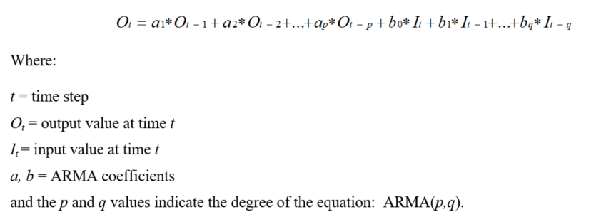
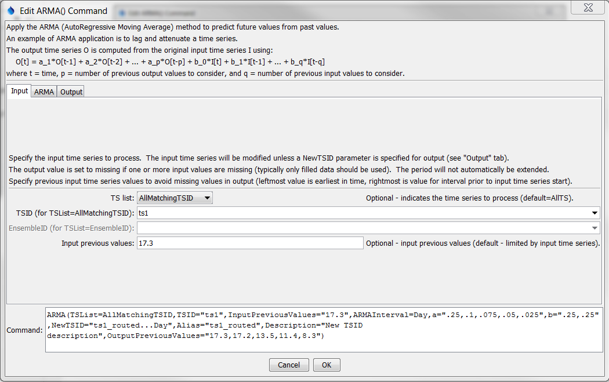
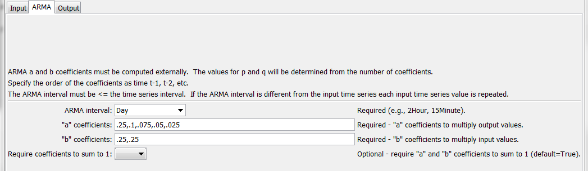
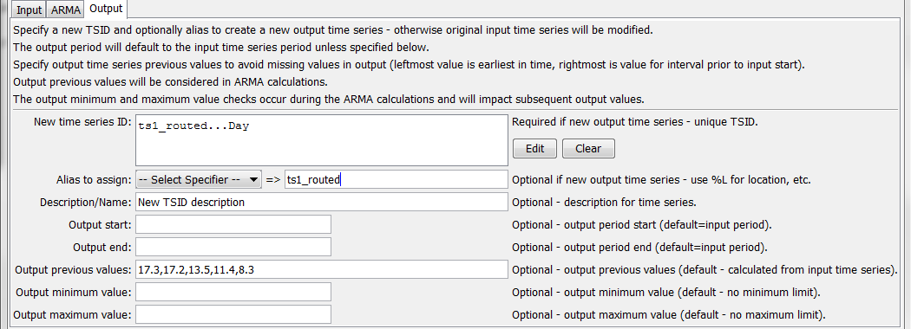
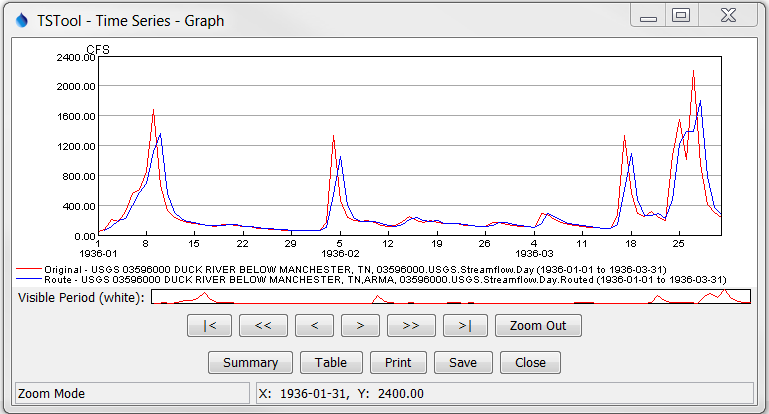
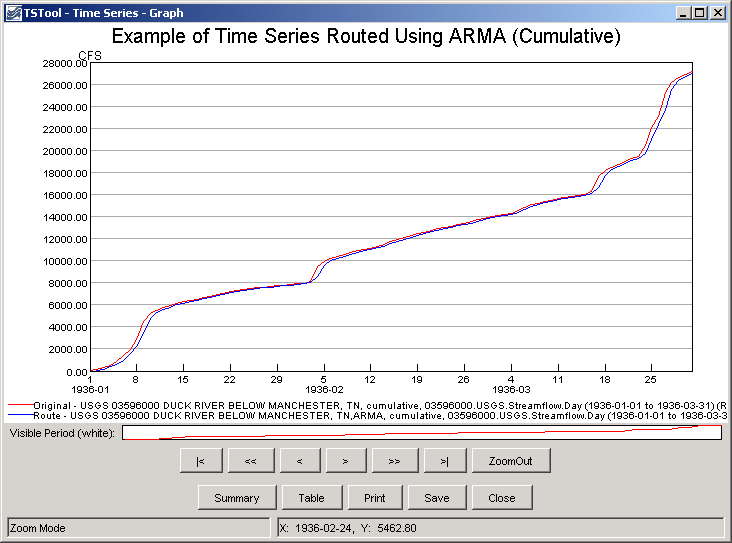

# TSTool / Command / ARMA #

*   [Overview](#overview)
*   [Command Editor](#command-editor)
*   [Command Syntax](#command-syntax)
*   [Examples](#examples)
*   [Troubleshooting](#troubleshooting)
*   [See Also](#see-also)

-------------------------

## Overview ##

The `ARMA` command uses values from an input time series to predict values
in the output time series (e.g., to route a streamflow time series downstream).
By default this command will replace the original time series values
(specify the `NewTSID` parameter to create a new output time series).
The ARMA method preserves the “mass” of the data.  The general equation for ARMA is:

**<p style="text-align: center;">

</p>**

The ARMA coefficients are determined by analyzing historical data and may be developed
using a data interval that is different than the data interval of the time series that is being manipulated.
The coefficients are typically computed by an external analysis program (TSTool does not perform this function).

The time series to process can have any interval.
The *a* and *b* coefficients are listed in the dialog from left-most to right-most in the equation
(for *a*-coefficients at time *t-1*, *t-2*, etc.).  Note that there are *p* *a*-coefficients and *(q + 1)* *b*-coefficients
(because there is a *b*-coefficient at time *t0*).
The interval used to compute the ARMA coefficients can be different from the data interval
but the data and ARMA intervals must be divisible by a common interval.  The ARMA algorithm is executed as follows:

1.  The data and ARMA intervals are checked and if they not the same,
    the data are expanded by duplicating each input value into a temporary array.
    For example, if the data interval is `6Hour` and the ARMA interval is `2Hour`,
    each data value is expanded to three data values (`2Hour` values).
    If the data interval is `6Hour` and the ARMA interval is `10Hour`,
    each data value is expanded to three data values (`2Hour` values) so that `2Hour` values
    can be combined to get `10Hour` values in the final output.
2.  The ARMA equation is applied at each point in the expanded data array.
    However, because the ARMA coefficients were developed using a specific interval,
    only the data values at the ARMA interval are used in the equation.
    For example, if the expanded data array has `2Hour` data and the ARMA interval is `10Hour`,
    then every fifth value will be used (e.g., *t* corresponds to the “current” value and *t – 1*
    corresponds to the fifth value before the current value).
    Because the ARMA algorithm depends on a number of previous terms in both the input and output,
    there may be missing terms at the beginning of the data array and in cases where missing data periods are encountered.
    Ideally ARMA will be applied to filled data and only the first few intervals will be an issue.
    The output period can be specified as less than the total period so
    that the initial part of the routed time series can be ignored.
    In cases where *O* values are missing, the algorithm first tries to use the *I* values.
    If any values needed for the result are missing, the result is set to missing.
    Another approach is to use the `InputPreviousValues` and `OutputPreviousValues` parameters to supply
    additional time series values previous to the start of the time series to overcome this issue.
    The following illustrates potential combinations of input and output previous values (*i* and *o*):<br>
    ```
               t
               IIIIIIIIIIIIIIIIIIIIIIIIIIIIIIIII (no InputPreviousValues)
           iiiiIIIIIIIIIIIIIIIIIIIIIIIIIIIIIIIII (InputPreviousValues specified)
               OOOOOOOOOOOOOOOOOOOOOOOOOOOOOOOOO (no OutputPreviousValues)
            oooOOOOOOOOOOOOOOOOOOOOOOOOOOOOOOOOO (OutputPreviousValues within overall input array)
     ooooooooooOOOOOOOOOOOOOOOOOOOOOOOOOOOOOOOOO (OutputPreviousValues beyond input array)
    ```
3.  The final results are converted to a data interval that matches the original input, if necessary.
    If the original data interval and the ARMA interval are the same, no conversion is necessary.
    For example, if the original data interval is `6Hour` and the ARMA interval is `10Hour`,
    then the expanded data interval will be `2Hour`.
    Consequently, three sequential expanded values are averaged to obtain the final 6Hour time series.

## Command Editor ##

The command is available in the following TSTool menu:

*   ***Commands / Manipulate Time Series***

The following dialog is used to edit the command and illustrates the command syntax.

**<p style="text-align: center;">

</p>**

**<p style="text-align: center;">
`ARMA` Command Editor for Input Parameters (<a href="../ARMA-input.png">see also the full-size image</a>)
</p>**

**<p style="text-align: center;">

</p>**

**<p style="text-align: center;">
`ARMA` Command Editor for ARMA Parameters (<a href="../ARMA-ARMA.png">see also the full-size image</a>)
</p>**

**<p style="text-align: center;">

</p>**

**<p style="text-align: center;">
`ARMA` Command Editor for Output Parameters (<a href="../ARMA-output.png">see also the full-size image</a>)
</p>**

## Command Syntax ##

The command syntax is as follows:

```text
ARMA(Parameter="Value",...)
```
**<p style="text-align: center;">
Command Parameters
</p>**

|**Parameter**&nbsp;&nbsp;&nbsp;&nbsp;&nbsp;&nbsp;&nbsp;&nbsp;&nbsp;&nbsp;&nbsp;&nbsp;&nbsp;&nbsp;&nbsp;&nbsp;&nbsp;&nbsp;&nbsp;&nbsp;&nbsp;&nbsp;&nbsp;&nbsp;&nbsp;&nbsp;&nbsp;&nbsp;&nbsp;&nbsp;&nbsp;&nbsp;&nbsp;&nbsp;&nbsp;|**Description**|**Default**&nbsp;&nbsp;&nbsp;&nbsp;&nbsp;&nbsp;&nbsp;&nbsp;&nbsp;&nbsp;&nbsp;&nbsp;&nbsp;&nbsp;&nbsp;&nbsp;&nbsp;&nbsp;&nbsp;&nbsp;&nbsp;&nbsp;&nbsp;&nbsp;&nbsp;&nbsp;&nbsp;|
|--------------|-----------------|-----------------|
| `TSList` | Indicates the list of time series to be processed, one of:<ul><li>`AllMatchingTSID` – all time series that match the TSID (single TSID or TSID with wildcards) will be modified.</li><li>`AllTS` – all time series before the command.</li><li>`EnsembleID` – all time series in the ensemble will be modified.</li><li>`FirstMatchingTSID` – the first time series that matches the TSID (single TSID or TSID with wildcards) will be modified.</li><li>`LastMatchingTSID` – the last time series that matches the TSID (single TSID or TSID with wildcards) will be modified.</li><li>`SelectedTS` – the time series are those selected with the [SelectTimeSeries](../SelectTimeSeries/SelectTimeSeries.md) command. | `AllTS` |
| `TSID` | The time series identifier or alias for the time series to be modified, using the `*` wildcard character to match multiple time series.  Can be specified with `${Property}`. | Required if `TSList=*TSID`. |
| `EnsembleID` | The ensemble to be modified, if processing an ensemble.  Can be specified with `${Property}`. | Required if `TSList=EnsembleID`. |
| `InputPreviousValues` | A list of comma-separated values to use for the input time series previous to the start of the input time series, to allow computation of output at the start of the period.  The first value is the earliest in time and the last is the value prior to the start of the input time series.  The number of values specified should be equal to the number of *b*-coefficients minus 1.  Can be specified with `${Property}`. |
| `ARMAInterval` | The ARMA interval to use in the analysis.  See discussion above for explanation when the ARMA interval is different from the input time series.  The most straightforward approach is when the ARMA interval matches the time series interval.  Can be specified with `${Property}`. | None – must be specified. |
| `a` | The *a* coefficients to multiply output time series values, separated by commas in order *t-1*, *t-2*, etc.  The *a* and *b* coefficients must sum to 1.000000 unless `RequireCoefficientSumTo1=False`.  Can be specified with `${Property}`. | Optional. |
| `b` | The *b* coefficients to multiple input time series, separated by commas, in order *t*, *t-1*, *t-2*, etc.  The *a* and *b* coefficients must sum to 1.000000 unless `RequireCoefficientSumTo1=False`.  Can be specified with `${Property}`. | None – must be specified. |
| `RequireCoefficientsSumTo1` | If `True`, the sum of the *a* and *b* coefficients must sum to 1.000000 (remainder is ignored).  The default enforces mass balance but using `False` is useful when evaluating analysis. | `True` |
| `NewTSID` | If specified, create a new time series as output, with this TSID.  Can be specified with `${Property}`. | Apply ARMA process and modify the input time series. |
| `Alias` | Alias for new output time series if `NewTSID` is specified. Can specify with `%L`, `${ts:Property}`, and `${Property}`. | No alias assigned to output time series. |
| `OutputStart` | The date/time for the start of the output as a date/time string or `${Property}`.  The period can only be lengthened if a new time series is created as output. | Use the global output period or input time series. |
| `OutputEnd` | The date/time for the end of the output as a date/time string or `${Property}`.  The period can only be lengthened if a new time series is created as output. | Use the global output period or input time series. |
| `OutputMinimum` | Minimum value allowed for output.  Any computed output value less than the minimum will be set to the minimum value.  The values are reset after the ARMA calculations occur and therefore do not impact the ARMA calculations.  Can be specified with `${Property}`. | None – use computed output value. |
| `OutputMaximum` | Maximum value allowed for output.  Any computed output value greater than the minimum will be set to the maximum value.  The values are reset after the ARMA calculations occur and therefore do not impact the ARMA calculations.  Can be specified with `${Property}`. | None – use computed output value. |
| `OutputPreviousValues` | A list of comma-separated values to use for the output time series previous to the start of the input time series, to allow computation of output at the start of the period.  The first value is the earliest in time and the last is the value prior to the start of the input time series.  The number of values must agree with the number of a coefficient values.  Can be specified with `${Property}`. | |

## Examples ##

See the [automated tests](https://github.com/OpenCDSS/cdss-app-tstool-test/tree/master/test/commands/ARMA).

A sample command file to process streamflow data from the USGS is as follows:

```
SetOutputPeriod(OutputStart="1936-01-01",OutputEnd="1936-03-31")
ReadUsgsNwisRdb(InputFile="Data/G03596000.rdb",Alias=Original)
Copy(TSID="Original",NewTSID="03596000.USGS.Streamflow.Day.Routed",Alias=Routed)
ARMA(TSList=AllMatchingTSID,TSID="Routed",ARMAInterval=2Hour,a="0.7325,
-0.3613,0.1345,0.5221,-0.2500,0.1381,-0.2643,0.0558",b="0.0263,0.0116,
-0.0146,-0.0081,0.0127,0.0798,0.0727,0.0523,0.0599")
```

The following figure shows the original and routed time series.

**<p style="text-align: center;">

</p>**

**<p style="text-align: center;">
Example Graph Showing Original and ARMA-Routed Time Series (<a href="../ARMA-graph.png">see also the full-size image</a>)
</p>**

The [`Cumulate`](../Cumulate/Cumulate.md) command can be used to verify mass balance of the original
and routed time series.  For example, insert a `Cumulate` command near the end of a command file.

The following figure shows the time series from the previous graph, this time as cumulative time series.

**<p style="text-align: center;">

</p>**

**<p style="text-align: center;">
Example Graph Showing Original and ARMA-Routed Time Series as Cumulative Values (<a href="../ARMA-graph-cumulate.png">see also the full-size image</a>)
</p>**

## Troubleshooting ##

See the main [TSTool Troubleshooting](../../troubleshooting/troubleshooting.md) documentation.

## See Also ##

*   [`Cumulate`](../Cumulate/Cumulate.md) command
