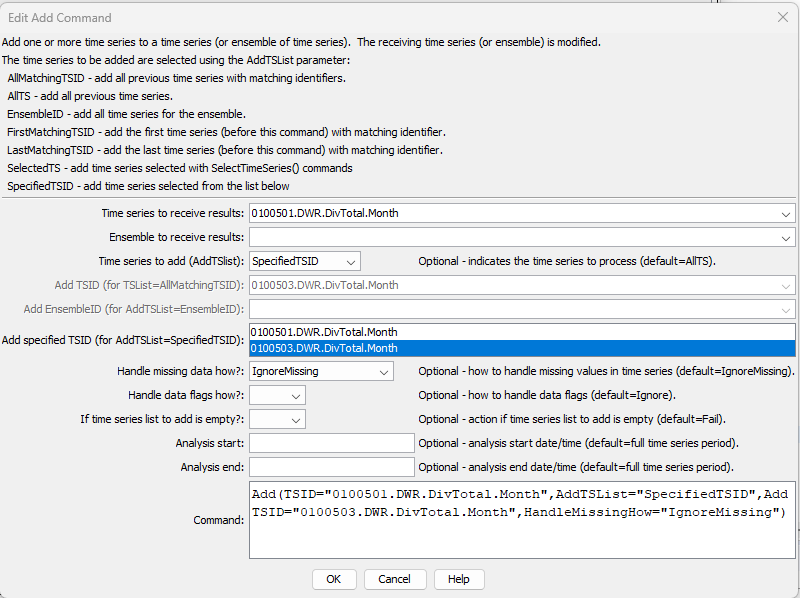

# TSTool / Command / Add #

* [Overview](#overview)
* [Command Editor](#command-editor)
* [Command Syntax](#command-syntax)
* [Examples](#examples)
* [Troubleshooting](#troubleshooting)
* [See Also](#see-also)

-------------------------

## Overview ##

The `Add` command adds regular interval time series.
The receiving time series will be set to the sum of itself and all indicated time series.
See also the [`NewTimeSeries`](../NewTimeSeries/NewTimeSeries) command, which can create an empty time series to receive a sum.
If an ensemble is being processed, another ensemble can be added,
a single time series can be added to all time series in the ensemble,
or a list of time series can be added to the ensemble (the number
in the list must match the number of time series in the ensemble).
	
This command will generate an error if the time series do not have compatible units.
If the units are compatible but are not the same (e.g., `IN` and `FT`),
then the units of the part will be converted to the units of the sum before addition.
Missing data in the parts can be ignored (do not set the sum to missing) or can result in missing values in the sum.
Implications of ignoring missing data should be considered.  Time series being added must have the same data interval.

## Command Editor ##

The following dialog is used to edit the command and illustrates the syntax of the command.
<a href="../Add.png">See also the full-size image.</a>



**<p style="text-align: center;">
`Add` Command Editor
</p>**

## Command Syntax ##

The command syntax is as follows:

```text
Add(Parameter="Value",...)
```
**<p style="text-align: center;">
Command Parameters
</p>**

|**Parameter**&nbsp;&nbsp;&nbsp;&nbsp;&nbsp;&nbsp;&nbsp;&nbsp;&nbsp;&nbsp;&nbsp;&nbsp;&nbsp;&nbsp;&nbsp;&nbsp;&nbsp;&nbsp;&nbsp;&nbsp;&nbsp;&nbsp;&nbsp;&nbsp;&nbsp;&nbsp;&nbsp;&nbsp;&nbsp;&nbsp;&nbsp;|**Description**|**Default**&nbsp;&nbsp;&nbsp;&nbsp;&nbsp;&nbsp;&nbsp;&nbsp;&nbsp;&nbsp;&nbsp;&nbsp;&nbsp;&nbsp;&nbsp;&nbsp;&nbsp;&nbsp;&nbsp;&nbsp;&nbsp;&nbsp;&nbsp;&nbsp;&nbsp;&nbsp;&nbsp;|
|--------------|-----------------|-----------------|
|`TSID`|The time series identifier or alias for the time series to receive the result.  Can be specified using processor `${Property}`.|`TSID` or `EnsembleID` must be specified.|
|`EnsembleID`|The ensemble to receive the result, if processing an ensemble.  Can be specified using processor `${Property}`.|`TSID` or `EnsembleID` must be specified.|
|`AddTSList`|Indicates the list of time series to be processed, one of:<br><ul><li>`AllMatchingTSID` – all time series that match the TSID (single TSID or TSID with wildcards) will be processed.</li><li>`AllTS` – all time series before the command.</li><li>`EnsembleID` – all time series in the ensemble will be processed (see the EnsembleID parameter).</li><li>`FirstMatchingTSID` – the first time series that matches the TSID (single TSID or TSID with wildcards) will be processed.</li><li>`LastMatchingTSID` – the last time series that matches the TSID (single TSID or TSID with wildcards) will be processed.</li><li>`SelectedTS` – the time series are those selected with the [`SelectTimeSeries`](../SelectTimeSeries/SelectTimeSeries) command.</li><li>`SpecifiedTSID` – the specified list of time series given by the `AddTSID` parameter.</li></ul> | `AllTS` (the time series receiving the result will not be added to itself). |
|`AddTSID`|The time series identifier or alias for the time series to be processed, using the `*` wildcard character to match multiple time series.  Can be specified using `${Property}`.|Required if `AddTSList=*TSID`|
|`AddEnsembleID`|The ensemble to be processed, if processing an ensemble. Can be specified using `${Property}`.|Required if `AddTSList=*EnsembleID`.  Use if an ensemble is being added to another ensemble.|
|`HandleMissingHow`|Indicates how to handle missing data in a time series:<ul><li>`IgnoreMissing` – create a result even if missing data are encountered in one or more time series – this option is not as rigorous as the others</li><li>`SetMissingIfOtherMissing` – set the result missing if any of the other time series values is missing</li><li>`SetMissingIfAnyMissing` – set the result missing if any time series value involved is missing	IgnoreMissing</li></ul>|`IgnoreMissing`|
|`IfTSListToAddIsEmpty`|Action if time series list to add is empty.|`Fail`|
|`AnalysisStart`|The date/time to start analyzing data.  Can be specified using processor `${Property}`.|Full period is analyzed.|
|`AnalysisEnd`|The date/time to end analyzing data.  Can be specified using processor `${Property}`.|Full period is analyzed.|

## Examples ##

See the [automated tests](https://github.com/OpenWaterFoundation/cdss-app-tstool-test/tree/master/test/regression/commands/general/Add).

A sample command file to process a time series from the [State of Colorado’s HydroBase database](../../datastore-ref/CO-HydroBase/CO-HydroBase)
is as follows:

```
# 0100501 - EMPIRE DITCH
0100501.DWR.DivTotal.Month~HydroBase
# 0100503 - RIVERSIDE CANAL
0100503.DWR.DivTotal.Month~HydroBase
Add(TSID="0100501.DWR.DivTotal.Month",TSList="SpecifiedTSID",
AddTSID="0100503.DWR.DivTotal.Month",HandleMissingHow=IgnoreMissing)
```

## Troubleshooting ##

## See Also ##

* [`NewTimeSeries`](../NewTimeSeries/NewTimeSeries) command
* [`SelectTimeSeries`](../SelectTimeSeries/SelectTimeSeries) command
* [`Subtract`](../Subtract/Subtract) command
