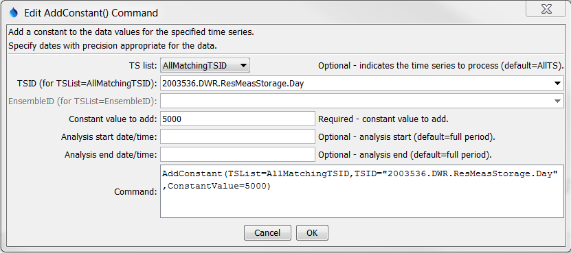

# TSTool / Command / AddConstant #

* [Overview](#overview)
* [Command Editor](#command-editor)
* [Command Syntax](#command-syntax)
* [Examples](#examples)
* [Troubleshooting](#troubleshooting)
* [See Also](#see-also)

-------------------------

## Overview ##

The `AddConstant` command adds a constant value to each data value in a time series
(or ensemble of time series) within the specified period.
This command is useful, for example,
when a time series needs to be adjusted for a constant bias.
Another example is to adjust a reservoir total volume time series by the dead pool
storage in order to compute the active storage (or inverse).
Missing data values will remain missing in the result.

## Command Editor ##

The following dialog is used to edit the command and illustrates the syntax of the command.
<a href="../AddConstant.png">See also the full-size image.</a>



**<p style="text-align: center;">
`AddConstant` Command Editor
</p>**

## Command Syntax ##

The command syntax is as follows:

```text
AddConstant(Parameter="Value",...)
```
**<p style="text-align: center;">
Command Parameters
</p>**

|**Parameter**&nbsp;&nbsp;&nbsp;&nbsp;&nbsp;&nbsp;&nbsp;&nbsp;&nbsp;&nbsp;&nbsp;|**Description**|**Default**&nbsp;&nbsp;&nbsp;&nbsp;&nbsp;&nbsp;&nbsp;&nbsp;&nbsp;&nbsp;&nbsp;&nbsp;&nbsp;&nbsp;&nbsp;&nbsp;&nbsp;&nbsp;&nbsp;&nbsp;&nbsp;&nbsp;&nbsp;&nbsp;&nbsp;&nbsp;&nbsp;|
|--------------|-----------------|-----------------|
|`TSList`|Indicates the list of time series to be processed, one of:<br><ul><li>`AllMatchingTSID` – all time series that match the TSID (single TSID or TSID with wildcards) will be processed.</li><li>`AllTS` – all time series before the command.</li><li>`EnsembleID` – all time series in the ensemble will be processed (see the EnsembleID parameter).</li><li>`FirstMatchingTSID` – the first time series that matches the TSID (single TSID or TSID with wildcards) will be processed.</li><li>`LastMatchingTSID` – the last time series that matches the TSID (single TSID or TSID with wildcards) will be processed.</li><li>`SelectedTS` – the time series are those selected with the [`SelectTimeSeries`](../SelectTimeSeries/SelectTimeSeries) command.</li></ul> | `AllTS` |
|`TSID`|The time series identifier or alias for the time series to be processed, using the `*` wildcard character to match multiple time series.  Can be specified using `${Property}`.|Required if `TSList=*TSID`|
|`EnsembleID`|The ensemble to be processed, if processing an ensemble. Can be specified using `${Property}`.|Required if `TSList=*EnsembleID`|
|`ConstantValue`<br>**required**|The data value to add to the time series.  Can be specified using processor `${Property}`.|None – must be specified.|
|`AnalysisStart`|The date/time to start analyzing data.  Can be specified using processor `${Property}`.|Full period.|
|`AnalysisEnd`|The date/time to end analyzing data.  Can be specified using processor `${Property}`.|Full period.|

## Examples ##

See the [automated tests](https://github.com/OpenWaterFoundation/cdss-app-tstool-test/tree/master/test/regression/commands/general/AddConstant).

A sample command file to process a time series from the [State of Colorado’s HydroBase database](../../datastore-ref/CO-HydroBase/CO-HydroBase)
is as follows:

```text
# 2003536 - CONTINENTAL RES
2003536.DWR.ResMeasStorage.Day~HydroBase
AddConstant(TSList=AllMatchingTSID,TSID="2003536.DWR.ResMeasStorage.Day",ConstantValue=5000)
```

## Troubleshooting ##

## See Also ##

* [`FillConstant`](../FillConstant/FillConstant) command
* [`SelectTimeSeries`](../SelectTimeSeries/SelectTimeSeries) command
* [`SetConstant`](../SetConstant/SetConstant) command
