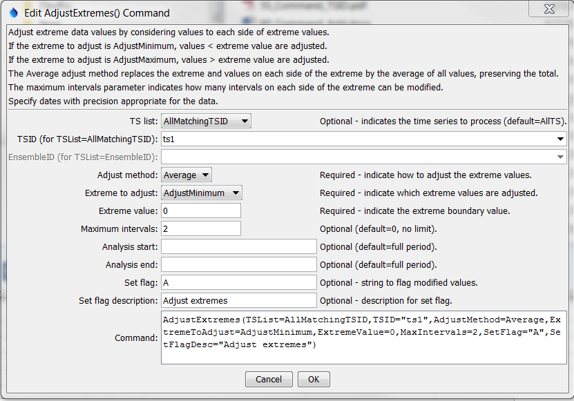
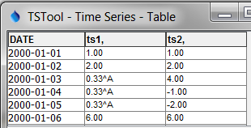

# TSTool / Command / AdjustExtremes #

*   [Overview](#overview)
*   [Command Editor](#command-editor)
*   [Command Syntax](#command-syntax)
*   [Examples](#examples)
*   [Troubleshooting](#troubleshooting)
*   [See Also](#see-also)

-------------------------

## Overview ##

The `AdjustExtremes` command adjusts extreme values in time series (e.g.,
to remove negative values from a time series that can only have values
greater than or equal to zero), while preserving “mass” (volume).
Currently the only adjust method is `Average`, which performs the following logic:

1.  Find a value beyond the extreme value, for example a negative value if the extreme value is 0.
2.  Adjust extreme values by considering neighboring values equally on each side of the point in question.
    When adjusting minimum values, neighboring values are added until the average
    is above the allowed extreme value, and all values that make up the sum are then set to the average value.
3.  Missing values remain missing and therefore this command should only be applied to filled data.
4.  If a satisfactory result cannot be reached within limits, then the original values are not changed.
5.  Changed values are listed in the time series history, which is viewed with the time series properties.
6.  Applying the command will result in the time series having periods of constant value,
    with the length of the period being controlled by the magnitude of the
    extreme value and the maximum number of values allowed for consideration on each side.

## Command Editor ##

The command is available in the following TSTool menu:

*   ***Commands / Manipulate Time Series***

The following dialog is used to edit the command and illustrates the syntax of the command.

**<p style="text-align: center;">

</p>**

**<p style="text-align: center;">
`AdjustExtremes` Command Editor (<a href="../AdjustExtremes.png">see full-size image</a>)
</p>**

## Command Syntax ##

The command syntax is as follows:

```text
AdjustExtremes(Parameter="Value",...)
```
**<p style="text-align: center;">
Command Parameters
</p>**

|**Parameter**&nbsp;&nbsp;&nbsp;&nbsp;&nbsp;&nbsp;&nbsp;&nbsp;&nbsp;&nbsp;&nbsp;&nbsp;&nbsp;&nbsp;&nbsp;&nbsp;|**Description**|**Default**&nbsp;&nbsp;&nbsp;&nbsp;&nbsp;&nbsp;&nbsp;&nbsp;&nbsp;&nbsp;&nbsp;&nbsp;&nbsp;&nbsp;&nbsp;&nbsp;&nbsp;&nbsp;&nbsp;&nbsp;&nbsp;&nbsp;&nbsp;&nbsp;&nbsp;&nbsp;&nbsp;|
|--------------|-----------------|-----------------|
|`TSList`|Indicates the list of time series to be processed, one of:<br><ul><li>`AllMatchingTSID` – all time series that match the TSID (single TSID or TSID with wildcards) will be processed.</li><li>`AllTS` – all time series before the command.</li><li>`EnsembleID` – all time series in the ensemble will be processed (see the EnsembleID parameter).</li><li>`FirstMatchingTSID` – the first time series that matches the TSID (single TSID or TSID with wildcards) will be processed.</li><li>`LastMatchingTSID` – the last time series that matches the TSID (single TSID or TSID with wildcards) will be processed.</li><li>`SelectedTS` – the time series are those selected with the [`SelectTimeSeries`](../SelectTimeSeries/SelectTimeSeries.md) command.</li></ul> | `AllTS` |
|`TSID`|The time series identifier or alias for the time series to be processed, using the `*` wildcard character to match multiple time series.  Can be specified using `${Property}`.|Required if `TSList=*TSID`|
|`EnsembleID`|The ensemble to be processed, if processing an ensemble. Can be specified using `${Property}`.|Required if `TSList=*EnsembleID`|
|`AdjustMethod`<br>**required**|Currently only Average is supported.|None – must be specified.|
|`ExtremeToAdjust`<br>**required**|Indicate whether minimum (`AdjustMinimum`) or maximum (`AdjustMaximum`) values to be adjusted.|None – must be specified.|
|`ExtremeValue`<br>**required**|The extreme value that is the limit of acceptable values.|None – must be specified.|
|`MaxIntervals`|Indicates how many values on each side of a point are allowed to be examined.|`0`, indicating no limit.|
|`AnalysisStart`|The date/time to start analyzing data, can use `${Property}`.|Full period.|
|`AnalysisEnd`|The date/time to end analyzing data, can use `${Property}`.|Full period.|

## Examples ##

See the [automated tests](https://github.com/OpenCDSS/cdss-app-tstool-test/tree/master/test/commands/AdjustExtremes).

The following example shows results using the above command editor values (adjusted on left, original on right):

**<p style="text-align: center;">

</p>**

**<p style="text-align: center;">
Results from `AdjustExtremes` Command
</p>**

## Troubleshooting ##

See the main [TSTool Troubleshooting](../../troubleshooting/troubleshooting.md) documentation.

## See Also ##

*   [`AddConstant`](../AddConstant/AddConstant.md) command
*   [`FillConstant`](../FillConstant/FillConstant.md) command
*   [`SelectTimeSeries`](../SelectTimeSeries/SelectTimeSeries.md) command
