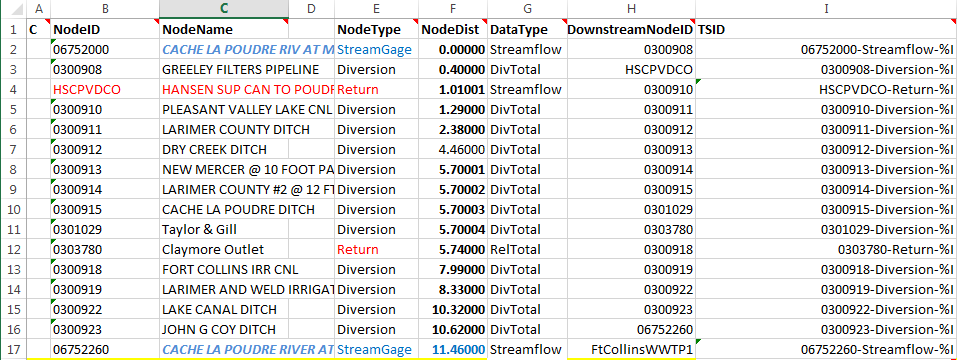
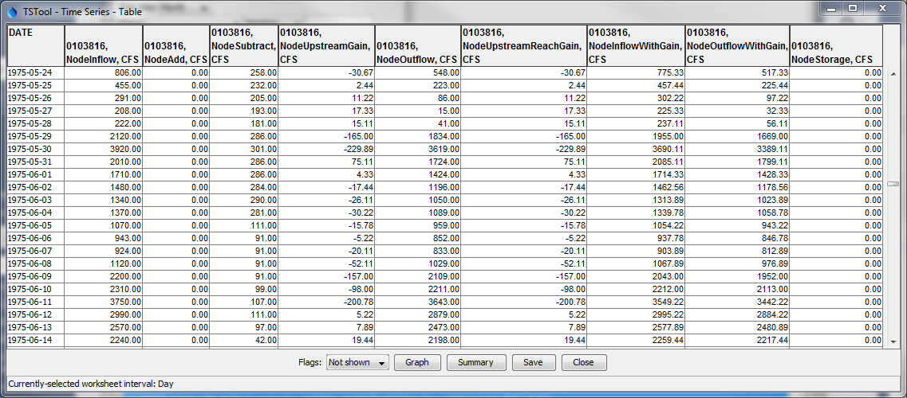
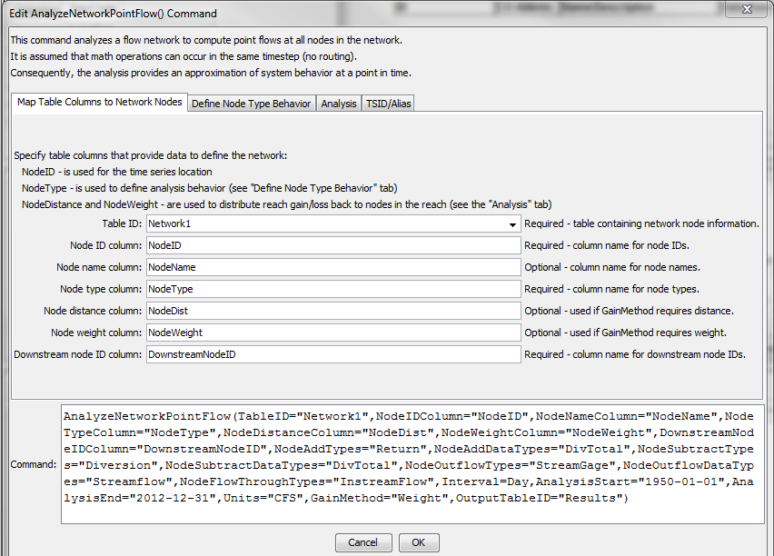
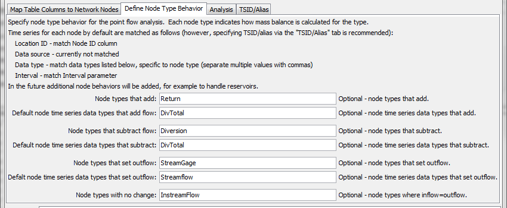
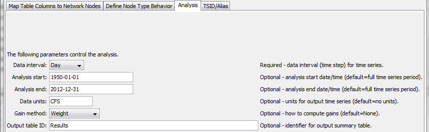
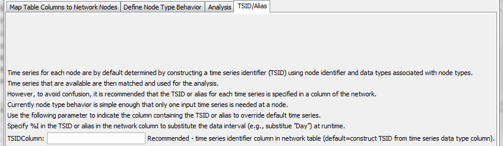

# TSTool / Command / AnalyzeNetworkPointFlow #

* [Overview](#overview)
* [Command Editor](#command-editor)
* [Command Syntax](#command-syntax)
* [Examples](#examples)
* [Troubleshooting](#troubleshooting)
* [See Also](#see-also)

-------------------------

## Overview ##

The `AnalyzeNetworkPointFlow` command takes as input information to define a “flow network”,
associates input time series with each node in the network,
and computes mass balance time series at each node.
Although the network is intended to represent a physical network such as a stream system,
it also can represent other flow networks such as transportation or other mass/energy conservation systems.

This command differs from the functionality of other network analysis tools as follows:

* Daily administration tools, such as the State of Colorado’s Colorado Water Rights Administration Tool (CWRAT)
(**CWRAT is no longer used in production**) perform a point flow analysis for a single day,
which only requires knowing one day’s input values,
whereas the `AnalyzeNetworkPointFlow` analyzes time series for a specified period.
* More sophisticated models, such as the State of Colorado’s StateMod water allocation model,
perform allocation decisions within each time step for the full period,
whereas the `AnalyzeNetworkPointFlow` command performs a sequence of
basic time series manipulations that can be quickly configured.

It may be possible to utilize the network data from tools such as those mentioned above with the `AnalyzeNetworkPointFlow` command.
For example, the StateMod river network file (`*.rin`) can be read using the TSTool
[`ReadTableFromFixedFormatFile`](../ReadTableFromFixedFormatFile/ReadTableFromFixedFormatFile.md) command.

Limitations to be addressed with future enhancements:

* The command does not handle branching networks in calculations
* The command does not handle reservoirs and storage calculations
* The output time series identifiers and alias cannot be user-defined
* Temporary known flows, for example at a diversion that dries the river, are not handled in calculations

The following figure illustrates the network connectivity and mass balance that is performed at each node.
Currently “on-channel” reservoirs with storage are not supported and gain/loss
can only be computed in non-branching networks – these features and others necessary
to model more complex networks will be added in the future;
however, this command is not intended to replace more complex models.
Consequently the command currently is suitable for analysis of a main stem river with no on-channel reservoirs.


**<p style="text-align: center;">
`AnalyzeNetworkPointFlow` Network and Node Mass Balance (<a href="../AnalyzeNetworkPointFlow_Diagram.png">see also the full-size image</a>)
</p>**

There are two main data configuration requirements:

1. Define the node network using node identifiers, node type, and other information that control the analysis.
2. Provide data that allows the command to locate the input time series for the analysis by matching with the node.
The time series identifiers (or alias) used by TSTool generally have location
identifiers that match the node identifier; however,
this is not a requirement if the input TSID is specified directly.

Defaults are in place that allow the time series identifier to be created from the network data.
However, for complicated networks where input time series may be accessed from multiple sources,
a general default may not result in matching time series.
Two examples are shown below to illustrate the different approach for specifying time series.

The following example shows a network that is defined in Excel as a table
containing a list of node identifiers with associated properties,
as illustrated in the following figure.
In this case, the node identifiers will be used by default to create the time series
identifier to match input time series (because the `TSIDColumn` command parameter
is not specified and there is no TSID column in the network table).
In this case, the input time series TSIDs must match the node
identifier and the data type provided with the `NodeAddDataTypes` and similar command parameters.


**<p style="text-align: center;">
`AnalyzeNetworkPointFlow` Network Input Table – Input Time Series Matched with NodeID (<a href="../AnalyzeNetworkPointFlow_InputTable.png">see also the full-size image</a>)
</p>**

The following example illustrates how the input time series identifier can be specified in the network data.
The TSID column in the table in this case contains time series aliases that will be matched with input time series,
where `%I` will be replaced with the analysis interval specified by the `Interval` command parameter.
 Using an alias for input time series allows a common naming convention for time series to be implemented,
which can simplify output (the period-delimited time series
identifier is still used with the time series but the alias takes precedence).



**<p style="text-align: center;">
`AnalyzeNetworkPointFlow` Network Input Table – Input Time Series Specified with TSID Column (<a href="../AnalyzeNetworkPointFlow_InputTable_TSID.png">see also the full-size image</a>)
</p>**

In the above examples the network is defined in an Excel file, the
[`ReadTableFromExcel`](../ReadTableFromExcel/ReadTableFromExcel.md) command is used to read the table,
and the table is used as input to the `AnalyzeNetworkPointFlow` command
The network definition table columns from the above figure are as follows
(note, however, that the column names are user-defined and are specified as
parameters to the `AnalyzeNetworkPointFlow` command.

**<p style="text-align: center;">
`AnalyzeNetworkPointFlow` Network Input Table Column Description
</p>**

|**Example Network Table Column**&nbsp;&nbsp;&nbsp;&nbsp;&nbsp;&nbsp;&nbsp;&nbsp;&nbsp;&nbsp;&nbsp;&nbsp;&nbsp;&nbsp;&nbsp;&nbsp;&nbsp;&nbsp;&nbsp;&nbsp;&nbsp;&nbsp;|**Command Parameter to Indicate Column**&nbsp;&nbsp;&nbsp;&nbsp;&nbsp;&nbsp;&nbsp;&nbsp;&nbsp;&nbsp;&nbsp;&nbsp;&nbsp;&nbsp;&nbsp;&nbsp;&nbsp;&nbsp;&nbsp;&nbsp;&nbsp;&nbsp;&nbsp;&nbsp;&nbsp;&nbsp;&nbsp;&nbsp;&nbsp;&nbsp;&nbsp;&nbsp;&nbsp;&nbsp;&nbsp;&nbsp;&nbsp;&nbsp;&nbsp;&nbsp;&nbsp;&nbsp;|**Description**|
|--|--|--|
|`NodeID`|`NodeIDColumn`|The location ID for the network node, typically corresponding to the location ID in time series identifiers.|
|`NodeName`|`NodeNameColumn`|The node name, useful because `NodeID` is generally terse and non-descriptive, used in messages.|
|`NodeType`|`NodeTypeColumn`|The node type, needed to define node behavior (e.g., whether time series values get added, subtracted, reset at node).  The node types are user-defined, although types often are defined by modeling conventions.  The behavior corresponding to node types is defined by using command parameters (`NodeAddTypes`, `NodeSubtractTypes`, `NodeOutflowTypes`, `NodeFlowThroughTypes`).|
|`NodeDist`|`NodeDistanceColumn`|The node distance along the flow path.  Typically the distance is measured relative to the lowest point on the network.  The distance is used to estimate gain/loss when GainMethod=Distance is specified as a command parameter.|
|`NodeWeight`|`	NodeWeightColumn`|Used when `GainMethod=Weight`.  The weights indicate the relative weight of the reach gain/loss to be distributed between nodes on the reach.  For example, specify a best estimate of the percentage of reach loss that occurs above each node.  Or, specify as a rate of gain/loss when used with `GainMethod=DistanceWeight` (but in this case the distance`*`weight product will be normalized to ensure that the reach gain/loss is equalized between known point flows).|
|`DownstreamNodeID`|`DownstreamNodeIDColumn`|The location ID for the downstream node, needed to define network connectivity.|
|`TSID`|`TSIDColumn`|Indicates the time series identifier or alias for the input time series.  The notation `%I` can be used as a place holder that will be replaced with value of the Interval command parameter.  In the future, additional similar columns will be added if multiple input time series are needed with other node types.|

The `AnalyzeNetworkPointFlow` command creates output time series with the
data types indicated in the following table.
For example, the time series identifier for the output time series will be
similar to the following (where the NodeID is taken from the network,
data source is not used, data type is as listed below,
and the interval agrees with the `Interval` command parameter):

```
NodeID..NodeInflow.Day
```
**<p style="text-align: center;">
`AnalyzeNetworkPointFlow` Network Input Table Column Description
</p>**

|**Column**&nbsp;&nbsp;&nbsp;&nbsp;&nbsp;&nbsp;&nbsp;&nbsp;&nbsp;&nbsp;&nbsp;&nbsp;&nbsp;&nbsp;&nbsp;&nbsp;&nbsp;&nbsp;&nbsp;&nbsp;&nbsp;&nbsp;&nbsp;&nbsp;&nbsp;&nbsp;&nbsp;&nbsp;&nbsp;&nbsp;&nbsp;&nbsp;|**Description**|
|--|--|
|`NodeInflow`|Sum of outflows from upstream nodes, which are consequently inflows to the current node (lagged routing currently is not implemented).|
|`NodeAdd`|Time series added at the node (for example immediately off-channel reservoir release or measured return flow).|
|`NodeSubtract`|Time series subtracted at the node (for example diversion).|
|`NodeUpstreamGain`|Gain (positive) or loss (negative) between immediate upstream node(s) and the current node (missing if gain/loss is not computed).|
|`NodeOutflow`|Outflow from the node, which takes into account inflow and any additions and subtractions at the node.  This is essentially natural flow.|
|`NodeUpstreamReachGain`|Gain (positive) or loss (negative) between upstream known flow node(s) and the current node (missing if gain/loss is not computed).|
|`NodeInflowWithGain`|`NodeInflow` + `NodeUpstreamReachGain` (missing if gain/loss are not computed).|
|`NodeOutflowWithGain`|`NodeOutflow` + `NodeUpstreamReachGain` (missing if gain/loss are not computed).|
|`NodeStorage`|Storage at the node after additions and subtractions (currently always zero, will enhance in the future to handle on-channel reservoirs).|
	
The following figure illustrates the output time series corresponding to the data types listed in the above table:



**<p style="text-align: center;">
`AnalyzeNetworkPointFlow` Output Time Series Table (<a href="../AnalyzeNetworkPointFlow_OutputTS.png">see also the full-size image</a>)
</p>**
 

The following logic is used to analyze the network.
Currently this logic is performed by navigating the network from most upstream to
downstream node and processing all timesteps for a node before moving to the next node.
In the future the entire network may be traversed for each timestep to allow for temporary known flows within a reach.

1. The network is navigated from top to bottom.
When a confluence is found (a node with more than one upstream node),
each confluence is processed from the top down to the confluence point.
Of particular importance is the concept of a “stream reach”,
which is the reach between known flow points,
because mass balance is enforced at known flow points and gain/loss can be estimated between the known flow points.
	1. The data type for the node (see `*DataType` command parameters)
	is used to retrieve the relevant time series for the node.
	The first time series that matches the location ID, data type, and interval is used as input for the node.
	The time series must have been read prior to the `AnalyzeNetworkPointFlow` command.
	For example, use the [`CopyTable`](../CopyTable/CopyTable) command to copy a
	subset of the network table’s `NodeID` values and then use the
	[`ReadTimeSeriesList`](../ReadTimeSeriesList/ReadTimeSeriesList.md) command with the list of identifiers.
	2. Calculate the node’s inflow:
		1. Node types that set outflow, indicated by the `NodeOutflowDataTypes` parameter (e.g., `StreamGage`):
			* `NodeInflow` = input time series for node
		2. All other node types:
			* `NodeInflow ` = sum of upstream node outflows
	3.	Calculate the node’s outflow:
		1. Node types that add, indicated by the `NodeAddDataTypes` parameter (e.g., `Return`, `Import`):
			* `NodeOutflow` = `NodeInflow` + added time series
		2. Node types that subtract, indicated by the `NodeSubtractDataTypes` parameter (e.g., `Diversion`):
			* `NodeOutflow` = `NodeInflow` - subtracted time series
		3. Node types that set outflow, indicated by the `NodeOutflowDataTypes` parameter (e.g., `StreamGage`):
			* `NodeOutflow` = `NodeInflow`
		4. Node types that let flow through, indicated by the `NodeFlowThroughDataTypes` parameter (e.g., `InstreamFlow`):
			* `NodeOutflow` = `NodeInflow`.
	4. For known flow points (e.g., `StreamGage` node type), set the reach gain/loss:
		1. `NodeUpstreamReachGain` = difference between upstream node outflow and known flow at downstream node in reach
	5. If gain/loss is being estimated and a known flow node encountered (e.g., `StreamGage`),
	gain/loss between this node and the nearest upstream node(s) is compute.
	This has only been implemented for the case where all intervening nodes are in a non-branching reach.
		1. First calculate the distribution factor by which the reach gain (see previous step) will be distributed to each node in the reach:
			* If the `GainMethod=None`, no adjustment to flows is made and the gain/loss
			upstream of the know flow node will result in a discontinuous jump because no gain/loss adjustment is made.
			* If the `GainMethod=Distance`, use the node distance
			data from the network table to prorate the gain/loss in the stream reach.
			The difference in distance between the upstream node and the current node is
			set to weight for prorating the reach gain/loss.
			Use this method if the gain/loss rate is the same throughout the reach and
			therefore only the distance between nodes controls the gain/loss.
			* If the `GainMethod=Weight`, the gain/loss is prorated by the weights
			specified by the `NodeWeightColumn` parameter (or weight equally
			if the weights are not specified in the network table).
			The weight of the upstream known flow node is not used.
			Use this method if the relative gain/loss for each node within the reach can be specified.
			* If the `GainMethod=DistanceWeight`, the gain/loss is prorated
			by the product of the weights specified by the `NodeWeightColumn` parameter
			(or weight equally if the weights are not specified in the network table)
			and by the values from the `NodeDistanceColumn`.
			The weight of the upstream known flow node is not used.
			Use this method if the relative rate of gain/loss for each node can be specified,
			but overall gain/loss is also a function of the distance.
			Even though a rate is specified, the calculated gain/loss may be
			slightly different because the overall reach gain/loss must be
			balanced at known flow points for each time step.
			* Multiply `NodeUpstreamReachGain` by the gain/loss distribution
			factor to calculate `NodeReadGain` for each node.
			* Compute the cumulative gain/loss for the node by summing `NodeUpstreamNodeGain`
			for each upstream node and set to `NodeUpstreamReachGain` for the current node. 
2. Analysis statistics optionally are written to an output table,
which contains a row for each network node.
Statistics include information such as the number of missing values in the input time series.
This information can be used to evaluate the quality of the analysis.
**This feature has not yet been implemented.**

Issues that need to be considered include:

1. Missing data in input result in missing data in calculated values.
Use TSTool features to fill missing data in time series before using as input to the analysis.
Because this may be a major effort, especially for a long analysis period,
it may be appropriate to read time series from model data sets.
It is envisioned that the output table will provide feedback on
how much missing data there is and how it impacts the analysis.
To review missing data, use the Period of Record graph or the Data Coverage tool in TSTool.
2. TSTool’s graphing tool currently does not allow graphing lines
as a step function in the case where no gain/loss is computed.
Instead, the line connects the data points.  An enhancement to the graphing tool is needed.
3. TSTool does not provide a way to graph a stream reach where the
graph values are pulled from each time series for a point in time.
Ideally a visualization tool would allow “scrolling” through dates and showing the
river reach with flow on the Y axis and node distance on the X axis,
although it would be tedious to have to scroll through the period.
4. There may be cases where a subtraction at the node takes all of the flow
resulting in a zero or negative value, essentially causing the node to be a known zero point flow.
For example, in Colorado, a river call may result in a river drying up during the call.
It is possible to estimate when this occurs, but the data quality may be low.
Currently TSTool allows negative flows in this case, which indicates that
input time series or the simple gain method calculations do not accurately represent the system.
One option in this case is to use the TSTool
[`AdjustExtremes`](../AdjustExtremes/AdjustExtremes.md) command,
which maintains mass balance around the extreme values.

It is important to understand that such a point flow analysis represents
a snapshot of the system at any point in time, but does not route flows through the network.
Known flows at stream gages are used as fixed values from which other data are estimated.
Gains and losses are representative of the network system, essentially interpolating over time and distance.
This type of analysis introduces errors in cases where the lag time between
nodes would result in significant differences if lagging were considered.
In the physical system, changing an upstream flow would result in lagged impacts due to routing;
however, the point flow analysis shows the impacts to downstream nodes in the same time step.
A more sophisticated model with routing would be needed to represent actual conditions.
However, the point flow analysis will be reasonably accurate if gains and
losses are occurring because of fairly static phenomena (e.g., groundwater
interactions that do not change rapidly within the network travel time).
One way to work around these limitations is to use a longer interval,
for example monthly instead of daily, in input time series or convert the point flow analysis results.

## Command Editor ##

The following dialog is used to edit the command and illustrates the syntax of the
command for parameters to map network table columns to network nodes.



**<p style="text-align: center;">
`AnalyzeNetworkPointFlow` Command Editor for Parameters to Map Network Table Columns to Network Nodes (<a href="../AnalyzeNetworkPointFlow.png">see also the full-size image</a>)
</p>**

The following dialog is used to edit the command and illustrates the syntax of the command for node type behavior parameters.



**<p style="text-align: center;">
`AnalyzeNetworkPointFlow` Command Editor for Node Type Behavior Parameters (<a href="../AnalyzeNetworkPointFlow2.png">see also the full-size image</a>)
</p>**

The following dialog is used to edit the command and illustrates the syntax of the command for analysis parameters.



**<p style="text-align: center;">
`AnalyzeNetworkPointFlow` Command Editor for Analysis Parameters (<a href="../AnalyzeNetworkPointFlow_AnalysisTab.png">see also the full-size image</a>)
</p>**

The following dialog is used to edit the command and illustrates the syntax of the command for time series parameters.



**<p style="text-align: center;">
`AnalyzeNetworkPointFlow` Command Editor for Analysis Parameters (<a href="../AnalyzeNetworkPointFlow_TSIDTab.png">see also the full-size image</a>)
</p>**

## Command Syntax ##

The command syntax is as follows:

```text
AnalyzeNetworkPointFlow(Parameter="Value",...)
```
**<p style="text-align: center;">
Command Parameters
</p>**

|**Parameter**&nbsp;&nbsp;&nbsp;&nbsp;&nbsp;&nbsp;&nbsp;&nbsp;&nbsp;&nbsp;&nbsp;&nbsp;&nbsp;&nbsp;&nbsp;&nbsp;&nbsp;&nbsp;&nbsp;&nbsp;&nbsp;&nbsp;&nbsp;&nbsp;&nbsp;&nbsp;&nbsp;&nbsp;&nbsp;|**Description**|**Default**&nbsp;&nbsp;&nbsp;&nbsp;&nbsp;&nbsp;&nbsp;&nbsp;&nbsp;&nbsp;&nbsp;&nbsp;&nbsp;&nbsp;&nbsp;&nbsp;&nbsp;&nbsp;&nbsp;&nbsp;&nbsp;&nbsp;&nbsp;&nbsp;&nbsp;&nbsp;&nbsp;|
|--------------|-----------------|-----------------|
|`TableID`<br>**required**|The identifier for the table defining the network.|None – must be specified.|
|`NodeIDColumn`<br>**required**|The name of the column in the network table containing node identifiers.  Node identifiers will be used for the location ID part of time series identifiers.|None – must be specified.|
|`NodeNameColumn`|The name of the column in the network table containing node names.||
|`NodeTypeColumn`<br>**required**|The name of the column in the network table containing node types.  The node type is used to specify what calculations will occur for the node.|None – must be specified.|
|`NodeDistanceColumn`|The name of the column in the network table containing node distance.  The distance is the measure from the most downstream node and is used when `GainMethod=Distance` or `GainMethod=DistanceWeight`.|Must be specified when `GainMethod=Distance` or `GainMethod=DistanceWeight`.|
|`NodeWeightColumn`|The name of the column in the network table containing node weights, which is used to distribute gain/loss when `GainMethod=Weight` or `GainMethod=DistanceWeight` (in the latter case the weight is the rate to use).|If not specified when `GainMethod=Weight`, gain/loss will be distributed evenly for the nodes.  Must be specified when `GainMethod=DistanceWeight`.|
|`DownstreamNodeIDColumn`|The name of the column in the network table containing downstream node identifiers.  This information defines the connectivity of the network.|None – must be specified.|
|`NodeAddTypes`|Node types for which time series are added to the node’s inflow to compute outflow, for example the Return node type in the above table example.  The `NodeTypeColumn` table column is checked to determine the type for each node in the network.|No additions will occur.|
|`NodeAddDataType`|The time series data type to match for the node.  The data type is used with the NodeID as the location ID to match available time series to use as input.  The `TSIDColumn` will override the default matching.|No additions will occur.|
|`NodeSubtractTypes`|Node types for which time series are subtracted from the node’s inflow, for example the Diversion node type in the above table example.  The `NodeTypeColumn` table column is checked to determine the type for each node in the network.|No subtractions will occur.|
|`NodeSubtractDataType`|The time series data type to match for the node.  The data type is used with the NodeID as the location ID to match available time series to use as input.  The `TSIDColumn` will override the default matching.|No subtractions will occur.|
|`NodeOutflowTypes`|Node types for which time series outflows are set to the node’s time input time series, for example the `Streamflow` node type in the above table example.  The `NodeTypeColumn` table column is checked to determine the type for each node in the network.|No known flows will be set – gain/loss cannot be computed.|
|`NodeOutflowDataType`|The time series data type to match for the node.  The data type is used with the `NodeID` as the location ID to match available time series to use as input.  The `TSIDColumn` will override the default matching.|No subtractions will occur.|
|`NodeFlowThroughTypes`|Node types for which time series outflows are set to the node’s inflow, for example the `InstreamFlow` node type in the above table example.  The `NodeTypeColumn` table column is checked to determine the type for each node in the network.|No known flows will be set – gain/loss cannot be computed.|
|`Interval`|The time series interval to process.  The interval is used with the node identifier and data type to match input time series.|None – must be specified.|
|`AnalysisStart`|The analysis start, which defines the period for output time series.  Specify to a precision consistent with Specify to a precision consistent with Interval.|Global output period.|
|`AnalysisEnd`|The analysis end, which defines the period for output time series.  Specify to a precision consistent with `Interval`.|Global output period.|
|`Units`|Units for output time series.  Warnings will be generated if input time series for the analysis are not consistent with these units.||
|`GainMethod`|The method used to prorate the gain/loss between known point flow nodes to other nodes in the reach.  Currently this can be used only on non-branching networks.<br><ul><li>`Distance` – prorate the gain/loss using distance between nodes (as a portion of the total distance).  Use this method if a constant gain/loss rate applies over each reach in the network.</li><li>`None` – no gain/loss is estimated, resulting in a discontinuity in an outflow jump above each known point flow.</li><li>`DistanceWeight` – prorate the gain/loss using distance*weight as the weight for each node, where the rate is specified in the weight network table column.  Use this method when the gain/loss rate varies by location and should be represented as a rate.</li><li>`Weight` – prorate the gain/loss using the weights specified for each node.  Use this method if the gain/loss fraction in a reach is explicitly specified.</li></ul>|None|
|`OutputTableID`|The identifier for the output table to receive analysis results statistics. |No output table will be created.|
|`TSIDColumn`|The name of the network table column containing time series identifiers or aliases for the input time series for the node.  Use `%I` in the column values to replace with the value of the Interval parameter.|Time series will be matched with nodes using the `NodeID` and data types specified with `NodeAddDataType`, etc.|

## Examples ##

See the [automated tests](https://github.com/OpenCDSS/cdss-app-tstool-test/tree/master/test/regression/commands/general/AnalyzeNetworkPointFlow).

The following command files illustrate how to implement a point flow analysis.
In this case the first command file prepares daily time series using the network as input.
The time series could similarly be provided by other processing procedures, or read from other model input files.
Need to update this example to use alias for the input time series and
corresponding TSID column in the network table matching the alias.

```text
# Read time series needed to perform the AnalyzeNetworkPointFlow() tests.
# Use data from HydroBase to provide realistic input.
# First read the network table
ReadTableFromExcel(TableID="Network1",InputFile="Network1.xlsx",ExcelColumnNames=FirstRowInRange)
# Get the list of streamflow gages and associated time series
# Free()
CopyTable(TableID="Network1",NewTableID="StreamflowStationList",IncludeColumns="NodeID",ColumnMap="NodeID:StreamGageID",ColumnFilters="NodeType:StreamGage")
ReadTimeSeriesList(TableID="StreamflowStationList",LocationColumn="StreamGageID",DataSource="DWR,USGS",DataType="Streamflow",Interval="Day",DataStore="HydroBase",IfNotFound=Warn)
WriteDateValue(OutputFile="Network1-StreamGage-Streamflow.dv",MissingValue=NaN,TSList=AllMatchingTSID,TSID="*.*.Streamflow.Day.*")
# Get the list of diversion stations and associated time series
Free()
CopyTable(TableID="Network1",NewTableID="DiversionStationList",IncludeColumns="NodeID",ColumnMap="NodeID:DiversionID",ColumnFilters="NodeType:Diversion")
ReadTimeSeriesList(TableID="DiversionStationList",LocationColumn="DiversionID",DataSource="DWR",DataType="DivTotal",Interval="Day",DataStore="HydroBase",IfNotFound=Warn)
WriteDateValue(OutputFile="Network1-Diversion-DivTotal.dv",MissingValue=NaN,TSList=AllMatchingTSID,TSID="*.*.DivTotal.Day.*")
# Get the list of diversion return stations and associated time series
Free()
CopyTable(TableID="Network1",NewTableID="DiversionReturnStationList",IncludeColumns="NodeID",ColumnMap="NodeID:DiversionID",ColumnFilters="NodeType:Return")
ReadTimeSeriesList(TableID="DiversionReturnStationList",LocationColumn="DiversionID",DataSource="DWR",DataType="DivTotal",Interval="Day",DataStore="HydroBase",IfNotFound=Warn)
WriteDateValue(OutputFile="Network1-Return-DivTotal.dv",MissingValue=NaN,TSList=AllMatchingTSID,TSID="*.*.DivTotal.Day.*")
```

The second command file performs the point flow analysis.
This example is from a TSTool test and fills missing data with a simple approach
in order to ensure that no missing values are included in the analysis.
A single command file that combines the two command file examples also could be used.

```text
# Test analyzing a simple network for point flows
StartLog(LogFile="Results/Test_AnalyzeNetworkPointFlow.TSTool.log")
# Read the network
ReadTableFromExcel(TableID="Network1",InputFile="Data\Network1.xlsx",Worksheet="Network1",ExcelColumnNames=FirstRowInRange)
# Read the time series associated with network nodes (pregenerated)
# Fill diversion time series with zeros so there is something to analyze
# Fill stream gage time series with repeat forward and backward
SetInputPeriod(InputStart="1950-01-01",InputEnd="2013-12-31")
ReadDateValue(InputFile="Data\Network1-Diversion-DivTotal.dv")
ReadDateValue(InputFile="Data\Network1-Return-DivTotal.dv")
FillConstant(TSList=AllMatchingTSID,TSID="*.*.DivTotal.*.*",ConstantValue=0)
ReadDateValue(InputFile="Data\Network1-StreamGage-Streamflow.dv")
FillRepeat(TSList=AllMatchingTSID,TSID="*.*.Streamflow.*.*",FillDirection=Backward)
FillRepeat(TSList=AllMatchingTSID,TSID="*.*.Streamflow.*.*",FillDirection=Forward)
CheckTimeSeries(CheckCriteria="Missing")
# Analyze the network point flow.
AnalyzeNetworkPointFlow(TableID="Network1",NodeIDColumn="NodeID",NodeNameColumn="NodeName",NodeTypeColumn="NodeType",NodeDistanceColumn="NodeDist",NodeWeightColumn="NodeWeight",DownstreamNodeIDColumn="DownstreamNodeID",NodeAddTypes="Return",NodeAddDataTypes="DivTotal",NodeSubtractTypes="Diversion",NodeSubtractDataTypes="DivTotal",NodeOutflowTypes="StreamGage",NodeOutflowDataTypes="Streamflow",NodeFlowThroughTypes="InstreamFlow",Interval=Day,AnalysisStart="1950-01-01",AnalysisEnd="2012-12-31",Units="CFS",GainMethod="Distance",OutputTableID="Results")
```

## Troubleshooting ##

## See Also ##

* [`AdjustExtremes`](../AdjustExtremes/AdjustExtremes.md) command
* [`CopyTable`](../CopyTable/CopyTable.md) command
* [`CreateNetworkFromTable`](../CreateNetworkFromTable/CreateNetworkFromTable.md) command
* [`ReadTableFromExcel`](../ReadTableFromExcel/ReadTableFromExcel.md) command
