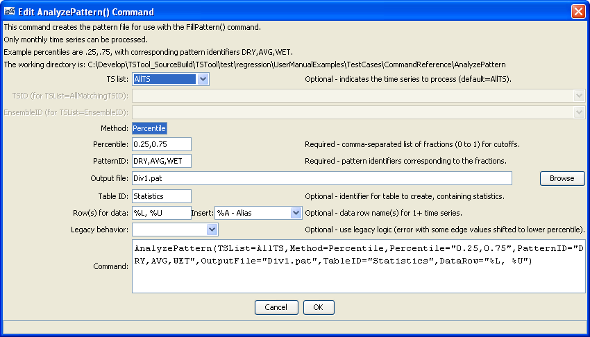
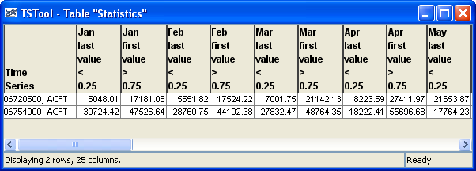

# TSTool / Command / AnalyzePattern #

* [Overview](#overview)
* [Command Editor](#command-editor)
* [Command Syntax](#command-syntax)
* [Examples](#examples)
* [Troubleshooting](#troubleshooting)
* [See Also](#see-also)

-------------------------

## Overview ##

The `AnalyzePattern` command creates the pattern file for use with the
[`FillPattern`](../FillPattern/FillPattern.md) command (see also
[`ReadPatternFile`](../ReadPatternFile/ReadPatternFile.md)).
Each time series to be processed is analyzed as follows:

1. Create a time series to contain the pattern identifiers for each month (e.g., `DRY`, `AVG`, `WET`).
2. For each month, determine the monthly values for the
time series being analyzed (e.g., find all of the January values).
3. Rank the values in ascending order.
4. Evaluate the percentile rank information for non-missing values and assign
in the pattern time series an appropriate pattern identifier.
For example, if the percentile values are `.25` and `.75`,
assign the first pattern identifier to values < 25% of the non-missing count,
assign the second pattern identifier to non-missing values >= 25% and < 75%,
and assign the third identifier to the non-missing values >= 75%.

The resulting pattern time series is then written to a file.
This command is enabled for monthly data only.
See below for an example of a fill pattern file.
One or more patterns can be included in each pattern file,
similar to StateMod time series files (see the
[StateMod Input Type Appendix](../../datastore-ref/StateMod/StateMod.md)).
Multiple pattern files can be used, if appropriate.  

```
#  Years Shown = Water Years
#  Missing monthly data filled by the Mixed Station Method, USGS 1989
#  Time series identifier         = 09034500.CRDSS_USGS.QME.MONTH.1
#  Description                    = COLORADO RIVER AT HOT SULPHUR SPRINGS, CO.
# -e-b----------eb------eb------eb------eb------eb------eb------eb------eb------eb------eb------eb------eb------eb--------e
   10/1908  -      9/1996 ACFT  WYR
1909 09034500         AVG     AVG     AVG     WET     WET     AVG     AVG     AVG     WET     WET     WET     WET
1910 09034500         WET     WET     WET     WET     WET     WET     AVG     AVG     AVG     AVG     AVG     AVG
1911 09034500         AVG     AVG     WET     AVG     AVG     AVG     AVG     WET     WET     WET     AVG     WET
1912 09034500         WET     WET     WET     WET     WET     AVG     AVG     WET     WET     WET     WET     WET
...ommitted...
```

The pattern file will by default contain all available data for the overlapping period
and will be written in calendar year.  The output period can be set with the
[`SetOutputPeriod`](../SetOutputPeriod/SetOutputPeriod.md) command and the output
year type can be set with the
[`SetOutputYearType`](../SetOutputYearType/SetOutputYearType.md) command.

## Command Editor ##

The following dialog is used to edit the command and illustrates the syntax of the command.

**<p style="text-align: center;">

</p>**

**<p style="text-align: center;">
`AnalyzePattern` Command Editor (<a href="../AnalyzePattern.png">see also the full-size image</a>)
</p>**

## Command Syntax ##

The command syntax is as follows:

```text
AnalyzePattern(Parameter="Value",...)
```
**<p style="text-align: center;">
Command Parameters
</p>**

|**Parameter**&nbsp;&nbsp;&nbsp;&nbsp;&nbsp;&nbsp;&nbsp;&nbsp;&nbsp;&nbsp;&nbsp;|**Description**|**Default**&nbsp;&nbsp;&nbsp;&nbsp;&nbsp;&nbsp;&nbsp;&nbsp;&nbsp;&nbsp;&nbsp;&nbsp;&nbsp;&nbsp;&nbsp;&nbsp;&nbsp;&nbsp;&nbsp;&nbsp;&nbsp;&nbsp;&nbsp;&nbsp;&nbsp;&nbsp;&nbsp;|
|--------------|-----------------|-----------------|
|`TSList`|Indicates the list of time series to be processed, one of:<br><ul><li>`AllMatchingTSID` – all time series that match the TSID (single TSID or TSID with wildcards) will be processed.</li><li>`AllTS` – all time series before the command.</li><li>`EnsembleID` – all time series in the ensemble will be processed (see the EnsembleID parameter).</li><li>`FirstMatchingTSID` – the first time series that matches the TSID (single TSID or TSID with wildcards) will be processed.</li><li>`LastMatchingTSID` – the last time series that matches the TSID (single TSID or TSID with wildcards) will be processed.</li><li>`SelectedTS` – the time series are those selected with the [`SelectTimeSeries`](../SelectTimeSeries/SelectTimeSeries.md) command.</li></ul> | `AllTS` |
|`TSID`|The time series identifier or alias for the time series to be processed, using the `*` wildcard character to match multiple time series.  Can be specified using `${Property}`.|Required if `TSList=*TSID`|
|`EnsembleID`|The ensemble to be processed, if processing an ensemble. Can be specified using `${Property}`.|Required if `TSList=*EnsembleID`|
|`Method`|Method used to determine the patterns.  Currently only `Percentile` is recognized.|`Percentile`|
|`Percentile`<br>**required**|A comma-separated list of percentiles for cutoffs, used when `Method=Percentile`.  Values should be `0` to `1` (e.g., `.25`, `.75`)|None – must be specified.|
|`PatternID`<br>**required**|The pattern identifiers to use, corresponding to the percentiles.  Specify one more than the number of percentiles (e.g., DRY,AVG,WET).|None – must be specified.|
|`OutputFile`<br>**required**|Output file to write, which will contain the pattern information.  Currently only the StateMod pattern file format is supported.|None – must be specified.|
|`TableID`|The identifier for a new table to be created, containing the sample values for each month adjoining the percentile positions.  Each time series will be listed in the first column as per the `DataRow` parameter.  For N percentile values, the first N-1 values in the table will correspond to the last value below a percentile cutoff and the Nth value will be the first value above the Nth percentile value.	Optional – table will not be created by default.||
|`DataRow`|The contents of the first column, indicating the time series.|Location, data type, and units, if available.|
|`Legacy`|Indicates whether to duplicate legacy behavior (`True`) or use current behavior (default, `False`).  A bug was fixed in TSTool 9.05.02 to correct a bug where the last value in each bin sometimes should have been in the larger cutoff bin.|`False` – use current behavior.|

## Examples ##

See the [automated tests](https://github.com/OpenCDSS/cdss-app-tstool-test/tree/master/test/regression/commands/general/AnalyzePattern).

A sample command file to analyze streamflow from the [State of Colorado’s HydroBase database](../../datastore-ref/CO-HydroBase/CO-HydroBase.md)
is as follows:

```text
# 06720500 - SOUTH PLATTE RIVER AT HENDERSON
06720500.DWR.Streamflow.Month~HydroBase
# 06754000 - SOUTH PLATTE RIVER NEAR KERSEY
06754000.DWR.Streamflow.Month~HydroBase
AnalyzePattern(TSList=AllTS,Method=Percentile,Percentile="0.25,0.75",PatternID="DRY,AVG,WET",OutputFile="Div1.pat",TableID=”Statistics”,DataRow=”%L, %U”)

```

The following figure illustrates the resulting statistics:
<a href="../AnalyzePattern_Table.png">See also the full-size image.</a>

**<p style="text-align: center;">

</p>**

**<p style="text-align: center;">
Statistics from Pattern Analysis
</p>**

## Troubleshooting ##

## See Also ##

* [`FillPattern`](../FillPattern/FillPattern.md) command
* [`ReadPatternFile`](../ReadPatternFile/ReadPatternFile.md) command
* [`SelectTimeSeries`](../SelectTimeSeries/SelectTimeSeries.md) command
