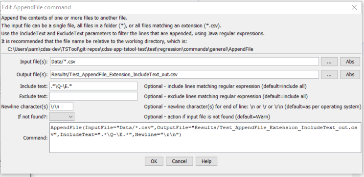

# TSTool / Command / AppendFile #

* [Overview](#overview)
* [Command Editor](#command-editor)
* [Command Syntax](#command-syntax)
* [Examples](#examples)
* [Troubleshooting](#troubleshooting)
* [See Also](#see-also)

-------------------------

## Overview ##

The `AppendFile` command appends one or more files to another file.
All or only matching lines from input files can be transferred.
This command is useful for appending multiple data files into a single file that can be read by TSTool.

## Command Editor ##

The following dialog is used to edit the command and illustrates the command syntax.

**<p style="text-align: center;">

</p>**

**<p style="text-align: center;">
`AppendFile` Command Editor (<a href="../AppendFile.png">see also the full-size image</a>)
</p>**

## Command Syntax ##

The command syntax is as follows:

```text
AppendFile(Parameter="Value",...)
```
**<p style="text-align: center;">
Command Parameters
</p>**

|**Parameter**&nbsp;&nbsp;&nbsp;&nbsp;&nbsp;&nbsp;&nbsp;&nbsp;&nbsp;&nbsp;&nbsp;&nbsp;&nbsp;&nbsp;&nbsp;&nbsp;&nbsp;&nbsp;&nbsp;&nbsp;&nbsp;&nbsp;&nbsp;&nbsp;&nbsp;&nbsp; | **Description** | **Default**&nbsp;&nbsp;&nbsp;&nbsp;&nbsp;&nbsp;&nbsp;&nbsp;&nbsp;&nbsp; |
|--------------|-----------------|----------------- |
|`InputFile`<br>**required**|The name of one or more files to append, using the following conventions:<ul><li>No `*` in filename – match one file.</li><li>Filename specified as `*`– match all files in input directory (working directory by default).</li><li>Filename specified as `*.ext` – match all files with extension</li></ul><br>More options may be supported in the future when TSTool is updated to use Java 1.7+.  Can specify using processor `${Property}`.|None – must be specified.|
|`OutputFile`<br>**required**|The output file that will be appended to.  The file is created if it does not exist.  Use the [`RemoveFile`](../RemoveFile/RemoveFile.md) command to remove the old file.  Can specify using processor `${Property}`.|None – must be specified.|
|`IncludeText`|A regular expression pattern to include text.  Only the matching lines will be included.  `*` can be used as wildcard to match beginning and ending of a string.  The `*` is converted to `.*` and the pattern uses the [Java regular expression syntax](http://en.wikipedia.org/wiki/Regular_expression).|Append all lines.|
|`ExcludeText`|A regular expression pattern to exclude text.  `*` can be used as wildcard to match beginning and ending of a string.  Matching lines will be excluded from the append.|Append all lines.|
|`Newline`|Indicate the newline character to use at the end of lines.  Normally the operating system default is ok (`\n` for Linux and for Mac, `\r\n for Windows`), but the newline may need to be specified to ensure cross-platform compatibility.|Operating system default.|
|`IfNotFound`|Indicate action if the file is not found, one of:<ul><li>`Ignore` – ignore the missing file (do not warn).</li><li>`Warn` – generate a warning (use this if the file truly is expected and a missing file is a cause for concern).</li><li>`Fail` – generate a failure (use this if the file truly is expected and a missing file is a cause for concern).</li></ul>|`Warn`|

The following table lists regular expression examples:

|**`IncludeText` Regular Expression**&nbsp;&nbsp;&nbsp;&nbsp;&nbsp;&nbsp;&nbsp;&nbsp;|**Description**|
|--------------|-----------------|
|`*\Q-\E*`|Match lines that start with any character, end with any character, and contain a dash.  The `\Q` and `\E` characters are special characters to start and end a quoted character, and are necessary because the dash has special meaning in a regular expression.|

## Examples ##

See the [automated tests](https://github.com/OpenCDSS/cdss-app-tstool-test/tree/master/test/commands/AppendFile).

## Troubleshooting ##

## See Also ##

* [`CopyFile`](../CopyFile/CopyFile.md) command
* [`RemoveFile`](../RemoveFile/RemoveFile.md) command
