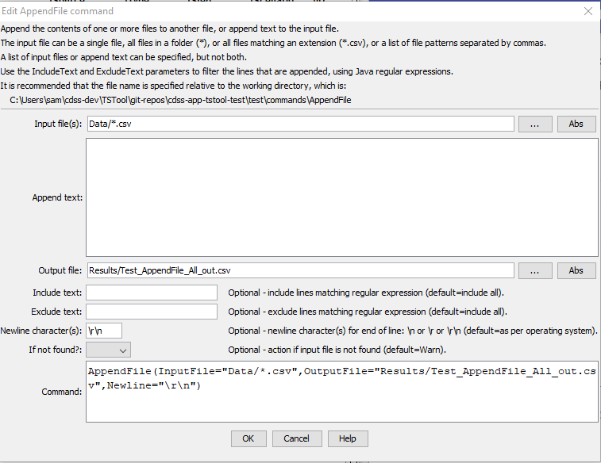

# TSTool / Command / AppendFile #

*   [Overview](#overview)
*   [Command Editor](#command-editor)
*   [Command Syntax](#command-syntax)
*   [Examples](#examples)
*   [Troubleshooting](#troubleshooting)
*   [See Also](#see-also)

-------------------------

## Overview ##

The `AppendFile` command appends text and/or one or more files to an output file.
This command is useful for:

*   appending multiple data files into a single file that can be read by TSTool
*   formatting files for use in websites (see also the [`FormatFile`](../FormatFile/FormatFile.md) command)

The command appends to a file using either or both of the following:

*   zero or more files can be appended to create a new file or overwrite an input file
*   text can be added to the input file to create a new file or overwrite the input file

The list of input files can be specified using a single pattern
or a comma-separated list of patterns, each of which can be specified as:

*   path:
    +   absolute path
    +   a path relative to the command file folder
*   wildcards: 
    +   literal path (no wildcards) that exactly matches a file
    +   wildcards to match one or more files
        (see Java [`PathMatcher`](https://docs.oracle.com/javase/8/docs/api/java/nio/file/FileSystem.html#getPathMatcher-java.lang.String-)):
        -   `*` - match one or more characters at a folder level
        -   `*.abc` - matches file names with extension `abc`
        -   `**/*.abc` - matches file names with extension `abc` in any folder

All or only matching lines from input files can be transferred using `IncludeText` and `ExcludeText` parameters.

## Command Editor ##

The command is available in the following TSTool menu:

*   ***Commands / General - File Handling***

The following dialog is used to edit the command and illustrates the command syntax.

**<p style="text-align: center;">

</p>**

**<p style="text-align: center;">
`AppendFile` Command Editor (<a href="../AppendFile.png">see full-size image</a>)
</p>**

## Command Syntax ##

The command syntax is as follows:

```text
AppendFile(Parameter="Value",...)
```
**<p style="text-align: center;">
Command Parameters
</p>**

|**Parameter**&nbsp;&nbsp;&nbsp;&nbsp;&nbsp;&nbsp;&nbsp;&nbsp;&nbsp;&nbsp;&nbsp;&nbsp;&nbsp;&nbsp;&nbsp;&nbsp;&nbsp;&nbsp;&nbsp;&nbsp;&nbsp;&nbsp;&nbsp;&nbsp;&nbsp;&nbsp; | **Description** | **Default**&nbsp;&nbsp;&nbsp;&nbsp;&nbsp;&nbsp;&nbsp;&nbsp;&nbsp;&nbsp; |
|--------------|-----------------|----------------- |
|`InputFile`|The name of one or more files to append, specified as file patterns separated by commas:<ul><li>No `*` in filename – match one file</li><li>`*`– match all files in input directory (working directory by default).</li><li>`*.ext` – match all files with extension</li></ul><br>Can specify using processor `${Property}`.  If the input file does not exist and `IfNotFound=Ignore`, text can still be appended to create the output file. | Specify file pattern(s) or text to append.|
| `AppendText` | Text to append to the input file. | Specify `InputFile` or text. |
|`OutputFile`<br>**required**|The output file that will be created from input.  The file is created if it does not exist.  If the output file matches an input file, the input file will be overwritten.  Use the [`RemoveFile`](../RemoveFile/RemoveFile.md) command to remove the old file.  Can specify using processor `${Property}`.|None – must be specified.|
|`IncludeText`|A regular expression pattern to include text.  Only the matching lines will be included.  `*` can be used as wildcard to match beginning and ending of a string.  The `*` is converted to `.*` and the pattern uses the [Java regular expression syntax](https://en.wikipedia.org/wiki/Regular_expression). Can include `${Property}` notation, which is evaluated before the regular expression is interpreted. If the file contains the literal string `${Something}`, use `*\$\{Something\}*`. |Append all lines.|
|`ExcludeText`|A regular expression pattern to exclude text.  `*` can be used as wildcard to match beginning and ending of a string.  Matching lines will be excluded from the append. Can include `${Property}` notation, which is evaluated before the regular expression is interpreted. If the file contains the literal string `${Something}`, use `*\$\{Something\}*`. |Append all lines.|
|`Newline`|Indicate the newline character to use at the end of lines.  Normally the operating system default is ok (`\n` for Linux and for Mac, `\r\n for Windows`), but the newline may need to be specified to ensure cross-platform compatibility.|Operating system default.|
|`IfNotFound`|Indicate action if the file is not found, one of:<ul><li>`Ignore` – ignore the missing file (do not warn).</li><li>`Warn` – generate a warning (use this if the file truly is expected and a missing file is a cause for concern).</li><li>`Fail` – generate a failure (use this if the file truly is expected and a missing file is a cause for concern).</li></ul>|`Warn`|

The following table lists regular expression examples:

|**`IncludeText` Regular Expression**&nbsp;&nbsp;&nbsp;&nbsp;&nbsp;&nbsp;&nbsp;&nbsp;|**Description**|
|--------------|-----------------|
|`*\Q-\E*`|Match lines that start with any character, end with any character, and contain a dash, for example to match lines with ISO 8601 date/time (`2022-01-01`, etc.).  The `\Q` and `\E` characters are special characters to start and end a quoted character, and are necessary because the dash has special meaning in a regular expression.|

## Examples ##

See the [automated tests](https://github.com/OpenCDSS/cdss-app-tstool-test/tree/master/test/commands/AppendFile).

## Troubleshooting ##

See the main [TSTool Troubleshooting](../../troubleshooting/troubleshooting.md) documentation.

## See Also ##

*   [`CopyFile`](../CopyFile/CopyFile.md) command
*   [`FormatFile`](../FormatFile/FormatFile.md) command
*   [`RemoveFile`](../RemoveFile/RemoveFile.md) command
