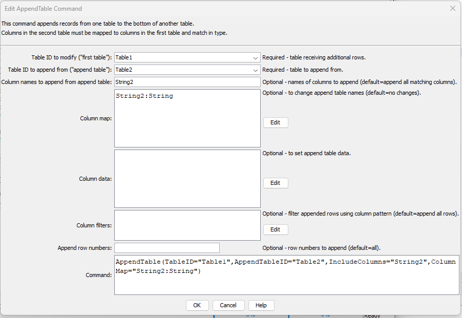

# TSTool / Command / AppendTable #

* [Overview](#overview)
* [Command Editor](#command-editor)
* [Command Syntax](#command-syntax)
* [Examples](#examples)
* [Troubleshooting](#troubleshooting)
* [See Also](#see-also)

-------------------------

## Overview ##

The `AppendTable` command appends rows from one table to another table,
resulting in more rows being added to the first table.
This command does not “join” tables horizontally (for such functionality see the [`JoinTables`](../JoinTables/JoinTables.md) command).
For appended rows:

* values in columns that are not matched are set to null in the receiving table
* values in columns where the data types do not match are set to null in the receiving table

## Command Editor ##

The following dialog is used to edit the command and illustrates the syntax of the command.

**<p style="text-align: center;">

</p>**

**<p style="text-align: center;">
`AppendTable` Command Editor (<a href="../AppendTable.png">see also the full-size image</a>)
</p>**

## Command Syntax ##

The command syntax is as follows:

```text
AppendTable(Parameter="Value",...)
```
**<p style="text-align: center;">
Command Parameters
</p>**

| **Parameter**&nbsp;&nbsp;&nbsp;&nbsp;&nbsp;&nbsp;&nbsp;&nbsp;&nbsp;&nbsp;&nbsp;&nbsp;&nbsp;&nbsp;&nbsp;&nbsp;&nbsp;&nbsp;&nbsp;&nbsp;&nbsp;&nbsp;&nbsp;&nbsp;&nbsp;&nbsp; | **Description** | **Default**&nbsp;&nbsp;&nbsp;&nbsp;&nbsp;&nbsp;&nbsp;&nbsp;&nbsp;&nbsp; |
| --------------|-----------------|----------------- |
|`TableID`<br>**required**|The identifier for the original table, to which records will be appended.  Can be specified using processor `${Property}`.|None – must be specified.|
|`AppendTableID`<br>**required**|The identifier for the table from which to append.  Can be specified using processor `${Property}`.|None – must be specified.|
|`IncludeColumns`|The names of columns to append from `AppendTableID`, separated by commas.  The `${Property}` syntax is recognized.  See also` ColumnMap` to indicate how to map column names in the append table to the first table (necessary if the column names don’t match).|Append all of the columns from `AppendTableID` that match columns in `TableID`.|
|`ColumnMap`|The map of the append table columns to the first table’s columns, necessary when column names are not the same:<br>`AppendColumn1:OriginalColumn1, AppendColumn2:OriginalColumn2`<br>The `${Property}` syntax is recognized. |If no map, append table column names in `IncludeColumns` must have the same name in the first table.|
|`ColumnData`|Data values to set in appended rows:<br>`AppendColumn1:DataValue1, AppendColumn2:DataValue2`<br>This is useful when the appended columns need constant data inserted for each row, for example when transposing year from a column heading to year as data.  The `${Property}` syntax is recognized. |No additional data are used.|
|`ColumnFilters`|Filters that limit the number of rows being appended from the append table, using the syntax:<br>`AppendColumn1:FilterPattern1, AppendColumn2:FilterPattern2`<br>Patterns can use `*` to indicate wildcards for matches.  Only string values can be checked (other data types are converted to strings for comparison).  Comparisons are case-independent.  All patterns must be matched in order to append the row.  In the future a command may be added to perform queries on tables, similar to SQL for databases.  Can use `${Property}` notation.|No filtering.|

## Examples ##

See the [automated tests](https://github.com/OpenCDSS/cdss-app-tstool-test/tree/master/test/regression/commands/general/AppendTable).

The following figures show the input tables and results (modified first table) corresponding to the parameters shown in the editor dialog figure above.
Note that the column names for “Table2” have a “2”.

**<p style="text-align: center;">

</p>**

**<p style="text-align: center;">
Table Corresponding to TableID in Command Editor
</p>**

**<p style="text-align: center;">

</p>**

**<p style="text-align: center;">
Table Corresponding to AppendTableID in Command Editor
</p>**

**<p style="text-align: center;">

</p>**

**<p style="text-align: center;">
Table Corresponding to Results from Parameters in Command Editor
</p>**

## Troubleshooting ##

## See Also ##

* [`FreeTable`](../FreeTable/FreeTable.md) command
* [`JoinTables`](../JoinTables/JoinTables.md) command
* [`NewTable`](../NewTable/NewTable.md) command
