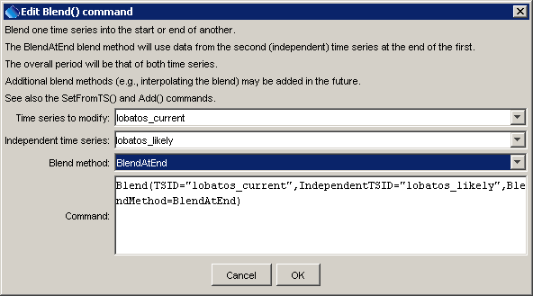

# TSTool / Command / Blend #

*   [Overview](#overview)
*   [Command Editor](#command-editor)
*   [Command Syntax](#command-syntax)
*   [Examples](#examples)
*   [Troubleshooting](#troubleshooting)
*   [See Also](#see-also)

-------------------------

## Overview ##

The `Blend` command blends one time series into another,
extending the first time series period if necessary.
This is typically used for combining time series for a station that has been
renamed or to blend historic and real-time data.
The second (independent time series) will ALWAYS override the first time series.
See also the [`SetFromTS`](../SetFromTS/SetFromTS.md) and [`Add`](../Add/Add.md) commands.
The `Blend` command ensures that single data values are used whereas
[`Add`](../Add/Add.md) will add values if more than one value is available at the same date/time.
The [`SetFromTS`](../SetFromTS/SetFromTS.md) does not extend the period.

## Command Editor ##

The command is available in the following TSTool menu:

*   ***Commands / Manipulate Time Series***

The following dialog is used to edit the command and illustrates the syntax of the command.

**<p style="text-align: center;">

</p>**

**<p style="text-align: center;">
`Blend` Command Editor (<a href="../Blend.png">see also the full-size image</a>)
</p>**

## Command Syntax ##

The command syntax is as follows:

```text
Blend(Parameter="Value",...)
```
**<p style="text-align: center;">
Command Parameters
</p>**

|**Parameter**&nbsp;&nbsp;&nbsp;&nbsp;&nbsp;&nbsp;&nbsp;&nbsp;&nbsp;&nbsp;&nbsp;&nbsp;&nbsp;&nbsp;&nbsp;&nbsp;|**Description**|**Default**&nbsp;&nbsp;&nbsp;&nbsp;&nbsp;&nbsp;&nbsp;&nbsp;&nbsp;&nbsp;&nbsp;&nbsp;&nbsp;&nbsp;&nbsp;&nbsp;&nbsp;&nbsp;&nbsp;&nbsp;&nbsp;&nbsp;&nbsp;&nbsp;&nbsp;&nbsp;&nbsp;|
|--------------|-----------------|-----------------|
|`TSID`<br>**required**|The time series identifier or alias for the time series to be modified.|None – must be specified.|
|`IndependentTSID`<br>**required**|The time series identifier or alias for the time series to be blended to the first time series.|None – must be specified.|
|`BlendMethod`|The method used to blend the data, one of:<ul><li>`BlendAtEnd` - the main time series will have the other time series attached to the end of its period.</li></ul>|None – must be specified.  Currently only `BlendAtEnd` is recognized.|

## Examples ##

See the [automated tests](https://github.com/OpenCDSS/cdss-app-tstool-test/tree/master/test/commands/Blend).

A sample command file to blend two time series from the [State of Colorado’s HydroBase database](../../datastore-ref/CO-HydroBase/CO-HydroBase.md)
is as follows:

```text
# 08236000 - ALAMOSA RIVER ABOVE TERRACE RESERVOIR
08236000.DWR.Streamflow.Month~HydroBase
# 08236500 - ALAMOSA RIVER BELOW TERRACE RESERVOIR
08236500.DWR.Streamflow.Month~HydroBase
Blend(TSID=”08236000.DWR.Streamflow.Month”,IndependentTSID=”08236500.DWR.Streamflow.Month”,BlendMethod=”BlendAtEnd”)
```

## Troubleshooting ##

See the main [TSTool Troubleshooting](../../troubleshooting/troubleshooting.md) documentation.

## See Also ##

*   [`Add`](../Add/Add.md) command
*   [`SelectTimeSeries`](../SelectTimeSeries/SelectTimeSeries.md) command
*   [`SetFromTS`](../SetFromTS/SetFromTS.md) command
