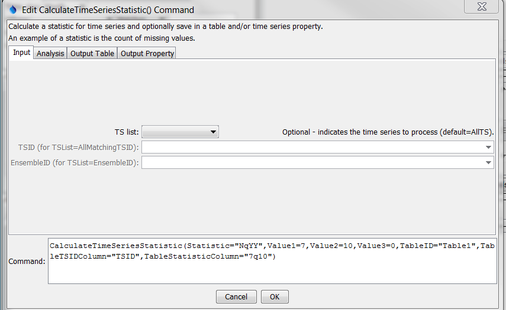
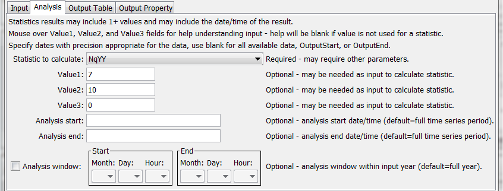
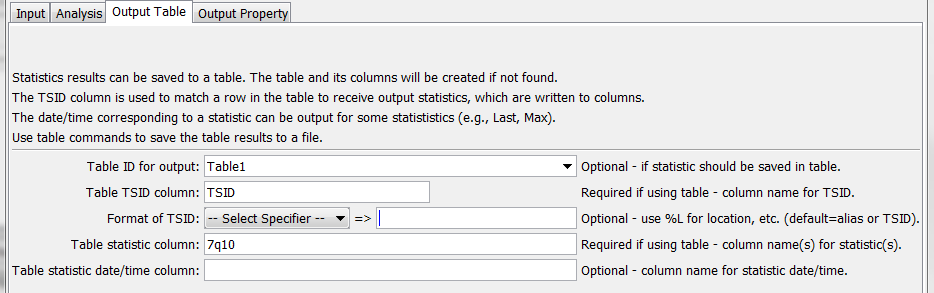
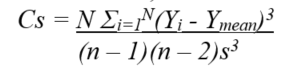

# TSTool / Command / CalculateTimeSeriesStatistic #

* [Overview](#overview)
* [Command Editor](#command-editor)
* [Command Syntax](#command-syntax)
* [Examples](#examples)
* [Troubleshooting](#troubleshooting)
* [See Also](#see-also)

-------------------------

## Overview ##

The `CalculateTimeSeriesStatistic` command calculates a statistic for a time series
(typically a single value, but may have multiple output values such as `TrendOLS`)
and optionally adds the result to a table and/or sets a time series property.
Some statistics, such as `Max` also have date/time.
Multiple time series can be processed.
The sample from each time series consists of data values for the full period
or a shorter analysis period if specified for the command.
Missing values typically are ignored unless significant for the statistic (e.g., `Statistic=MissingCount`).

See the [Statistic Examples](../../examples/examples.md#statistic-examples) for a list of commands that calculate statistics.

## Command Editor ##

The following dialog is used to edit the command and illustrates the command syntax.
Most statistics do not require additional input; however,
those that do utilize the `Value*` parameters to specify additional information.
See the documentation below and move the mouse over the entry fields in the dialog.

**<p style="text-align: center;">

</p>**

**<p style="text-align: center;">
`CalculteTimeSeriesStatistic` Command Editor for Input Parameters (<a href="../CalculateTimeSeriesStatistic.png">see also the full-size image</a>)
</p>**

**<p style="text-align: center;">

</p>**

**<p style="text-align: center;">
`CalculteTimeSeriesStatistic` Command Editor for Analysis Parameters (<a href="../CalculateTimeSeriesStatistic_Analysis.png">see also the full-size image</a>)
</p>**

**<p style="text-align: center;">

</p>**

**<p style="text-align: center;">
`CalculteTimeSeriesStatistic` Command Editor for Output Table Parameters (<a href="../CalculateTimeSeriesStatistic_OutputTable.png">see also the full-size image</a>)
</p>**

**<p style="text-align: center;">

</p>**

**<p style="text-align: center;">
`CalculteTimeSeriesStatistic` Command Editor for Output Property Parameters (<a href="../CalculateTimeSeriesStatistic_OutputProperty.png">see also the full-size image</a>)
</p>**

## Command Syntax ##

The command syntax is as follows:

```text
CalculateTimeSeriesStatistic(Parameter="Value",...)
```

**<p style="text-align: center;">
Command Parameters
</p>**

|**Parameter**&nbsp;&nbsp;&nbsp;&nbsp;&nbsp;&nbsp;&nbsp;&nbsp;&nbsp;&nbsp;&nbsp;&nbsp;&nbsp;&nbsp;&nbsp;&nbsp;&nbsp;&nbsp;&nbsp;&nbsp;&nbsp;&nbsp;&nbsp;&nbsp;&nbsp;&nbsp;&nbsp;&nbsp;&nbsp;&nbsp;&nbsp;&nbsp;&nbsp;&nbsp;&nbsp;&nbsp;&nbsp;&nbsp;&nbsp;&nbsp;&nbsp;&nbsp;&nbsp;|**Description**|**Default**&nbsp;&nbsp;&nbsp;&nbsp;&nbsp;&nbsp;&nbsp;&nbsp;&nbsp;&nbsp;&nbsp;&nbsp;&nbsp;&nbsp;&nbsp;&nbsp;&nbsp;&nbsp;&nbsp;&nbsp;&nbsp;&nbsp;&nbsp;&nbsp;&nbsp;&nbsp;&nbsp;|
|--------------|-----------------|-----------------|
| `TSList` | Indicates the list of time series to be processed, one of:<ul><li>`AllMatchingTSID` – all time series that match the TSID (single TSID or TSID with wildcards).</li><li>`AllTS` – all time series before the command.</li><li>`EnsembleID` – all time series in the ensemble.</li><li>`FirstMatchingTSID` – the first time series that matches the TSID (single TSID or TSID with wildcards).</li><li>`LastMatchingTSID` – the last time series that matches the TSID (single TSID or TSID with wildcards).</li><li>`SelectedTS` – the time series selected with the [SelectTimeSeries](../SelectTimeSeries/SelectTimeSeries.md) command. | `AllTS` |
| `TSID` | The time series identifier or alias for the time series to be processed, using the `*` wildcard character to match multiple time series.  Can be specified with processor `${Property}`. | Required if `TSList=*TSID`. |
| `EnsembleID` | The ensemble to be processed, if processing an ensemble.  Can be specified with processor `${Property}`. | Required if `TSList=EnsembleID`. |
| `Statistic` | Statistic to compute as shown in the **Statistic Details** table below. | None – must be specified. |
| `Value1` | Input data required by the statistic.  Currently the command editor does not check the value for correctness – it is checked when the statistic is computed. | See **Statistic Details** table below. |
| `Value2` | Input data required by the statistic.  Currently the command editor does not check the value for correctness – it is checked when the statistic is computed. | See **Statistic Details** table below. |
| `Value3` | Input data required by the statistic.  Currently the command editor does not check the value for correctness – it is checked when the statistic is computed. | See **Statistic Details** table below. |
| `AnalysisStart` | The date/time to start analyzing data as valid date/time string or `${Property}`. | Full period is analyzed. |
| `AnalysisEnd` | The date/time to end analyzing data as valid date/time string or `${Property}`. | Full period is analyzed. |
| `AnalysisWindowStart` |The calendar date/time for the analysis start within each year.  Specify using the format `MM`, `MM-DD`, `MM-DD hh`, or `MM-DD hh:mm`, consistent with the time series interval precision.  A year of 2000 will be used internally to parse the date/time.  Use this parameter to limit data processing within the year, for example to analyze only a season.   The analysis window has only been enabled for `Count`, `GECount`, `GTCount`, `Last`, `LastNonmissing`, `LECount`, `LTCount`, `Max`, `Min`, `MissingCount`, `MissingPercent`, `NonmissingCount`, and `NonmissingPercent` statistics. | Analyze the full year. |
| `AnalysisWindowEnd` | Specify date/time for the analysis end within each year.  See `AnalysisWindowStart` for details. | Analyze the full year. |
| `TableID` | Identifier for table that receives the statistic.  An existing table can be specified.  If not found, a new table will be created.  Can be specified with processor `${Property}`. | Optional – table output is not required. |
| `TableTSIDColumn` | Table column name that is used to look up the time series.  If a matching TSID is not found, a row will be added to the table.  If a TSID is found, the statistic cell value for the time series is modified.  The column name can use processor `${Property}` and time series `%` specifiers (e.g., `%L` for location) and properties using syntax `${ts:Property}`. | Optional – table output is not required. |
| `TableTSIDFormat` | The specification to format the time series identifier to insert into the TSID column.  Use the format choices and other characters to define a unique identifier. | Time series alias if available, or the time series identifier. |
| `TableStatisticColumn` | Table column name(s) to receive the statistic value(s).  If not found in the table, a new column is added automatically.  The column names can use processor `${Property}` and use time series % specifiers (e.g., `%L` for location) and properties using syntax `${ts:Property}`. | Optional – table output is not required. |
| `TableStatisticDateTimeColumn` | Table name for date/time corresponding to statistic, if available (for example for `Max`). | Date/time not output to table. |
| `TimeSeriesPropertyName` | If specified, the output statistic will be set as a property value for the time series.  In the future, statistics with multiple values will use a variation of the property name. | No property is set. |
| `StatisticValueProperty` | Name of the processor property to set the value of the statistics. | No property is set. |

The following table provides additinal information about specific statistics,
in particular to describe how the statitic is computed,
whether additional input needs to be provided with `Value` command parameters,
and whether multiple statistic values are output in results.

**<p style="text-align: center;">
Statistic Details
</p>**

|**Statistic**&nbsp;&nbsp;&nbsp;&nbsp;&nbsp;&nbsp;&nbsp;&nbsp;&nbsp;&nbsp;&nbsp;&nbsp;&nbsp;&nbsp;&nbsp;&nbsp;&nbsp;&nbsp;&nbsp;&nbsp;&nbsp;&nbsp;&nbsp;&nbsp;&nbsp;&nbsp;&nbsp;&nbsp;&nbsp;&nbsp;&nbsp;&nbsp;&nbsp;&nbsp;&nbsp;&nbsp;&nbsp;&nbsp;&nbsp;&nbsp;|**Description**|**Analysis Window Allowed?**|**Date/Time for Statistic Calculated?**|**Required Values**&nbsp;&nbsp;&nbsp;&nbsp;&nbsp;&nbsp;&nbsp;&nbsp;&nbsp;&nbsp;&nbsp;&nbsp;|
|--------------|-----------------|-----------------|---|---|
| `Count`| Number of data values total, including missing and non-missing. | Yes | | |
| `DeficitMax`| Maximum deficit value (where deficit is mean minus value). | No | | |
| `DeficitMean`| Mean deficit value (where deficit is mean minus value). | No | | |
| `DeficitMin`| Minimum deficit value (where deficit is mean minus value). | No | | |
| `DeficitSeqLengthMax`| Maximum number of sequential intervals where each value is less than the mean (for example maximum drought length). | No | | |
| `DeficitSeqLengthMean`| Mean number of sequential intervals where each value is less than the mean (for example mean drought length). | No | | |
| `DeficitSeqLengthMin`| Minimum number of sequential intervals where each value is less than the mean (for example minimum drought length). | No | | |
| `DeficitSeqMin`| Maximum sum of sequential values where each value is less than the mean (for example maximum drought water volume). | No | | |
| `DeficitSeqMean`| Mean of the sum of sequential values where each value is less than the mean (for example mean drought water volume). | No | | |
| `DeficitSeqMin`| Minimum sum of sequential values where each value is less than the mean (for example minimum drought water volume). | No | | |
| `GECount`| Count of values greater than or equal to `Value1`. | Yes |  | `Value1` – criteria to check |
| `GTCount`| Count of values greater than `Value1`. | Yes | | `Value1` – criteria to check |
| `Lag-1AutoCorrelation` | Autocorrelation between values and the those that follow in the next time step, given by:<br>  | No | | |
| `Last` | Last non-missing or missing value.  Second statistic is the date/time of the value. | Yes | Yes | |
| `LastNonmissing` | Last non-missing value.  Second statistic is the date/time of the value. | Yes | Yes | |
| `LECount` | Count of values less than or equal to `Value1`. |  Yes | | `Value1` – criteria to check |
| `LTCount` | Count of values less than `Value1`. | Yes | | `Value1` – criteria to check |
| `Max` | Maximum value. | Yes | Yes (first) | |
| `Mean` | Mean value. | No | | |
| `Min` | Minimum value. | Yes | Yes (first) | |
| `MissingCount` | Number of missing values. | Yes | | |
| `MissingPercent` | Percent of values that are missing. | Yes | | |
| `MissingSeqLengthMax` | Maximum number of sequential values that are missing. | No | | |
| `NonmissingCount` | Number of non-missing values. | Yes | | |
| `NonmissingPercent` | Percent of values that are not missing. | Yes | | |
| `NqYY` | This statistic is typically used to evaluate the return period of low flows and is implemented only for daily data.  The `N` indicates the number of daily values to be averaged and `YY` indicates the return interval.  For example, `7q10` indicates the flow corresponding to the 10-year recurrence interval for minimum average daily flow (for 7 days) in a year.  This statistic is computed as follows, using `7q10` as an example:<ol><li>Determine the number of years to be analyzed (from analysis period command parameters or time series data).</li><li>For each year, loop through each day from January 1 to December 31.  Compute an average flow by averaging 7 days, in this case with 3 values on each side of the current day and including the current day.  If at the end of the year, use 3 values from adjoining years.  The number of missing data allowed is controlled by the `Value3` command parameter.</li><li>For the year, save the minimum 7-day average.</li><li>Utilize the minimum values for all years, with log-Pearson Type III distribution, to determine the value for the 10-year recurrence interval.  See [http://pubs.usgs.gov/sir/2008/5126/section3.html](http://pubs.usgs.gov/sir/2008/5126/section3.html) for a description of `NqYY` and “Hydrology for Engineers, 3rd Edition,” Linsley, Kohler, Paulhus for a description of log-Pearson Type III distribution.</li></ol> | No |  | `Value1` – specify the number of daily values to be averaged.  Currently this must be an odd number to allow bracketing the current day.<br><br>`Value2` – specify the return interval (e.g., `10`).<br><br>`Value3` – specify the number of missing values allowed in the average (e.g., `0` for most rigorous analysis).  It may be useful to set this value if, for example, a single daily value is available in the time series, for example entered on the first day of the month. |
| `Skew` | Skew coefficient, as follows: <br> where s = standard deviation | No | | |
| `StdDev` | Standard deviation. | No | | |
| `SurplusMin` | Maximum surplus value (where surplus is value minus mean). | No | | |
| `SurplusMean` | Mean surplus value (where surplus is value minus mean). | No | | |
| `SurplusMin` | Minimum surplus value (where surplus is value minus mean). | No | | |
| `SurplusSeqLengthMax` | Maximum number of sequential intervals where each value is greater than the mean (for example maximum water surplus length). | No | | |
| `SurplusSeqLengthMean` | Mean number of sequential intervals where each value is greater than the mean (for example mean water surplus length). | No | | |
| `SurplusSeqLengthMin` | Minimum number of sequential intervals where each value is greater than the mean (for example minimum water surplus length). | No | | |
| `SurplusSeqMin` | Maximum sum of sequential values where each value is greater than the mean (for example maximum water surplus volume). | No | | |
| `SurplusSeqMean` | Mean of the sum of sequential values where each value is greater than the mean (for example mean water surplus volume). | No | | |
| `SurplusSeqMin` | Minimum sum of sequential values where each value is greater than the mean (for example minimum water surplus volume). | No | | |
| `Total` | Total of values. | No | | |
| `TrendOLS` | Ordinary least squares analysis is used to compute results that are named `TableStatisticColumn` with appended `_Intercept`, `_Slope`, and `_R2`. | No | | |
| `Variance` | Variance. | No | | |

## Examples ##

See the [automated tests](https://github.com/OpenCDSS/cdss-app-tstool-test/tree/master/test/regression/commands/general/CalculateTimeSeriesStatistic).

The following example illustrates how to use the command to compute the 7q10 statistic for daily flow:

```
ReadDateValue(Alias=”linsley”,InputFile="Data\linsley.dv")
NewTable(TableID="Table1",Columns="TSID,string;7q10,double")
CalculateTimeSeriesStatistic(Statistic="NqYY",Value1=7,Value2=10,Value3=6,TableID="Table1",TableTSIDColumn="TSID",TableStatisticColumn="7q10")
WriteTableToDelimitedFile(TableID="Table1",OutputFile="Results/Test_CalculateTimeSeriesStatistic_7q10_linsley_out.csv")
```

## Troubleshooting ##

## See Also ##

* [Statistic Examples](../../examples/examples.md#statistic-examples)
* [`CheckTimeSeriesStatistic`](../CheckTimeSeriesStatistic/CheckTimeSeriesStatistic.md) command
