# TSTool / Command / ChangeInterval #

* [Overview](#overview)
* [Command Editor](#command-editor)
* [Command Syntax](#command-syntax)
* [Examples](#examples)
* [Troubleshooting](#troubleshooting)
* [See Also](#see-also)

-------------------------

## Overview ##

The `ChangeInterval` command creates new time series by changing the data interval of each input time series,
in some cases using advanced logic consistent with hydrologic models.

See also the following commands that focus on specific combinations of input and output and are
simpler to use than the `ChangeInterval` command:

* [`ChangeIntervalIrregularToRegular`](../ChangeIntervalIrregularToRegular/ChangeIntervalIrregularToRegular.md) - computes output interval value
from input sample as a statistic

A list of one or more time series or an ensemble of time series can be processed.
The majority of the original header data (e.g., description, units) are copied to the new time series;
however, the new interval will be used for data management and in the new time series identifier.
Time series data values have a time scale of instantaneous, accumulated (e.g., volume), or mean.
Changing the interval also can result in a change in the time scale
(e.g., converting instantaneous values to a mean value).
Currently, the time scale for input and output time series is NOT automatically
determined from the data type and interval and must be specified as `ACCM`, `MEAN`, or `INST`.
Instantaneous values are recorded at the date/time of the value and typically
apply to small intervals (e.g. minute and hour).
For mean and accumulated time series, the date/time for each value is at the end of the interval for which the value applies.

Irregular time series have a date/time precision and a scale appropriate for the data.
For example, irregular minute time series may be used for instantaneous temperature or accumulated precipitation.
Irregular day time series may be used for “instantaneous” reservoir level.
For regular time series, the data intervals must align so that each larger
interval aligns with the end-points of the corresponding smaller intervals
(e.g., the ends of 6-hour intervals align with the daily interval).

The following conversions are currently supported, with a description of the conversion process.
Refer to the command parameter reference for an explanation of parameters.
The conversion from daily and monthly interval to yearly interval (for `ACCM` and `MEAN`) utilizes a simpler algorithm.

### Irregular Time Series to Regular Time Series ###

An irregular time series can be converted to a regular time series.
The ability to change from an irregular or regular time series to an irregular time series currently is not implemented.
Missing data is handled in different ways depending on the old and new time scales.
Each of the follow examples demonstrates how missing data is interpreted.

The following conversion combinations are allowed.

#### Small Interval ACCM to Large Interval ACCM ####

When converting from small interval accumulated data to large interval accumulated data,
values from the old time series are summed for the new interval-ending
date/time from the values in the old intervals prior to this date/time.

The following illustrates the conversion from NHour to NHour (1Hour to 3Hour example):

**<p style="text-align: center;">
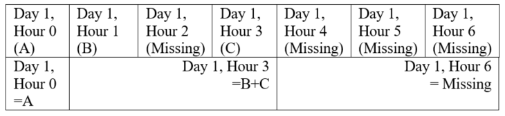
</p>**

#### Large Interval ACCM to Small Interval ACCM ####

When converting from large interval accumulated data to small interval accumulated data,
values from the old time series are equally divided by the number of intervals
prior to this date/time in the new time series since the previous non-missing data.

The following illustrates the conversion from NHour to NHour (3Hour to 1Hour example):

**<p style="text-align: center;">
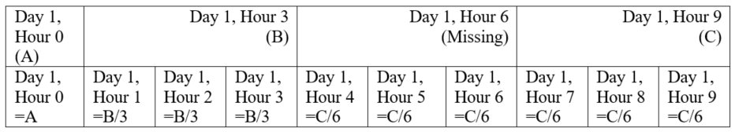
</p>**

#### Small Interval MEAN or INST to Large Interval MEAN ####

When converting from instantaneous or mean data to mean data,
mean values are calculated for the new interval-ending date/time
from the values in the old intervals prior to this date/time.

The following illustrates the conversion from NHour to NHour (1Hour to 3Hour example):

**<p style="text-align: center;">
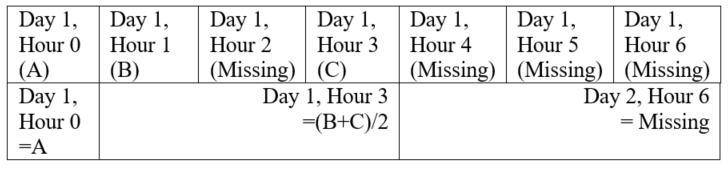
</p>**

#### Large Interval MEAN or INST to Small Interval MEAN ####

When converting from large interval mean or instantaneous data to small interval mean data,
values from the old time series are copied to the new interval-ending date/time time series.

The following illustrates the conversion from NHour to NHour (3Hour to 1Hour example):

**<p style="text-align: center;">
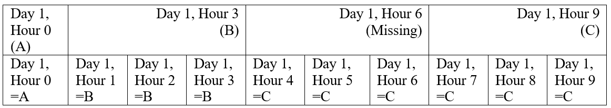
</p>**

#### Small Interval INST to Large Interval INST ####

When converting from small interval instantaneous data to large interval instantaneous data,
the data is copied directly from the old time series when available.
If the data is missing, the most recent previous valid data is used.

The following illustrates the conversion from NHour to NHour (1Hour to 3Hour example):

**<p style="text-align: center;">
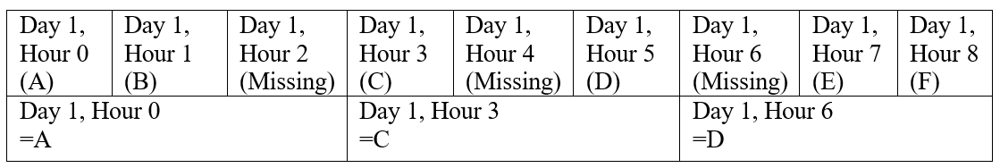
</p>**

#### Large Interval INST to Small Interval INST ####

When converting from large interval instantaneous data to small interval instantaneous data,
values from the old time series are linearly interpolated to calculate values for the new time series.

The following illustrates the conversion from NHour to NHour (3Hour to 1Hour example):

**<p style="text-align: center;">
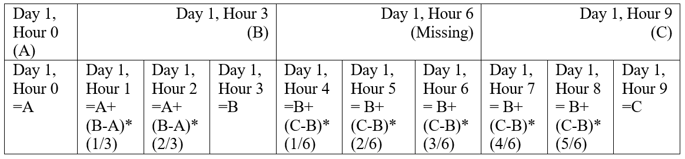
</p>**

### Regular Time Series to Regular Time Series ###

#### ACCM (Accumulation) to ACCM (Accumulation) ####

##### Small Interval ACCM (Accumulation) to Large Interval ACCM (Accumulation) #####

Changing the interval for small interval accumulated data to large interval
accumulated data involves summing the small interval data values for the period that overlaps the large interval.

Accumulated data have a timestamp corresponding to the interval-end for the accumulation.
Conversions involving time intervals that have zero values (e.g., Hour 0, Minute 0) result in a perceived shift
in time because the zero occurs on the boundary between larger intervals.
The following examples illustrate the accumulation for common cases.
In cases where an accumulation jumps over two or more interval categories (e.g., minute to day),
the accumulation occurs as if the two intermediate accumulations occurred in succession.
In the following examples, the general representation is shown first, followed by an example where appropriate.

The following illustrates the conversion from NHour to Day (6Hour to Day example, i equals the hour multiplier):

**<p style="text-align: center;">
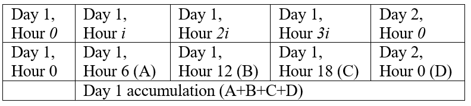
</p>**

The following illustrates the conversion from NDay to Month (example for a month with 30 days):

**<p style="text-align: center;">
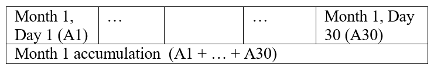
</p>**

##### Large Interval ACCM (Accumulation) to Small Interval ACCM (Accumulation) #####

Changing from large interval accumulation data to small interval mean data involves
dividing each accumulated value by the number of new values for that same period of record.

The following illustrates the conversion from Day to 6Hour (Day to 6Hour example, i equals the hour multiplier):

**<p style="text-align: center;">
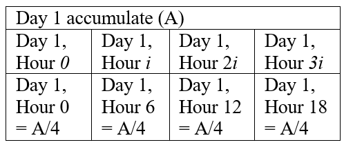
</p>**

#### ACCM (Accumulation) to INST (Instantaneous) ####

Accumulated to instantaneous is not currently supported.

#### ACCM (Accumulation) to MEAN ####

##### Small Interval ACCM to Large Interval MEAN #####

See Small Interval INST (Instantaneous) to Large Interval MEAN.

##### Interval ACCM to Same Interval MEAN #####

Changing the interval from accumulation data to the same interval mean data
involves copying the data from the old time series to the new time series (no changes to date values occur).

The following illustrates the conversion from 6Hour to 6Hour (6Hour to 6Hour example, i equals the hour multiplier):

**<p style="text-align: center;">

</p>**

##### Large Interval ACCM to Small Interval MEAN #####

See Large Interval ACCM to Small Interval ACCM.

#### INST (Instantaneous) to INST (Instantaneous) ####

##### Small Interval INST (Instantaneous) to Large Interval INST (Instantaneous) #####

Changing the interval for small interval instantaneous data to large interval instantaneous
data involves assigning each date in the new time series a value from the
corresponding date in the old time series.
The `HandleMissingInputHow` parameter indicates how to interpret a missing value in the old time series.
`HandleMissingInputHow=KeepMissing` will simply assign a missing value for that date/time.
`HandleMissingInputHow=SetToZero` will set the value to 0.
Repeat fills the date with data from the last non-missing value.
Interpolation and using a non-missing future value may be added in the future.

A special case is the ability to compute a statistic from the sample of values
from the input time series, using the Statistic parameter.
For example, instantaneous 5 minute temperature data can be converted to 1 day maximum values.
In this case, each 1 day sample of values from the input time series is used to compute the statistic.
The initial handling of missing data described above is supported and
additionally the `AllowMissingCount` parameter is recognized to control computation of the statistic.

The following illustrates the conversion from NHour to Day (6Hour to Day example where `HandleMissingInputHow=Repeat`, i equals the hour multiplier):

**<p style="text-align: center;">
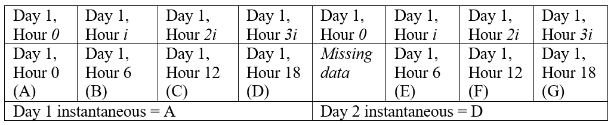
</p>**

##### Large Interval INST (Instantaneous) to Small Interval INST (Instantaneous) #####

Small interval instantaneous data is created from larger interval instantaneous data by
linearly interpolating between the previous and current large interval data to fill
each value in the new time series during that same period of time.
If the value in the old time series is missing,
the method specified by the user in the `HandleMissingInputHow` parameter is used.

The following illustrates the conversion from Day to NHour (Day to 6Hour example, *i* equals the hour multiplier):

**<p style="text-align: center;">
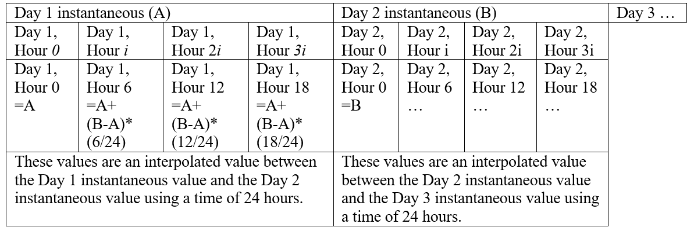
</p>**

These values are an interpolated value between the Day 1 instantaneous
value and the Day 2 instantaneous value using a time of 24 hours.
These values are an interpolated value between the Day 2 instantaneous
value and the Day 3 instantaneous value using a time of 24 hours.

In the future, the ability to repeat input values may be added.

#### INST (Instantaneous) to ACCM (Accumulation) ####

Instantaneous to accumulated is not currently supported.

#### INST (Instantaneous) to MEAN ####

##### Small Interval INST (Instantaneous) to Large Interval MEAN #####

Changing from small interval instantaneous data to large interval mean data
involves adding together all the values from the small interval time series
over the larger interval for the corresponding time period and then
dividing by the number of data values used within this calculation.
As in other conversions, `HandleMissingInputHow` is first used to interpret missing data.
If `HandleEndpointHow=AverageEndpoints`, the values at each end of the interval are
averaged for minute and hour inputs (the parameter does not apply to day, month or year input).

The following illustrates the conversion from NHour to Day
(6Hour to Day example with `HandleEndpointHow=IncludeFirstOnly`, *i* equals the hour multiplier):

**<p style="text-align: center;">
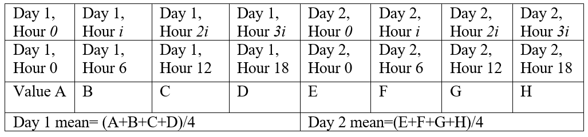
</p>**

The following illustrates the conversion from NHour to Day (6Hour to Day example with
`HandleEndpointHow=AverageEndpoints`, *i* equals the hour multiplier):

**<p style="text-align: center;">
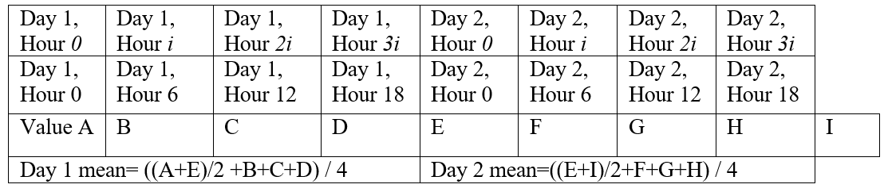
</p>**

##### Interval INST (Instantaneous) to Same Interval MEAN #####

If `OutputFillMethod=Interpolate`, see Large Interval INST (Instantaneous) to Small Interval INST (Instantaneous).
Otherwise, the values are duplicated from the old time series directly to the new time series.

The following illustrates the conversion from 6Hour to 6Hour
(6Hour to 6Hour example with `OutputFillMethod=Repeat`, *i* equals the hour multiplier):

**<p style="text-align: center;">
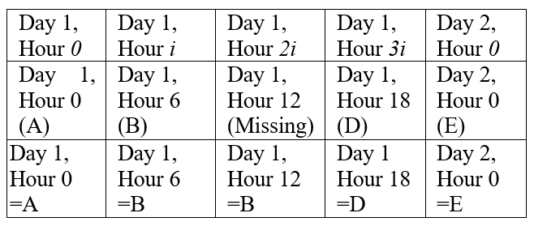
</p>**

##### Large Interval INST (Instantaneous) to Small Interval MEAN #####

If the `OutputFillMethod=Interpolate`, see Large Interval INST (Instantaneous) to Small Interval INST (Instantaneous).
The time series are handled in the same way.
Otherwise, the values are duplicated from the old time series directly to the new time series.

The following illustrates the conversion from Day to 6Hour (Day to 6Hour example
with `OutputFillMethod=Repeat`, i equals the hour multiplier):

**<p style="text-align: center;">
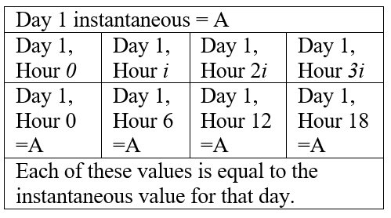
</p>**

Each of these values is equal to the instantaneous value for that day.

#### MEAN to MEAN ####

##### Small Interval MEAN to Large Interval MEAN #####

See Small Interval INST (Instantaneous) to Large Interval MEAN.

##### Large Interval MEAN to Small Interval MEAN #####

Changing from large interval mean data to small interval mean data involves
copying values from the old time series into the new time series for that same period of record.

The following illustrates the conversion from Month to Day (Example for a month with 30):

**<p style="text-align: center;">
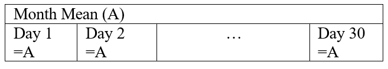
</p>**

#### MEAN to ACCM (Accumulation) ####

##### Small Interval MEAN to Large Interval ACCM (Accumulation) #####

See Small Interval INST (Instantaneous) to Large Interval MEAN.

##### Interval MEAN to Same Interval ACCM (Accumulation) #####

See Interval ACCM to Same Interval MEAN.

##### Large Interval MEAN to Small Interval ACCM (Accumulation) #####

See Large Interval ACCM to Small Interval ACCM.

#### MEAN to INST (Instantaneous) ####

##### Small Interval MEAN to Large Interval INST (Instantaneous) #####

Not currently supported.

##### Interval MEAN to Same Interval INST (Instantaneous) #####

Not currently supported.  The data can be treated equivalently by most commands.

##### Large Interval MEAN to Small Interval INST (Instantaneous) #####

Changing the interval for large interval mean to small interval instantaneous data
involves calculating a value for each new interval based on trends found in the mean data.
This approach has been adapted from the National Weather Service River Forecast System (NWSRFS) CHANGE-T operation
(see [http://www.nws.noaa.gov/oh/hrl/nwsrfs/users_manual/part5/_pdf/533changet.pdf](http://www.nws.noaa.gov/oh/hrl/nwsrfs/users_manual/part5/_pdf/533changet.pdf).
The following example demonstrates how the data is converted from the old interval to the new interval.
A general representation is shown first followed by an example.

The following illustrates the conversion from Day to NHour (Day to 6Hour example, i equals the hour multiplier):

**<p style="text-align: center;">
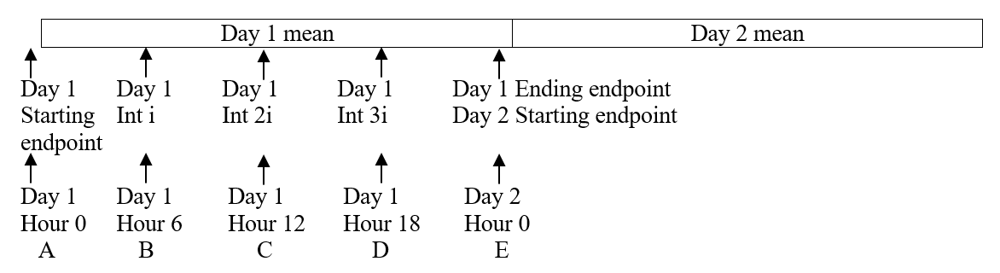
</p>**

In computing instantaneous values, the volume of the original mean time series needs to be maintained.
However, the value of the instantaneous endpoints affects the calculated mean value for the previous
and subsequent long intervals, since the mean over a longer interval uses both endpoints in its calculation.
In the above example, *Averagenew Day 1 = ((A+E)/2 +B+C+D) / 4*

As a result, an iterative technique is required to adjust the initially computed instantaneous values
to produce a time series with a volume that is within a specified tolerance of the input mean volume for each time step.
The following paragraphs describe how the initial instantaneous time series values are computed, followed by a description of the volume adjustment.

### Initial Instantaneous Time Series Calculations ###

Prior to converting from a large interval mean to small interval instantaneous,
special cases are handled associated with missing data:

* Missing data is initially converted using the method specified by the user in the `HandleMissingInputHow` parameter.
* If the current input value is still missing, the instantaneous time series is
also filled with missing data for each interval that falls in the larger interval.
* If the previous or next mean values are missing, the current mean value
for that interval is copied directly to the instantaneous time series.

The output instantaneous values for each input interval are computed using the current, next, and previous mean values.
All three values are useful because together they indicate whether the current
value is part of a continuous rise or fall, a peak or trough or simply a continuation of a steady value.
These conditions are illustrated in the following figure.

**<p style="text-align: center;">
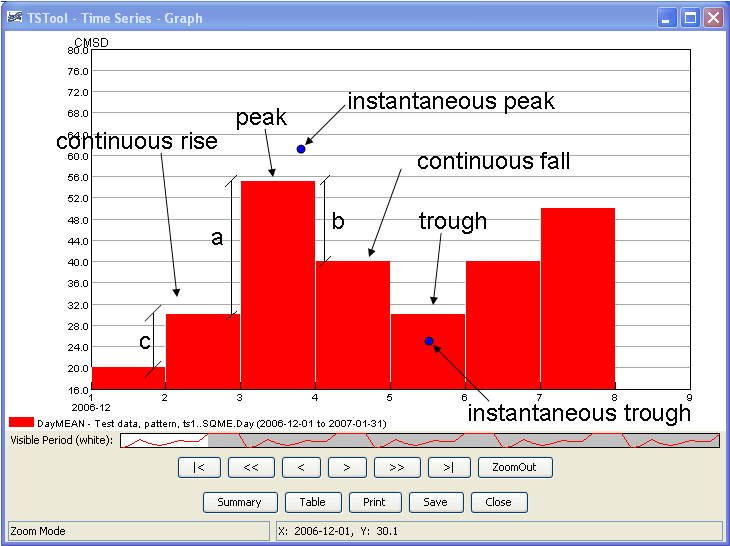
</p>**

**<p style="text-align: center;">
Mean data illustration
</p>**

* The first condition that may exist is a peak or trough.
A peak exists when the current value is greater than the previous and next values.
A trough is when the current value is less than the next and previous values.
	1. In this case, an instantaneous peak (or trough) is calculated.
	Referring to the above illustration, the magnitude of the peak is
	calculated by adding (or subtracting for a trough) *1/4 x (a+b)/2* to the current mean.
	2. The time of the instantaneous peak is initially set to the start date/time
	of the current interval then shifted forward in time using the following calculation.
	The number of instantaneous intervals per larger interval is multiplied by *b/(a+b)*.
	That result is added to the start date/time.
	The time of the instantaneous peak will not necessarily correspond to the output interval.
	3. The value for the starting endpoint of the interval is set to the current value minus *1/4 a*.
	4. The value for the ending endpoint of the interval is set to the current value minus *1/4 b*.
	5. The remaining intermediate instantaneous values for the interval are
	linearly interpolated between the peak (or trough) and both endpoints.
* The second condition that may exist is a continuous rise or fall.
A continuous rise or fall exists when the current value is between the previous and next values.
	1. In the case of a continuous rise, the starting endpoint of the interval is set to the current value minus *1/4 c* (again using the above illustration).
	In the case of a continuous fall, *1/4 c* is added to the current value.
	2. The ending endpoint of the interval of a continuous rise is set to the current value plus *1/4 c* (minus *1/4 c* for a continuous fall)
	3. The remaining intermediate instantaneous values are calculated based on the following.
		1. The difference between the starting and ending endpoints is computed.
		2. The values *c* and *a* are calculated.
		The ratio of mean differences is computed: If *c > a*, the mean *ratio = c / a*. If *a > c*, the mean *ratio = a / c*.
		3. If *c* is less than *a*, then the intermediate instantaneous values are computed by adding
		small but increasing increments to the starting endpoint until the last point of the interval is reached.
		If *a* is less than *c* then the output values are computed by subtracting small
		but increasing increments to the last endpoint until the first point of the interval is reached.
		For intermediate interval n from the appropriate endpoint:
		*Incrementn = (1/([number intervals] – n) * [endpoint difference] * [mean ratio])*

### Instantaneous Time Series Volume Adjustment ###

After the instantaneous values are estimated using the above set of rules,
they are adjusted so that the volume over each interval is within a specified tolerance of the input mean volume for each time step.
This tolerance is specified with the `Tolerance` parameter.
The volume calculation for each interval uses the average of the first and last endpoint.

For each time step of the original mean time series, the error of each original interval is computed as:

*([mean of current instantaneous values] – [original mean]) / [original mean]*

If this volume error is within the tolerance, no adjustment is made for that time interval.
If the error is larger than the tolerance, the ratio: *[original mean] / [mean of current instantaneous values]* is computed.
For the intermediate instantaneous values, the instantaneous values are adjusted by multiplying each value by this ratio.
For the instantaneous endpoint values,
since these values affect the mean value of the current and the previous or following time intervals,
the endpoint values are not adjusted to the above calculated ratio.
Instead, the new endpoint value is computed as the average of the original
endpoint value and the original endpoint value multiplied by the above ratio.

The volume error is checked for each original time step.
If any adjustments were made, the process is repeated, up to 15 iterations.
If the adjustment technique cannot adjust the instantaneous time series such that the
corresponding mean volume is within the specified tolerance of
the input mean volume within 15 iterations, a warning will be written to the log file.

## Command Editor ##

The following dialog is used to edit the command and illustrates the syntax for the command.
This example is converting a monthly volume time series to annual water year (October to September) volumes.

**<p style="text-align: center;">
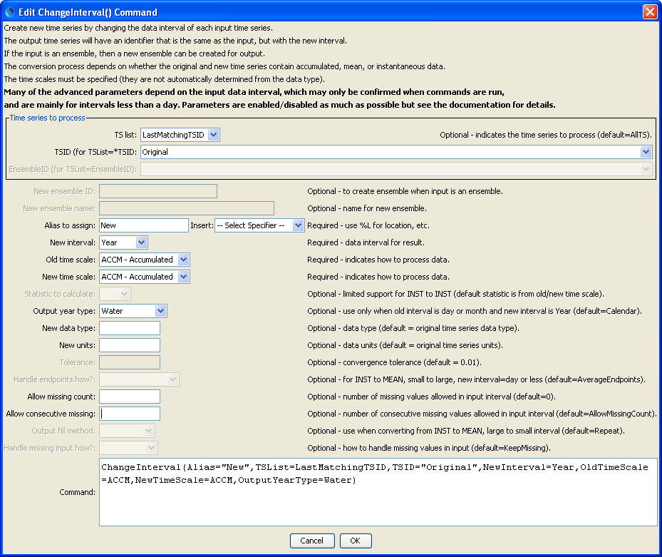
</p>**

**<p style="text-align: center;">
`ChangeInterval` Command Editor (<a href="../ChangeInterval.png">see also the full-size image</a>)
</p>**

## Command Syntax ##

The command syntax is as follows:

```
ChangeInterval(Parameter=Value,...)
```

The following older command syntax is updated to the above syntax when a command file is read:

```
TS Alias = ChangeInterval(Parameter=Value,...)
```

**<p style="text-align: center;">
Command Parameters
</p>**

|**Parameter**&nbsp;&nbsp;&nbsp;&nbsp;&nbsp;&nbsp;&nbsp;&nbsp;&nbsp;&nbsp;&nbsp;&nbsp;&nbsp;&nbsp;&nbsp;&nbsp;&nbsp;&nbsp;&nbsp;&nbsp;&nbsp;&nbsp;&nbsp;&nbsp;&nbsp;&nbsp;&nbsp;&nbsp;&nbsp;&nbsp;&nbsp;|**Description**|**Default**&nbsp;&nbsp;&nbsp;&nbsp;&nbsp;&nbsp;&nbsp;&nbsp;&nbsp;&nbsp;&nbsp;&nbsp;&nbsp;&nbsp;&nbsp;&nbsp;&nbsp;&nbsp;&nbsp;&nbsp;&nbsp;&nbsp;&nbsp;&nbsp;&nbsp;&nbsp;&nbsp;|
|--------------|-----------------|-----------------|
| `TSList` | Indicates the list of time series to be processed, one of:<ul><li>`AllMatchingTSID` – all time series that match the TSID (single TSID or TSID with wildcards)</li><li>`AllTS` – all time series generated before the command</li><li>`EnsembleID` – all time series in the ensemble</li><li>`FirstMatchingTSID` – the first time series that matches the TSID (single TSID or TSID with wildcards)</li><li>`LastMatchingTSID` – the last time series that matches the TSID (single TSID or TSID with wildcards)</li><li>`SelectedTS` – the time series selected with the [`SelectTimeSeries`](../SelectTimeSeries/SelectTimeSeries.md) command</li></ul> | `AllTS` |
| `TSID` | The time series identifier or alias for the time series to be processed, using the `*` wildcard character to match multiple time series.  Can be specified using processor ${Property}. | Required if `TSList=*TSID`. |
| `EnsembleID` | The ensemble to be processed, if processing an ensemble.  Can be specified using processor `${Property}`. | Required if `TSList=EnsembleID`. |
| `Alias` | The alias to assign to the time series, as a literal string or using the special formatting characters listed by the command editor.  The alias is a short identifier used by other commands to locate time series for processing, as an alternative to the time series identifier (TSID). | None – must be specified. |
| `NewInterval` | The data interval for the new time series, from the provided choices.  For example:  `6Hour`, `Day`, `Month`, `Year`. | None – must be specified. |
| `OldTimeScale` | The time scale for the original time series, one of:<ul><li>`ACCM` – accumulated data</li><li>`INST` – instantaneous data</li><li>`MEAN` – mean data</li><br>In the future, this parameter may be made optional if the time scale can be determined from the data type. | None – must be specified. |
| `NewTimeScale` | The time scale for the new time series (see `OldTimeScale` for possible values).  In the future, this parameter may be made optional if the time scale can be determined from the data type. | None – must be specified. |
| `Statistic` | Used in the case where `INST` (small interval) to `INST` (large interval) conversion is occurring.  A sample of values from the input time series, corresponding to the output interval, is determined and used to compute a statistic instead of a simple value transfer.  Statistics that are currently supported are `MAX` and `MIN`.  The `HandleMissingInputHow` parameter is initially used to adjust missing data and then the `AllowMissingCount` parameter is used to check whether the statistic can be computed. | The statistic is determined from the old and new time scales. |
| `OutputYearType` | The output year type if the output time series has an interval of Year.  The output year type can only be specified for input time series having an interval of `Day` or `Month` and the output can have a time scale of `ACCM` (sum the input values) or `MEAN` (average the input values).  The `AllowMissingCount` and `AllowMissingConsecutive` parameters are recognized. | `Calendar` |
| `NewDataType` | The data type for the new time series.  This will be set in the identifier of the new time series. | Use the data type from the original time series. |
| `NewUnits` | The units for the new time series.  This will be set in the identifier of the new time series. | Use the units from the original time series. |
| `Tolerance` | Currently used when converting large interval `MEAN` data to small interval `INST` data.  After the new time series is created, the volume of the new time series over each old interval is compared to the old time series for that same interval.  If the difference between the two is outside the specified tolerance percentage, then each value in the new time series is adjusted so the totals will match.  The endpoints are averaged for this comparison.  Additionally, when the adjustment is made, the new starting value is averaged with the ending value of the previous interval so that the previous interval is not overly affected by this calculation. | `0.01` |
| `HandleEndpointsHow` | Indicates how endpoints should be handled when changing from `INST` to `MEAN`, small interval to larger interval (daily output or finer), one of:<ul><li>`AverageEndpoints` – use both endpoint values for new single value</li><li>`IncludeFirstOnly` – only use earlier endpoint</li></ul> | `AverageEndpoints` |
| `AllowMissingCount` | The number of missing values allowed in the input interval in order to produce a result.  For example, if converting daily data to monthly, a value of `5` would allow <= 5 missing daily values and still compute the result.  This capability should be used with care because it may result in data that are not representative of actual conditions.  This parameter is considered after the `HandleMissingHow` parameter. | `0` – do not allow any missing data in the source data when computing a result. |
| `AllowMissingConsecutive` | The number of consecutive missing values allowed in the input interval in order to produce a result.  For example, if converting daily data to monthly, a value of 3 would allow <= 3 consecutive missing daily values and still compute the result.  The value must be less than or equal to `AllowMissingCount`.  This parameter is considered after the `HandleMissingHow` parameter. | If not specified, the default for the number of allowed consecutive missing values is set to `AllowMissingCount`. |
| `OutputFillMethod` | Use to fill output when converting from `INST` to `MEAN`, large interval time series to small interval time series, one of:<ul><li>`Interpolate` – linearly interpolate</li><li>`Repeat` – repeat values for the output</li></ul> | `Repeat` |
| `HandleMissingInputHow` | Indicate how to handle missing values in input, one of:<ul><li>`KeepMissing` – leave data missing</li><li>`Repeat` – repeat last non-missing value</li><li>`SetToZero` – set values to `0`</li></ul><br>The missing data is handled on input and the replacement value, if any, is applied to input and used for calculations just as if it was the actual value.  The following cases do not use this parameter:<ul><li>Irregular data</li><li>Day and Month input converted to `ACCM` and `MEAN`</li></ul>. | `KeepMissing` |

## Examples ##

See the [automated tests](https://github.com/OpenCDSS/cdss-app-tstool-test/tree/master/test/regression/commands/general/ChangeInterval).

Several example command files follow.  The following commands creates a Day `ACCM` time series from a Month `ACCM` time series:

```
0109.NOAA.Precip.Day~HydroBase
ChangeInterval(Alias=”0109Month”,TSList=AllMatchingTSID,TSID="0109.NOAA.Precip.Day",NewInterval=Month,OldTimeScale=ACCM,NewTimeScale=ACCM)
```

The following commands create a 6Hour `INST` time series from a Day `MEAN` time series:

```
NewPatternTimeSeries(Alias=”DayMEAN”,NewTSID="ts1..SQME.Day",Description="Test data",SetStart="2006-12-01",SetEnd="2007-01-31",Units="CMSD",PatternValues="20,30,55,40,30,40,50,45,45,80,80,80,80")
ChangeInterval(Alias=”6HourINST”,TSID="DayMEAN",NewInterval=6Hour,OldTimeScale=MEAN,NewTimeScale=INST,NewDataType=CMS)
```

The following commands create a Day `MEAN` time series from a 6Hour `INST` time series:

```
NewPatternTimeSeries(Alias=”6HourInst”,NewTSID="ts2..Flow.6Hour",IrregularInterval=6Hour,Description="Test data",SetStart="2006-12-15 12",SetEnd="2007-01-29 00",Units="CFS",PatternValues="20,23,56,62,35,42")
ChangeInterval(Alias=”DayMean2”,TSID="6HourInst",NewInterval=Day,OldTimeScale=INST,NewTimeScale=MEAN,HandleEndpointsHow=IncludeFirstOnly)
```

The following commands create a 3Hour `INST` time series from an Irregular (1Hour) `INST` time series:

```
NewPatternTimeSeries(Alias=”IrregularINST”,NewTSID="ts1..Temp.Irregular",IrregularInterval=1Hour,Description="Test data",SetStart="2006-12-15 00",SetEnd="2007-01-31 23",Units="DEGF",PatternValues="20,23,-999,45,-999,-999,56,62,0,-3")
ChangeInterval(Alias=”3HourINST”,TSID="IrregularINST",NewInterval=3Hour,OldTimeScale=INST,NewTimeScale=INST)
```

## Troubleshooting ##

## See Also ##

* [Statistic Examples](../../examples/examples.md#statistic-examples)
* [`ChangeIntervalIrregularToRegular`](../ChangeIntervalIrregularToRegular/ChangeIntervalIrregularToRegular.md) command
