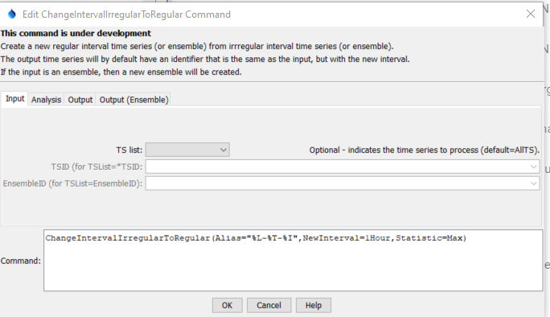
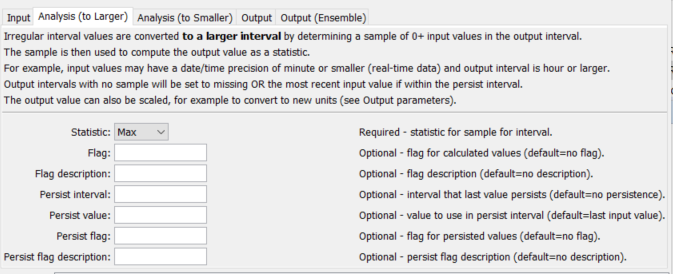
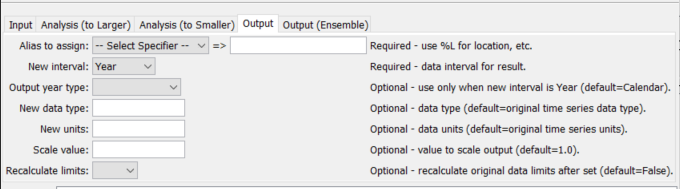
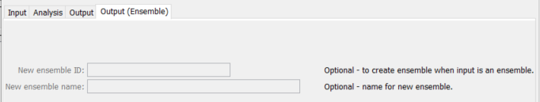

# TSTool / Command / ChangeIntervalIrregularToRegular #

*   [Overview](#overview)
*   [Command Editor](#command-editor)
*   [Command Syntax](#command-syntax)
*   [Examples](#examples)
*   [Troubleshooting](#troubleshooting)
*   [See Also](#see-also)

-------------------------

## Overview ##

The `ChangeIntervalIrregularToRegular` command creates a new regular interval time series (or ensemble)
from an irregular interval time series (or ensemble).
**This command is under development and is intended to provide a simpler subset of functionality
compared to the more complicated [`ChangeInterval`](../ChangeInterval/ChangeInterval.md) command,
which was developed for advanced hydrologic data processing but can be complicated to use.**

A list of one or more time series or an ensemble of time series can be processed.
The majority of the original header data (e.g., description, units) are copied to the new time series;
however, the new interval will be used in the new time series identifier.

Irregular interval time series with interval `Irreg` or `Irregular` rely on the date/time precision
indicated by the date/times from the original data source.
Irregular interval time series with interval `IrregMinute`, for example, should have date/times with
precision minute.

Time zone in input irregular time series is ignored for processing.
Any time zone shift necessary to ensure that days align at midnight must occur prior
to this command.

### Example:  Real-time to 1Hour for Event-Focused Data Management System ###

An event-focused data management system collects data at periodic regular intervals
(e.g., every 12 hours) and when an event occurs that results in changing data values.
Conversion of real-time irregular interval data to larger regular interval is as follows,
using second-precision input and 1Hour output as an example, with `Statistic=Mean`.
In the following diagram, `(1)`, `(2)`, `(3)`, and `(4)` indicate sensor measurements.

```
       |                          PersistInterval=1Hour                                 |
       |                      /--------------------------/   |                          |
      (1)      (2)    (3)    (4)  |                          |                          |
       |                          |                          |                          |
  YYYY-MM-DD 00            YYYY-MM-DD 01              YYYY-MM-DD 02              YYYY-MM-DD 03
```

1.  For interval ending `YYYY-MM-DD 01`:
    1.  The sample is determined as data values `2`, `3`, and `4`.
        The sample does not include value `1` because the output interval spans the time:
        `> YYYY-MM-DD 00` and `<= YYYY-MM-DD 01`
    2.  The output value is computed as the mean of values `1`, `2`, and `3`.
2.  For interval ending `YYYY-MM-DD 02`:
    1.  The sample has no values.
    2.  However, because the `PersistInterval` is `1Hour`,
        the last value `4` within the `PersistInterval` is used as the single sample value
        and in this case is also the mean value.
        If `PersistValue=0`, then an input value of `0` would be used,
        which is suitable for data types such as precipitation increment.
3.  For interval ending `YYYY-MM-DD 03`:
    1.  The sample has no values.
    2.  The output value is missing since a value cannot be determined from
        the sample or `PersistInterval`.

## Command Editor ##

The command is available in the following TSTool menu:

*   ***Commands / Create Time Series***

The following dialog is used to edit the command and illustrates the syntax for the command.

**<p style="text-align: center;">

</p>**

**<p style="text-align: center;">
`ChangeIntervalIrregularToRegular` Command Editor for Input Parameters (<a href="../ChangeIntervalIrregularToRegular.png">see also the full-size image</a>)
</p>**

**<p style="text-align: center;">

</p>**

**<p style="text-align: center;">
`ChangeIntervalIrregularToRegular` Command Editor for Analysis (to Larger) Parameters (<a href="../ChangeIntervalIrregularToRegular_AnalysisLarger.png">see also the full-size image</a>)
</p>**

**<p style="text-align: center;">

</p>**

**<p style="text-align: center;">
`ChangeIntervalIrregularToRegular` Command Editor for Analysis (to Smaller) Parameters (<a href="../ChangeIntervalIrregularToRegular_AnalysisSmaller.png">see also the full-size image</a>)
</p>**

**<p style="text-align: center;">

</p>**

**<p style="text-align: center;">
`ChangeIntervalIrregularToRegular` Command Editor for Output Parameters (<a href="../ChangeIntervalIrregularToRegular_Output.png">see also the full-size image</a>)
</p>**

**<p style="text-align: center;">

</p>**

**<p style="text-align: center;">
`ChangeIntervalIrregularToRegular` Command Editor for Ensemble Output Parameters (<a href="../ChangeIntervalIrregularToRegular_EnsOutput.png">see also the full-size image</a>)
</p>**

## Command Syntax ##

The command syntax is as follows:

```
ChangeIntervalIrregularToRegular(Parameter=Value,...)
```

**<p style="text-align: center;">
Command Parameters
</p>**

|**Parameter Group**|**Parameter**&nbsp;&nbsp;&nbsp;&nbsp;&nbsp;&nbsp;&nbsp;&nbsp;&nbsp;&nbsp;&nbsp;&nbsp;&nbsp;&nbsp;&nbsp;&nbsp;&nbsp;&nbsp;&nbsp;&nbsp;&nbsp;&nbsp;&nbsp;&nbsp;&nbsp;&nbsp;&nbsp;&nbsp;&nbsp;&nbsp;&nbsp; | **Description**|**Default**&nbsp;&nbsp;&nbsp;&nbsp;&nbsp;&nbsp;&nbsp;&nbsp;&nbsp;&nbsp;&nbsp;&nbsp;&nbsp;&nbsp;&nbsp;&nbsp;&nbsp;&nbsp;&nbsp;&nbsp;&nbsp;&nbsp;&nbsp;&nbsp;&nbsp;&nbsp;&nbsp;|
|--------------|-----------------|-----------------|--|
| Input | `TSList` | Indicates the list of time series to be processed, one of:<ul><li>`AllMatchingTSID` – all time series that match the TSID (single TSID or TSID with wildcards)</li><li>`AllTS` – all time series generated before the command</li><li>`EnsembleID` – all time series in the ensemble</li><li>`FirstMatchingTSID` – the first time series that matches the TSID (single TSID or TSID with wildcards)</li><li>`LastMatchingTSID` – the last time series that matches the TSID (single TSID or TSID with wildcards)</li><li>`SelectedTS` – the time series selected with the [`SelectTimeSeries`](../SelectTimeSeries/SelectTimeSeries.md) command</li></ul> | `AllTS` |
| Input | `TSID` | The time series identifier or alias for the time series to be processed, using the `*` wildcard character to match multiple time series.  Can be specified using processor ${Property}. | Required if `TSList=*TSID`. |
| Input | `EnsembleID` | The ensemble to be processed, if processing an ensemble.  Can be specified using processor `${Property}`. | Required if `TSList=EnsembleID`. |
| Analysis (to Larger)<br> | `Statistic`<br>**required** | Statistic to compute to convert sample of input time series values to output value, when converting smaller date/time precision units to larger interval.  See the table below for supported statistics. | None - must be specified. |
| Analysis (to Larger)<br> | `Flag`<br> | Flag to use for values that are calculated. | Flag won't be set. |
| Analysis (to Larger)<br> | `FlagDescription`<br> | Description for `Flag`. | |
| Analysis (to Larger)| `PersistInterval` | The interval after a non-missing value within which the value can be used to fill output values.  This is used in data collection systems where data values are available only for periodic regular reports (e.g., every 12 hours) and when an event is occurring. Specify using an interval string consistent with time series identifier data interval, such as `15Minute`, `1Hour`, `Day`, `Month`, or `Year`.  The `PersistInterval` is added to the last observation time and is considered as the input data value if the resulting date/time is within the output interval.| Data do not persist past actual observations. |
| Analysis (to Larger)| `PersistValue` | The value to use in the `PersistInterval` when no sample values are found.  For example specify `0` for precipitation increment time series (otherwise the last precipitation increment will be erroneously used). | Last input time series value. |
| Analysis (to Larger)<br> | `PersistFlag`<br> | Flag to use for values that are set in the `PersistInterval`. | Flag won't be set. |
| Analysis (to Larger)<br> | `PersistFlagDescription`<br> | Description for `PersistFlag`. | |
| Analysis (to Smaller)| `SampleMethod` | This parameter is envisioned for the future and would indicate how to determine the smaller interval output from irregular interval values for larger date/time units. **Not currently implemented.** | |
| Output | `Alias`<br>**required** | The alias to assign to the time series, as a literal string or using the special formatting characters listed by the command editor.  The alias is a short identifier used by other commands to locate time series for processing, as an alternative to the time series identifier (TSID). | None – must be specified. |
| Output | `NewInterval`<br>**required** | The data interval for the new time series, from the provided choices.  For example:  `6Hour`, `Day`, `Month`, `Year`. | None – must be specified. |
| Output | `OutputYearType` | The output year type if the output time series has an interval of `Year`. | `Calendar` |
| Output | `NewDataType` | The data type for the new time series.  This will be set in the identifier of the new time series. | Use the data type from the original time series. |
| Output | `NewUnits` | The units for the new time series.  This will be set in the identifier of the new time series. | Use the units from the original time series. |
| Output | `ScaleValue` | Value to scale output values, used to convert units. | Do not scale output values. |
| Output | `OutputStart` | Start date/time for output time series.  **Not yet implemented.**. | Determine from input time series. |
| Output | `OutputEnd` | End date/time for output time series.  **Not yet implemented.**. | Determine from input time series. |
| Output | `RecalcLimits` | Whether to recalculate the time series limits. | Do not scale output values. |
| Output (Ensemble) | `NewEnsembleID` | New ensemble identifier, if processing an input ensemble. |  |
| Output (Ensemble) | `NewEnsembleName` | New ensemble name, if processing an input ensemble. |  |

The following statistics can be used to compute the interval data using the `Statistic` parameter.

**<p style="text-align: center;">
Supported Statistics
</p>**

| **Statistic** | **Description** |
| -- | -- |
| `Max` | Maximum of sample values. |
| `Mean` | Mean of sample values. |
| `Median` | Median of sample values. |
| `Min` | Minimum of sample values. |

## Examples ##

See the [automated tests](https://github.com/OpenCDSS/cdss-app-tstool-test/tree/master/test/commands/ChangeIntervalIrregularToRegular).

## Troubleshooting ##

## See Also ##

*   [`ChangeInterval`](../ChangeInterval/ChangeInterval.md) command
