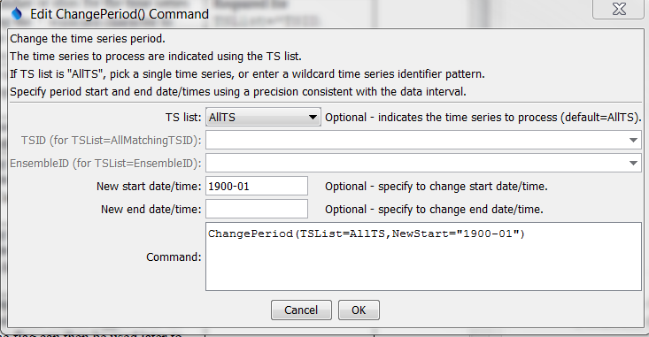

# TSTool / Command / ChangePeriod #

* [Overview](#overview)
* [Command Editor](#command-editor)
* [Command Syntax](#command-syntax)
* [Examples](#examples)
* [Troubleshooting](#troubleshooting)
* [See Also](#see-also)

-------------------------

## Overview ##

The `ChangePeriod` command changes the period for the given time series,
for example to extend the time series.  A longer period will be filled with missing values.

## Command Editor ##

The following dialog is used to edit the command and illustrates the syntax of the command.
<a href="../ChangePeriod.png">See also the full-size image.</a>



**<p style="text-align: center;">
`ChangePeriod` Command Editor
</p>**

## Command Syntax ##

The command syntax is as follows:

```text
ChangePeriod(Parameter="Value",...)
```
**<p style="text-align: center;">
Command Parameters
</p>**

|**Parameter**&nbsp;&nbsp;&nbsp;&nbsp;&nbsp;&nbsp;&nbsp;&nbsp;&nbsp;&nbsp;&nbsp;|**Description**|**Default**&nbsp;&nbsp;&nbsp;&nbsp;&nbsp;&nbsp;&nbsp;&nbsp;&nbsp;&nbsp;&nbsp;&nbsp;&nbsp;&nbsp;&nbsp;&nbsp;&nbsp;&nbsp;&nbsp;&nbsp;&nbsp;&nbsp;&nbsp;&nbsp;&nbsp;&nbsp;&nbsp;|
|--------------|-----------------|-----------------|
|`TSList`|Indicates the list of time series to be processed, one of:<br><ul><li>`AllMatchingTSID` – all time series that match the TSID (single TSID or TSID with wildcards) will be processed.</li><li>`AllTS` – all time series before the command.</li><li>`EnsembleID` – all time series in the ensemble will be processed (see the EnsembleID parameter).</li><li>`FirstMatchingTSID` – the first time series that matches the TSID (single TSID or TSID with wildcards) will be processed.</li><li>`LastMatchingTSID` – the last time series that matches the TSID (single TSID or TSID with wildcards) will be processed.</li><li>`SelectedTS` – the time series are those selected with the [`SelectTimeSeries`](../SelectTimeSeries/SelectTimeSeries) command.</li></ul> | `AllTS` |
|`TSID`|The time series identifier or alias for the time series to be processed, using the `*` wildcard character to match multiple time series.  Can be specified using `${Property}`.|Required if `TSList=*TSID`|
|`EnsembleID`|The ensemble to be processed, if processing an ensemble. Can be specified using `${Property}`.|Required if `TSList=*EnsembleID`|
|`NewStart`|The new period start, specified to precision that matches the time series data interval.  Can be specified with a processor `${Property}`.|Start will remain the same.|
|`NewEnd`|The new period end, specified to precision that matches the time series data interval.  Can be specified with a processor `${Property}`.|End will remain the same.|

## Examples ##

See the [automated tests](https://github.com/OpenWaterFoundation/cdss-app-tstool-test/tree/master/test/regression/commands/general/ChangePeriod).

A sample command file to change the period for a time series from the [State of Colorado’s HydroBase database](../../datastore-ref/CO-HydroBase/CO-HydroBase)
is as follows:

```text
# 08236000 - ALAMOSA RIVER ABOVE TERRACE RESERVOIR
08236000.DWR.Streamflow.Month~HydroBase
ChangePeriod(TSList=AllTS,NewStart="1900-01")
```
## Troubleshooting ##

## See Also ##

* [`SelectTimeSeries`](../SelectTimeSeries/SelectTimeSeries) command
