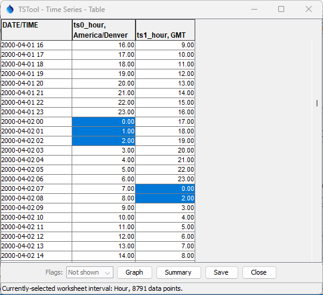
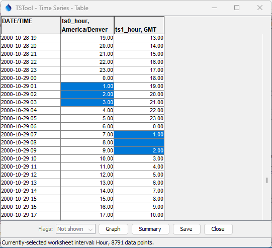

# TSTool / Command / ChangeTimeZone #

*   [Overview](#overview)
*   [Command Editor](#command-editor)
*   [Command Syntax](#command-syntax)
*   [Examples](#examples)
*   [Troubleshooting](#troubleshooting)
*   [See Also](#see-also)

-------------------------

## Overview ##

The `ChangeTimeZone` command changes the time zone for date/times associated with the time series.
Time zone should typically be used only with hourly and smaller time interval and
therefore this command should typically only be used for regular interval time series with interval less than a day (hour or less)
and irregular interval time series with date/time precision less than a day (hour or less).
The two main use cases for the command are:

1.  **Set the time zone but do not shift times:**
    This is appropriate if the original time series did not use a time zone
    but a time zone is required by later commands, such as writing to a file or database.
    In some cases it is appropriate to add a time zone and in other cases remove the time zone:
    1.  The time zone can be set by specifying `NewTimeZone`.
    2.  The time zone can be removed by not specifying `OldTimeZone`.
2.  **Set the time zone AND shift times:**
    Set the datet/times as in case 1 and also shift the date/time values to the new time zone,
    using the offset between the old and new time zones.
    For example, hour `0` for time zone `America/Denver` would be shifted to hour `7 GMT` in
    standard time part of the year and hour `6 GMT` in the daylight saving time of the year.

Time series date/times that are changed include:

*   Time series start and end (and original start and end).
*   For irregular time series, the date/times associated with data values.

Specification of the time zone is important for some workflows,
in particular with respect to daylight savings time,
in order to retain data integrity and properly represent the time associated with data.
For example, the time zone `America/Denver` indicates local time with
standard and daylight savings depending on the time of the year.
In this case, the time zone implies handling of daylight savings.

The `America/Denver` time zone is equivalent to `-07:00` during the “standard” part of the year,
and `-06:00` during the daylight savings part of the year,
meaning that local times are offset from GMT time zone by the number of indicated hours.
Consequently, using hour offsets explicitly indicates when daylight savings is in effect.

Recording original data using local time means that in the spring there will
be a gap of one hour because the time is jumped forward by an hour (e.g., at 02:00 AM the clock changes to 03:00 AM),
and in the fall an observation is lost because time is jumped back by an hour
(e.g., at 02:00 AM the clock changes to 01:00 AM and therefore an hour is overwritten).
However, if the original data are recorded using a standard time zone, then no data loss occurs.
Persistent data storage (e.g., database) might use standard time (or GMT),
with local time zone used for display.  See:

*   [Daylight saving time in the United States in Wikipedia](https://en.wikipedia.org/wiki/Daylight_saving_time_in_the_United_States)
*   [History of time in the United States](https://en.wikipedia.org/wiki/History_of_time_in_the_United_States) - table listing daylight saving dates for all years

## Command Editor ##

The command is available in the following TSTool menu:

*   ***Commands / Manipulate Time Series***

The following dialog is used to edit the command and illustrates the syntax of the command.

**<p style="text-align: center;">

</p>**

**<p style="text-align: center;">
`ChangeTimeZone` Command Editor (<a href="../ChangeTimeZone.png">see full-size image</a>)
</p>**

## Command Syntax ##

The command syntax is as follows:

```text
ChangeTimeZone(Parameter="Value",...)
```
**<p style="text-align: center;">
Command Parameters
</p>**

|**Parameter**&nbsp;&nbsp;&nbsp;&nbsp;&nbsp;&nbsp;&nbsp;&nbsp;&nbsp;&nbsp;&nbsp;|**Description**|**Default**&nbsp;&nbsp;&nbsp;&nbsp;&nbsp;&nbsp;&nbsp;&nbsp;&nbsp;&nbsp;&nbsp;&nbsp;&nbsp;&nbsp;&nbsp;&nbsp;&nbsp;&nbsp;&nbsp;&nbsp;&nbsp;&nbsp;&nbsp;&nbsp;&nbsp;&nbsp;&nbsp;|
|--------------|-----------------|-----------------|
|`TSList`|Indicates the list of time series to be processed, one of:<br><ul><li>`AllMatchingTSID` – all time series that match the TSID (single TSID or TSID with wildcards) will be processed.</li><li>`AllTS` – all time series before the command.</li><li>`EnsembleID` – all time series in the ensemble will be processed (see the EnsembleID parameter).</li><li>`FirstMatchingTSID` – the first time series that matches the TSID (single TSID or TSID with wildcards) will be processed.</li><li>`LastMatchingTSID` – the last time series that matches the TSID (single TSID or TSID with wildcards) will be processed.</li><li>`SelectedTS` – the time series are those selected with the [`SelectTimeSeries`](../SelectTimeSeries/SelectTimeSeries.md) command.</li></ul> | `AllTS` |
|`TSID`|The time series identifier or alias for the time series to be processed, using the `*` wildcard character to match multiple time series.  Can be specified using `${Property}`.|Required if `TSList=*TSID`|
|`EnsembleID`|The ensemble to be processed, if processing an ensemble. Can be specified using `${Property}`.|Required if `TSList=*EnsembleID`|
|`OldTimeZone`|The old time zone, which will be used if the time series date/time does not have a time zone.  Can be specified with a processor `${Property}`.  Time zones should agree with the Java [`java.time.ZoneId`](https://docs.oracle.com/javase/8/docs/api/java/time/ZoneId.html).  Abbreviations like `MST` should be avoided and more explicit zone (e.g., `America/Denver`) should be used to avoid ambiguity.  Possible values are listed on the following site:  [https://garygregory.wordpress.com/2013/06/18/what-are-the-java-timezone-ids/](https://garygregory.wordpress.com/2013/06/18/what-are-the-java-timezone-ids/)| Determine from time series date/times.|
|`NewTimeZone`|The new time zone.  Can be specified with a processor `${Property}`.  See the `OldTimeZone` description for more information. |If blank, the time zone will be set to blank.|
|`ShiftTime`| Whether to shift the time numerical values in addition to setting the time zone, `False` or `True`. | `False` |

## Examples ##

See the [automated tests](https://github.com/OpenCDSS/cdss-app-tstool-test/tree/master/test/commands/ChangeTimeZone).

The following example shows the time series before (`America/Denver`) and after (`GMT`) 
for the spring daylight saving change, with the following observations:

*   `2000-04-02 01 America/Denver` (and earlier) has a 7 hour offset to `2000-04-02 08 GMT`
*   `2000-04-02 02 America/Denver` has a 6 hour offset to `2000-04-02 08 GMT`, and therefore overwrites the previous value
*   `2000-04-02 03 America/Denver` (and later) has a 6 hour offset to `2000-04-02 09 GMT`

Note that in this example, the value for `2000-04-02 02 America/Denver` might be missing in source data
because the "spring forward" would have recorded the value at hour `03`.
An inverse effect will be seen converting from `GMT` to `America/Denver`.

**<p style="text-align: center;">

</p>**

**<p style="text-align: center;">
Example of "Spring Forward" Daylight Saving Change (<a href="../DaylightSaving-SpringForward.png">see full-size image</a>)
</p>**

Similarly, the following example shows the time series before (`America/Denver`) and after (`GMT`) 
for the fall daylight saving change, with the following observations:

*   `2000-10-29 01 America/Denver` (and earlier) has a 6 hour offset to `2000-10-29 07 GMT`
*   `2000-10-29 02 America/Denver` (and late) has a 7 hour offset to `2000-10-29 09 GMT` - results in a gap at hour `08 GMT`

Note that in this example, the value for `2000-10-29 02 America/Denver` might be recorded twice,
with the first hour lost after being overwritten.
An inverse effect would be seen converting from `GMT` to `America/Denver`.

**<p style="text-align: center;">

</p>**

**<p style="text-align: center;">
Example of "Fall Back" Daylight Saving Change (<a href="../DaylightSaving-FallBack.png">see full-size image</a>)
</p>**

## Troubleshooting ##

See the main [TSTool Troubleshooting](../../troubleshooting/troubleshooting.md) documentation.

## See Also ##

*   [`SelectTimeSeries`](../SelectTimeSeries/SelectTimeSeries.md) command
