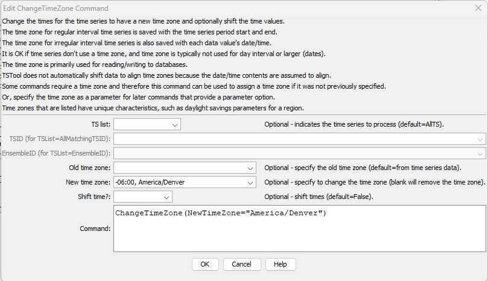

# TSTool / Command / ChangeTimeZone #

*   [Overview](#overview)
*   [Command Editor](#command-editor)
*   [Command Syntax](#command-syntax)
*   [Examples](#examples)
*   [Troubleshooting](#troubleshooting)
*   [See Also](#see-also)

-------------------------

## Overview ##

The `ChangeTimeZone` command changes the time zone for date/times associated with the time series.
This may be appropriate if the original time series did not use a time zone
but a time zone is required by later commands, such as writing to a file or database.
Currently this command simply resets the time zone that is saved with
date/times used in the time series, but does not modify the actual date/time values.
For regular-interval time series, date/times are used with period start and end.
For irregular time series, date/times are also associated with each data value.
Time zone should typically be used only with hourly and smaller time interval.

Specification of the time zone is important, in particular with respect to daylight savings time,
in order to retain data integrity and properly represent the time associated with data.
For example, the time zone `America/Denver` indicates local time with
standard and daylight savings depending on the time of the year.
For America/Denver, the time zone is equivalent to `-07:00` during the “standard” part of the year,
and `-06:00` during the daylight savings part of the year,
meaning that local times are offset from GMT time zone by the number of indicated hours.
Recording original data using local time means that in the spring there will
be a gap of one hour because the time is jumped forward by an hour,
and in the fall an observation is lost because time is jumped back by an hour.
However, if the original data are recorded using a standard time zone, then no data loss occurs.
Persistent data storage (e.g., database) should generally use standard time (or GMT),
with local time zone used for display.

## Command Editor ##

The command is available in the following TSTool menu:

*   ***Commands / Manipulate Time Series***

The following dialog is used to edit the command and illustrates the syntax of the command.

**<p style="text-align: center;">

</p>**

**<p style="text-align: center;">
`ChangeTimeZone` Command Editor (<a href="../ChangeTimeZone.png">see also the full-size image</a>)
</p>**

## Command Syntax ##

The command syntax is as follows:

```text
ChangeTimeZone(Parameter="Value",...)
```
**<p style="text-align: center;">
Command Parameters
</p>**

|**Parameter**&nbsp;&nbsp;&nbsp;&nbsp;&nbsp;&nbsp;&nbsp;&nbsp;&nbsp;&nbsp;&nbsp;|**Description**|**Default**&nbsp;&nbsp;&nbsp;&nbsp;&nbsp;&nbsp;&nbsp;&nbsp;&nbsp;&nbsp;&nbsp;&nbsp;&nbsp;&nbsp;&nbsp;&nbsp;&nbsp;&nbsp;&nbsp;&nbsp;&nbsp;&nbsp;&nbsp;&nbsp;&nbsp;&nbsp;&nbsp;|
|--------------|-----------------|-----------------|
|`TSList`|Indicates the list of time series to be processed, one of:<br><ul><li>`AllMatchingTSID` – all time series that match the TSID (single TSID or TSID with wildcards) will be processed.</li><li>`AllTS` – all time series before the command.</li><li>`EnsembleID` – all time series in the ensemble will be processed (see the EnsembleID parameter).</li><li>`FirstMatchingTSID` – the first time series that matches the TSID (single TSID or TSID with wildcards) will be processed.</li><li>`LastMatchingTSID` – the last time series that matches the TSID (single TSID or TSID with wildcards) will be processed.</li><li>`SelectedTS` – the time series are those selected with the [`SelectTimeSeries`](../SelectTimeSeries/SelectTimeSeries.md) command.</li></ul> | `AllTS` |
|`TSID`|The time series identifier or alias for the time series to be processed, using the `*` wildcard character to match multiple time series.  Can be specified using `${Property}`.|Required if `TSList=*TSID`|
|`EnsembleID`|The ensemble to be processed, if processing an ensemble. Can be specified using `${Property}`.|Required if `TSList=*EnsembleID`|
|`NewTimeZone`|The new time zone.  Can be specified with a processor `${Property}`.  Time zones should agree with the Java `java.time.ZoneId` class.  Possible values are listed on the following site:  [https://garygregory.wordpress.com/2013/06/18/what-are-the-java-timezone-ids/](https://garygregory.wordpress.com/2013/06/18/what-are-the-java-timezone-ids/)|If blank, the time zone will be set to blank.|

## Examples ##

See the [automated tests](https://github.com/OpenCDSS/cdss-app-tstool-test/tree/master/test/commands/ChangeTimeZone).

## Troubleshooting ##

## See Also ##

*   [`SelectTimeSeries`](../SelectTimeSeries/SelectTimeSeries.md) command
