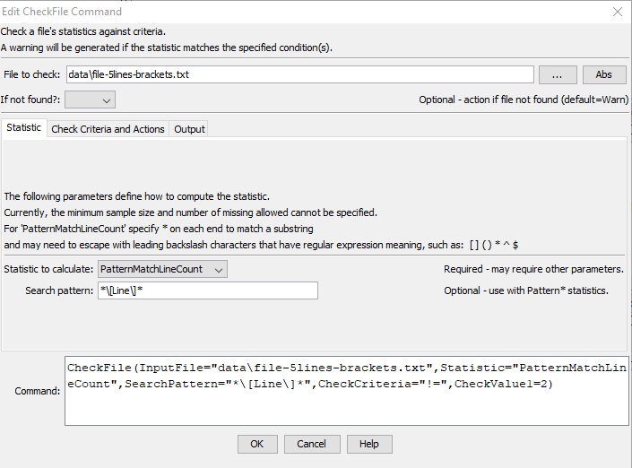

# TSTool / Command / CheckFile #

*   [Overview](#overview)
*   [Command Editor](#command-editor)
*   [Command Syntax](#command-syntax)
*   [Examples](#examples)
*   [Troubleshooting](#troubleshooting)
*   [See Also](#see-also)

-------------------------

## Overview ##

The `CheckFile` command checks a file's statistic (properties) against criteria.
See also the [`CompareFiles`](../CompareFiles/CompareFiles.md) command,
which can be used to compare the properties of two files.

Examples of use include:

*   check that a file has non-zero size as output from a process
*   check for lines matching expected output (or check that an error indicator is **not** present) a pattern as part of automated testing

Use the [`CompareFiles`](../CompareFiles/CompareFiles.md) command
if it is necessary to compare two files, for example size or modification time.

## Command Editor ##

The command is available in the following TSTool menu:

*   ***Commands / General - File Handling***

The following dialog is used to edit the command and illustrates the command syntax
for statistic parameters.

**<p style="text-align: center;">

</p>**

**<p style="text-align: center;">
`CheckFile` Command Editor for Statistic Parameters (<a href="../CheckFile-Statistic.png">see full-size image</a>)
</p>**

The following parameters indicate the check criteria.

**<p style="text-align: center;">

</p>**

**<p style="text-align: center;">
`CheckFile` Command Editor for Criteria and Action Parameters (<a href="../CheckFile-Criteria.png">see full-size image</a>)
</p>**

The following parameters will output the check results to a table,
which can be further manipulated.

**<p style="text-align: center;">

</p>**

**<p style="text-align: center;">
`CheckFile` Command Editor for Output Parameters (<a href="../CheckFile-Output.png">see full-size image</a>)
</p>**

## Command Syntax ##

The command syntax is as follows:

```text
CheckFile(Parameter="Value",...)
```
**<p style="text-align: center;">
Command Parameters
</p>**

|**Tab** |**Parameter**&nbsp;&nbsp;&nbsp;&nbsp;&nbsp;&nbsp;&nbsp;&nbsp;&nbsp;&nbsp;&nbsp;&nbsp;&nbsp;&nbsp;&nbsp;&nbsp;&nbsp;&nbsp;&nbsp;&nbsp;&nbsp;&nbsp;&nbsp;&nbsp;&nbsp;&nbsp;&nbsp;&nbsp;&nbsp;&nbsp;&nbsp;&nbsp;&nbsp;&nbsp;&nbsp;|**Description**|**Default**&nbsp;&nbsp;&nbsp;&nbsp;&nbsp;&nbsp;&nbsp;&nbsp;&nbsp;&nbsp;&nbsp;&nbsp;&nbsp;&nbsp;&nbsp;&nbsp;&nbsp;&nbsp;&nbsp;&nbsp;&nbsp;&nbsp;&nbsp;&nbsp;&nbsp;&nbsp;&nbsp;|
|--------------|-----------------|-----------------| -- |
| |`InputFile`<br>**required**|Name of the input file to process. Can use `${Property}` notation. | None - must be specified. |
| |`IfNotFound`  | Indicate an action if the input file is not found:<ul><li>`Ignore` - ignore the missing file and do not warn</li><li>`Warn` - generate a warning message</li><li>`Fail` - generate a failure message</li></ul>| `Warn` |
| ***Statistic*** |`Statistic`<br>**required**|Statistic to compute.  See the table below. | None - must be specified. |
| |`SearchPattern`| A string to match if `Statistic` `=PatternMatchLineCount`.<ul><li>Use `*` for wildcard to match a substring, otherwise the entire line must exactly match.</li><li>Multiple patterns can be specified separated by commas or can be or'ed using syntax `*pattern1*|*pattern2*`.</li><li>Can use `${Property}` notation.</li><li>Special characters that are recognized in [Java regular expression syntax](https://docs.oracle.com/javase/8/docs/api/java/util/regex/Pattern.html) should be escaped with backslash before the character, otherwise the pattern won't be matched</li></ul>| |
| ***Check Criteria and Actions*** |`CheckCriteria`|The criteria that is checked, one of:<ul><li>`InRange` – check for value >= `Value1` and <= `Value2`.</li><li>`OutOfRange` – check for value < `Value1` or > `Value2`.</li><li>`<` – check for values < `CheckValue1`.</li><li>`<=` – check for values <= `CheckValue1`.</li><li>`>` – check for values > `CheckValue1`.</li><li>`>=` – check for values >= `CheckValue1`.</li><li>`==` – check for values equal to `CheckValue1`.</li></ul>Can use `${Property}` notation. |None – must be specified.|
| |`CheckValue1`|A parameter that is used for specific `CheckCriteria` values. Can use `${Property}` notation. ||
| |`CheckValue2`|A parameter that is used for specific `CheckCriteria` values, currently only needed for `InRange` and `OutOfRange` criteria. Can use `${Property}` notation. ||
| |`ProblemType`|The problem type that will be shown in warning messages. Can use `${Property}` notation.  |`Statistic-CheckCriteria`|
| |`IfCriteriaMet`|Indicate whether to set the command status if the statistic meets the criteria, one of:<ul></li><li>`Ignore` – do not set the command status</li><li>`Warn` – set the command status to Warning</li><li>`Fail` – set the command status to `Failure`</li></ul>|The command status will not be changed.|
| |`PropertyName`|If the statistic meets the criteria, set the property identified by `PropertyName` to `PropertyValue`. Can use `${Property}` notation. |No property is set.|
| |`PropertyValue`|If the statistic meets the criteria, set the property identified by `PropertyName` to `PropertyValue`. Can use `${Property}` notation. |No property is set.|
| ***Output*** |`TableID`|Identifier for table that receives the statistic. Can use `${Property}` notation. |Optional – table output is not required.|
| |`TableFilenameColumn`|Table column name that is used to look up the file.  If a matching filename is not found, a row will be added to the table.  If a filename is found, the statistic cell value for the file is modified. Can use `${Property}` notation. |Optional – table output is not required. | `File` |
| | `TableStatisticColumn`|Table column name to receive the statistic name.  If not found in the table, a new column is added automatically. Can use `${Property}` notation. | `Statistic` |
| | `TableStatisticValueColumn`|Table column name to receive the statistic value.  If not found in the table, a new column is added automatically. Can use `${Property}` notation. | `StatisticValue` |

The following statistics can be used for the `Statistic` command parameter.

**<p style="text-align: center;">
File Statistics
</p>**

| **Statistic**&nbsp;&nbsp;&nbsp;&nbsp;&nbsp;&nbsp;&nbsp;&nbsp;&nbsp;&nbsp;&nbsp;&nbsp;&nbsp;&nbsp;&nbsp;&nbsp;&nbsp;&nbsp;&nbsp;&nbsp;&nbsp;&nbsp;&nbsp;&nbsp;&nbsp;&nbsp;&nbsp;&nbsp;&nbsp;&nbsp;&nbsp;&nbsp; | **Description** |
| -- | -- |
| `FileSizeBytes` | File size in bytes. |
| `FileSizeLines` | File size as number of lines. |
| `PatternMatch` | **Planned future feature.** The number of matching text patterns, can be more than one match on a line. |
| `PatternMatchLineCount` | The number of lines that contain a matching text pattern. |

## Examples ##

See the [automated tests](https://github.com/OpenCDSS/cdss-app-tstool-test/tree/master/test/commands/CheckFile).

## Troubleshooting ##

See the main [TSTool Troubleshooting](../../troubleshooting/troubleshooting.md) documentation.

## See Also ##

*   [`CheckTimeSeries`](../CheckTimeSeries/CheckTimeSeries.md) command
*   [`CheckTimeSeriesStatistic`](../CheckTimeSeriesStatistic/CheckTimeSeriesStatistic.md) command
*   [`CompareFiles`](../CompareFiles/CompareFiles.md) command
*   [`CompareTables`](../CompareTables/CompareTables.md) command
