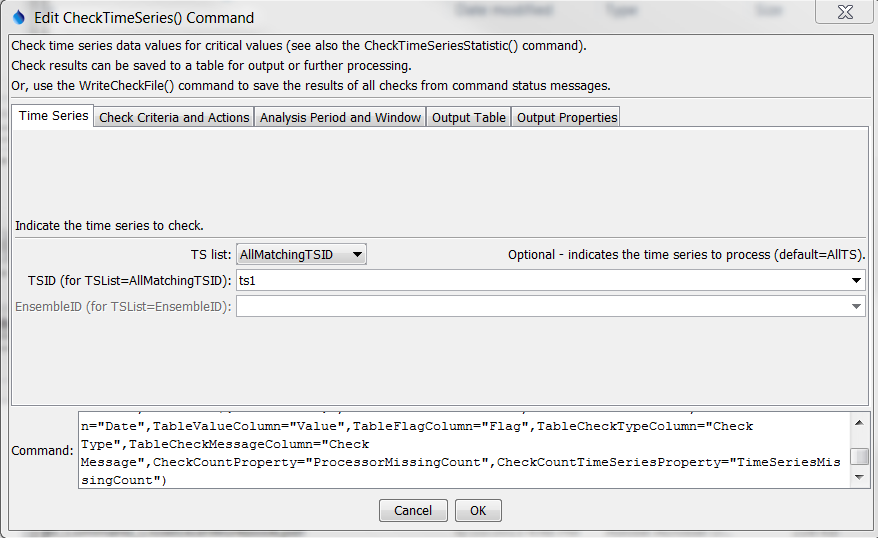
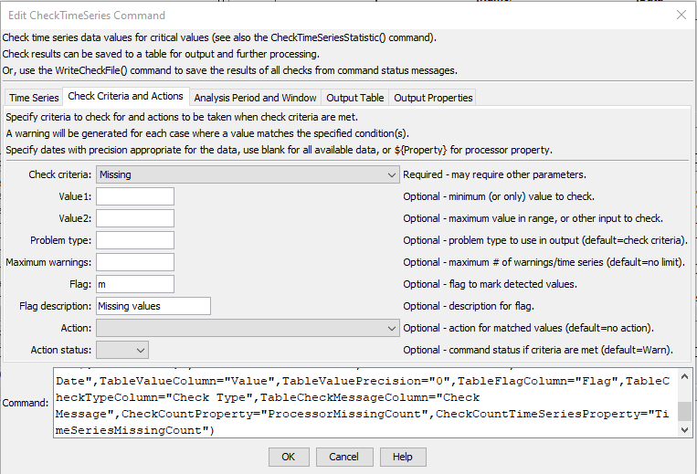
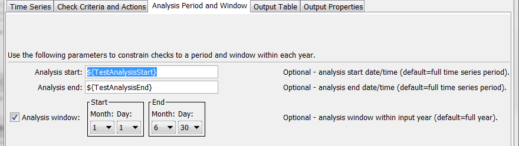
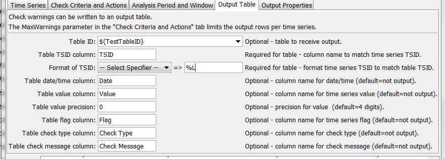
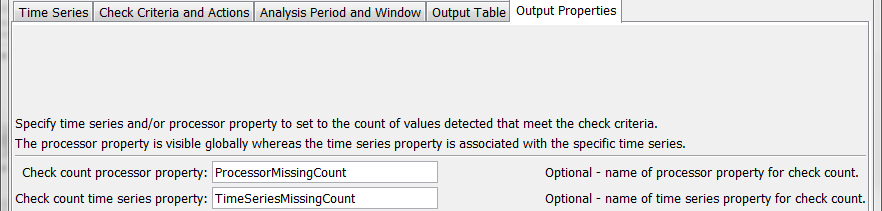

# TSTool / Command / CheckTimeSeries #

*   [Overview](#overview)
*   [Command Editor](#command-editor)
*   [Command Syntax](#command-syntax)
*   [Examples](#examples)
*   [Troubleshooting](#troubleshooting)
*   [See Also](#see-also)

-------------------------

## Overview ##

The `CheckTimeSeries` command checks time series data values against criteria,
for example to identify missing, erroneous, or extreme data values.
The command was originally developed for quality control but can also be used for simple data manipulations,
in which case the `ActionStatus` parameter can be used to control the command status.
One or more of the following can occur for each data value that is matched:

*   generate a message in the log file
*   set command status log messages (up to a limited number of messages)
*   set a flag for the value, which is useful for visualization
*   set the value to missing
*   remove (if irregular interval)

Check results can be saved to an output table for output and further processing by other commands.

See also the following related commands:

*   [`WriteCheckFile`](../WriteCheckFile/WriteCheckFile.md) - write a summary of the warnings based on command messages
*   [`CheckTimeSeriesStatistic`](../CheckTimeSeriesStatistic/CheckTimeSeriesStatistic.md) - checks a statistic for the entire time series (e.g., missing value count)
*   [[`Delta`](../Delta/Delta.md) - creates new time series as the change between each value,
    which may be necessary in cases where data periodically reset to a starting value, prior to performing a Change> check

## Command Editor ##

The command is available in the following TSTool menu:

*   ***Commands / Check Time Series***

The following dialog is used to edit the command and illustrates the syntax of the command for time series parameters.

**<p style="text-align: center;">

</p>**

**<p style="text-align: center;">
`CheckTimeSeries` Command Editor for Time Series Parameters (<a href="../CheckTimeSeries.png">see full-size image</a>)
</p>**

The following dialog is used to edit the command and illustrates the syntax of the command for criteria and action parameters.

**<p style="text-align: center;">

</p>**

**<p style="text-align: center;">
`CheckTimeSeries` Command Editor for Check Criteria and Action Parameters (<a href="../CheckTimeSeries_Criteria.png">see full-size image</a>)
</p>**

The following dialog is used to edit the command and illustrates the syntax of the command for analysis period and window parameters.

**<p style="text-align: center;">

</p>**

**<p style="text-align: center;">
`CheckTimeSeries` Command Editor for Analysis Period and Window Parameters (<a href="../CheckTimeSeries_Time.png">see full-size image</a>)
</p>**

The following dialog is used to edit the command and illustrates the syntax of the command for output table parameters.

**<p style="text-align: center;">

</p>**

**<p style="text-align: center;">
`CheckTimeSeries` Command Editor for Output Table Parameters (<a href="../CheckTimeSeries_Table.png">see full-size image</a>)
</p>**

The following dialog is used to edit the command and illustrates the syntax of the command for output property parameters.

**<p style="text-align: center;">

</p>**

**<p style="text-align: center;">
`CheckTimeSeries` Command Editor for Output Properties Parameters (<a href="../CheckTimeSeries_Properties.png">see full-size image</a>)
</p>**

## Command Syntax ##

The command syntax is as follows:

```text
CheckTimeSeries(Parameter="Value",...)
```
**<p style="text-align: center;">
Command Parameters
</p>**

|**Tab** | **Parameter**&nbsp;&nbsp;&nbsp;&nbsp;&nbsp;&nbsp;&nbsp;&nbsp;&nbsp;&nbsp;&nbsp;&nbsp;&nbsp;&nbsp;&nbsp;&nbsp;&nbsp;&nbsp;&nbsp;&nbsp;&nbsp;&nbsp;&nbsp;&nbsp;&nbsp;&nbsp;&nbsp;&nbsp;&nbsp;&nbsp;&nbsp;&nbsp;&nbsp;|**Description**|**Default**&nbsp;&nbsp;&nbsp;&nbsp;&nbsp;&nbsp;&nbsp;&nbsp;&nbsp;&nbsp;&nbsp;&nbsp;&nbsp;&nbsp;&nbsp;&nbsp;&nbsp;&nbsp;&nbsp;&nbsp;&nbsp;&nbsp;&nbsp;&nbsp;&nbsp;&nbsp;&nbsp;|
|--|--|--|--|
| ***Time Series*** | `TSList`|Indicates the list of time series to be processed, one of:<br><ul><li>`AllMatchingTSID` – all time series that match the TSID (single TSID or TSID with wildcards) will be processed.</li><li>`AllTS` – all time series before the command.</li><li>`EnsembleID` – all time series in the ensemble will be processed (see the EnsembleID parameter).</li><li>`FirstMatchingTSID` – the first time series that matches the TSID (single TSID or TSID with wildcards) will be processed.</li><li>`LastMatchingTSID` – the last time series that matches the TSID (single TSID or TSID with wildcards) will be processed.</li><li>`SelectedTS` – the time series are those selected with the [`SelectTimeSeries`](../SelectTimeSeries/SelectTimeSeries.md) command.</li></ul> | `AllTS` |
||`TSID`|The time series identifier or alias for the time series to be processed, using the `*` wildcard character to match multiple time series.  Can be specified using `${Property}`.|Required if `TSList=*TSID`|
||`EnsembleID`|The ensemble to be processed, if processing an ensemble. Can be specified using `${Property}`.|Required if `TSList=*EnsembleID`|
|***Check Criteria and Actions***|`CheckCriteria`|The criteria that is checked, one of the following.  Missing values are skipped except for cases where the statistic is specific to missing values.<ul><li>`AbsChange>` – check for absolute change from one value to the next value > `Value1`</li><li>`AbsChangePercent>` – check for absolute change in percent from one value to the next value > `Value1`.</li><li>`Change>` – check for change > `Value1`.</li><li>`Change<` – check for change < `Value1`.</li><li>`InRange` – check for value >= `Value1` and <= `Value2`.</li><li>`OutOfRange` – check for value < `Value1` or > `Value2`.</li><li>`Missing` – check for missing values.</li><li>`Repeat` – check for Value1 repeating values (i.e., if Value1=2, then the check will detect 2 adjacent values that are the same).  If the flag or action are specified, values Value1+ in the sequence are modified (i.e., if Value1=2, the 2nd and subsequent repeating values will be modified by the action).</li><li>`<` – check for values < Value1.</li><li>`<=` – check for values <= Value1.</li><li>`>` – check for values > Value1.</li><li>`>=` – check for values >= Value1.</li><li>`==` – check for values equal to Value1.</li></ul>|None – must be specified.|
||`Value1`|A parameter that is used for specific `CheckCriteria` values.||
||`Value2`|A parameter that is used for specific `CheckCriteria` values.||
||`ProblemType`|The problem type that will be shown in warning messages.|`CheckCriteria`|
||`MaxWarnings`|The maximum number of warnings to list for each time series, useful if analysis results in many warnings.|List all warnings.|
||`Flag`|A string to use for a flag on values that are detected during the check, which will be shown in the HTML summary report.|No flag.|
||`FlagDesc`|Description for the flag.|No description.|
||`Action`|Action to take for matched values, in addition to generating warnings:<ul><li>`Remove` – remove the values.  For irregular interval time series the values will be removed.  For regular interval time series the values will be set to missing.</li><li>`SetMissing` – set the values to missing.</li></ul>|No action is taken.|
||`ActionStatus`| The command status to set if any criteria are met:<ul><li>`Ignore` - use when the command should have a status of success (unless errors occur)</li><li>`Warn`</li><li>`Fail`</li></ul>|`Warn`|
|***Analysis Period and Window***|`AnalysisStart`|The date/time to start analyzing data.  Can be specified using processor `${Property}`.|Analyze full period.|
||`AnalysisEnd`|The date/time to end analyzing data.  Can be specified using processor `${Property}`.|Analyze full period.|
||`AnalysisWindowStart`|The calendar date/time for the analysis start within each year.  Specify using the format `MM`, `MM-DD`, `MM-DD hh`, or `MM-DD hh:mm`, consistent with the time series interval precision.  A year of 2000 will be used internally to parse the date/time.  Use this parameter to limit data processing within the year, for example to analyze only a season.|Analyze the full year.|
||`AnalysisWindowEnd`|Specify date/time for the analysis end within each year.  See `AnalysisWindowStart` for details.|Analyze the full year.|
|***Output Table***|`TableID`|Identifier for output table to contain check results.  Specify an existing table or new table to create.  Can be specified using processor `${Property}`.|No table output.|
||`TableTSIDColumn`|Table column name for time series TSID.|Required for table.|
||`TableTSIDFormat`|The specification to format the time series identifier to insert into the `TSID` column.  Use the format choices and other characters to define a unique identifier.|Required for table. |
||`TableDateTimeColumn`|Table column name for date/time.|Column is not output.|
||`TableValueColumn`|Table column name for time series data values.|Column is not output.|
||`TableValuePrecision`|Precision for values in `TableValueColumn` column.|`4`|
||`TableFlagColumn`|Table column name for time series data flag values.|Column is not output.|
||`TableCheckTypeColumn`|Table column name for data check type.|Column is not output.|
||`TableCheckMessageColumn`|Table column name for data check message.|Column is not output.|
|***Check Properties***|`CheckCount`<br>`Property`|Name of processor property to set with count of values that meet the criteria.  Can use processor `${Property}` and time series `%` or `${ts:Property}`.|No property is set.|
||`CheckCount`<br>`TimeSeriesProperty`|Name of time series property to set with count of values that meet the criteria.  Can use processor `${Property}` and time series `%` or `${ts:Property}`.|No property is set.|

## Examples ##

See the [automated tests](https://github.com/OpenCDSS/cdss-app-tstool-test/tree/master/test/commands/CheckTimeSeries).

## Troubleshooting ##

See the main [TSTool Troubleshooting](../../troubleshooting/troubleshooting.md) documentation.

## See Also ##

*   Commands:
    +   [`CheckTimeSeriesStatistic`](../CheckTimeSeriesStatistic/CheckTimeSeriesStatistic.md)
    +   [`Delta`](../Delta/Delta.md)
    +   [`SelectTimeSeries`](../SelectTimeSeries/SelectTimeSeries.md)
    +   [`WriteCheckFile`](../WriteCheckFile/WriteCheckFile.md)
