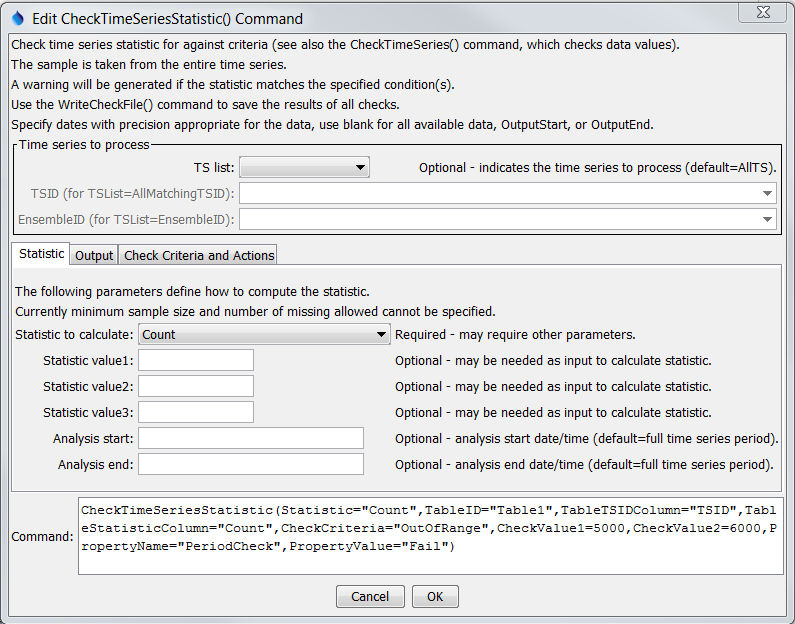
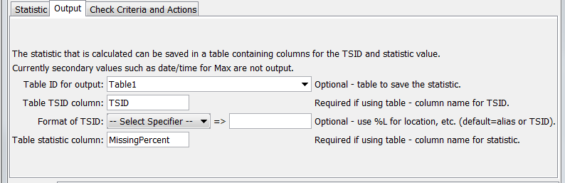
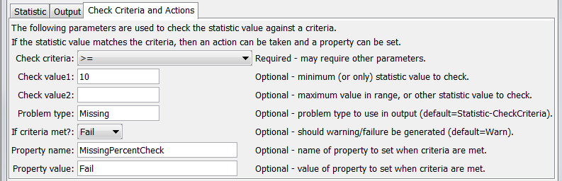

# TSTool / Command / CheckTimeSeriesStatistic #

* [Overview](#overview)
* [Command Editor](#command-editor)
* [Command Syntax](#command-syntax)
* [Examples](#examples)
* [Troubleshooting](#troubleshooting)
* [See Also](#see-also)

-------------------------

## Overview ##

The `CheckTimeSeriesStatistic` command checks a time series statistic against criteria,
for example to perform quality control using full-period statistics.
This command is essentially a combination of the
[`CalculateTimeSeriesStatistic`](../CalculateTimeSeriesStatistic/CalculateTimeSeriesStatistic.md)
command with features similar to the
[`CheckTimeSeries`](../CheckTimeSeries/CheckTimeSeries.md) command; however,
the latter checks individual data values and this command checks a
statistic computed from the entire time series.
The [`WriteCheckFile`](../WriteCheckFile/WriteCheckFile.md) command can be used to write a summary of the warnings.

## Command Editor ##

The following dialog is used to edit the command and illustrates the command syntax,
in this case to check for time series that have >= 5% missing data values.

**<p style="text-align: center;">

</p>**

**<p style="text-align: center;">
`CheckTimeSeriesStatistic` Command Editor for Statistic Parameters (<a href="../CheckTimeSeriesStatistic.png">see also the full-size image</a>)
</p>**

The following parameters will output the location part of the TSID to a
column named TSID and the missing percentage to a column named `MissingPercent` in the output table named `Table1`.

**<p style="text-align: center;">

</p>**

**<p style="text-align: center;">
`CheckTimeSeriesStatistic` Command Editor for Output Parameters (<a href="../CheckTimeSeriesStatistic_Output.png">see also the full-size image</a>)
</p>**

The percentage of missing values is then checked to see if `>= 10` and if so the command will
fail and the time series will have a property set `MissingPercentCheck=Fail`.

**<p style="text-align: center;">

</p>**

**<p style="text-align: center;">
`CheckTimeSeriesStatistic` Command Editor for Criteria and Action Parameters (<a href="../CheckTimeSeriesStatistic_Output.png">see also the full-size image</a>)
</p>**

## Command Syntax ##

The command syntax is as follows:

```text
CheckTimeSeriesStatistic(Parameter="Value",...)
```
**<p style="text-align: center;">
Command Parameters
</p>**

|**Parameter**&nbsp;&nbsp;&nbsp;&nbsp;&nbsp;&nbsp;&nbsp;&nbsp;&nbsp;&nbsp;&nbsp;&nbsp;&nbsp;&nbsp;&nbsp;&nbsp;&nbsp;&nbsp;&nbsp;&nbsp;&nbsp;&nbsp;&nbsp;&nbsp;&nbsp;|**Description**|**Default**&nbsp;&nbsp;&nbsp;&nbsp;&nbsp;&nbsp;&nbsp;&nbsp;&nbsp;&nbsp;&nbsp;&nbsp;&nbsp;&nbsp;&nbsp;&nbsp;&nbsp;&nbsp;&nbsp;&nbsp;&nbsp;&nbsp;&nbsp;&nbsp;&nbsp;&nbsp;&nbsp;|
|--------------|-----------------|-----------------|
|`TSList`|Indicates the list of time series to be processed, one of:<br><ul><li>`AllMatchingTSID` – all time series that match the TSID (single TSID or TSID with wildcards) will be processed.</li><li>`AllTS` – all time series before the command.</li><li>`EnsembleID` – all time series in the ensemble will be processed (see the EnsembleID parameter).</li><li>`FirstMatchingTSID` – the first time series that matches the TSID (single TSID or TSID with wildcards) will be processed.</li><li>`LastMatchingTSID` – the last time series that matches the TSID (single TSID or TSID with wildcards) will be processed.</li><li>`SelectedTS` – the time series are those selected with the [`SelectTimeSeries`](../SelectTimeSeries/SelectTimeSeries.md) command.</li></ul> | `AllTS` |
|`TSID`|The time series identifier or alias for the time series to be processed, using the `*` wildcard character to match multiple time series.  Can be specified using `${Property}`.|Required if `TSList=*TSID`|
|`EnsembleID`|The ensemble to be processed, if processing an ensemble. Can be specified using `${Property}`.|Required if `TSList=*EnsembleID`|
|`Statistic`|Statistic to compute.  Refer to the [`CalculateTimeSeriesStatistic`](../CalculateTimeSeriesStatistic/CalculateTimeSeriesStatistic.md) command documentation.|None – must be specified.|
|`StatisticValue1`|Input data required by the statistic.  Currently the command editor does not check the value for correctness – it is checked when the statistic is computed.	See the [`CalculateTimeSeriesStatistic`](../CalculateTimeSeriesStatistic/CalculateTimeSeriesStatistic.md) command documentation.|
|`StatisticValue2`|Input data required by the statistic.  Currently the command editor does not check the value for correctness – it is checked when the statistic is computed.	to the [`CalculateTimeSeriesStatistic`](../CalculateTimeSeriesStatistic/CalculateTimeSeriesStatistic.md) command documentation.|
|`StatisticValue3`|Input data required by the statistic.  Currently the command editor does not check the value for correctness – it is checked when the statistic is computed.	to the [`CalculateTimeSeriesStatistic`](../CalculateTimeSeriesStatistic/CalculateTimeSeriesStatistic.md) command documentation.|
|`AnalysisStart`|The date/time to start analyzing data.|Full period is analyzed.|
|`AnalysisEnd`|The date/time to end analyzing data.|Full period is analyzed.|
|`TableID`|Identifier for table that receives the statistic.|Optional – table output is not required.|
|`TableTSIDColumn`|Table column name that is used to look up the time series.  If a matching TSID is not found, a row will be added to the table.  If a TSID is found, the statistic cell value for the time series is modified.|Optional – table output is not required.|
|`TableTSIDFormat`|The specification to format the time series identifier to insert into the TSID column.  Use the format choices and other characters to define a unique identifier.|Time series alias if available, or the time series identifier.|
|`TableStatisticColumn`|Table column name to receive the statistic value.  If not found in the table, a new column is added automatically.|Optional – table output is not required.|
|`CheckCriteria`|The criteria that is checked, one of:<ul><li>`InRange` – check for value >= `Value1` and <= `Value2`.</li><li>`OutOfRange` – check for value < `Value1` or > `Value2`.</li><li>`<` – check for values < `CheckValue1`.</li><li>`<=` – check for values <= `CheckValue1`.</li><li>`>` – check for values > `CheckValue1`.</li><li>`>=` – check for values >= `CheckValue1`.</li><li>`==` – check for values equal to `CheckValue1`.</li></ul>|None – must be specified.|
|`CheckValue1`|A parameter that is used for specific `CheckCriteria` values.||
|`CheckValue2`|A parameter that is used for specific `CheckCriteria` values, currently only needed for `InRange` and `OutOfRange` criteria.||
|`ProblemType`|The problem type that will be shown in warning messages.	`Statistic-CheckCriteria`|
|`IfCriteriaMet`|Indicate whether to set the command status if the statistic meets the criteria, one of:</li><li>`Ignore` – do not set the command status</li><li>`Warn` – set the command status to Warning</li></ul>|`Fail` – set the command status to `Failure`|The command status will not be changed.|
|`PropertyName`|If the statistic meets the criteria, set the property identified by `PropertyName` to `PropertyValue`.|No property is set.|
|`PropertyValue`|If the statistic meets the criteria, set the property identified by `PropertyName` to `PropertyValue`.|No property is set.|

## Examples ##

See the [automated tests](https://github.com/OpenCDSS/cdss-app-tstool-test/tree/master/test/regression/commands/general/CheckTimeSeriesStatistic).

## Troubleshooting ##

## See Also ##

* [`CalculateTimeSeriesStatistic`](../CalculateTimeSeriesStatistic/CalculateTimeSeriesStatistic.md) command
* [`CheckTimeSeries`](../CheckTimeSeries/CheckTimeSeries.md) command
* [`SelectTimeSeries`](../SelectTimeSeries/SelectTimeSeries.md) command
* [`WriteCheckFile`](../WriteCheckFile/WriteCheckFile.md) command
