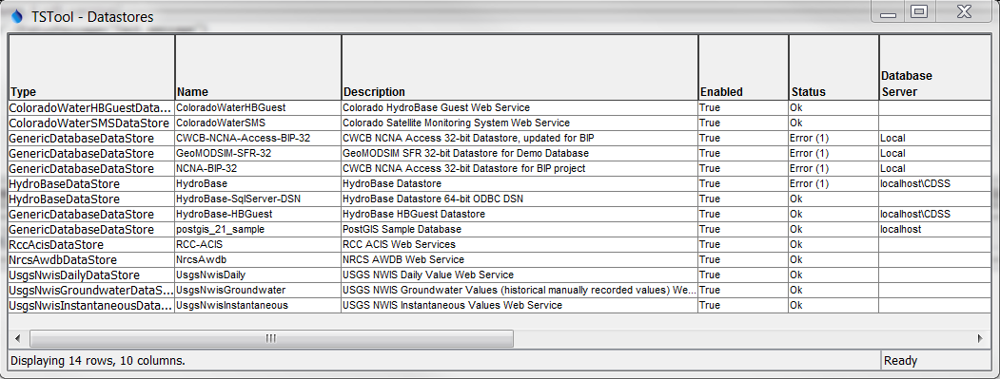
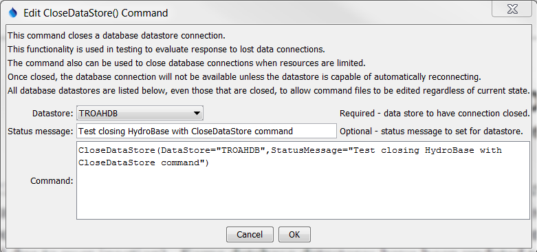

# TSTool / Command / CloseDataStore #

* [Overview](#overview)
* [Command Editor](#command-editor)
* [Command Syntax](#command-syntax)
* [Examples](#examples)
* [Troubleshooting](#troubleshooting)
* [See Also](#see-also)

-------------------------

## Overview ##

The `CloseDataStore` command closes a datastore’s database connection.
Closing the connection will cause subsequent interactions with the datastore’s database to fail.
This command is used to simulate dropped database connections
(for example when TSTool does not read from or write to database for a period due to user inaction).
Some database datastores have been updated to auto-connect to the database when the connection is dropped.

**Because many datastores now use a configuration file to connect at startup,
this command is not at the current time envisioned for managing database connections.
In the future the command may be useful to process many databases in one command file.**

The status of datastores can be shown in TSTool using the ***View...Datastores***
menu as shown in the following figure (the Status ***Message*** column on the far right,
not visible in the figure, provides additional information about the datastore):

**<p style="text-align: center;">

</p>**

**<p style="text-align: center;">
Datastore Information (<a href="../CloseDataStore_Status.png">see also the full-size image</a>)
</p>**

## Command Editor ##

The following dialog is used to edit the command and illustrates the syntax of the command.

**<p style="text-align: center;">

</p>**

**<p style="text-align: center;">
`CloseDataStore` Command Editor (<a href="../CloseDataStore.png">see also the full-size image</a>)
</p>**

## Command Syntax ##

The command syntax is as follows:

```text
CloseDataStore(Parameter="Value",...)
```
**<p style="text-align: center;">
Command Parameters
</p>**

|**Parameter**&nbsp;&nbsp;&nbsp;&nbsp;&nbsp;&nbsp;&nbsp;&nbsp;&nbsp;&nbsp;&nbsp;&nbsp;&nbsp;&nbsp;&nbsp;&nbsp;&nbsp;&nbsp;&nbsp;&nbsp;&nbsp;&nbsp;&nbsp;&nbsp;&nbsp;&nbsp;&nbsp;&nbsp;&nbsp;&nbsp;&nbsp;&nbsp;&nbsp;&nbsp;&nbsp;|**Description**|**Default**&nbsp;&nbsp;&nbsp;&nbsp;&nbsp;&nbsp;&nbsp;&nbsp;&nbsp;&nbsp;&nbsp;&nbsp;&nbsp;&nbsp;&nbsp;&nbsp;&nbsp;&nbsp;&nbsp;&nbsp;&nbsp;&nbsp;&nbsp;&nbsp;&nbsp;&nbsp;&nbsp;|
|--------------|-----------------|-----------------|
|`DataStore`|The name of a database datastore to read.|	None – must be specified.|
|`StatusMessage`|A status message to display when the datastore information is viewed.  The status may be reset if the connection is automatically restored, for example when a subsequent database interaction occurs.|Message appropriate for closing the datastore.|

## Examples ##

See the [automated tests](https://github.com/OpenCDSS/cdss-app-tstool-test/tree/master/test/regression/commands/general/CloseDataStore).

## Troubleshooting ##

## See Also ##
