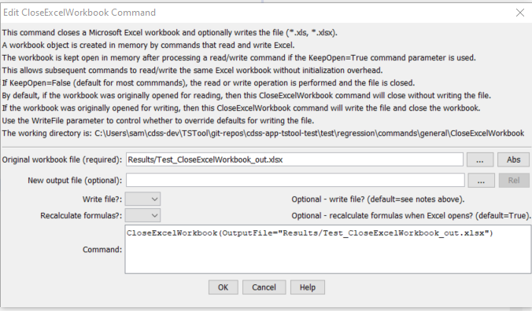

# TSTool / Command / CloseExcelWorkbook #

*   [Overview](#overview)
*   [Command Editor](#command-editor)
*   [Command Syntax](#command-syntax)
*   [Examples](#examples)
*   [Troubleshooting](#troubleshooting)
*   [See Also](#see-also)

-------------------------

## Overview ##

The `CloseExcelWorkbook` command closes a Microsoft Excel workbook
that has been opened with a previous command and kept open,
for example by using the `KeepOpen=True` command parameter.
The act of “closing” discards the workbook from program memory and optionally
causes the workbook to be written to an Excel file.
Using this command is helpful when multiple commands are manipulating an Excel workbook,
for example when used in a [`For`](../For/For.md) loop block.

## Command Editor ##

The command is available in the following TSTool menu:

*   ***Commands / Spreadsheet Processing***

The following dialog is used to edit the command and illustrates the syntax of the command.

**<p style="text-align: center;">

</p>**

**<p style="text-align: center;">
`CloseExcelWorkbook` Command Editor (<a href="../CloseExcelWorkbook.png">see full-size image</a>)
</p>**

## Command Syntax ##

The command syntax is as follows:

```text
CloseExcelWorkbook(Parameter="Value",...)
```
**<p style="text-align: center;">
Command Parameters
</p>**

|**Parameter**&nbsp;&nbsp;&nbsp;&nbsp;&nbsp;&nbsp;&nbsp;&nbsp;&nbsp;&nbsp;&nbsp;&nbsp;&nbsp;&nbsp;&nbsp;&nbsp;&nbsp;&nbsp;&nbsp;&nbsp;&nbsp;&nbsp;&nbsp;&nbsp;&nbsp;&nbsp;&nbsp;&nbsp;&nbsp;&nbsp;&nbsp;&nbsp;&nbsp;&nbsp;&nbsp;|**Description**|**Default**&nbsp;&nbsp;&nbsp;&nbsp;&nbsp;&nbsp;&nbsp;&nbsp;&nbsp;&nbsp;&nbsp;&nbsp;&nbsp;&nbsp;&nbsp;&nbsp;&nbsp;&nbsp;&nbsp;&nbsp;&nbsp;&nbsp;&nbsp;&nbsp;&nbsp;&nbsp;&nbsp;|
|--------------|-----------------|-----------------|
|`OutputFile`|The name of the currently open Excel workbook (`*.xls` or `*.xlsx`) to close, as an absolute path or relative to the command file location.  The filename will match that of previous commands that have read an existing or created a new Excel file.  No action is performed if the open workbook is not found.  Can be specified using processor `${Property}`.|None – must be specified.|
|`NewOutputFile`|Specify if a new output file should be written.  This is useful if `OutputFile` corresponds to an Excel file that was read but is not intended to be written over.|`OutputFile`|
|`WriteFile`|Indicate whether the output file should be written (`True`) or not (`False`).  The parameter can be used to override the default behavior.|`False` if the workbook was originally opened for reading, `True` if the workbook was originally created or opened for writing.|
|`RecalculateFormulasAtOpen`|The Excel file when written can be configured to cause Excel to recalculate formulas when it opens.  This is the default when writing to ensure that the Excel workbook contents are up to date when opened.  This parameter can be used to override the default.|`True`|

## Examples ##

See the [automated tests](https://github.com/OpenCDSS/cdss-app-tstool-test/tree/master/test/commands/CloseExcelWorkbook).

## Troubleshooting ##

See the main [TSTool Troubleshooting](../../troubleshooting/troubleshooting.md) documentation.

## See Also ##

*   [`For`](../For/For.md) command
