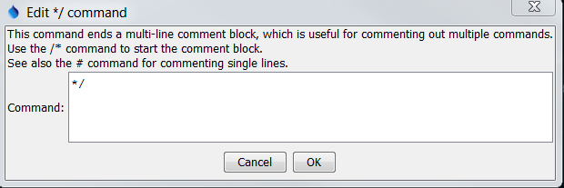

# TSTool / Command / Comment Block End `*/` #

* [Overview](#overview)
* [Command Editor](#command-editor)
* [Command Syntax](#command-syntax)
* [Examples](#examples)
* [Troubleshooting](#troubleshooting)
* [See Also](#see-also)

-------------------------

## Overview ##

The `*/` command ends a multi-line comment block and is useful for inserting long comments or
temporarily commenting out blocks of commands.
See also the [`/*`](../CommentBlockStart/CommentBlockStart.md) and [`#`](../Comment/Comment.md) commands.
Commands between the `/*` and `*/` are not converted to comments but are skipped during processing.
See the [`#`](../Comment/Comment.md) comment documentation for information about comment @ annotations.

## Command Editor ##

The following dialog is used to edit the command and illustrates the command syntax.



**<p style="text-align: center;">
`*/` Command Editor (<a href="../CommentBlockEnd.png">see also the full-size image</a>)
</p>**

## Command Syntax ##

The command syntax is as follows:

```text
ACommand(...)
AnotherCommand(...)
/*
ACommentedCommand(...)
AnotherCommentedCommand(...)
*/
```

The commands between `/*` and `*/` lines will be recognized as commands but will not be run.

## Examples ##

See the [automated tests](https://github.com/OpenCDSS/cdss-app-tstool-test/tree/master/test/regression/commands/general/CommentBlock).

## Troubleshooting ##

## See Also ##

* [Comment - `#`](../Comment/Comment.md) command
* [CommentBlockEnd - `*/`](../CommentBlockEnd/CommentBlockEnd.md) command
