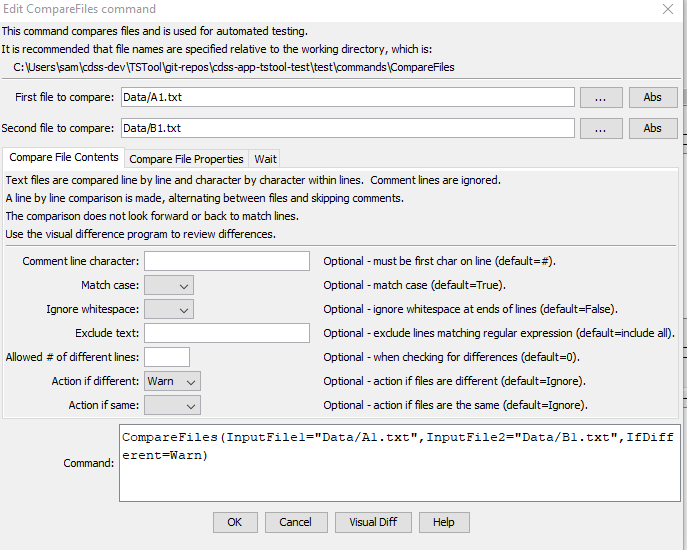

# TSTool / Command / CompareFiles #

*   [Overview](#overview)
*   [Command Editor](#command-editor)
*   [Command Syntax](#command-syntax)
*   [Examples](#examples)
*   [Troubleshooting](#troubleshooting)
*   [See Also](#See Also)

-------------------------

## Overview ##

The `CompareFiles` command compares text files to determine differences.
Each file can be specified as a path to a file on the local computer,
or a URL specifying a file on a web server.
If a URL is specified for an input file,
the URL contents are downloaded to a temporary file,
which is then compared with the other file.

The command can be used to compare old and new files produced by a software process.
This command is suitable for comparing files that are similar,
but is not suitable for comparing files that are very different,
although it may be enhanced in the future to provide more sophisticated comparison features.

*   Each line in each file is read.
    Different numbers of non-comment lines will result in differences.
*   By default, lines beginning with `#` are treated as comment lines and are ignored
    (see the `CommentLineChar` parameter to specify the comment indicator).
    Therefore, only non-comment lines are compared.
    Comment lines in the middle of the file are simply discarded.
*   Missing input files will result in an error.
    However, if `WaitUntil` is specified, a missing file is treated as an empty file.
*   No attempt is made to align similar lines to jump past groups of different lines.
    Therefore, if the number of lines is different, many lines may be reported to be different.

Differences and simple statistics are printed to the log file.
A warning can be generated if a difference is detected or if no differences are detected
(see also the [`CompareTimeSeries`](../CompareTimeSeries/CompareTimeSeries.md) and [`CompareTables`](../CompareTables/CompareTables.md) commands).

## Command Editor ##

The command is available in the following TSTool menu:

*   ***Commands / General - Test Processing***

The following dialog is used to edit the command and illustrates the syntax for the command.
If the `DiffProgram` property has been defined in the TSTool configuration file and both files exist,
the ***View Diff*** button will be enabled to display a visual difference.
The KDiff3 software is one option for a visual difference program.

The following dialog is used to edit the command and illustrates the command syntax.

**<p style="text-align: center;">

</p>**

**<p style="text-align: center;">
`CompareFiles` Command Editor for Comparing Contents (<a href="../CompareFiles.png">see also the full-size image</a>)
</p>**

**<p style="text-align: center;">

</p>**

**<p style="text-align: center;">
`CompareFiles` Command Editor for Comparing File Properties (<a href="../CompareFiles-Properties.png">see also the full-size image</a>)
</p>**

**<p style="text-align: center;">

</p>**

**<p style="text-align: center;">
`CompareFiles` Command Editor for Wait Properties (<a href="../CompareFiles-Wait.png">see also the full-size image</a>)
</p>**

## Command Syntax ##

The command syntax is as follows:

```text
CompareFiles(Parameter="Value",...)
```
**<p style="text-align: center;">
Command Parameters
</p>**

| **Tab** | **Parameter**&nbsp;&nbsp;&nbsp;&nbsp;&nbsp;&nbsp;&nbsp;&nbsp;&nbsp;&nbsp;&nbsp;&nbsp;&nbsp;&nbsp;&nbsp;&nbsp;&nbsp;&nbsp;&nbsp;&nbsp;&nbsp;&nbsp;&nbsp;&nbsp;&nbsp; | **Description** | **Default**&nbsp;&nbsp;&nbsp;&nbsp;&nbsp;&nbsp;&nbsp;&nbsp;&nbsp;&nbsp; |
| --------------|-----------------|----------------- | -- |
| ***All*** | `InputFile1`<br>**required** | The path to the local file or URL for the first file to read for comparison.  Can be specified using `${Property}`. | None - must be specified. |
| | `InputFile2`<br>**required** | The path to the local file or URL for the second file to read for comparison.  Can be specified using `${Property}`. | None - must be specified. |
| ***Compare File Contents*** | `InputFile1`<br>**required** | The name of the first file to read for comparison.  Can be specified using `${Property}`. | None - must be specified. |
| | `CommentLineChar` | The character(s) that if found at the start of a line indicate comment lines. Comment lines are ignored in the comparison because they typically may include information such as date/time that changes even if the remainder of the file contents is the same.  Specify `<!--` when comparing HTML files and make sure that the HTML comments start at the beginning of the line. | `#` |
| | `MatchCase` | If `True`, lines must match exactly.  If `False`, case is ignored for the comparison. | `True` |
| | `ExcludeText` | Specify one or more patterns using `*` for wildcard and separated by commas.  The syntax `*abc*|*xyz*` is also supported for or'ed patterns. If any patterns are matched, exclude the text line from the comparison. | Include all lines. |
| | `IgnoreWhitespace` | If `True`, then each line is trimmed to remove leading and trailing whitespace characters (spaces, tabs, etc.) before doing the comparison.  If `False`, then whitespace is retained for the comparison. | `False` |
| | `AllowedDiff` | The number of lines allowed to be different, when checking for differences.  This is useful, for example, when a non-comment line contains the date/time when the file was generated, and other dynamic data. | `0` |
| | `IfDifferent` | Indicate the action if the source files are different:  `Ignore` (ignore differences and do not warn), `Warn` (generate a warning message), `Fail` (generate a failure message) | `Ignore` |
| | `IfSame` | Indicate the action if the source files are the same:  `Ignore` (ignore if same and do not warn), `Warn` (generate a warning message), `Fail` (generate a failure message) | `Ignore` |
| ***Compare File Properties*** | `FileProperty` | File property to compare:<ul><li>`ModificationTime` - file modification time</li><li>`Size` - file size in bytes</li></ul> | |
| | `FilePropertyOperator` | Operator for comparison, such as Property (for file 1) > Property (for file 2). | |
| | `FilePropertyAction` | Action to take if the file property check is true:<ul><li>`Warn` - create a warning message</li><li>`Fail` - create a failure message</li></ul> | |
| ***Wait*** | `WaitUntil` | Indicate whether the command should wait until a condition is met, useful to confirm that a process has completed updating a file or a file has been updated to a web server:<ul><li>`FilesAreDifferent` - wait until the files are different</li><li>`FilesAreSame` - wait until the files are the same</li><li>`NoWait` - don't wait (evaluate the files once)</li></ul> | `NoWait` |
| | `WaitTimeout` | The maximum number of milliseconds to wait to achieve the `WaitUntil` condition.  If the condition is met before the timeout, the output reflects the files being the requested condition. If the time is reached, no further attempts occur and the result of the last comparison is output. | `1000` (1 second). |
| | `WaitInterval` | The number of milliseconds to wait between evaluations (to allow an external process to complete its work). | `1000` (1 second). |

## Examples ##

See the [automated tests](https://github.com/OpenCDSS/cdss-app-tstool-test/tree/master/test/commands/CompareFiles).

## Troubleshooting ##

See the main [TSTool Troubleshooting](../../troubleshooting/troubleshooting.md) documentation.

## See Also ##

*   [`CompareTables`](../CompareTables/CompareTables.md) command
*   [`CompareTimeSeries`](../CompareTimeSeries/CompareTimeSeries.md) command
