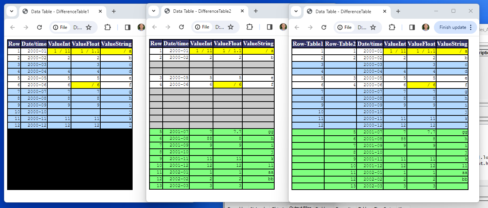
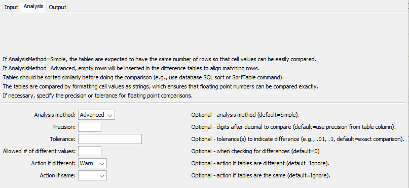
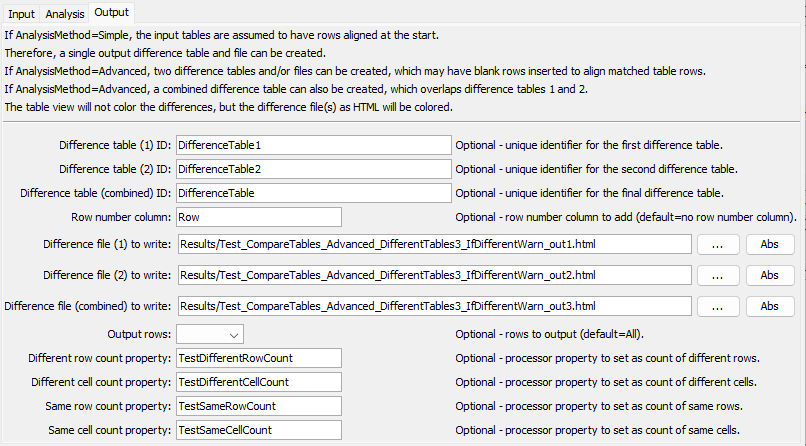

# TSTool / Command / CompareTables #

*   [Overview](#overview)
*   [Command Editor](#command-editor)
*   [Command Syntax](#command-syntax)
*   [Examples](#examples)
*   [Troubleshooting](#troubleshooting)
*   [See Also](#see-also)

-------------------------

## Overview ##

The `CompareTables` command compares data from two tables, with the following considerations:

*   The tables to compare should be sorted similarly (or have similar content)
    to avoid the results showing a large number of differences.
*   Comparisons are made using the data values formatted as strings based on the precision shown in tables.
    +   If the table was read with [`ReadTableFromDelimitedFile`](../ReadTableFromDelimitedFile/ReadTableFromDelimitedFile.md),
        the precision for floating point numbers is set based on the largest
        number of digits after the decimal encountered in the input.
    +   If the table was read from a database, the precision is based on database column precision.
    +   The precision from other sources depends on the input source.
*   A tolerance can optionally be specified to control the comparison of floating point values.
*   The first table's content is considered the primary content for comparison purposes.
*   The comparison can use the `Simple` or `Advanced` analysis method.
    +   `AnalysisMethod=Simple` assumes that the tables have the same structure and
        can be compared without inserting rows to align,
        for example data read from similar datasets.
    +   `AnalysisMethod=Advanced` will cause rows to be inserted in output to align
        matching table rows, where matching rows can be specified using
        one or more columns (e.g., column(s) that provide unique identifiers).
*   The determination of the number of differences uses the first difference table to compare cell values,
    ignoring the row number columns.  See the example below.

If `AnalysisMethod=Simple`, then a single "difference table" and file can be created to show differences.
If `AnalysisMethod=Advanced`, then a "difference table" and file can be created for each of the two input files
and a combined difference file.
Creating an HTML output file allows differences to be color coded.

The following example shows HTML output files from `AnalysisMethod=Advanced`.

**<p style="text-align: center;">

</p>**

**<p style="text-align: center;">
`CompareTables` Difference Tables (<a href="../difftables.png">see full-size image</a>)
</p>**

*   The `RowNumberColumn` parameter can be specified to insert a row number column in each table,
    which helps to cross-reference with the original table rows.
*   Cells that are the same in both tables have a white background and
    rows are aligned horizontally.
*   Values that are different have yellow background and show both tables' values as text.
*   Rows that exist only in the first (left) table have blue background.
*   Rows that exist only in the second (right) table have green background.
*   Rows with empty cells that are added to align rows have grey background.
*   Rows that do not exist in the table have black background.
*   Cells that could not be evaluated and have unknown comparison are shown in darker grey
    (should only occur if there is a software error).
*   Cells that could not be compared have a red background
    (should only occur if there is a software error).

## Command Editor ##

The command is available in the following TSTool menus:

*   ***Commands / General - Test Processing***
*   ***Commands(Table) / Analyze Table***

The following dialog is used to edit the command and illustrates the command syntax for command parameters.

**<p style="text-align: center;">

</p>**

**<p style="text-align: center;">
`CompareTables` Command Editor for Input Parameters (<a href="../CompareTables.png">see full-size image</a>)
</p>**

Analysis parameters are specified using the ***Analysis*** tab.

**<p style="text-align: center;">

</p>**

**<p style="text-align: center;">
`CompareTables` Command Editor for Analysis Parameters (<a href="../CompareTables-Analysis.png">see full-size image</a>)
</p>**

Output parameters are specified using the ***Output*** tab.

**<p style="text-align: center;">

</p>**

**<p style="text-align: center;">
`CompareTables` Command Editor for Output Parameters (<a href="../CompareTables-Output.png">see full-size image</a>)
</p>**

## Command Syntax ##

The command syntax is as follows:

```text
CompareTables(Parameter="Value",...)
```
**<p style="text-align: center;">
Input Command Parameters
</p>**

|**Parameter**&nbsp;&nbsp;&nbsp;&nbsp;&nbsp;&nbsp;&nbsp;&nbsp;&nbsp;&nbsp;&nbsp;&nbsp;&nbsp;&nbsp;&nbsp; | **Description** | **Default**&nbsp;&nbsp;&nbsp;&nbsp;&nbsp;&nbsp;&nbsp;&nbsp;&nbsp;&nbsp;&nbsp;&nbsp;&nbsp;&nbsp;&nbsp;&nbsp;&nbsp;&nbsp;&nbsp;&nbsp;&nbsp; |
|--------------|-----------------|----------------- |
|`Table1ID`<br>**required**|The identifier for the first table to compare, can use `${Property}` notation.|None – must be specified.|
|`Table2ID`<br>**required**|The identifier for the second table to compare, can use `${Property}` notation. | None – must be specified. |
|`CompareColumns1`|The names of columns to compare from the first table, separated by commas, can use `${Property}` notation.|All columns will be compared.|
|`ExcludeColumns1`|The names of columns in the first table to exclude from the comparison, separated by commas, can use `${Property}` notation.|All columns will be compared.|
|`MatchColumns1`|Used with `AnalysisMethod=Advanced`, the names of columns in the first table to match when aligning rows, separated by commas, can use `${Property}` notation.|All columns will be compared to align.|
|`CompareColumns2`|The names of columns to compare from the second table, separated by commas, can use `${Property}` notation.|All columns will be compared, can use `${Property}` notation.|
|`ExcludeColumns2`|The names of columns in the second table to exclude from the comparison, separated by commas, can use `${Property}` notation.|All columns will be compared.|
|`MatchColumns2`|Used with `AnalysisMethod=Advanced`, the names of columns in the second table to match when aligning rows, separated by commas, can use `${Property}` notation.|All columns will be compared to align.|
|`MatchColumnsHow`|Indicate how columns are matched:<ul><li>`Name` - match column names</li><li>`Order` - match columns by order number (used when column names are not available)</li></ul>| `Name` |

**<p style="text-align: center;">
Analysis Command Parameters
</p>**

|**Parameter**&nbsp;&nbsp;&nbsp;&nbsp;&nbsp;&nbsp;&nbsp;&nbsp;&nbsp;&nbsp;&nbsp;&nbsp;&nbsp;&nbsp;&nbsp; | **Description** | **Default**&nbsp;&nbsp;&nbsp;&nbsp;&nbsp;&nbsp;&nbsp;&nbsp;&nbsp;&nbsp;&nbsp;&nbsp;&nbsp;&nbsp;&nbsp;&nbsp;&nbsp;&nbsp;&nbsp;&nbsp;&nbsp; |
|--------------|-----------------|----------------- |
|`AnalysisMethod`|The analysis method:<ul><li>`Advanced` - use for complex tables that may need rows aligned for comparison</li><li>`Simple` - use for simple tables that have the same structure and alignment</li></ul>.|`Simple`|
|`Precision`|The number of digits after the decimal to consider when comparing floating point values. If values are different to the specified (or default) precision, both values are shown in the comparison table.|Format floating point numbers as strings for comparison according to the table column precision.|
|`Tolerance`|A value indicating the allowed difference between floating point values.  The tolerance should be consistent with the precision (i.e., don’t specify a coarse precision and fine tolerance).  If the difference is less than the tolerance, the values will not be marked as different.|Floating point values must exactly match, according to the precision.|
|`AllowedDiff`|The allowed number of differences before triggering a Warn/Fail message (see `IfDifferent`).  A value >= 0 indicates that the number of differences must be the same as the specified value.  A negative value indicates that the number of differences can be less than or equal to the specified value.  This parameter is useful for constructing tests where a specified number of differences is expected.|0|
|`IfDifferent`|Indicates the action to take if the tables are different:<ul><li>`Ignore` – do not generate warning</li><li>`Warn` – generate a warning message</li><li>`Fail` – generate a failure message</li></ul>|Do not generate a warning if the tables are different.|
|`IfSame`|Indicates the action to take if the tables are the same:<ul><li>`Ignore` – do not generate warning</li><li>`Warn` – generate a warning message</li><li>`Fail` – generate a failure message</li></ul>|Do not generate a warning if the tables are the same.|

**<p style="text-align: center;">
Output Command Parameters
</p>**

|**Parameter**&nbsp;&nbsp;&nbsp;&nbsp;&nbsp;&nbsp;&nbsp;&nbsp;&nbsp;&nbsp;&nbsp;&nbsp;&nbsp;&nbsp;&nbsp;&nbsp;&nbsp;&nbsp;&nbsp;&nbsp;&nbsp;&nbsp;&nbsp;&nbsp;&nbsp;&nbsp;&nbsp; | **Description** | **Default**&nbsp;&nbsp;&nbsp;&nbsp;&nbsp;&nbsp;&nbsp;&nbsp;&nbsp;&nbsp;&nbsp;&nbsp;&nbsp;&nbsp;&nbsp;&nbsp;&nbsp;&nbsp;&nbsp;&nbsp;&nbsp;&nbsp;&nbsp;&nbsp;&nbsp;&nbsp;&nbsp;&nbsp;&nbsp;&nbsp;&nbsp; |
|--------------|-----------------|----------------- |
|`DiffTable1ID`|The identifier for the first difference table, which indicates differences from the perspective of the first table, can use `${Property}` notation.  This was `NewTableID` prior to TSTool 14.9.3. |`Table1ID-Table2ID-diff1`|
|`DiffTable2ID`|The identifier for the second difference table, which indicates differences from the perspective of the second table, can use `${Property}` notation. |`Table1ID-Table2ID-diff2`|
|`DiffTableID`|The identifier for the combined difference table, can use `${Property}` notation. | Not created. |
|`RowNumberColumn`| New column to add to output containing the row number from the original table, can use `${Property}` notation. | |
|`DiffFile1`|If specified, an HTML table will be created for the first difference table, with colored cells, can use `${Property}` notation.  This was `OutputFile` prior to TSTool 14.9.3. | No HTML output file will be created. |
|`DiffFile2`|If specified, an HTML table will be created for the second difference table, with colored cells, can use `${Property}` notation. | No HTML output file will be created. |
|`DiffFile`|If specified, an HTML table will be created for the combined difference table, with colored cells, can use `${Property}` notation. | No HTML output file will be created. |
|`OutputRows`| Indicate which difference table rows to output:<ul><li>`All` - output all rows</li><li>`Different` - output only different rows</li><li>`Same` - output only same rows</li></ul> | `All`|
|`DiffRowCountProperty` | Name of the processor property to set with the number of different rows, can use `${Property}` notation. | |
|`DiffCellCountProperty` | Name of the processor property to set with the number of different cells, can use `${Property}` notation. | |
|`SameRowCountProperty` | Name of the processor property to set with the number of same rows, can use `${Property}` notation. | |
|`SameCellCountProperty` | Name of the processor property to set with the number of same cells, can use `${Property}` notation. | |

## Examples ##

See the [automated tests](https://github.com/OpenCDSS/cdss-app-tstool-test/tree/master/test/commands/CompareTables).

The tests with `Legacy` in the name use older command parameter names.

## Troubleshooting ##

See the main [TSTool Troubleshooting](../../troubleshooting/troubleshooting.md) documentation.

## See Also ##

*   [`CompareFiles`](../CompareFiles/CompareFiles.md) command
*   [`CompareTimeSeries`](../CompareTimeSeries/CompareTimeSeries.md) command
*   [`ReadTableFromDelimitedFile`](../ReadTableFromDelimitedFile/ReadTableFromDelimitedFile.md) command
