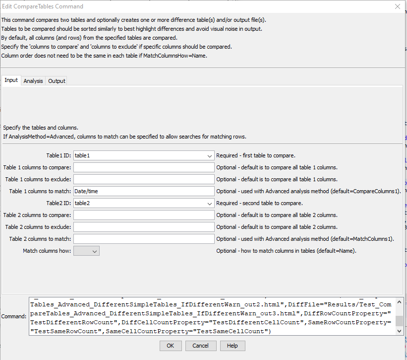

# TSTool / Command / CompareTables #

* [Overview](#overview)
* [Command Editor](#command-editor)
* [Command Syntax](#command-syntax)
* [Examples](#examples)
* [Troubleshooting](#troubleshooting)
* [See Also](#see-also)

-------------------------

## Overview ##

The `CompareTables` command compares columns from two tables, saving the results in a new table.
Comparisons are made using the data values formatted as strings based on the precision shown in tables.
If the table was read with [`ReadTableFromDelimitedFile`](../ReadTableFromDelimitedFile/ReadTableFromDelimitedFile.md),
the precision for floating point numbers is set based on the largest
number of digits after the decimal encountered in the input.
Optionally, a precision and tolerance can be specified to control the comparison of floating point values.
Values that are the same are shown in the new table without modification.
Values that are different result in both table values being shown (as strings) to allow comparison.
The command also allows the comparison table to be output to an HTML file, in which case different values are shown as red.

## Command Editor ##

The following dialog is used to edit the command and illustrates the command syntax.

**<p style="text-align: center;">

</p>**

**<p style="text-align: center;">
`CompareTables` Command Editor (<a href="../CompareTables.png">see also the full-size image</a>)
</p>**

## Command Syntax ##

The command syntax is as follows:

```text
CompareTables(Parameter="Value",...)
```
**<p style="text-align: center;">
Command Parameters
</p>**

|**Parameter**&nbsp;&nbsp;&nbsp;&nbsp;&nbsp;&nbsp;&nbsp;&nbsp;&nbsp;&nbsp;&nbsp;&nbsp;&nbsp;&nbsp;&nbsp; | **Description** | **Default**&nbsp;&nbsp;&nbsp;&nbsp;&nbsp;&nbsp;&nbsp;&nbsp;&nbsp;&nbsp;&nbsp;&nbsp;&nbsp;&nbsp;&nbsp;&nbsp;&nbsp;&nbsp;&nbsp;&nbsp;&nbsp; |
|--------------|-----------------|----------------- |
|`TableID1`<br>**required**|The identifier for the first table to be compared.|None – must be specified.|
|`TableID2`<br>**required**|The identifier for the second table to be compared.	None – must be specified.
|`CompareColumns1`|The names of columns to be compared from the first table, separated by commas.|All columns will be compared.|
|`CompareColumns2`|The names of columns to be compared from the second table, separated by commas.|All columns will be compared.|
|`Precision`|The number of digits after the decimal to consider when comparing floating point values. If values are different to the specified (or default) precision, both values are shown in the comparison table.|Format floating point numbers as strings for comparison according to the table column precision.|
|`Tolerance`|A value indicating the allowed difference between floating point values.  The tolerance should be consistent with the precision (i.e., don’t specify a coarse precision and fine tolerance).  If the difference is less than the tolerance, the values will not be marked as different.|Floating point values must exactly match, according to the precision.|
|`AllowedDiff`|The allowed number of differences before triggering a Warn/Fail message (see `IfDifferent`).  A value >= 0 indicates that the number of differences must be the same as the specified value.  A negative value indicates that the number of differences can be less than or equal to the specified value.  This parameter is useful for constructing tests where a specified number of differences is expected.|0|
|`NewTableID`|The identifier for the new comparison table.|`Table1ID-Table2ID-comparison`|
|`OutputFile`|If specified, an HTML table will be created for the comparison table, in which different values are highlighted in red.|No HTML output file will be created.|
|`IfDifferent`|Indicates the action to be taken if the tables are different:<ul><li>`Ignore` – do not generate warning</li><li>`Warn` – generate a warning message</li><li>`Fail` – generate a failure message</li></ul>|Do not generate a warning if the tables are different.|
|`IfSame`|Indicates the action to be taken if the tables are the same:<ul><li>`Ignore` – do not generate warning</li><li>`Warn` – generate a warning message</li><li>`Fail` – generate a failure message</li></ul>|Do not generate a warning if the tables are the same.|

## Examples ##

See the [automated tests](https://github.com/OpenCDSS/cdss-app-tstool-test/tree/master/test/commands/CompareTables).

## Troubleshooting ##

## See Also ##

* [`CompareFiles`](../CompareFiles/CompareFiles.md) command
* [`CompareTimeSeries`](../CompareTimeSeries/CompareTimeSeries.md) command
* [`ReadTableFromDelimitedFile`](../ReadTableFromDelimitedFile/ReadTableFromDelimitedFile.md) command
