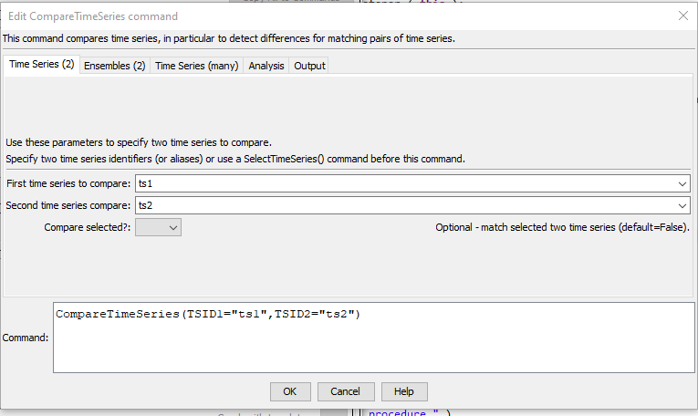
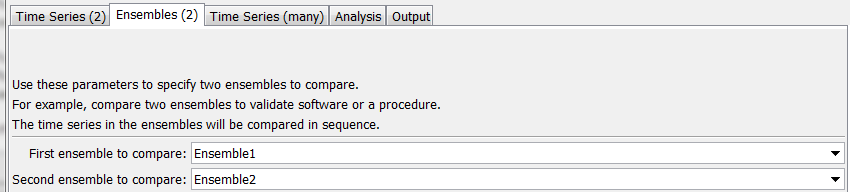
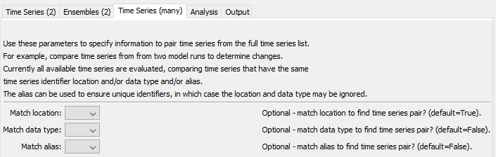
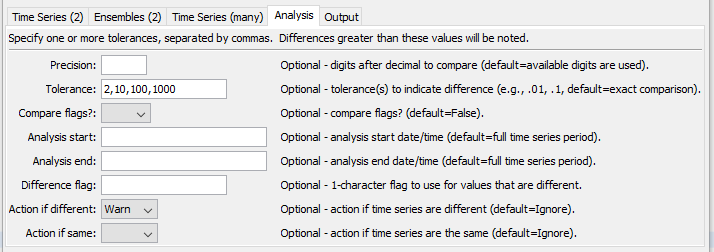
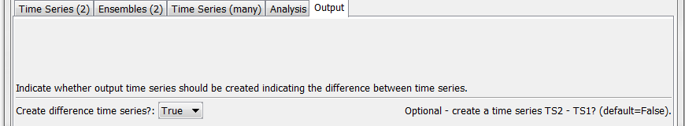

# TSTool / Command / CompareTimeSeries #

* [Overview](#overview)
* [Command Editor](#command-editor)
* [Command Syntax](#command-syntax)
* [Examples](#examples)
* [Troubleshooting](#troubleshooting)
* [See Also](#see-also)

-------------------------

## Overview ##

The `CompareTimeSeries` command compares time series to determine data differences.
This command is often used to test a process.
Currently time series properties (e.g., name, units) are NOT compared – only data values are compared.
It is designed to process many time series in bulk fashion.
Time series to compare are determined by trying to match each available time series
with another time series in the list (ignoring itself) using one of the following options for input:

* Two lists of time series, for example the same set of time series from two different databases
or model results.
Typically the location identifiers and possibly data types will be the same in the two lists.
* Compare two time series directly.
* Compare time series from two ensembles.

Time series that are not matched are listed in output and the second time series is treated
as completely missing.

Time series are compared value by value for each date/time in the analysis period,
with the differences computed as the value
from the second time series minus the value from the first time series.
The values that are compared can be rounded based on a specified precision.
If necessary, read each set of time series from files to ensure that final round off is consistent.
The checks occur by comparing the difference to one or more specified tolerances.
Differences and simple statistics are optionally printed to output files
(see `DifferenceFile` and `SummaryFile` command parameters).
Values that are different can optionally be indicated using the following:

* set a character flag, for use with the graphing package
* create a time series of the differences that can be visualized using graph or raster graph
* generate a command warning if a difference is detected, or if no differences are detected
* create a table record listing the difference, which can viewed or output with other commands
* set a processor property with count of the number of time series that are different

Date/time in time series is handled as follows:

* In order to compare time series, it is important that the date/times for data values align.
Lack of alignment can result in differences.
**There is currently no command feature to accept date/time differences within a tolerance.**
* The date/time precision of the time series should be the same.
For regular-interval time series, the interval base and date/time precision are the same (e.g., 5Min interval
has a precision of minute).
For irregular interval time series the time series interval may be `irregular` and the precision must
be determined from the period date/times.
TSTool is being updated over time to support irregular interval with base (e.g., "IrregDay") but this is not universal.
* To help ensure alignment of time series, the following approach is taken:
	+ Regular interval time series:  Are compared as usual because the times should line up.
	+ Irregular interval time series:  If at least one of the two time series are irregular interval,
	the date/times for both time series are added to a sorted list, which is used to retrieve data from
	both time series.  Any date/times that result in only one value will result in a difference.

See also the [`CompareFiles`](../CompareFiles/CompareFiles.md) and [`CompareTables`](../CompareTables/CompareTables.md) commands.

## Command Editor ##

The following dialog is used to edit the command and illustrates the command syntax when comparing two time series.

**<p style="text-align: center;">

</p>**

**<p style="text-align: center;">
`CompareTimeSeries` Command Editor Showing Parameters to Compare 2 Time Series (<a href="../CompareTimeSeries_2.png">see also the full-size image</a>)
</p>**

The following dialog is used to edit the command and illustrates the command syntax when comparing two ensembles.

**<p style="text-align: center;">

</p>**

**<p style="text-align: center;">
`CompareTimeSeries` Command Editor Showing Parameters to Compare 2 Ensembles (<a href="../CompareTimeSeries_2Ensembles.png">see also the full-size image</a>)
</p>**

The following dialog is used to edit the command and illustrates the command syntax when comparing many time series.

**<p style="text-align: center;">

</p>**

**<p style="text-align: center;">
`CompareTimeSeries` Command Editor Showing Parameters to Compare Many Time Series (<a href="../CompareTimeSeries_Many.png">see also the full-size image</a>)
</p>**

The following dialog is used to edit the command and illustrates the command syntax for analysis parameters.

**<p style="text-align: center;">

</p>**

**<p style="text-align: center;">
`CompareTimeSeries` Command Editor Showing Analysis Parameters (<a href="../CompareTimeSeries_Analysis.png">see also the full-size image</a>)
</p>**

The following dialog is used to edit the command and illustrates the command syntax for output parameters.

**<p style="text-align: center;">

</p>**

**<p style="text-align: center;">
`CompareTimeSeries` Command Editor showing Output Parameters (<a href="../CompareTimeSeries_Output.png">see also the full-size image</a>)
</p>**

## Command Syntax ##

The command syntax is as follows:

```text
CompareTimeSeries(Parameter="Value",...)
```
**<p style="text-align: center;">
Command Parameters
</p>**

|**Tab**| **Parameter**&nbsp;&nbsp;&nbsp;&nbsp;&nbsp;&nbsp;&nbsp;&nbsp;&nbsp;&nbsp;&nbsp;&nbsp;&nbsp;&nbsp;&nbsp;&nbsp;&nbsp;&nbsp;&nbsp;&nbsp;&nbsp;&nbsp;&nbsp;&nbsp;&nbsp;&nbsp; | **Description** | **Default**&nbsp;&nbsp;&nbsp;&nbsp;&nbsp;&nbsp;&nbsp;&nbsp;&nbsp;&nbsp; |
|---|--------------|-----------------|----------------- |
|***Time Series (2)***|`TSID1`|First time series identifier (or alias) to compare.|Specify if only 2 time series are compared.|
||`TSID2`|Second time series identifier (or alias) to compare.|Specify if only 2 time series are compared.|
|***Ensembles (2)***|`EnsembleID1`|First ensemble identifier to compare.|Specify if time series from 2 ensembles are compared.|
||`EnsembleID2`|Second ensemble identifier to compare.|Specify if time series from 2 ensembles are compared.|
|***Time Series (many)***|`MatchLocation`|Match the location part of time series identifiers when matching time series to compare.|`True`|
||`MatchDataType`|Match the data type part of time series identifiers when matching time series to compare.|`False`|
|***Analysis***|`Precision`|When comparing data values, round the values to the given precision.  For example, a precision of 2 will round to the hundredths place.  This can be used to do comparisons on the lowest precision of the available time series.|Compare the available values without rounding.|
||`Tolerance`|Specify a comma-separated list of values.  The difference in the time series values will be compared to the tolerances and messages printed to the log file.|A tolerance of zero will be used to detect differences.|
||`CompareFlags`|Indicate whether data flags should be compared, `False` or `True`. | `False`|
||`AnalysisStart`|The starting date/time to analyze for differences.  Specify a date/time of appropriate precision for the time series or `OutputStart` to use the output start.|Analyze all available data.|
||`AnalysisEnd`|The ending date/time to analyze for differences.  Specify a date/time of appropriate precision for the time series or `OutputEnd` to use the output end.|Analyze all available data.|
||`DiffFlag`|Specify as a single character to append a flag to the data flags for the time series.  Each value that is different is flagged in both time series that are compared.  The flag can be displayed by the graphing package.  This is useful for verification processes.  New time series will be created with the original identifier preceded by `Diff_`.|Do not flag data.|
||`IfDifferent`|Action taken if a difference is detected:<ul><li>`Ignore` - no action is taken</li><li>`Warn` - a warning message is generated</li><li>`Fail` - a failure message is generted</li></ul>| `Ignore` because one of `IfDifferent` or `IsSame` must be specified. |
||`IfSame`| Action taken if no differences are detected:<ul><li>`Ignore` - no action is taken</li><li>`Warn` - a warning message is generated</li><li>`Fail` - a failure message is generted</li></ul>| `Ignore` because one of `IfDifferent` or `IsSame` must be specified. |
|***Output***|`CreateDiffTS`|Indicate whether a time series should be created containing the differences between time series (TS2 – TS1):<ul><li>`False` - do not create difference time series (fastest)</li><li>`IfDifferent` - create difference time series when a difference is detected (next fastest)</li><li>`True` - create difference time series for all time series, even if no differences are found (slowest)</li></ul>  Difference time series are useful to visually evaluate the differences and process the results with other commands.  For example, see raster graphs and the [`ProcessRasterGraph`](../ProcessRasterGraph/ProcessRasterGraph.md). |`False`|
||`DifferenceFile` | Path to output file containing a list of all time series and whether differences are detected. Can specify using `${Property}` syntax.| Do not create file. |
||`SummaryFile` | Path to output file containing a summary of time series with differences. Can specify using `${Property}` syntax.| Do not create file. |
||`TableID`| Table identifier for table to create listing differences.| No output table will be created. |
||`DiffCountProperty`| Name of processor property to set with count of timesteps with differences.| No property will be set.|

## Examples ##

* See the [automated tests](https://github.com/OpenCDSS/cdss-app-tstool-test/tree/master/test/commands/CompareTimeSeries).

The following example illustrates how time series from two files can be compared.
For example, use similar commands to compare results from two model runs or two database queries:

```
# Example to compare files.  Since they are different, a warning will be generated.
ReadDateValue(InputFile="RawData1.dv")
ReadDateValue(InputFile="RawData1Scaled.dv")
CompareTimeSeries(Precision=2,WarnIfDifferent=True)
```

The following example compares matching time series for the full available period, doing checks for several tolerances:

```
CompareTimeSeries(Precision=2,Tolerance="0,.1,.5,1",DiffFlag="x")
```

The following example compares data only within the output period, as specified by the [`SetOutputPeriod`](../SetOutputPeriod/SetOutputPeriod.md) command:

```
CompareTimeSeries(Precision=2,Tolerance="0,.1,.5,1",
AnalysisStart="OutputStart",AnalysisEnd="OutputEnd",DiffFlag="x")
```

## Troubleshooting ##

## See Also ##

* [`CompareFiles`](../CompareFiles/CompareFiles.md) command
* [`CompareTables`](../CompareTables/CompareTables.md) command
* [`ProcessRasterGraph`](../ProcessRasterGraph/ProcessRasterGraph.md) command
* [`RunCommands`](../RunCommands/RunCommands.md) command
* [`SetOutputPeriod`](../SetOutputPeriod/SetOutputPeriod.md) command
