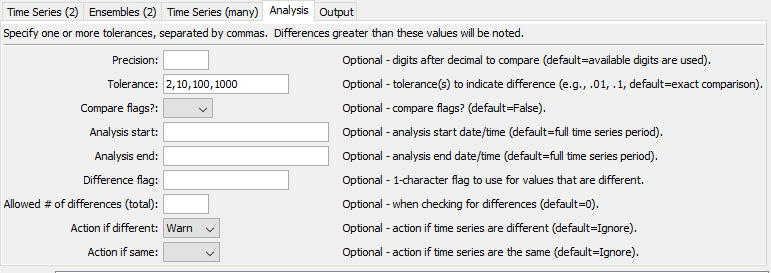
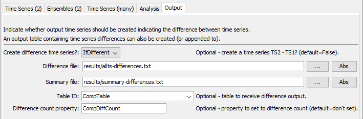

# TSTool / Command / CompareTimeSeries #

* [Overview](#overview)
* [Command Editor](#command-editor)
* [Command Syntax](#command-syntax)
* [Examples](#examples)
* [Troubleshooting](#troubleshooting)
* [See Also](#see-also)

-------------------------

## Overview ##

The `CompareTimeSeries` command compares time series to determine data differences.
This command is often used to test a process.
Currently time series header information is NOT compared – only data values are compared.
It is designed to process many time series in bulk fashion.
Time series to compare are determined by trying to match each available time series
with another time series in the list (ignoring itself) using one of the following options for input:

* Two lists of time series, for example the same set of time series from two different databases or files.
Typically the location identifiers and possibly data types will be the same in the two lists.
* Compare two time series directly.
* Compare time series from two ensembles.
	
Time series are compared value by value, with the differences computed as the value
from the second time series minus the value from the first time series.
The values can be rounded based on a specified precision.
It may be important to read each set of time series from files to ensure that final round off is consistent.
The checks occur by comparing the difference to one or more specified tolerances.
Differences and simple statistics are printed to the log file.
Values that are different can optionally be tagged with a character flag, for use with the graphing package.
Time series of the differences can optionally be created.
A warning can be generated if a difference is detected,
or if no differences are detected.
See also the [`CompareFiles`](../CompareFiles/CompareFiles) and [`CompareTables`](../CompareTables/CompareTables) commands).

## Command Editor ##

The following dialog is used to edit the command and illustrates the command syntax when comparing two time series.
<a href="../CompareTimeSeries_2.png">See also the full-size image.</a>


**<p style="text-align: center;">
`CompareTimeSeries` Command Editor Showing Parameters to Compare 2 Time Series
</p>**

The following dialog is used to edit the command and illustrates the command syntax when comparing two ensembles.
<a href="../CompareTimeSeries_2Ensembles.png">See also the full-size image.</a>


**<p style="text-align: center;">
`CompareTimeSeries` Command Editor Showing Parameters to Compare 2 Ensembles
</p>**

The following dialog is used to edit the command and illustrates the command syntax when comparing many time series.
<a href="../CompareTimeSeries_Many.png">See also the full-size image.</a>


**<p style="text-align: center;">
`CompareTimeSeries` Command Editor Showing Parameters to Compare Many Time Series
</p>**

The following dialog is used to edit the command and illustrates the command syntax for analysis parameters.
<a href="../CompareTimeSeries_Analysis.png">See also the full-size image.</a>



**<p style="text-align: center;">
`CompareTimeSeries` Command Editor Showing Analysis Parameters
</p>**

The following dialog is used to edit the command and illustrates the command syntax for output parameters.
<a href="../CompareTimeSeries_Output.png">See also the full-size image.</a>



**<p style="text-align: center;">
`CompareTimeSeries` Command Editor showing Output Parameters
</p>**

## Command Syntax ##

The command syntax is as follows:

```text
CompareTimeSeries(Parameter="Value",...)
```
**<p style="text-align: center;">
Command Parameters
</p>**

|**Compare Method**| **Parameter**&nbsp;&nbsp;&nbsp;&nbsp;&nbsp;&nbsp;&nbsp;&nbsp;&nbsp;&nbsp;&nbsp;&nbsp;&nbsp;&nbsp;&nbsp;&nbsp;&nbsp;&nbsp;&nbsp;&nbsp;&nbsp;&nbsp;&nbsp;&nbsp;&nbsp;&nbsp; | **Description** | **Default**&nbsp;&nbsp;&nbsp;&nbsp;&nbsp;&nbsp;&nbsp;&nbsp;&nbsp;&nbsp; |
|--------------|-----------------|----------------- |
|2 time series|`TSID1`|First time series identifier (or alias) to compare.|Specify if only 2 time series are compared.|
|2 time series|`TSID2`|Second time series identifier (or alias) to compare.|Specify if only 2 time series are compared.|
|2 enembles|`EnsembleID1`|First ensemble identifier to compare.|Specify if time series from 2 ensembles are compared.|
|2 enembles|`EnsembleID2`|Second ensemble identifier to compare.|Specify if time series from 2 ensembles are compared.|
||`MatchLocation`|Match the location part of time series identifiers when matching time series to compare.|`True`|
||`MatchDataType`|Match the data type part of time series identifiers when matching time series to compare.|`False`|
||`Precision`|When comparing data values, round the values to the given precision.  For example, a precision of 2 will round to the hundredths place.  This can be used to do comparisons on the lowest precision of the available time series.|Compare the available values without rounding.|
||`Tolerance`|Specify a comma-separated list of values.  The difference in the time series values will be compared to the tolerances and messages printed to the log file.|A tolerance of zero will be used to detect differences.|
||`AnalysisStart`|The starting date/time to analyze for differences.  Specify a date/time of appropriate precision for the time series or `OutputStart` to use the output start.|Analyze all available data.|
||`AnalysisEnd`|The ending date/time to analyze for differences.  Specify a date/time of appropriate precision for the time series or `OutputEnd` to use the output end.|Analyze all available data.|
||`DiffFlag`|Specify as a single character to append a flag to the data flags for the time series.  Each value that is different is flagged in both time series that are compared.  The flag can be displayed by the graphing package.  This is useful for verification processes.  New time series will be created with the original identifier preceded by `Diff_`.|Do not flag data.|
||`WarnIfDifferent`|If `True` and at least one difference is detected, a warning will be generated by the command, which will result in software like TSTool displaying a warning.  If `False`, only status messages are written to the log file.  The warning is useful if it is critical to detect any change in the time series.|Do not generate a warning if time series are different.  Differences are printed to the log file.|
||`WarnIfSame`|If `True` and no differences are detected, a warning will be generated by the command, which will result in software like TSTool displaying a warning.  If `False`, only status messages are written to the log file.  The warning is useful if it is critical to detect that time series are the same.|Do not generate a warning if time series are the same.|
||`CreateDiffTS`|Indicate whether a time series should be created containing the differences between time series (TS2 – TS1).  This is useful to visually evaluate the differences and process the results with other commands.|`False`|

## Examples ##

* See the [automated tests](https://github.com/OpenWaterFoundation/cdss-app-tstool-test/tree/master/test/regression/commands/general/CompareTimeSeries).

The following example illustrates how time series from two files can be compared.
For example, use similar commands to compare results from two model runs or two database queries:

```
# Example to compare files.  Since they are different, a warning will be generated.
ReadDateValue(InputFile="RawData1.dv")
ReadDateValue(InputFile="RawData1Scaled.dv")
CompareTimeSeries(Precision=2,WarnIfDifferent=True)
```

The following example compares matching time series for the full available period, doing checks for several tolerances:

```
CompareTimeSeries(Precision=2,Tolerance="0,.1,.5,1",DiffFlag="x")
```

The following example compares data only within the output period, as specified by the [`SetOutputPeriod`](../SetOutputPeriod/SetOutputPeriod) command:

```
CompareTimeSeries(Precision=2,Tolerance="0,.1,.5,1",
AnalysisStart="OutputStart",AnalysisEnd="OutputEnd",DiffFlag="x")
```

## Troubleshooting ##

## See Also ##

* [`CompareFiles`](../CompareFiles/CompareFiles) command
* [`CompareTables`](../CompareTables/CompareTables) command
* [`RunCommands`](../RunCommands/RunCommands) command
* [`SetOutputPeriod`](../SetOutputPeriod/SetOutputPeriod) command
