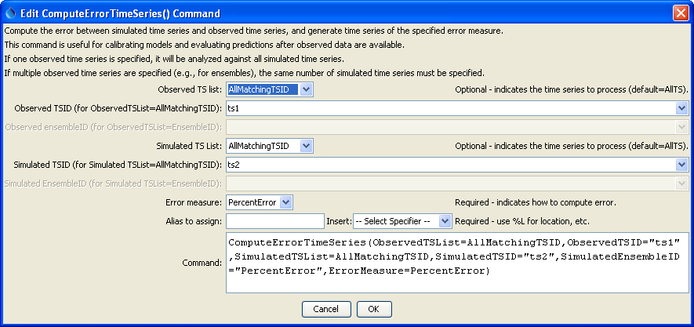

# TSTool / Command / ComputeErrorTimeSeries #

*   [Overview](#overview)
*   [Command Editor](#command-editor)
*   [Command Syntax](#command-syntax)
*   [Examples](#examples)
*   [Troubleshooting](#troubleshooting)
*   [See Also](#see-also)

-------------------------

## Overview ##

The `ComputeErrorTimeSeries` command computes the error
between two time series as absolute value or percent,
creating a new time series for each pair of time series that is compared.
This is useful for comparing observed and simulated time series.
The time series that are created have the simulated time series’ metadata but an alias can be assigned.
The command can be used to process multiple pairs of time series,
each determined using the appropriate `*TSList` parameter.

## Command Editor ##

The command is available in the following TSTool menu:

*   ***Commands / Analyze Time Series***

The following dialog is used to edit the command and illustrates the syntax of the command.

**<p style="text-align: center;">

</p>**

**<p style="text-align: center;">
`ComputeErrorTimeSeries` Command Editor (<a href="../ComputeErrorTimeSeries.png">see full-size image</a>)
</p>**

## Command Syntax ##

The command syntax is as follows:

```text
ComputeErrorTimeSeries(Parameter="Value",...)
```
**<p style="text-align: center;">
Command Parameters
</p>**

|**Parameter**&nbsp;&nbsp;&nbsp;&nbsp;&nbsp;&nbsp;&nbsp;&nbsp;&nbsp;&nbsp;&nbsp;&nbsp;&nbsp;&nbsp;&nbsp;&nbsp;&nbsp;&nbsp;&nbsp;&nbsp;&nbsp;&nbsp;|**Description**|**Default**&nbsp;&nbsp;&nbsp;&nbsp;&nbsp;&nbsp;&nbsp;&nbsp;&nbsp;&nbsp;&nbsp;&nbsp;&nbsp;&nbsp;&nbsp;&nbsp;&nbsp;&nbsp;&nbsp;&nbsp;&nbsp;&nbsp;&nbsp;&nbsp;&nbsp;&nbsp;&nbsp;|
|--------------|-----------------|-----------------|
|`ObservedTSList`|Indicates the list of observed time series to be processed, one of:<br><ul><li>`AllMatchingTSID` – all time series that match the TSID (single TSID or TSID with wildcards) will be processed.</li><li>`AllTS` – all time series before the command.</li><li>`EnsembleID` – all time series in the ensemble will be processed (see the EnsembleID parameter).</li><li>`FirstMatchingTSID` – the first time series that matches the TSID (single TSID or TSID with wildcards) will be processed.</li><li>`LastMatchingTSID` – the last time series that matches the TSID (single TSID or TSID with wildcards) will be processed.</li><li>`SelectedTS` – the time series are those selected with the [`SelectTimeSeries`](../SelectTimeSeries/SelectTimeSeries.md) command.</li></ul> | `AllTS` |
|`ObservedTSID`|The time series identifier or alias for the observed time series to be processed, using the `*` wildcard character to match multiple time series.  Can be specified using `${Property}`.|Required if `ObservedTSList=*TSID`|
|`ObservedEnsembleID`|The observed ensemble to be processed, if processing an ensemble. Can be specified using `${Property}`.|Required if `ObservedTSList=*EnsembleID`|
|`SimulatedTSList`|Indicates how to determine the list of simulated time series (see the explanation of `ObservedTSList`).|`AllTS`|
|`SimulatedTSID`|The time series identifier or alias for the simulated time series (see the explanation of `ObservedTSID`).|Use when `SimulatedTSList=*MatchingTSID`.
|`SimulatedEnsembleID`|The ensemble identifier for the simulated time series (see the explanation of `SimulatedEnsembleID`).|Use when `SimulatedTSList=EnsembleID`|
|`ErrorMeasure`|The error measure to compute, one of:<ul><li>`PercentError` – Simulated minus observed, divided by observed.</li><li>`AbsoluteError` – **not yet implemented**.</li></ul>||
|`Alias`|The alias to assign to the time series, as a literal string or using the special formatting characters listed by the command editor.  The alias is a short identifier used by other commands to locate time series for processing, as an alternative to the time series identifier (TSID).|Alias will not be assigned.|

## Examples ##

See the [automated tests](https://github.com/OpenCDSS/cdss-app-tstool-test/tree/master/test/commands/ComputeErrorTimeSeries).

A sample command file is as follows (in this case using contrived data):

```
RemoveFile(InputFile="Results\Test_ComputeErrorTimeSeries_1_out.dv",WarnIfMissing=False)
NewPatternTimeSeries(Alias=”ts1”,NewTSID="ts1..test.Day",Description="Test data",SetStart="1950-01-01",SetEnd="1951-03-12",Units="CFS",PatternValues="5,10,12,13,75")
NewPatternTimeSeries(Alias=”ts2”,NewTSID="ts2..test.Day",Description="Test data",SetStart="1950-01-01",SetEnd="1951-03-12",Units="CFS",PatternValues="6,12,14,11.5,80")
ComputeErrorTimeSeries(ObservedTSList=AllMatchingTSID,ObservedTSID="ts1",SimulatedTSList=AllMatchingTSID,SimulatedTSID="ts2",ErrorMeasure=PercentError)
# Uncomment the following command to regenerate the expected results file.
# WriteDateValue(OutputFile="ExpectedResults\Test_ComputeErrorTimeSeries_1_out.dv")
WriteDateValue(OutputFile="Results\Test_ComputeErrorTimeSeries_1_out.dv")
CompareFiles(InputFile1="Results\Test_ComputeErrorTimeSeries_1_out.dv",InputFile2="ExpectedResults\Test_ComputeErrorTimeSeries_1_out.dv",WarnIfDifferent=True)
```

## Troubleshooting ##

See the main [TSTool Troubleshooting](../../troubleshooting/troubleshooting.md) documentation.

## See Also ##

*   [`SelectTimeSeries`](../SelectTimeSeries/SelectTimeSeries.md) command
