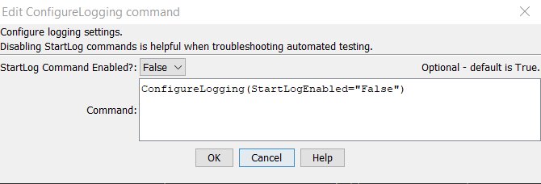

# TSTool / Command / ConfigureLogging #

*   [Overview](#overview)
*   [Command Editor](#command-editor)
*   [Command Syntax](#command-syntax)
*   [Examples](#examples)
*   [Troubleshooting](#troubleshooting)
*   [See Also](#see-also)

-------------------------

## Overview ##

The `ConfigureLogging` command configures logging features that are not
otherwise configured by other commands such as [`SetDebugLevel`](../SetDebugLevel/SetDebugLevel.md).
The command is particularly useful for disabling [`StartLog`](../StartLog/StartLog.md) commands
used with automated testing so that all logging output goes to the main log file.

## Command Editor ##

The command is available in the following TSTool menu:

*   ***Commands / General - Logging and Messaging***

The following dialog is used to edit the command and illustrates the command syntax.

**<p style="text-align: center;">

</p>**

**<p style="text-align: center;">
`ConfigureLogging` Command Editor Showing Conditions Test (<a href="../ConfigureLogging.png">see also the full-size image</a>)
</p>**

## Command Syntax ##

The command syntax is as follows:

```text
ConfigureLogging(Parameter="Value",...)
```
**<p style="text-align: center;">
Command Parameters
</p>**

| **Parameter**&nbsp;&nbsp;&nbsp;&nbsp;&nbsp;&nbsp;&nbsp;&nbsp;&nbsp;&nbsp;&nbsp;&nbsp;&nbsp;&nbsp;&nbsp;&nbsp;&nbsp;&nbsp;&nbsp;&nbsp;&nbsp;&nbsp;&nbsp;&nbsp;&nbsp;&nbsp; | **Description** | **Default**&nbsp;&nbsp;&nbsp;&nbsp;&nbsp;&nbsp;&nbsp;&nbsp;&nbsp;&nbsp; |
| --------------|-----------------|----------------- |
| `StartLogEnabled`| Indicate whether [`StartLog`](../StartLog/StartLog.md) commands should be enabled:<br><ul><li>`False` - commands will be disabled</li><li>`True` - commands will be enabled</li></ul>. | `True` |

## Examples ##

See the [automated tests](https://github.com/OpenCDSS/cdss-app-tstool-test/tree/master/test/commands/ConfigureLogging).

## Troubleshooting ##

See the main [TSTool Troubleshooting](../../troubleshooting/troubleshooting.md) documentation.

## See Also ##

*   [`SetDebugLevel`](../SetDebugLevel/SetDebugLevel.md) command - controls debug output
*   [`SetWarningLevel`](../SetWarningLevel/SetWarningLevel.md) command - controls warning output
*   [`StartLog`](../StartLog/StartLog.md) command - controls log file where messages are written
