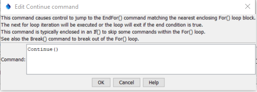

# TSTool / Command / Continue #

*   [Overview](#overview)
*   [Command Editor](#command-editor)
*   [Command Syntax](#command-syntax)
*   [Examples](#examples)
*   [Troubleshooting](#troubleshooting)
*   [See Also](#see-also)

-------------------------

## Overview ##

The `Continue` command causes logic to jump to the end of the current [`For`](../For/For.md) loop block.
It is typically enclosed in an [`If`](../If/If.md) block.
The loop will then increment the iteration property and the loop with either execute another iteration
or will be complete and logic will continue with the command after the corresponding
[`EndFor`](../EndFor/EndFor.md) command.

## Command Editor ##

The command is available in the following TSTool menu:

*   ***Commands / General - Running and Properties***

The following dialog is used to edit the command and illustrates the command syntax.

**<p style="text-align: center;">

</p>**

**<p style="text-align: center;">
`Continue` Command Editor (<a href="../Continue.png">see also the full-size image</a>)
</p>**

## Command Syntax ##

The command syntax is as follows:

```text
Continue()
```
**<p style="text-align: center;">
Command Parameters
</p>**

| **Parameter**&nbsp;&nbsp;&nbsp;&nbsp;&nbsp;&nbsp;&nbsp;&nbsp;&nbsp;&nbsp;&nbsp;&nbsp;&nbsp;&nbsp;&nbsp;&nbsp;&nbsp;&nbsp;&nbsp;&nbsp;&nbsp; | **Description** | **Default**&nbsp;&nbsp;&nbsp;&nbsp;&nbsp;&nbsp;&nbsp;&nbsp;&nbsp;&nbsp;&nbsp;&nbsp;&nbsp;&nbsp;&nbsp;&nbsp;&nbsp; |
| --------------|-----------------|----------------- |
| None | Currently the command does not use any parameters. |  |

## Examples ##

See the [automated tests](https://github.com/OpenCDSS/cdss-app-tstool-test/tree/master/test/commands/Continue).

## Troubleshooting ##

See the main [TSTool Troubleshooting](../../troubleshooting/troubleshooting.md) documentation.

## See Also ##

*   [`Break`](../Break/Break.md) command
*   [`EndFor`](../EndFor/EndFor.md) command
*   [`For`](../For/For.md) command
*   [`If`](../If/If.md) command
