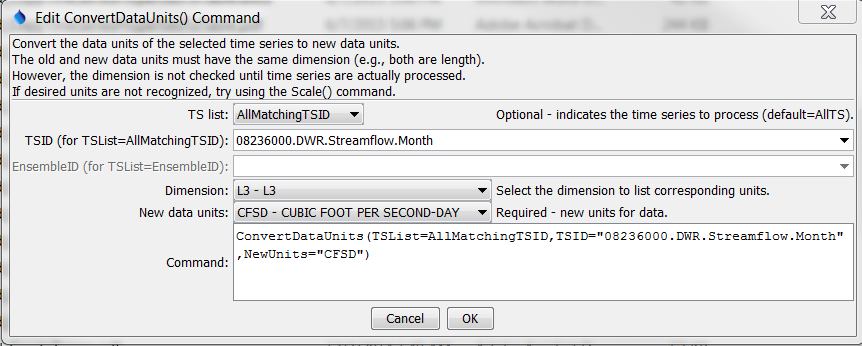

# TSTool / Command / ConvertDataUnits #

* [Overview](#overview)
* [Command Editor](#command-editor)
* [Command Syntax](#command-syntax)
* [Examples](#examples)
* [Troubleshooting](#troubleshooting)
* [See Also](#see-also)

-------------------------

## Overview ##

The `ConvertDataUnits` command converts the data units for a time series (e.g., before output to a file).
Some read and write commands also may allow units to be converted.
See also the [`Scale`](../Scale/Scale.md) command, which allows units of output to be specified.

## Command Editor ##

The following dialog is used to edit the command and illustrates the syntax of the command.

**<p style="text-align: center;">

</p>**

**<p style="text-align: center;">
`ConvertDataUnits` Command Editor (<a href="../ConvertDataUnits.png">see also the full-size image</a>)
</p>**

The ***Dimension*** choice should be selected to narrow the list of available units to the appropriate dimension.
Next, select the ***New Data Units*** for the time series.
The list of available data units is taken from the information described in the
TSTool `DATAUNIT` file (see the [TSTool Installation and Configuration Appendix](../../appendix-install/install.md) for more information).
If desired units are not available,
contact the TSTool developers to suggest adding units to the `DATAUNIT` file
or edit the command manually after initial creation.
See also the TSTool ***View / Data Units*** menu to view the current data units.

The dialog cannot display the current units for the time series
because the units are not available until time series are actually
processed – commands are edited before processing.

## Command Syntax ##

The command syntax is as follows:

```text
ConvertDataUnits(Parameter="Value",...)
```
**<p style="text-align: center;">
Command Parameters
</p>**

|**Parameter**&nbsp;&nbsp;&nbsp;&nbsp;&nbsp;&nbsp;&nbsp;&nbsp;&nbsp;&nbsp;&nbsp;|**Description**|**Default**&nbsp;&nbsp;&nbsp;&nbsp;&nbsp;&nbsp;&nbsp;&nbsp;&nbsp;&nbsp;&nbsp;&nbsp;&nbsp;&nbsp;&nbsp;&nbsp;&nbsp;&nbsp;&nbsp;&nbsp;&nbsp;&nbsp;&nbsp;&nbsp;&nbsp;&nbsp;&nbsp;|
|--------------|-----------------|-----------------|
|`TSList`|Indicates the list of time series to be processed, one of:<br><ul><li>`AllMatchingTSID` – all time series that match the TSID (single TSID or TSID with wildcards) will be processed.</li><li>`AllTS` – all time series before the command.</li><li>`EnsembleID` – all time series in the ensemble will be processed (see the EnsembleID parameter).</li><li>`FirstMatchingTSID` – the first time series that matches the TSID (single TSID or TSID with wildcards) will be processed.</li><li>`LastMatchingTSID` – the last time series that matches the TSID (single TSID or TSID with wildcards) will be processed.</li><li>`SelectedTS` – the time series are those selected with the [`SelectTimeSeries`](../SelectTimeSeries/SelectTimeSeries.md) command.</li></ul> | `AllTS` |
|`TSID`|The time series identifier or alias for the time series to be processed, using the `*` wildcard character to match multiple time series.  Can be specified using `${Property}`.|Required if `TSList=*TSID`|
|`EnsembleID`|The ensemble to be processed, if processing an ensemble. Can be specified using `${Property}`.|Required if `TSList=*EnsembleID`|
|`NewUnits`<br>**required**|The new data units. |None – must be specified.|

## Examples ##

See the [automated tests](https://github.com/OpenCDSS/cdss-app-tstool-test/tree/master/test/regression/commands/general/ConvertDataUnits).

A sample command file to convert the units of a time series from the [State of Colorado’s HydroBase database](../../datastore-ref/CO-HydroBase/CO-HydroBase.md)
is as follows:

```text
# 08236000 - ALAMOSA RIVER ABOVE TERRACE RESERVOIR
08236000.DWR.Streamflow.Month~HydroBase
ConvertDataUnits(TSList=AllMatchingTSID,TSID="08236000.DWR.Streamflow.Month",NewUnits="CFSD")
```
## Troubleshooting ##

## See Also ##

* [`Scale`](../Scale/Scale.md) command
* [`SelectTimeSeries`](../SelectTimeSeries/SelectTimeSeries.md) command
