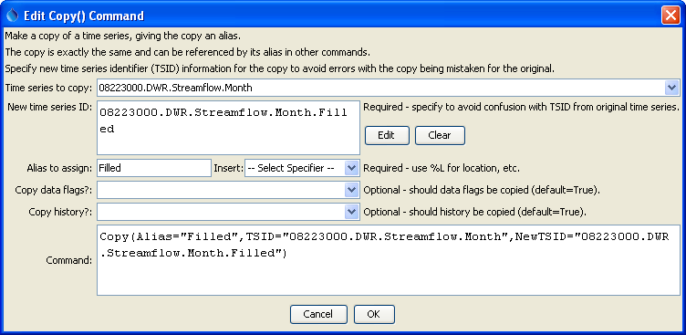

# TSTool / Command / Copy #

* [Overview](#overview)
* [Command Editor](#command-editor)
* [Command Syntax](#command-syntax)
* [Examples](#examples)
* [Troubleshooting](#troubleshooting)
* [See Also](#see-also)

-------------------------

## Overview ##

The `Copy` command creates a copy of an existing time series, assigning an alias to the result.
The copy is an exact copy except that the alias is different
(the TSID must also specified and should be defined to be unique).
The alias can then be used for further time series manipulation.
A copy of a time series is useful when data filling or other manipulation
will occur and time series that is unique from the original is needed.
For example, if adding two time series, a copy of one time series can be made,
and the second time series added to the copy – this ensures that there is not confusion with the original time series.
Parameters are available to control how much of the original data are copied.
  
## Command Editor ##

The following dialog is used to edit the command and illustrates the command syntax.
<a href="../Copy.png">See also the full-size image.</a>



**<p style="text-align: center;">
`Copy` Command Editor
</p>**

## Command Syntax ##

The command syntax is as follows:

```text
Copy(Parameter="Value",...)
```
The following older command syntax is updated to the above syntax when a command file is read:

```text
TS Alias = Copy(Parameter=Value,...)
```

**<p style="text-align: center;">
Command Parameters
</p>**

|**Parameter**&nbsp;&nbsp;&nbsp;&nbsp;&nbsp;&nbsp;&nbsp;&nbsp;&nbsp;&nbsp;&nbsp;&nbsp;&nbsp;&nbsp;&nbsp;&nbsp;&nbsp;&nbsp;&nbsp;&nbsp;&nbsp;&nbsp;| **Description** | **Default**&nbsp;&nbsp;&nbsp;&nbsp;&nbsp;&nbsp;&nbsp;&nbsp;&nbsp;&nbsp;&nbsp;&nbsp;&nbsp;&nbsp;&nbsp;&nbsp;&nbsp;&nbsp;&nbsp;&nbsp;&nbsp;&nbsp;&nbsp;&nbsp;&nbsp;&nbsp; |
| --------------|-----------------|----------------- |
| `TSID`<br>**required**|The time series identifier or alias of the time series to copy.  The time series will be found by searching backwards from the copy command.  Can be specified using processor `${Property}`.| None - must be specified.|
| `NewTSID`|A new time series identifier to assign to the copy.  This is useful to avoid confusion with the original time series.  Use the ***Edit*** button to edit the time series identifier parts.  The data interval must match that of the original time series.  Can be specified using processor `${Property}`.| Copy the original time series TSID.  If `NewTSID` is specified but does not have a valid interval, copy the interval from TSID.  The default cannot be determined if an alias is used for the input time series.|
| `Alias`<br>**required**|The alias to assign to the time series, as a literal string or using the special formatting characters listed by the command editor.  The alias is a short identifier used by other commands to locate time series for processing, as an alternative to the time series identifier (TSID).  Can be specified using processor `${Property}`. | None - must be specified. |
| `CopyDataFlags`|Indicates whether data flags are copied.  Specify as `False` or `True`.|`True`|
| `CopyHistory`| Indicates whether the time series manipulation history is copied.  Specify as `False` or `True`.| `True`|

## Examples ##

See the [automated tests](https://github.com/OpenWaterFoundation/cdss-app-tstool-test/tree/master/test/regression/commands/general/Copy).

An example command file to read a time series from the HydroBase database and make a copy is as follows:

```text
# 08223000 - RIO GRANDE RIVER AT ALAMOSA
08223000.DWR.Streamflow.Month~HydroBase
Copy(Alias=”Filled”,TSID="08223000.DWR.Streamflow.Month",NewTSID="08223000.DWR.Streamflow.Month.Filled")
```

## Troubleshooting ##

## See Also ##
