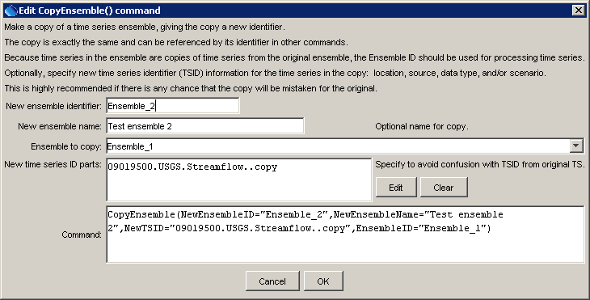

# TSTool / Command / CopyEnsemble #

*   [Overview](#overview)
*   [Command Editor](#command-editor)
*   [Command Syntax](#command-syntax)
*   [Examples](#examples)
*   [Troubleshooting](#troubleshooting)
*   [See Also](#see-also)

-------------------------

## Overview ##

The `CopyEnsemble` command creates a copy of an ensemble,
copying all time series in the ensemble and assigning a new identifier to the result.
The copy is an exact copy except that the ensemble identifier is different
(the TSIDs for each ensemble time series should also specified to be unique).

## Command Editor ##

The command is available in the following TSTool menu:

*   ***Commands / Ensemble Processing***

The following dialog is used to edit the command and illustrates the syntax of the command.

**<p style="text-align: center;">

</p>**

**<p style="text-align: center;">
`CopyEnsemble` Command Editor (<a href="../CopyEnsemble.png">see also the full-size image</a>)
</p>**

## Command Syntax ##

The command syntax is as follows:

```text
CopyEnsemble(Parameter="Value",...)
```
**<p style="text-align: center;">
Command Parameters
</p>**

|**Parameter**&nbsp;&nbsp;&nbsp;&nbsp;&nbsp;&nbsp;&nbsp;&nbsp;&nbsp;&nbsp;&nbsp;&nbsp;&nbsp;&nbsp;&nbsp;&nbsp;|**Description**|**Default**&nbsp;&nbsp;&nbsp;&nbsp;&nbsp;&nbsp;&nbsp;&nbsp;&nbsp;&nbsp;&nbsp;&nbsp;&nbsp;&nbsp;&nbsp;&nbsp;&nbsp;&nbsp;&nbsp;&nbsp;&nbsp;&nbsp;&nbsp;&nbsp;&nbsp;&nbsp;&nbsp;|
|--------------|-----------------|-----------------|
|`EnsembleID`<br>**required**|The ensemble to copy.|None – must be specified.|
|`NewEnsembleID`<br>**required**|The ensemble identifier for the new ensemble|None – must be specified.|
|`NewEnsembleName`|The name for the new ensemble.|Blank.|
|`NewTSID`|A new time series identifier to assign to time series in the new ensemble.  This is useful to avoid confusion with the original time series.  Use the Edit button to edit the time series identifier parts.  The data interval and sequence number will be determined from the original time series.|Copy the original time series TSID.|

## Examples ##

See the [automated tests](https://github.com/OpenCDSS/cdss-app-tstool-test/tree/master/test/commands/CopyEnsemble).

A sample command file to read a time series from the [State of Colorado’s HydroBase database](../../datastore-ref/CO-HydroBase/CO-HydroBase.md),
create an ensemble from the time series, and make a copy is as follows:

```text
# 09019500 - COLORADO RIVER NEAR GRANBY
09019500.USGS.Streamflow.Day~HydroBase
CreateEnsemble(TSID="09019500.USGS.Streamflow.Day",TraceLength=1Year,EnsembleID="Ensemble_1",EnsembleName="Test Ensemble",ReferenceDate="2008-01-01",ShiftDataHow=ShiftToReference)
CopyEnsemble(NewEnsembleID="Ensemble_2",NewEnsembleName="Test ensemble 2",NewTSID="09019500.USGS.Streamflow..copy",EnsembleID="Ensemble_1")
```

## Troubleshooting ##

See the main [TSTool Troubleshooting](../../troubleshooting/troubleshooting.md) documentation.

## See Also ##

*   [`Copy`](../Copy/Copy.md) command, to copy a time series
*   [`CopyTable`](../CopyTable/CopyTable.md) command
