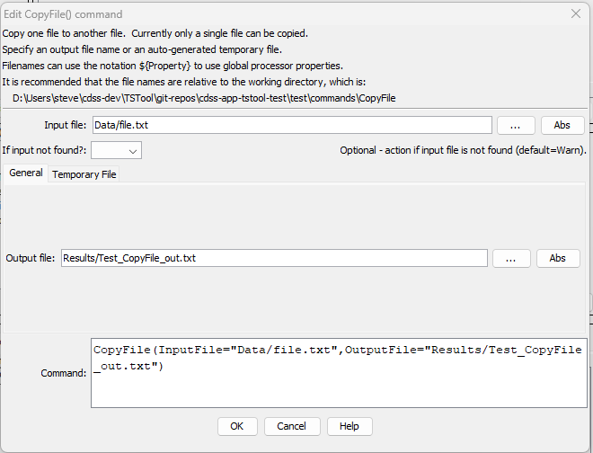

# TSTool / Command / CopyFile #

*   [Overview](#overview)
*   [Command Editor](#command-editor)
*   [Command Syntax](#command-syntax)
*   [Examples](#examples)
*   [Troubleshooting](#troubleshooting)
*   [See Also](#see-also)

-------------------------

## Overview ##

The `CopyFile` command copies a source file to a destination.
The destination can be one of:

*   a specific file given by the `OutputFile` parameter
*   a temporary file (use the `TempFileProperty` command parameter to allow using the name in other commands)

If a temporary file is used, the filename will include randomly-generated characters
based on the operating system.
The `TempFilePrefix` and `TempFileSuffix` parameters are recommended in order to
clarify which temporary files are associated with a command workflow.
If the temporary file is located in the default location,
the operating system will typically remove the file when the computer is restarted.
Otherwise, the [`RemoveFile`](../RemoveFile/RemoveFile.md) command
must be used to remove the file to ensure that file space is not wasted.

## Command Editor ##

The command is available in the following TSTool menu:

*   ***Commands / General - File Handling***

The following dialog is used to edit the command and illustrates the command syntax for a specific output file.

**<p style="text-align: center;">

</p>**

**<p style="text-align: center;">
`CopyFile` Command Editor for an Output File (<a href="../CopyFile.png">see also the full-size image</a>)
</p>**

The following is used to specify a temporary file.

**<p style="text-align: center;">

</p>**

**<p style="text-align: center;">
`CopyFile` Command Editor for a Temporary File (<a href="../CopyFile-Temp.png">see also the full-size image</a>)
</p>**

## Command Syntax ##

The command syntax is as follows:

```text
CopyFile(Parameter="Value",...)
```
**<p style="text-align: center;">
Command Parameters
</p>**

| **Parameter**&nbsp;&nbsp;&nbsp;&nbsp;&nbsp;&nbsp;&nbsp;&nbsp;&nbsp;&nbsp;&nbsp;&nbsp;&nbsp;&nbsp;&nbsp;&nbsp;&nbsp;&nbsp;&nbsp;&nbsp;&nbsp;&nbsp;&nbsp;&nbsp;&nbsp;&nbsp; | **Description** | **Default**&nbsp;&nbsp;&nbsp;&nbsp;&nbsp;&nbsp;&nbsp;&nbsp;&nbsp;&nbsp; |
| --------------|-----------------|----------------- |
| `InputFile`<br>**required** | The name of the source file to copy. Can be specified using `${Property}`. | None - must be specified. |
| `OutputFile` | The name of the output file. Can be specified using `${Property}`. | Must be specified if temporary file is not used. |
| `TempFolder` | The name of the folder for a temporary file. Can be specified using `${Property}`. | `C:\Users\user\AppData\Local\Temp` on Windows or `/tmp` on Linux.  See the TSTool `TempDir` property in ***Results***. |
| `TempFilePrefix` | Prefix to add to the start of a temporary file. Can be specified using `${Property}`.| |
| `TempFileSuffix` | Suffix to add to the end of a temporary file, Can be specified using `${Property}`. The period must be specified to indicate a file extension. | `.tmp` |
| `TempFileProperty` | Property name to set to the output file if a temporary file is used. | |
| `IfInputNotFound` | Indicate an action if the source file is not found:  `Ignore` (ignore the missing file and do not warn), `Warn` (generate a warning message), `Fail` (generate a failure message) | `Warn` |

## Examples ##

See the [automated tests](https://github.com/OpenCDSS/cdss-app-tstool-test/tree/master/test/commands/CopyFile).

## Troubleshooting ##

See the main [TSTool Troubleshooting](../../troubleshooting/troubleshooting.md) documentation.

## See Also ##

*   [`RemoveFile`](../RemoveFile/RemoveFile.md) command
