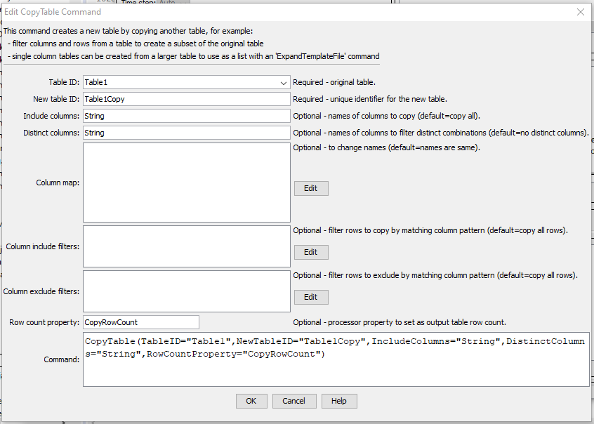

# TSTool / Command / CopyTable #

* [Overview](#overview)
* [Command Editor](#command-editor)
* [Command Syntax](#command-syntax)
* [Examples](#examples)
* [Troubleshooting](#troubleshooting)
* [See Also](#see-also)

-------------------------

## Overview ##

The `CopyTable` command copies all or a subset of the columns and rows from one table to create a new table.
For example, this is useful to create one-column lists that can be used to expand template files with the
[`ExpandTemplateFile`](../ExpandTemplateFile/ExpandTemplateFile.md) command,
or to create a subset of a table to output to a file or write to a database
(for example filter a large table by geographic area or other criteria).  

## Command Editor ##

The following dialog is used to edit the command and illustrates the syntax of the command
(in this case illustrating how values in a column named `LocationID` are copied to a new table).  

**<p style="text-align: center;">

</p>**

**<p style="text-align: center;">
`CopyTable` Command Editor (<a href="../CopyTable.png">see also the full-size image</a>)
</p>**

## Command Syntax ##

The command syntax is as follows:

```text
CopyTable(Parameter="Value",...)
```
**<p style="text-align: center;">
Command Parameters
</p>**

| **Parameter**&nbsp;&nbsp;&nbsp;&nbsp;&nbsp;&nbsp;&nbsp;&nbsp;&nbsp;&nbsp;&nbsp;&nbsp;&nbsp;&nbsp;&nbsp;&nbsp;&nbsp;&nbsp;&nbsp;&nbsp;&nbsp;&nbsp;&nbsp;&nbsp;&nbsp;&nbsp; | **Description** | **Default**&nbsp;&nbsp;&nbsp;&nbsp;&nbsp;&nbsp;&nbsp;&nbsp;&nbsp;&nbsp; |
| --------------|-----------------|----------------- |
|`TableID`|The identifier for the original table.  Can be specified using processor `${Property}`.|None – must be specified.|
|`NewTableID`|The identifier for the new table.  Can be specified using processor `${Property}`.|None – must be specified.|
|`IncludeColumns`|The names of columns to copy, separated by commas.|Copy all of the columns.|
|`DistinctColumns`|The names of columns to copy, separated by commas.  Only distinct values from the specified column(s) will be copied.  For example, if column A contains strings `X, Y, Z, Y, C,` the resulting distinct value column will have rows with `X, Y, Z, C`.  The following behavior is implemented:<ul><li>If multiple column names are specified, the unique combination of the values will be checked.</li><li>If only the `DistinctColumns` are to be in the copy, specify the columns with `IncludeColumns`.</li><li>If columns other than `DistinctColumns` are in `IncludeColumns`, then the distinct row will be output.</li><li>Prior to TSTool 10.26.00, `DistinctColumns` would override `IncludeColumns`.</li><li>Column values null, and blank strings are not considered in distinct comparisons.</li></ul>Don’t do a distinct comparison.|
|`ColumnMap`|The new names for the output columns, using syntax:<br>`OriginalColumn1:NewColumn1, OriginalColumn2:NewColumn2|The column names in the copy will be the same as in the original table.|
|`ColumnFilters`|Filters that limit the number of rows being copied, using the syntax:<br>`FilterColumn1:FilterPattern1, FilterColumn2:FilterPattern2`<br>Patterns can use `*` to indicate wildcards for matches.  Only string values can be checked (other data types are converted to strings for comparison).  Comparisons are case-independent.  All patterns must be matched in order to copy the row.  Can be specified using processor `${Property}`.|No filtering.|
|`ColumnExcludeFilters`|Filters that exclude rows being copied, by matching column values:<br>`ColumnExcludeFilter1:FilterPattern1,`<br>`ColumnExcludeFilter2:FilterPattern2`<br>Patterns can use `*` to indicate wildcards for matches.  Only string values can be checked (other data types are converted to strings for comparison).|All patterns must be matched to exclude the row.|
|`RowCountProperty`|The row count for the copy will be set as a processor property.  This is useful for error-checks (e.g., check that number of time series read with [`ReadTimeSeriesList`](../ReadTimeSeriesList/ReadTimeSeriesList.md) based on the table list matches the expected count.  Can be specified using processor `${Property}`.	

## Examples ##

See the [automated tests](https://github.com/OpenCDSS/cdss-app-tstool-test/tree/master/test/regression/commands/general/CopyTable).

## Troubleshooting ##

## See Also ##

* [`ExpandTemplateFile`](../ExpandTemplateFile/ExpandTemplateFile.md) command
* [`FreeTable`](../FreeTable/FreeTable.md) command
* [`NewTable`](../NewTable/NewTable.md) command
* [`ReadTimeSeriesList`](../ReadTimeSeriesList/ReadTimeSeriesList.md) command
