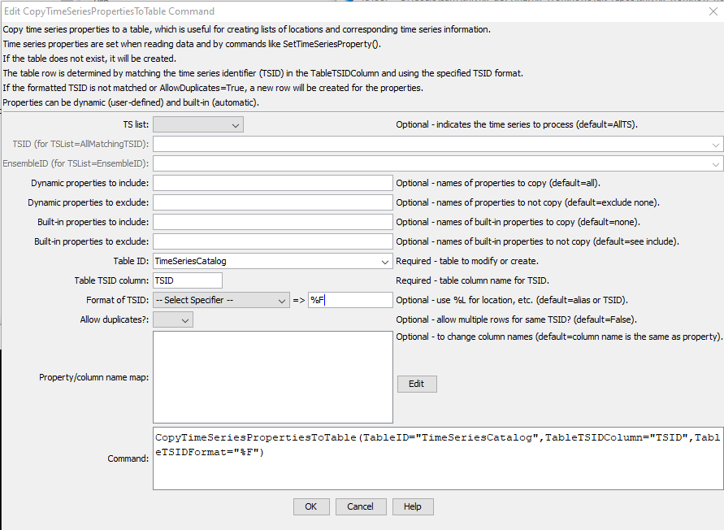

# TSTool / Command / CopyTimeSeriesPropertiesToTable #

* [Overview](#overview)
* [Command Editor](#command-editor)
* [Command Syntax](#command-syntax)
* [Examples](#examples)
* [Troubleshooting](#troubleshooting)
* [See Also](#see-also)

-------------------------

## Overview ##

The `CopyTimeSeriesPropertiesToTable` command copies time series properties to a table.
Properties can be copied to an existing table, or a new table can be created.
Time series properties typically are set in the following ways:

1. Location and time series metadata from original data (e.g., database or web service) are set as properties when the time series are read.
2. The [`SetTimeSeriesProperty`](../SetTimeSeriesProperty/SetTimeSeriesProperty) command sets a property.
3. Other commands set properties as a bi-product of processing.

## Command Editor ##

The following dialog is used to edit the command and illustrates the command syntax
(in this case the location part of the time series identifier is used to match the contents of the “loc” column in the table).
<a href="../CopyTimeSeriesPropertiesToTable.png">See also the full-size image.</a>



**<p style="text-align: center;">
`CopyTimeSeriesPropertiesToTable` Command Editor
</p>**

## Command Syntax ##

The command syntax is as follows:

```text
CopyTimeSeriesPropertiesToTable(Parameter="Value",...)
```
**<p style="text-align: center;">
Command Parameters
</p>**

|**Parameter**&nbsp;&nbsp;&nbsp;&nbsp;&nbsp;&nbsp;&nbsp;&nbsp;&nbsp;&nbsp;&nbsp;&nbsp;&nbsp;&nbsp;&nbsp;&nbsp;&nbsp;&nbsp;&nbsp;&nbsp;&nbsp;|**Description**|**Default**&nbsp;&nbsp;&nbsp;&nbsp;&nbsp;&nbsp;&nbsp;&nbsp;&nbsp;&nbsp;&nbsp;&nbsp;&nbsp;&nbsp;&nbsp;&nbsp;&nbsp;&nbsp;&nbsp;&nbsp;&nbsp;&nbsp;&nbsp;&nbsp;&nbsp;&nbsp;&nbsp;|
|--------------|-----------------|-----------------|
|`TSList`|Indicates the list of time series to be processed, one of:<br><ul><li>`AllMatchingTSID` – all time series that match the TSID (single TSID or TSID with wildcards) will be processed.</li><li>`AllTS` – all time series before the command.</li><li>`EnsembleID` – all time series in the ensemble will be processed (see the EnsembleID parameter).</li><li>`FirstMatchingTSID` – the first time series that matches the TSID (single TSID or TSID with wildcards) will be processed.</li><li>`LastMatchingTSID` – the last time series that matches the TSID (single TSID or TSID with wildcards) will be processed.</li><li>`SelectedTS` – the time series are those selected with the [`SelectTimeSeries`](../SelectTimeSeries/SelectTimeSeries) command.</li></ul> | `AllTS` |
|`TSID`|The time series identifier or alias for the time series to be processed, using the `*` wildcard character to match multiple time series.  Can be specified using `${Property}`.|Required if `TSList=*TSID`|
|`EnsembleID`|The ensemble to be processed, if processing an ensemble. Can be specified using `${Property}`.|Required if `TSList=*EnsembleID`|
|`IncludeProperties`|A list of time series property names to be copied to the table, separated by commas.|Copy all properties.|
|`TableID`|The identifier for the existing or new table to receive properties.  Can specify using processor `${Property}`.|None – must be specified.|
|`TableTSIDColumn`|Table column name that is used to match the time series identifier for processing, to select the row.|None – must be specified.|
|`TableTSIDFormat`|The specification to format the time series identifier to match the `TSID` column.  Use the format choices and other characters to define a unique identifier.|Time series alias if available, or otherwise the time series identifier.|
|`AllowDuplicates`|Allow duplicate TSID rows in the output:<ul><li>`False` – match `TSID`, intended for cases where `TSID` are distinct</li><li>`True` – add new rows regardless, for cases where multiple time series having the same `TSID` are processed and should each have a row in the output table.|`False` (if `TSID` is matched, set the properties for that row).|
|`TableOutputColumns`|The name(s) of the column(s) to receive properties for the matching time series.  Separate column names with commas.  If a column name is specified as `*`, the property name is used for the column name.|If not specified, use `IncludeProperties`.|

## Examples ##

See the [automated tests](https://github.com/OpenWaterFoundation/cdss-app-tstool-test/tree/master/test/regression/commands/general/CopyTimeSeriesPropertiesToTable).

## Troubleshooting ##

## See Also ##

* [`SelectTimeSeries`](../SelectTimeSeries/SelectTimeSeries) command
* [`SetTimeSeriesProperty`](../SetTimeSeriesProperty/SetTimeSeriesProperty) command
