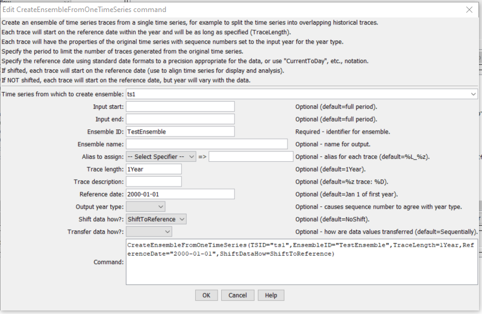
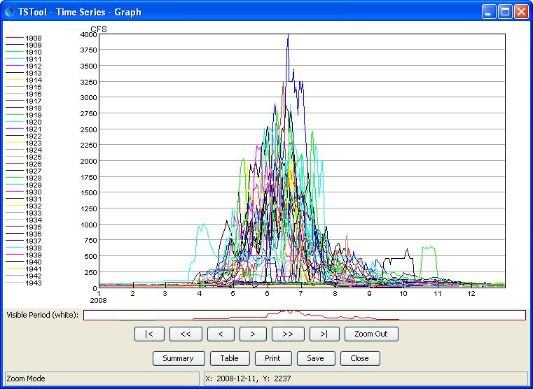

# TSTool / Command / CreateEnsembleFromOneTimeSeries #

* [Overview](#overview)
* [Command Editor](#command-editor)
* [Command Syntax](#command-syntax)
* [Examples](#examples)
* [Troubleshooting](#troubleshooting)
* [See Also](#see-also)

-------------------------

## Overview ##

The `CreateEnsembleFromOneTimeSeries` command creates an ensemble
by splitting up a single time series into traces.
For example, a historical time series can be split into 1-year
overlapping traces that are shifted to start at the beginning of the current year.
The sequence number part of the time series identifier for each trace
is set to the year type starting year and will be shown as `[Year]`
at the end of the time series identifier.
The data transfer will retain a continuous record.
If leap years are encountered, the output may be offset.
In other words, no gaps are retained, and no data are discarded due to leap years.

## Command Editor ##

The following dialog is used to edit the command and illustrates the syntax of the command.



**<p style="text-align: center;">
`CreateEnsembleFromOneTimeSeries` Command Editor (<a href="../CreateEnsembleFromOneTimeSeries.png">see also the full-size image</a>)
</p>**

## Command Syntax ##

The command syntax is as follows:

```text
CreateEnsembleFromOneTimeSeries(Parameter="Value",...)
```
**<p style="text-align: center;">
Command Parameters
</p>**

|**Parameter**&nbsp;&nbsp;&nbsp;&nbsp;&nbsp;&nbsp;&nbsp;&nbsp;&nbsp;&nbsp;&nbsp;&nbsp;&nbsp;&nbsp;&nbsp;&nbsp;&nbsp;&nbsp;|**Description**|**Default**&nbsp;&nbsp;&nbsp;&nbsp;&nbsp;&nbsp;&nbsp;&nbsp;&nbsp;&nbsp;&nbsp;&nbsp;&nbsp;&nbsp;&nbsp;&nbsp;&nbsp;&nbsp;&nbsp;&nbsp;&nbsp;&nbsp;&nbsp;&nbsp;&nbsp;&nbsp;&nbsp;|
|--------------|-----------------|-----------------|
|`TSID`<br>**required**|The time series identifier or alias for the time series used to create the ensemble.  Can be specified using `${Property}`.|None – must be specified.|
|`InputStart`|The date/time to start transferring data from the time series.  Can be specified using `${Property}`.|Use all data.|
|`InputEnd`|The date/time to end transferring data from the time series.  Can be specified using `${Property}`.|Use all data.|
|`EnsembleID`<br>**required**|The new ensemble identifier.  Can be specified using `${Property}`.|None – must be specified.|
|`EnsembleName`|The name for the new ensemble.  Can be specified using `${Property}`.|Blank.|
|`Alias`|The alias to assign to the time series, as a literal string or using the special formatting characters listed by the command editor.  The alias is a short identifier used by other commands to locate time series for processing, as an alternative to the time series identifier (TSID).  Can be specified using `${Property}`.|`%L_%z` (location\_sequence number)|
|`TraceLength`|An interval for the trace length (e.g., `1Year`, `1Month` or, `7Day`).|1Year|
|`TraceDescription`|Specify the description to be used for the output traces, using the time series property specifiers `%z`, etc.|`%z trace: %D`|
|`ReferenceDate`|The reference date indicates the starting date for each trace.  Each trace optionally can be shifted (see `ShiftDataHow`), in which case the year in the `ReferenceDate` is used for the common starting date.  The reference date can be one of:<ul><li>Blank, indicating that January 1 of the current year will be used.</li><li>A date/time string (use the format `01/01/YYYY` or `YYYY-MM-DD`).</li><li>`CurrentToYear`, `CurrentToMonth`, `CurrentToDay`, `CurrentToHour`, `CurrentToMinute`, indicating the current date/time to the specified precision.</li><li>A `Current*` value +- an interval, for example: `CurrentToMinute – 7Day`|January 1 of the first year in the source time series.|
|`OutputYearType`|The output year type for the ensemble traces.  The only impact from this parameter is that sequence number for the time series will be set to the start of the output year.  This is useful because legends on graphs that use the sequence number (`%z` format specifier) will use the appropriate year type.  The `ReferenceDate` should normally be specified as the first day of the output year (e.g., `ReferenceDate=2012-10-01` for `OutputYearType=Water`). |`Calendar`|
|`ShiftDataHow`|Indicates whether the traces should be shifted.  Possible values are:<ul><li>`ShiftToReference` – each trace will be shifted to the reference date, resulting in overlapping time series.</li><li>`NoShift` – plotting the traces will result in a total line that matches the original time series, except that each trace can be manipulated individually.</li></ul>|`NoShift`|

## Examples ##

See the [automated tests](https://github.com/OpenCDSS/cdss-app-tstool-test/tree/master/test/regression/commands/general/CreateEnsembleFromOneTimeSeries).

A sample command file to read a time series from the [State of Colorado’s HydroBase database](../../datastore-ref/CO-HydroBase/CO-HydroBase.md)
and create an ensemble from the time series is as follows:

```text
# 09019500 - COLORADO RIVER NEAR GRANBY
09019500.USGS.Streamflow.Day~HydroBase
CreateEnsembleFromOneTimeSeries(TSID="09019500.USGS.Streamflow.Day",TraceLength=1Year,EnsembleID="Ensemble_1",EnsembleName="Test Ensemble",ReferenceDate="2008-01-01",ShiftDataHow=ShiftToReference)
```

The following figure illustrates a graph of the resulting ensemble:



**<p style="text-align: center;">
`CreateEnsembleFromOneTimeSeries` Example Graph (<a href="../CreateEnsembleFromOneTimeSeries_Graph.png">see also the full-size image</a>)
</p>**

## Troubleshooting ##

## See Also ##

* [`NewEnsemble`](../NewEnsemble/NewEnsemble.md) command
