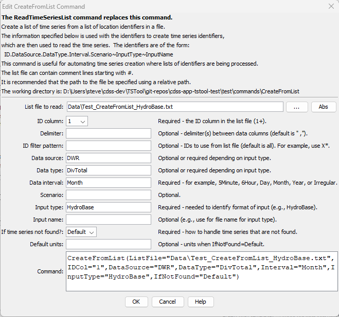

# TSTool / Command / CreateFromList #

* [Overview](#overview)
* [Command Editor](#command-editor)
* [Command Syntax](#command-syntax)
* [Examples](#examples)
* [Troubleshooting](#troubleshooting)
* [See Also](#see-also)

-------------------------

## Overview ##

**See also the [`ReadTimeSeriesList`](../ReadTimeSeriesList/ReadTimeSeriesList.md) command, which may replace this command in the future.**

The `CreateFromList` command creates one or more time series using identifiers from a list file,
an example of which is shown below:

```text
# Example list file.  Comments start with the # character.
# Column headings can be specified in the first non-comment row using quotes.
“Structure ID”,”Structure Name”
500501,Ditch 501
500502,Ditch 502
# Invalid ID (see IfNotFound parameter)
509999,Ditch 9999
```
The command is typically used when reading time series from a database or binary file
and can streamline processing in the following situations:

* A list of identifiers may have been generated from a database query and saved to a file.
* A list of identifiers may have been extracted from a model data set.

TSTool reads the list file and internally creates a list of time series identifiers.
The time series are of the standard form:

```
Location.DataSource.DataType.Interval[.Scenario]~InputType[~InputName]
```
where the brackets indicate optional information.
TSTool then queries each time series, which can be processed further.
	
Although it is possible to specify an input type that reads from files by also using the `InputName`,
this is not generally recommended because the `CreateFromList` command can only specify
one input file name and the file will be reopened for each read.
Instead, read commands for specific file formats should be used because these commands
are typically optimized to read multiple time series from the files.
In summary, the `CreateFromList` command is useful with databases but performance may suffer when used with file input types.

## Command Editor ##

The following dialog is used to edit the command and illustrates the syntax of the command.

**<p style="text-align: center;">

</p>**

**<p style="text-align: center;">
`CreateFromList` Command Editor (<a href="../CreateFromList.png">see also the full-size image</a>)
</p>**

## Command Syntax ##

The command syntax is as follows:

```text
CreateFromList(Parameter="Value",...)
```
**<p style="text-align: center;">
Command Parameters
</p>**

|**Parameter**&nbsp;&nbsp;&nbsp;&nbsp;&nbsp;&nbsp;&nbsp;&nbsp;&nbsp;&nbsp;&nbsp;|**Description**|**Default**&nbsp;&nbsp;&nbsp;&nbsp;&nbsp;&nbsp;&nbsp;&nbsp;&nbsp;&nbsp;&nbsp;&nbsp;&nbsp;&nbsp;&nbsp;&nbsp;&nbsp;&nbsp;&nbsp;&nbsp;&nbsp;&nbsp;&nbsp;&nbsp;&nbsp;&nbsp;&nbsp;|
|--------------|-----------------|-----------------|
|`ListFile`<br>**required**|The name of the list file to read, surrounded by double quotes.|None – must be specified.|
|`IDCol`|The column (1+) in the list file containing the location identifiers to use in time series identifiers.|`1`|
|`Delim`|The delimiter characters that separate columns in the list file.  If a space is used as the delimiter, surround with another delimiter characters or a character that is unlikely to be found so that the space is not discarded as white space (e.g., `~ ~`).|Comma|
|`ID`|Indicate a pattern to filter the identifiers in the list file.  For example, use `A*` to only process identifiers in the list file that start with `A`.|Process all identifiers.|
|`DataSource `|The data source in the time series identifier, appropriate for `InputType`.  For example, if using the [State of Colorado’s HydroBase](../../datastore-ref/CO-HydroBase/CO-HydroBase.md), `USGS` indicates that data are from the United States Geological Survey.  See the input type appendices for more information on available data types.|May or may not be required, depending on the input type.  Refer to the input type appendices.|
|`DataType`|The data type in the time series identifier, as appropriate for `InputType`.  For example, if using the [State of Colorado’s HydroBase](../../datastore-ref/CO-HydroBase/CO-HydroBase.md), `DivTotal` is used for diversion totals.  See the input type appendices for more information on available data types.|Usually required for an input type.  Refer to the input type appendices.|
|`Interval`<br>**required**|Data interval in the time series identifier, using standard values such as `15Minute`, `6Hour`, `Day`, `Month`, `Year`.|None – must be specified.|
|`Scenario`|Scenario in the time series identifier.|Usually not required.|
|`InputType`<br>**required**|The input type in the time series identifier.  For example, use `HydroBase` for the [State of Colorado’s HydroBase database](../../datastore-ref/CO-HydroBase/CO-HydroBase.md).  Refer to the input type appendices or the TSTool main GUI for options.|None – must be specified.|
|`InputName`|The input name in the time series identifier.|Typically only required if the input type requires a file name.|
|`IfNotFound`|Indicates how to handle missing time series, one of:<ul><li>`Warn` – generate fatal warnings and do not include in output.</li><li>`Ignore` – generate non-fatal warnings and do not include in output.</li><li>`Default` – generate non-fatal warnings and create empty time series for those that could not be found.  This requires that a [`SetOutputPeriod`](../SetOutputPeriod/SetOutputPeriod.md) command be used before the command to define the period for default time series.|`Warn`|
|`DefaultUnits`|Default units when `IfNotFound=Default`.|Blank – no units.|

## Examples ##

See the [automated tests](https://github.com/OpenCDSS/cdss-app-tstool-test/tree/master/test/regression/commands/general/CreateFromList).

A sample command file to process diversion time series from the [State of Colorado’s HydroBase database](../../datastore-ref/CO-HydroBase/CO-HydroBase.md)
is as follows:

```text
# Read monthly diversion total from HydroBase for the structures in the list
# file. The data source is set to DWR because data source is saved in
# HydroBase.
CreateFromList(ListFile="Data\Diversions.txt",IDCol=1,DataSource=DWR,
DataType=DivTotal,Interval=Month,InputType=HydroBase,IfNotFound=Default)
```

## Troubleshooting ##

## See Also ##

* [`SetOutputPeriod`](../SetOutputPeriod/SetOutputPeriod.md) command
* [`ReadTimeSeriesList`](../ReadTimeSeriesList/ReadTimeSeriesList.md) command
