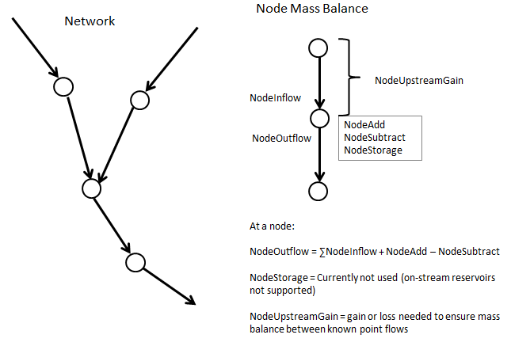
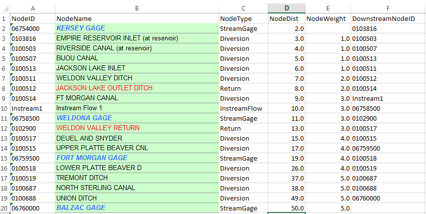
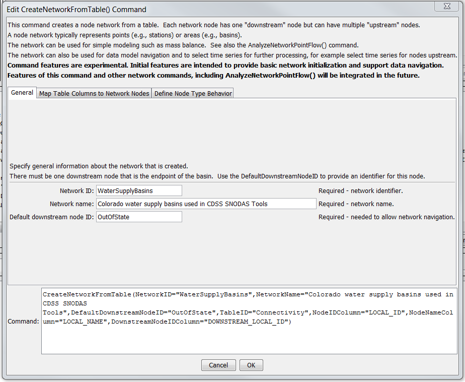
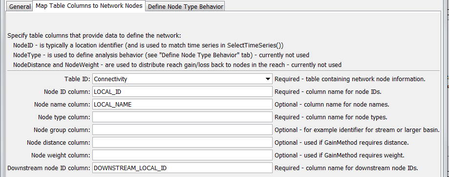
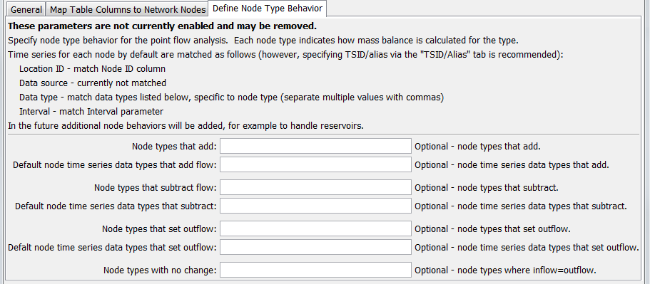

# TSTool / Command / CreateNetworkFromTable #

*   [Overview](#overview)
*   [Command Editor](#command-editor)
*   [Command Syntax](#command-syntax)
*   [Examples](#examples)
*   [Troubleshooting](#troubleshooting)
*   [See Also](#see-also)

-------------------------

## Overview ##

The `CreateNetworkFromTable` command creates a network object from a table.
Support for network objects is being phased into TSTool to allow processing of
time series that are related to networks, such as river flow networks.

The following figure is taken from the [`AnalyzeNetworkPointFlow`](../AnalyzeNetworkPointFlow/AnalyzeNetworkPointFlow.md)
command documentation for illustration.
However, the network created by the `CreateNetworkFromTable` command does not have
knowledge of node type or calculations – this may be enhanced later.

**<p style="text-align: center;">

</p>**

**<p style="text-align: center;">
Node-based Network (<a href="../AnalyzeNetworkPointFlow_Diagram.png">see also the full-size image</a>)
</p>**

The network is defined by simple “NodeID” and “DownstreamNodeID” notation and can be applied
to either point-based networks (such as river networks with stations/sites) or
area-based networks (such as upstream and downstream basins).

The following example shows a network that is defined in Excel as a table containing a
list of node identifiers with associated properties.
The `NodeID` and `DownstreamNodeID` columns are used by the command to
create a navigable network object in program memory.
The network can then be used with commands such as
[`SelectTimeSeries`](../SelectTimeSeries/SelectTimeSeries.md) to select time series that were read for the network.

**<p style="text-align: center;">

</p>**

**<p style="text-align: center;">
Network Definition Input Table (<a href="../AnalyzeNetworkPointFlow_InputTable.png">see also the full-size image</a>)
</p>**

## Command Editor ##

The command is available in the following TSTool menu:

*   ***Commands / Network Processing***

The following dialog is used to edit the command and illustrates the syntax of the command for general parameters.

**<p style="text-align: center;">

</p>**

**<p style="text-align: center;">
`CreateNetworkFromTable` Command Editor for General Parameters (<a href="../CreateNetworkFromTable_General.png">see also the full-size image</a>)
</p>**

The following dialog is used to edit the command and illustrates the syntax of the command for parameters that map table columns to network node types.

**<p style="text-align: center;">

</p>**

**<p style="text-align: center;">
`CreateNetworkFromTable` Command Editor for Parameters that Map Table Columns to Network Nodes (<a href="../CreateNetworkFromTable_Map.png">see also the full-size image</a>)
</p>**

The following dialog is used to edit the command and illustrates the syntax of the command for parameters that define node behavior.

**<p style="text-align: center;">

</p>**

**<p style="text-align: center;">
`CreateNetworkFromTable` Command Editor for Parameters that Define Node Behavior (<a href="../CreateNetworkFromTable_Behavior.png">see also the full-size image</a>)
</p>**

## Command Syntax ##

The command syntax is as follows:

```text
CreateNetworkFromTable(Parameter="Value",...)
```
**<p style="text-align: center;">
Command Parameters
</p>**

|**Parameter**&nbsp;&nbsp;&nbsp;&nbsp;&nbsp;&nbsp;&nbsp;&nbsp;&nbsp;&nbsp;&nbsp;&nbsp;&nbsp;&nbsp;&nbsp;&nbsp;&nbsp;&nbsp;&nbsp;&nbsp;&nbsp;&nbsp;&nbsp;&nbsp;&nbsp;&nbsp;&nbsp;&nbsp;&nbsp;&nbsp;&nbsp;|**Description**|**Default**&nbsp;&nbsp;&nbsp;&nbsp;&nbsp;&nbsp;&nbsp;&nbsp;&nbsp;&nbsp;&nbsp;&nbsp;&nbsp;&nbsp;&nbsp;&nbsp;&nbsp;&nbsp;&nbsp;&nbsp;&nbsp;&nbsp;&nbsp;&nbsp;&nbsp;&nbsp;&nbsp;|
|--------------|-----------------|-----------------|
|`NetworkID`<br>**required**|Identifier for the network being created.|None – must be specified.|
|`NetworkName`<br>**required**|Descriptive name for network being created.|None – must be specified.|
|`DefaultDownstreamNodeID`<br>**required**|Default downstream node identifier to ensure that the network can connect to a final downstream node.|None – must be specified.|
|`TableID`<br>**required**|The identifier for the table defining the network.|None – must be specified.|
|`NodeIDColumn`<br>**required**|The name of the column in the network table containing node identifiers.  Node identifiers will be used for the location ID part of time series identifiers.|None – must be specified.|
|`NodeNameColumn`|The name of the column in the network table containing node names.||
|`NodeTypeColumn`<br>**required**|The name of the column in the network table containing node types.  The node type is used to specify what calculations will occur for the node.  **Currently not used.**|None – must be specified.|
|`NodeGroupColumn`|Used to group nodes, for example a stream reach or larger drainage basin.  **Currently not used.**||
|`NodeDistanceColumn`|The name of the column in the network table containing node distance.  The distance is the measure from the most downstream node and is used when `GainMethod=Distance` or `GainMethod=DistanceWeight`.**Currently not used.**||
|`NodeWeightColumn`|The name of the column in the network table containing node weights, which is used to distribute gain/loss when `GainMethod=Weight` or `GainMethod=DistanceWeight` (in the latter case the weight is the rate to use).  **Currently not used.**||
|`DownstreamNodeIDColumn`|The name of the column in the network table containing downstream node identifiers.  This information defines the connectivity of the network.|None – must be specified.|
|`NodeAddTypes`|Node types for which time series are added to the node’s inflow to compute outflow, for example the Return node type in the above table example.  The `NodeTypeColumn` table column is checked to determine the type for each node in the network.  **Currently not used.**|No additions will occur.|
|`NodeAddDataType`|The time series data type to match for the node.  The data type is used with the NodeID as the location ID to match available time series to use as input.  The `TSIDColumn` will override the default matching.  **Currently not used.**|No additions will occur.|
|`NodeSubtractTypes`|Node types for which time series are subtracted from the node’s inflow, for example the Diversion node type in the above table example.  The `NodeTypeColumn` table column is checked to determine the type for each node in the network.  **Currently not used.**|No subtractions will occur.|
|`NodeSubtractDataType`|The time series data type to match for the node.  The data type is used with the NodeID as the location ID to match available time series to use as input.  The `TSIDColumn` will override the default matching.  **Currently not used.**|No subtractions will occur.|
|`NodeOutflowTypes`|Node types for which time series outflows are set to the node’s time input time series, for example the `Streamflow` node type in the above table example.  The `NodeTypeColumn` table column is checked to determine the type for each node in the network.  **Currently not used.**|No known flows will be set – gain/loss cannot be computed.|
|`NodeOutflowDataType`|The time series data type to match for the node.  The data type is used with the NodeID as the location ID to match available time series to use as input.  The `TSIDColumn` will override the default matching.  **Currently not used.**|See above.|
|`NodeFlowThroughTypes`|Node types for which time series outflows are set to the node’s inflow, for example the `InstreamFlow` node type in the above table example.  The `NodeTypeColumn` table column is checked to determine the type for each node in the network.  **Currently not used.**|No known flows will be set – gain/loss cannot be computed.|

## Examples ##

See the [automated tests](https://github.com/OpenCDSS/cdss-app-tstool-test/tree/master/test/commands/CreateNetworkFromTable).

## Troubleshooting ##

See the main [TSTool Troubleshooting](../../troubleshooting/troubleshooting.md) documentation.

## See Also ##

*   [`AnalyzeNetworkPointFlow`](../AnalyzeNetworkPointFlow/AnalyzeNetworkPointFlow.md) command
*   [`ReadTableFromExcel`](../ReadTableFromExcel/ReadTableFromExcel.md) command
*   [`SelectTimeSeries`](../SelectTimeSeries/SelectTimeSeries.md) command
