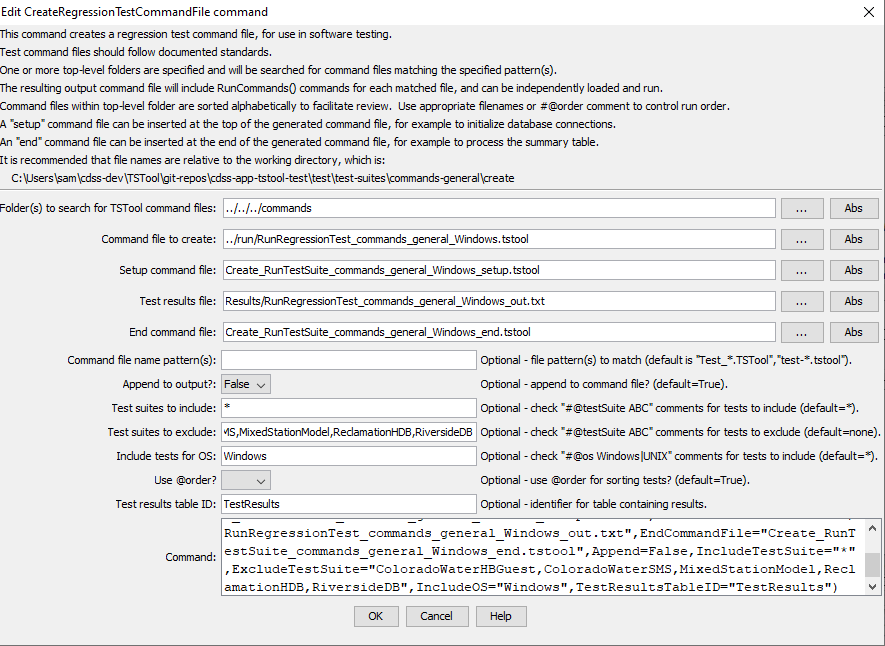

# TSTool / Command / CreateRegressionTestCommandFile #

* [Overview](#overview)
* [Command Editor](#command-editor)
* [Command Syntax](#command-syntax)
* [Examples](#examples)
* [Troubleshooting](#troubleshooting)
* [See Also](#see-also)

-------------------------

## Overview ##

The `CreateRegressionTestCommandFile` command is used for software testing and validation of workflow processes.
The command creates a command file that includes a
[StartRegressionTestResultsReport](../StartRegressionTestResultsReport/StartRegressionTestResultsReport.md) and multiple
[RunCommands](../RunCommands/RunCommands.md) commands.
A starting search folder is provided and all files that match the given pattern (by convention `Test_*.TSTool` and `test-*.tstool`)
are assumed to be command files that can be run to test the software.
The resulting command file is a test suite comprised of all the individual tests and can be used
to verify software before release.
The goal is to have all tests pass before software is released and not retain broken tests in the test repository.

The following table lists tags (annotations) that can be placed in `#` comments in command files to provide information for testing, for example:

```
#@expectedStatus Failure
```


**<p style="text-align: center;">
Property File Formats
</p>**

| **Comment Tag**&nbsp;&nbsp;&nbsp;&nbsp;&nbsp;&nbsp;&nbsp;&nbsp;&nbsp;&nbsp;&nbsp;&nbsp;&nbsp;&nbsp;&nbsp;&nbsp;&nbsp;&nbsp;&nbsp;&nbsp;&nbsp;&nbsp;&nbsp;&nbsp;&nbsp;&nbsp;&nbsp;&nbsp;&nbsp;&nbsp;&nbsp;&nbsp;&nbsp;&nbsp;&nbsp;&nbsp;&nbsp;&nbsp;&nbsp;&nbsp;&nbsp;&nbsp;&nbsp;&nbsp;&nbsp;&nbsp;&nbsp;&nbsp;&nbsp; | **Description** |
|-----------------------|-----------------|
| `#@enabled False`           | The `RunCommands` command will by default run the command file that is provided.  However, if the `@enabled False` tag is specified in a comment in the command file, `RunCommands` will skip the command file.  This is useful to disable a test that needs additional work. |
| `#@expectedStatus Failure`<br>`#@expectedStatus Warning`       | The `RunCommands` command `ExpectedStatus` parameter is by default `Success`.  However, a different status can be specified if it is expected that a command file will result in Warning or Failure and still be a successful test.  For example, if a command is obsolete and should generate a failure, the expected status can be specified as `Failure` and the test will pass.  Another example is to test that the software properly treats a missing file as a failure. |
| `#@os Windows`<br>`#@os UNIX` | The test is designed to work only on the specified platform and will be included in the test suite only if the `IncludeOS` parameter includes the corresponding operating system (OS) type.  This is primarily used to test specific features of the OS and similar but separate test cases should be implemented for both OS types.  If the OS type is not specified as a tag in a command file, the test is always included (see also the handling of included test suites).  Use `UNIX` for `Linux` and `Mac`. |
| `@readOnly`       |Indicates that the command file should not be edited.  TSTool will update old command syntax to current syntax when a command file is loaded.  However, this tag will cause the software to warn the user when saving the command file, so that they can cancel.|
| `@testSuite ABC`       |Indicate that the command file should be considered part of the specified test suite, as specified with the `IncludeTestSuite` parameter.  The test is included in all test collections if the tag is not specified; therefore, for general tests, do not specify a test suite.  This tag is useful if a group of tests require special setup, for example connecting to a database.  The suite names should be decided upon by the test developer.|

## Command Editor ##

The following dialog is used to edit the command and illustrates the command syntax.

**<p style="text-align: center;">

</p>**

**<p style="text-align: center;">
`CreateRegressionTestCommandFile` Command Editor (<a href="../CreateRegressionTestCommandFile.png">see also the full-size image</a>)
</p>**

## Command Syntax ##

The command syntax is as follows:

```text
CreateRegressionTestCommandFile(Parameter="Value",...)
```
**<p style="text-align: center;">
Command Parameters
</p>**

| **Parameter**&nbsp;&nbsp;&nbsp;&nbsp;&nbsp;&nbsp;&nbsp;&nbsp;&nbsp;&nbsp;&nbsp;&nbsp;&nbsp;&nbsp;&nbsp;&nbsp;&nbsp;&nbsp;&nbsp;&nbsp;&nbsp;&nbsp;&nbsp;&nbsp;&nbsp;&nbsp; | **Description** | **Default**&nbsp;&nbsp;&nbsp;&nbsp;&nbsp;&nbsp;&nbsp;&nbsp;&nbsp;&nbsp;&nbsp;&nbsp;&nbsp;&nbsp;&nbsp;&nbsp; |
| --------------|-----------------|----------------- |
| `SearchFolder`<br>**required** | The folder to search for regression test command files.  All subfolders will also be searched.  Can use `${Property}`. | None - must be specified. |
| `OutputFile`<br>**required** | The name of the command file to create, enclosed in double quotes if the file contains spaces or other special characters.  A path relative to the command file containing this command can be specified.  Can specify using `${Property}`.| None - must be specified.|
| `SetupCommandFile` |  The name of a TSTool command file that supplies setup commands, and which will be prepended to output.  Use such a file to open database connections and set other global settings that apply to the entire test run.  Can specify using `${Property}`. | Do not include setup commands.|
| `FilenamePattern` | Pattern(s) to find TSTool command files, using `*` wildcards, separated by commas. | `Test_*.TSTool` and `test-*.tstool`, ignoring case. |
| `EndCommandFile` | The name of a TSTool command file that supplies end commands, and which will be appended to the output.  Use such a file to output the test results table to a delimited file or Excel.  See `TestResultsTableID`.  Can specify using `${Property}`. | Do not include end commands.|
| `Append` | Indicate whether to append to the output file (`True`) or overwrite (`False`).  This allows multiple directory trees to be searched for tests, where the first command typically specifies `False` and additional commands specify `True`. | `True` |
| `IncludeTestSuite` |If `*`, all tests that match `FilenamePattern` and `IncludeOS` are included.  If a test suite is specified, only include tests that have `@testSuite` tag values that match a value in `IncludeTestSuite`.  One or more tags can be specified, separated by commas.| `*` - include all test cases.|
| `IncludeOS` |If `*`, all tests that match `FilenamePattern` and `IncludeTestSuite` are included.  If an OS is specified, only include tests that have `@os` tag values that match a value in `IncludeTestSuite`.  This tag is typically specified once or not at all. | `*` - include all test cases. |
| `TestResultsTableID` |The identifier of an output table to be created.  The table will be passed to the [`StartRegressionTestResultsReport`](../StartRegressionTestResultsReport/StartRegressionTestResultsReport.md) command. | No table will be output. |

## Examples ##

* See the [command file used to generate tests](https://github.com/OpenCDSS/cdss-app-tstool-test/blob/master/test/regression/TestSuites/commands_general/create/Create_RunTestSuite_commands_general_IncludeOS%3DWindows.TSTool)

See the [Quality Control chapter](../../quality-control/quality-control.md) for how to set up a regression test.

An example of the output file from running the tests is:

```
# File generated by...
# program:      TSTool 10.20.00 (2013-04-10)
# user:         sam
# date:         Sat Apr 20 13:36:05 MDT 2013
# host:         AMAZON
# directory:    C:\Develop\TSTool_SourceBuild\TSTool\test\regression\TestSuites\commands_general\run
# command line: TSTool
#  -home test/operational/CDSS
#
# Command file regression test report from StartRegressionTestResultsReport() and RunCommands()
#
# Explanation of columns:
#
# Num: count of the tests
# Enabled: TRUE if test enabled or FALSE if "#@enabled false" in command file
# Run Time: run time in milliseconds
# Test Pass/Fail:
#    The test status below may be PASS or FAIL (or blank if disabled).
#    A test will pass if the command file actual status matches the expected status.
#    Disabled tests are not run and do not count as PASS or FAIL.
#    Search for *FAIL* to find failed tests.
# Commands Expected Status:
#    Default is assumed to be SUCCESS.
#    "#@expectedStatus Warning|Failure" comment in command file overrides default.
# Commands Actual Status:
#    The most severe status (Success|Warning|Failure) for each command file.
#
#    |       |Test  |Commands  |Commands   |
#    |       |Pass/ |Expected  |Actual     |
# Num|Enabled|Fail  |Status    |Status     |Command File
#----+-------+------+----------+-----------+----------------------------------------------------------------------------------------
    1| TRUE  | PASS |SUCCESS   |SUCCESS    |C:\Develop\TSTool_SourceBuild\TSTool\test\regression\commands\general\ARMA\Test_ARMA_Day.TSTool
    2| TRUE  | PASS |SUCCESS   |SUCCESS    |C:\Develop\TSTool_SourceBuild\TSTool\test\regression\commands\general\ARMA\Test_ARMA_Legacy.TSTool
    3| TRUE  | PASS |SUCCESS   |SUCCESS    |C:\Develop\TSTool_SourceBuild\TSTool\test\regression\commands\general\ARMA\Test_ARMA_Legacy_Ast.TSTool
    4| TRUE  | PASS |SUCCESS   |SUCCESS    |C:\Develop\TSTool_SourceBuild\TSTool\test\regression\commands\general\ARMA\Test_ARMA_Legacy…
...
#----+-------+------+----------+-----------+----------------------------------------------------------------------------------------
FAIL count     =     0,   0.000%
PASS count     =    17, 100.000%
Disabled count =     1
#--------------------------------
Total          =    18
```

## Troubleshooting ##

## See Also ##

* [`RunCommands`](../RunCommands/RunCommands.md) command
* [`StartRegressionTestResultsReport`](../StartRegressionTestResultsReport/StartRegressionTestResultsReport.md) command
* [`WriteCommandSummaryToFile`](../WriteCommandSummaryToFile/WriteCommandSummaryToFile.md) command
