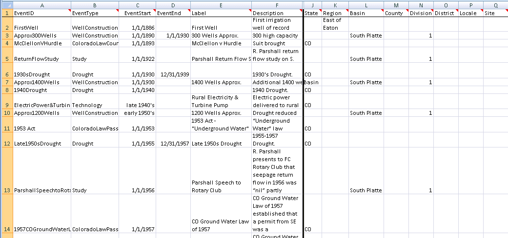
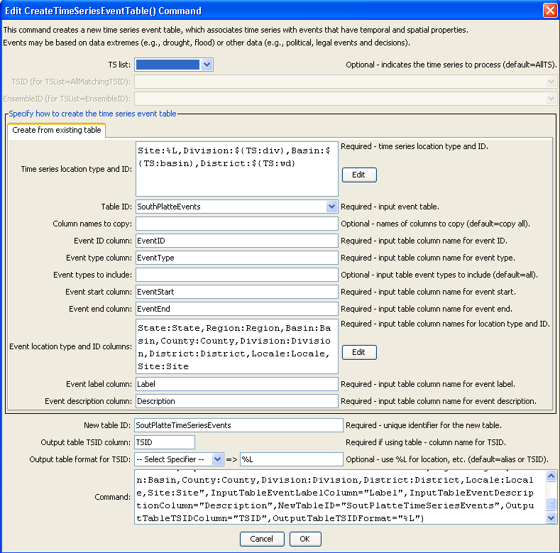
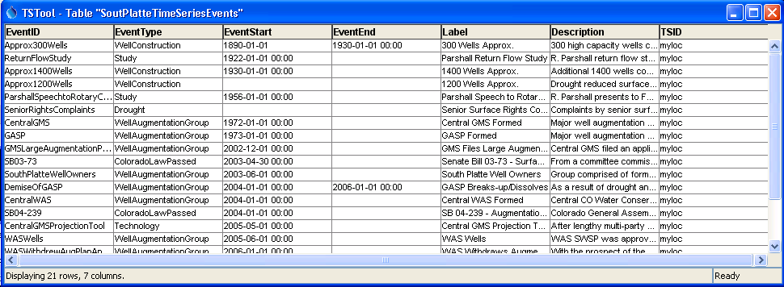

# Learn TSTool / Command / CreateTimeSeriesEventTable #

* [Overview](#overview)
* [Command Editor](#command-editor)
* [Command Syntax](#command-syntax)
* [Examples](#examples)
* [Troubleshooting](#troubleshooting)
* [See Also](#see-also)

-------------------------

## Overview ##

The `CreateTimeSeriesEventTable` command creates an event table associated with time series.
Time series events have the following properties:
	
* `EventID` – unique identifier for the event
* `EventType` – event type for the event data (e.g., natural disasters such as drought and flood, economic events, political or legal events)
* `EventStart` – starting date/time for the event
* `EventEnd` – ending date/time for the event
* `EventLocationType` – the type of location (e.g., County, State), used to join the event to time series by location
* `EventLocationID` – the location identifier (e.g., county name, state abbreviation), used to join the event to time series by location
* `EventLabel` – short string suitable for labeling a graph or map
* `EventDescription` – longer string suitable for a narrative description about the event
* `TSID` – time series identifier to uniquely identify the matching time series
	
Basic event data are associated with time series using location data to create a “time series event”,
which can then be used to annotate time series graph products.
The following figure illustrates event data in an Excel worksheet.
The column names do not need to be as shown.
Location data can be specified in multiple columns,
as shown in the far right of the figure, where non-blank values indicate the locations that are applicable for a location type.
<a href="../CreateTimeSeriesEventTable_InputTable.png">See also the full-size image.</a>



**<p style="text-align: center;">
Event Data before Relating to Time Series
</p>**

## Command Editor ##

The following dialog is used to edit the command and illustrates the
syntax of the command (in this case illustrating how an input event table can
be processed to create a time series event table).
It is envisioned that additional methods will be enabled in the future to create time series events,
for example to estimate extreme events from data.
<a href="../CreateTimeSeriesEventTable.png">See also the full-size image.</a>



**<p style="text-align: center;">
`CreateTimeSeriesEventTable` Command Editor
</p>**

## Command Syntax ##

The command syntax is as follows:

```text
CreateTimeSeriesEventTable(Parameter="Value",...)
```
**<p style="text-align: center;">
Command Parameters
</p>**

|**Parameter**&nbsp;&nbsp;&nbsp;&nbsp;&nbsp;&nbsp;&nbsp;&nbsp;&nbsp;&nbsp;&nbsp;&nbsp;&nbsp;&nbsp;&nbsp;&nbsp;&nbsp;&nbsp;&nbsp;&nbsp;&nbsp;&nbsp;&nbsp;&nbsp;&nbsp;&nbsp;&nbsp;&nbsp;&nbsp;&nbsp;&nbsp;&nbsp;&nbsp;&nbsp;&nbsp;&nbsp;&nbsp;&nbsp;&nbsp;&nbsp;&nbsp;&nbsp;&nbsp;&nbsp;&nbsp;&nbsp;&nbsp;&nbsp;&nbsp;&nbsp;|**Description**|**Default**&nbsp;&nbsp;&nbsp;&nbsp;&nbsp;&nbsp;&nbsp;&nbsp;&nbsp;&nbsp;&nbsp;&nbsp;&nbsp;&nbsp;&nbsp;&nbsp;&nbsp;&nbsp;&nbsp;&nbsp;&nbsp;&nbsp;&nbsp;&nbsp;&nbsp;&nbsp;&nbsp;|
|--------------|-----------------|-----------------|
|`TSList`|Indicates the list of time series to be processed, one of:<br><ul><li>`AllMatchingTSID` – all time series that match the TSID (single TSID or TSID with wildcards) will be processed.</li><li>`AllTS` – all time series before the command.</li><li>`EnsembleID` – all time series in the ensemble will be processed (see the EnsembleID parameter).</li><li>`FirstMatchingTSID` – the first time series that matches the TSID (single TSID or TSID with wildcards) will be processed.</li><li>`LastMatchingTSID` – the last time series that matches the TSID (single TSID or TSID with wildcards) will be processed.</li><li>`SelectedTS` – the time series are those selected with the [`SelectTimeSeries`](../SelectTimeSeries/SelectTimeSeries) command.</li></ul> | `AllTS` |
|`TSID`|The time series identifier or alias for the time series to be processed, using the `*` wildcard character to match multiple time series.  Can be specified using `${Property}`.|Required if `TSList=*TSID`|
|`EnsembleID`|The ensemble to be processed, if processing an ensemble. Can be specified using `${Property}`.|Required if `TSList=*EnsembleID`|
|`TimeSeriesLocations`<br>**required**|A dictionary of event location type and time series identifier format specifiers:<br>`LocationType1:Specifier1,`<br>`LocationType2:Specifier2`<br>The specifiers can use the `%` formats that are commonly used for time series alias parameters (e.g., `%L` is location identifier) and also the `${TS:property}` syntax that indicates general time series properties.  For example, time series location properties are often read when the time series is read, or can be set later with the [`SetTimeSeriesPropertiesFromTable`](../SetTimeSeriesPropertiesFromTable/SetTimeSeriesPropertiesFromTable) command.|None – must be specified.|
|`TableID`<br>**required**|The identifier for the original event table (which has not been matched with time series).|None – must be specified.|
|`IncludeColumns`|The names of columns in the `TableID` table to copy, separated by commas.  The required column tables listed below are always copied, but additional columns can be specified.  This parameter is not enabled.|Only copy the required columns.|
|`InputTableEventIDColumn`<br>**required**|The name of the column in the `TableID` table containing event identifiers.|None – must be specified.|
|`InputTableEventTypeColumn`<br>**required**|The name of the column in the `TableID` table containing event types.|None – must be specified.|
|`IncludeInputTableEventTypes`|The event types from the `TableID` table that should be included when processing (others will be ignored).|Include all event types.|
|`InputTableEventStartColumn`<br>**required**|The name of the column in the `TableID` table containing event start date/time.|None – must be specified.|
|`InputTableEventEndColumn`<br>**required**|The name of the column in the `TableID` table containing event end date/time.|None – must be specified.|
|`InputTableEventLocationColumns`<br>**required**|A dictionary of location types mapped to column names in the `TableID` table, using syntax:<br>`LocationType1:Column1,`<br>`LocationType2:Column2`|None – must be specified.|
|`InputTableEventLabelColumn`<br>**required**|The name of the column in the `TableID` table containing event labels.|None – must be specified.|
|`InputTableEventDescriptionColumn`<br>**required**|The name of the column in the `TableID` table containing event descriptions.|None – must be specified.|
|`NewTableID`<br>**required**|The identifier for the new time series event table, which will be a join of the `TableID` table and time series identifier column specified by the `OutputTableTSIDColumn`.|None – must be specified.|
|`OutputTableTSIDColumn`<br>**required**|The name of the column in the `NewTableID` table containing event types.|None – must be specified.|
|`OutputTableTSIDFormat`<br>**required**|The format specifier to be applied to the time series identifier to create the value for the `OutputTableTSIDColumn`.|None – must be specified.|

## Examples ##

See the [automated tests](https://github.com/OpenWaterFoundation/cdss-app-tstool-test/tree/master/test/regression/commands/general/CreateTimeSeriesEventTable).

The following figure illustrates the result of processing the input event table
with a time series that has property `basin=South Platte` and `division=1`,
which results in 21 of the 55 input rows being used in the output time series event table.
The results can then be used when processing time series products to
annotate the graphs (see the [`ProcessTSProduct`](../ProcessTSProduct/ProcessTSProduct) command).
<a href="../CreateTimeSeriesEventTable_OutputTable.png">See also the full-size image.</a>



**<p style="text-align: center;">
Event Data after Relating to Time Series
</p>**

## Troubleshooting ##

## See Also ##

* [ProcessTSProduct](../ProcessTSProduct/ProcessTSProduct) command
* [ReadTableFromExcel](../ReadTableFromExcel/ReadTableFromExcel) command
* [ReadTableFromDelimitedFile](../ReadTableFromDelimitedFile/ReadTableFromDelimitedFile) command
* [SetTimeSeriesPropertiesFromTable](../SetTimeSeriesPropertiesFromTable/SetTimeSeriesPropertiesFromTable) command
