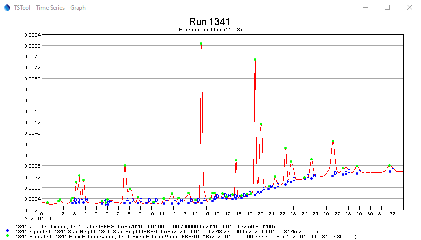

# TSTool / Command / CreateTimeSeriesEventTable #

*   [Overview](#overview)
    +   [Analyze Time Series for Events](#analyze-time-series-for-events)
    +   [Associate Historical Events with Time Series](#associate-historical-events-with-time-series)
*   [Command Editor](#command-editor)
*   [Command Syntax](#command-syntax)
*   [Examples](#examples)
*   [Troubleshooting](#troubleshooting)
*   [See Also](#see-also)

-------------------------

## Overview ##

**This command is under development and is experimental.**

The `CreateTimeSeriesEventTable` command creates an event table associated with time series,
which is a join of events and time series data.
A general goal is to associate event data with time series to allow further analysis and visualization,
for example to highlight time series peaks or show a period of drought or flood.

There are currently two uses for the command:

1.  Analyze time series data to identify events:
    *   peaks are determined from data
2.  Associate historical events with time series:
    *   time series properties, such as county or basin identifier,
        are used to associate the time series with historical events

### Analyze Time Series for Events

**This functionality is under development and is experimental.**

If an existing event table is not specified with `TableID` parameter,
then the time series will analyzed to create an event table that includes peak value events.
Currently, all command parameters and output format uses default values.
A peak event is defined as follows.
Enhancements to the analysis may implement additional refinements to define events.

*   The first value in the event is a low point:
    +   the previous value is >= the starting value
    +   the next value is > the starting value
*   The last value in the event is a low point:
    +   the previous value is > the ending value
    +   the next value is >= the ending value
*   The peak may include repeated values:
    +   Currently the repeated values must have exactly the same value.
    +   In the future repeated values may be allowed to have some variability.
*   All values after start but before the peak are greater than the previous value.
*   All values after the peak but before the end are less than the previous value (no flat sequences are allowed).
*   Event as part of longer slow increase:
    +   in the future, enhancements may be implemented to require events to fit within a limited time period
*   Event magnitude to avoid interpreting noise as events:
    +   the maximum difference between peak and starting value, and
        peak and ending value, must be >= 1% of the starting value
    +   this criteria may identify too many local peaks if the time series
        base value hovers around a value that is relatively large compared to the event local size

The output event table has the following columns.
If an extreme value is repeated, the extreme date/time and value are for the first repeated value.

**<p style="text-align: center;">
Event Table Columns
</p>**

| **Property**&nbsp;&nbsp;&nbsp;&nbsp;&nbsp;&nbsp;&nbsp;&nbsp;&nbsp;&nbsp;&nbsp;&nbsp;&nbsp;&nbsp;&nbsp;&nbsp;&nbsp;&nbsp;&nbsp;&nbsp;&nbsp;&nbsp;&nbsp;&nbsp; | **Description** |
| -- | -- |
| `TSID` | Time series identifier corresponding to the event. |
| `EventStartDateTime` | Starting date/time for the event. |
| `EventStartValue` | Starting time series value for the event. |
| `EventExtremeDateTime` | Extreme (peak) date/time for the event. |
| `EventExtremeValue` | Extreme (peak) time series value for the event. |
| `EventEndDateTime` | Ending date/time for the event. |
| `EventEndtValue` | Ending time series value for the event. |

The following graph illustrates the results of an analysis.
The blue markers indicate the location of events for a test dataset, marked at the starting y-value.
The green markers indicate the location of peaks, marked at the first peak value in each event.

**<p style="text-align: center;">

</p>**

**<p style="text-align: center;">
Time Series Event Analysis Results (<a href="../CreateTimeSeriesEventTable_Analysis.png">see also the full-size image</a>)
</p>**

### Associate Historical Events with Time Series

Historical data may be available in a table,
for example to indicate periods for floods and droughts, or events that occurred
at a specific date/time, such as new infrastructure or policy.
Such information can be "coded" to apply to one or more regions, such as county or river basin.
Time series spatial properties such as county and basin may
be available in time series data or can be determined from spatial data analysis
based on the longitude and latitude for a time series site.

The event table can therefore be related to the time series to create a joined time series event table.
The event table can then be used for additional analysis and visualization,
for example to convert the table into irregular interval time series or annotations that can be displayed on time series data graphs.

Time series events have the following properties, which can be included in the event table.

**<p style="text-align: center;">
Event Properties
</p>**

| **Property**&nbsp;&nbsp;&nbsp;&nbsp;&nbsp;&nbsp;&nbsp;&nbsp;&nbsp;&nbsp;&nbsp;&nbsp;&nbsp;&nbsp;&nbsp;&nbsp;&nbsp;&nbsp;&nbsp;&nbsp;&nbsp;&nbsp;&nbsp;&nbsp; | **Description** |
| -- | -- |
| `EventID` | Unique identifier for the event. |
| `EventType` | Event type for the event data (e.g., natural disasters such as drought and flood, economic events, political or legal events). |
| `EventStart` | Starting date/time for the event. |
| `EventEnd` | Ending date/time for the event. |
| `EventLocationType` | The type of location (e.g., `County`, `State`), used to join the event to time series by location. |
| `EventLocationID` | The location identifier (e.g., county name, state abbreviation), used to join the event to time series by location. |
| `EventLabel` | Short string suitable for labeling a graph or map. |
| `EventDescription` | Longer string suitable for a narrative description about the event. |
| `TSID` | Time series identifier to uniquely identify the matching time series. |

Basic event data are associated with time series using location data to create a “time series event”,
which can then be used to annotate time series graph products.
The following figure illustrates event data in an Excel worksheet.
Location data can be specified in multiple columns,
as shown in the far right of the figure, where non-blank values indicate the locations that are applicable for a location type.

**<p style="text-align: center;">

</p>**

**<p style="text-align: center;">
Event Data before Relating to Time Series (<a href="../CreateTimeSeriesEventTable_InputTable.png">see also the full-size image</a>)
</p>**

## Command Editor ##

The command is available in the following TSTool menu:

*   ***Commands(Table) / Table, Time Series Processing***

The following dialog is used to edit the command and illustrates the
syntax of the command (in this case illustrating how an input event table can
be processed to create a time series event table).
It is envisioned that additional methods will be enabled in the future to create time series events,
for example to estimate extreme events from data.

**<p style="text-align: center;">

</p>**

**<p style="text-align: center;">
`CreateTimeSeriesEventTable` Command Editor (<a href="../CreateTimeSeriesEventTable.png">see also the full-size image</a>)
</p>**

## Command Syntax ##

The command syntax is as follows:

```text
CreateTimeSeriesEventTable(Parameter="Value",...)
```
**<p style="text-align: center;">
Command Parameters (General)
</p>**

|**Parameter**&nbsp;&nbsp;&nbsp;&nbsp;&nbsp;&nbsp;&nbsp;&nbsp;&nbsp;&nbsp;&nbsp;&nbsp;|**Description**|**Default**&nbsp;&nbsp;&nbsp;&nbsp;&nbsp;&nbsp;&nbsp;&nbsp;&nbsp;&nbsp;&nbsp;&nbsp;&nbsp;&nbsp;&nbsp;&nbsp;&nbsp;&nbsp;&nbsp;&nbsp;&nbsp;&nbsp;&nbsp;&nbsp;&nbsp;&nbsp;&nbsp;|
|-------|-----------------|-----------------|
|`TSList`|Indicates the list of time series to be processed, one of:<br><ul><li>`AllMatchingTSID` – all time series that match the TSID (single TSID or TSID with wildcards) will be processed.</li><li>`AllTS` – all time series before the command.</li><li>`EnsembleID` – all time series in the ensemble will be processed (see the EnsembleID parameter).</li><li>`FirstMatchingTSID` – the first time series that matches the TSID (single TSID or TSID with wildcards) will be processed.</li><li>`LastMatchingTSID` – the last time series that matches the TSID (single TSID or TSID with wildcards) will be processed.</li><li>`SelectedTS` – the time series are those selected with the [`SelectTimeSeries`](../SelectTimeSeries/SelectTimeSeries.md) command.</li></ul> | `AllTS` |
|`TSID`|The time series identifier or alias for the time series to be processed, using the `*` wildcard character to match multiple time series.  Can be specified using `${Property}`.|Required if `TSList=*TSID`|
|`EnsembleID`|The ensemble to be processed, if processing an ensemble. Can be specified using `${Property}`.|Required if `TSList=*EnsembleID`|

**<p style="text-align: center;">
Command Parameters (Create events from existing table)
</p>**

|**Parameter**&nbsp;&nbsp;&nbsp;&nbsp;&nbsp;&nbsp;&nbsp;&nbsp;&nbsp;&nbsp;&nbsp;&nbsp;&nbsp;&nbsp;&nbsp;&nbsp;&nbsp;&nbsp;&nbsp;&nbsp;&nbsp;&nbsp;&nbsp;&nbsp;&nbsp;&nbsp;&nbsp;&nbsp;&nbsp;&nbsp;&nbsp;&nbsp;&nbsp;&nbsp;&nbsp;&nbsp;&nbsp;&nbsp;&nbsp;&nbsp;&nbsp;&nbsp;&nbsp;&nbsp;&nbsp;&nbsp;&nbsp;&nbsp;&nbsp;&nbsp;|**Description**|**Default**&nbsp;&nbsp;&nbsp;&nbsp;&nbsp;&nbsp;&nbsp;&nbsp;&nbsp;&nbsp;&nbsp;&nbsp;&nbsp;&nbsp;&nbsp;&nbsp;&nbsp;&nbsp;&nbsp;&nbsp;&nbsp;&nbsp;&nbsp;&nbsp;&nbsp;&nbsp;&nbsp;|
|-------|-----------------|-----------------|
|`TimeSeriesLocations`<br>**required**|A dictionary of event location type and time series identifier format specifiers:<br>`LocationType1:Specifier1,`<br>`LocationType2:Specifier2`<br>The specifiers can use the `%` formats that are commonly used for time series alias parameters (e.g., `%L` is location identifier) and also the `${TS:property}` syntax that indicates general time series properties.  For example, time series location properties are often read when the time series is read, or can be set later with the [`SetTimeSeriesPropertiesFromTable`](../SetTimeSeriesPropertiesFromTable/SetTimeSeriesPropertiesFromTable.md) command.|None – must be specified.|
|`TableID`<br>**required**|The identifier for the original event table (which has not been matched with time series).|None – must be specified.|
|`IncludeColumns`|The names of columns in the `TableID` table to copy, separated by commas.  The required column tables listed below are always copied, but additional columns can be specified.  This parameter is not enabled.|Only copy the required columns.|
|`InputTableEventIDColumn`<br>**required**|The name of the column in the `TableID` table containing event identifiers.|None – must be specified.|
|`InputTableEventTypeColumn`<br>**required**|The name of the column in the `TableID` table containing event types.|None – must be specified.|
|`IncludeInputTableEventTypes`|The event types from the `TableID` table that should be included when processing (others will be ignored).|Include all event types.|
|`InputTableEventStartColumn`<br>**required**|The name of the column in the `TableID` table containing event start date/time.|None – must be specified.|
|`InputTableEventEndColumn`<br>**required**|The name of the column in the `TableID` table containing event end date/time.|None – must be specified.|
|`InputTableEventLocationColumns`<br>**required**|A dictionary of location types mapped to column names in the `TableID` table, using syntax:<br>`LocationType1:Column1,`<br>`LocationType2:Column2`|None – must be specified.|
|`InputTableEventLabelColumn`<br>**required**|The name of the column in the `TableID` table containing event labels.|None – must be specified.|
|`InputTableEventDescriptionColumn`<br>**required**|The name of the column in the `TableID` table containing event descriptions.|None – must be specified.|
|`NewTableID`<br>**required**|The identifier for the new time series event table, which will be a join of the `TableID` table and time series identifier column specified by the `OutputTableTSIDColumn`.|None – must be specified.|
|`OutputTableTSIDColumn`<br>**required**|The name of the column in the `NewTableID` table containing event types.|None – must be specified.|
|`OutputTableTSIDFormat`<br>**required**|The format specifier to be applied to the time series identifier to create the value for the `OutputTableTSIDColumn`.|None – must be specified.|

## Examples ##

See the [automated tests](https://github.com/OpenCDSS/cdss-app-tstool-test/tree/master/test/commands/CreateTimeSeriesEventTable).

The following figure illustrates the result of processing the input event table
with a time series that has property `basin=South Platte` and `division=1`,
which results in 21 of the 55 input rows being used in the output time series event table.
The results can then be used when processing time series products to
annotate the graphs (see the [`ProcessTSProduct`](../ProcessTSProduct/ProcessTSProduct.md) command).

**<p style="text-align: center;">

</p>**

**<p style="text-align: center;">
Event Data after Relating to Time Series (<a href="../CreateTimeSeriesEventTable_OutputTable.png">see also the full-size image</a>)
</p>**

## Troubleshooting ##

See the main [TSTool Troubleshooting](../../troubleshooting/troubleshooting.md) documentation.

## See Also ##

*   [`ProcessTSProduct`](../ProcessTSProduct/ProcessTSProduct.md) command
*   [`ReadTableFromExcel`](../ReadTableFromExcel/ReadTableFromExcel.md) command
*   [`ReadTableFromDelimitedFile`](../ReadTableFromDelimitedFile/ReadTableFromDelimitedFile.md) command
*   [`SetTimeSeriesPropertiesFromTable`](../SetTimeSeriesPropertiesFromTable/SetTimeSeriesPropertiesFromTable.md) command
