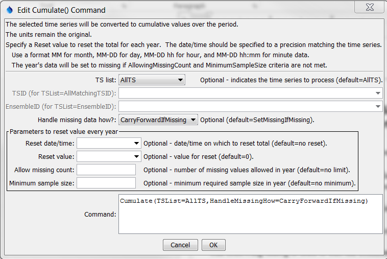
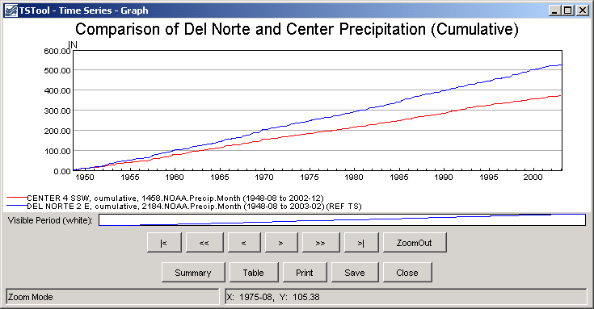

# TSTool / Command / Cumulate #

* [Overview](#overview)
* [Command Editor](#command-editor)
* [Command Syntax](#command-syntax)
* [Examples](#examples)
* [Troubleshooting](#troubleshooting)
* [See Also](#see-also)

-------------------------

## Overview ##

The `Cumulate` command converts a time series into cumulative values, which is useful for:
	
* comparing the cumulative trends of related time series
(e.g., nearby gages or precipitation gages) and can serve as a substitute
for the double-mass graph, which has difficulty handling missing data
* checking mass balance when routing time series
(the cumulative values before and after routine will track closely)
* computing year-to-date totals such as cumulative precipitation

## Command Editor ##

The following dialog is used to edit the command and illustrates the syntax of the command.
<a href="../Cumulate.png">See also the full-size image.</a>



**<p style="text-align: center;">
`Cumulate` Command Editor
</p>**

## Command Syntax ##

The command syntax is as follows:

```text
Cumulate(Parameter="Value",...)
```
**<p style="text-align: center;">
Command Parameters
</p>**

|**Parameter**&nbsp;&nbsp;&nbsp;&nbsp;&nbsp;&nbsp;&nbsp;&nbsp;&nbsp;&nbsp;&nbsp;&nbsp;&nbsp;&nbsp;&nbsp;&nbsp;&nbsp;&nbsp;&nbsp;&nbsp;&nbsp;|**Description**|**Default**&nbsp;&nbsp;&nbsp;&nbsp;&nbsp;&nbsp;&nbsp;&nbsp;&nbsp;&nbsp;&nbsp;&nbsp;&nbsp;&nbsp;&nbsp;&nbsp;&nbsp;&nbsp;&nbsp;&nbsp;&nbsp;&nbsp;&nbsp;&nbsp;&nbsp;&nbsp;&nbsp;|
|--------------|-----------------|-----------------|
|`TSList`|Indicates the list of time series to be processed, one of:<br><ul><li>`AllMatchingTSID` – all time series that match the TSID (single TSID or TSID with wildcards) will be processed.</li><li>`AllTS` – all time series before the command.</li><li>`EnsembleID` – all time series in the ensemble will be processed (see the EnsembleID parameter).</li><li>`FirstMatchingTSID` – the first time series that matches the TSID (single TSID or TSID with wildcards) will be processed.</li><li>`LastMatchingTSID` – the last time series that matches the TSID (single TSID or TSID with wildcards) will be processed.</li><li>`SelectedTS` – the time series are those selected with the [`SelectTimeSeries`](../SelectTimeSeries/SelectTimeSeries) command.</li></ul> | `AllTS` |
|`TSID`|The time series identifier or alias for the time series to be processed, using the `*` wildcard character to match multiple time series.  Can be specified using `${Property}`.|Required if `TSList=*TSID`|
|`EnsembleID`|The ensemble to be processed, if processing an ensemble. Can be specified using `${Property}`.|Required if `TSList=*EnsembleID`|
|`HandleMissingHow`|Indicate how to handle missing data, one of:<ul><li>`CarryForwardIfMissing` – carry forward the last non-missing value</li><li>`SetMissingIfMissing` – set the result to missing if the original value is missing.</li></ul><br>The only difference in output is that the period of missing data will either be blank or a horizontal line in graphs.|`SetMissingIfMissing`|
|`Reset`|A date to the precision of the time series (e.g., `01-01` for January 1 in a daily time series) that indicates when to reset the cumulative value to the initial value, before beginning to cumulate again.  Specifying the reset effectively defines the first timestep in a new year, whether calendar or some other year is being used for the cumulative values.  Use the format `MM-DD`, `MM-DD hh`, or `MM-DD hh:mm`.|Do not reset.|
|`ResetValue`|When Reset is specified:  the value to initialize the total at the Reset date/time, one of:<ul><li>`DataValue` – the data value from the original time series</li><li>`Number` – a number to use for the reset</li></ul>|`0` (zero)|
|`AllowMissingCount`|When Reset is specified:  the number of values allowed to be missing in a year.  If more values are missing, the entire year is set to missing.  The missing value count for the first year includes the period from analysis start to Reset.  A partial year at the end of the analysis period will not count as missing beyond the analysis end.|No limit on the number of missing values.|
|`MinimumSampleSize`|When Reset is specified:  the minimum number of non-missing values required in a year to perform the computation.    If fewer values are in the sample, the entire year is set to missing.  The missing value count for the first year includes the period from analysis start to Reset.  A partial year at the end of the analysis period will result in the sample size being less than the full year.|No minimum sample size is required.|

## Examples ##

See the [automated tests](https://github.com/OpenWaterFoundation/cdss-app-tstool-test/tree/master/test/regression/commands/general/Cumulate).

A sample command file to cumulate time series from the [State of Colorado’s HydroBase database](../../datastore-ref/CO-HydroBase/CO-HydroBase)
is as follows:

```text
# 1458 - CENTER 4 SSW
1458.NOAA.Precip.Month~HydroBase
# 2184 - DEL NORTE 2 E
2184.NOAA.Precip.Month~HydroBase
Cumulate(TSList=AllTS,HandleMissingHow=CarryForwardIfMissing)
```
The following graph illustrates cumulative data for two precipitation gages in the same region,
where missing data results in carrying forward the last known value.
<a href="../Cumulate_Graph.png">See also the full-size image.</a>



**<p style="text-align: center;">
Example Graph Showing Results of `Cumulate` Command
</p>**

## Troubleshooting ##

## See Also ##

* [`SelectTimeSeries`](../SelectTimeSeries/SelectTimeSeries) command
