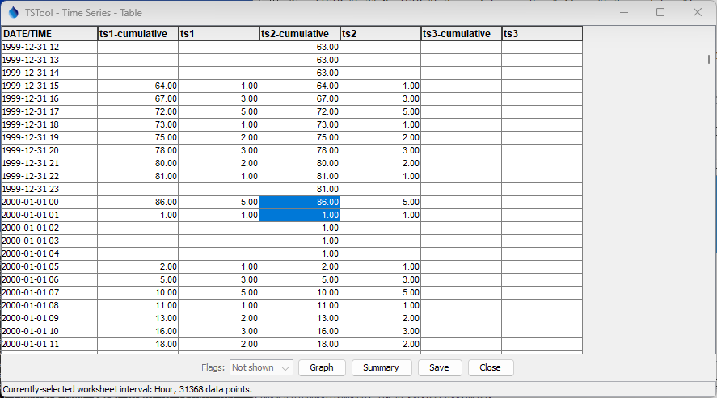
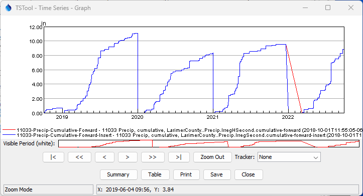

# TSTool / Command / Cumulate #

*   [Overview](#overview)
    +   [Cumulate Without Reset](#cumulate-without-reset)
    +   [Cumulate With Reset](#cumulate-with-reset)
    +   [Limitations](#limitations)
    +   [Double Mass Curve Analysis](#double-mass-curve-analysis)
*   [Command Editor](#command-editor)
*   [Command Syntax](#command-syntax)
*   [Examples](#examples)
*   [Troubleshooting](#troubleshooting)
*   [See Also](#see-also)

-------------------------

## Overview ##

The `Cumulate` command converts a time series into cumulative values, which is useful for:

*   comparing the cumulative trends of related time series
    (e.g., nearby gages or precipitation gages) and can serve as a substitute
    for the double-mass graph,
    which typically plots time series against each other on the X and Y axis
*   checking mass balance when routing time series
    (the cumulative values before and after routine will track closely)
*   computing year-to-date totals such as cumulative precipitation

### Cumulate Without Reset ###

The default behavior is to cumulate the values without resetting,
which results in an ever-increasing total of the data values.
This behavior is appropriate when reviewing the long-term trend,
for example to see if precipitation at a station is generally consistent over time.
Any noticeable deviation in the slope of the cumulative time series
indicates a sudden or cumulative change in values.

### Cumulate With Reset ###

A reset date/time can be applied, which causes cumulative values to reset to a new starting value once each year,
resulting in a "sawtooth" pattern.
The `Reset` parameter, which does not include year,
indicates the first date/time of the new year,
and by default the cumulative value will be initialized to the data value for that interval.
**Note that prior to TSTool 14.4.0 the default was `0`,
but this ignores the first interval's value in the cumulative value.**
Because values are being accumulated,
the reset date/time should be the first interval-ending time in the new year,
with behavior as shown in the following table.

The `AllowMissingCount` and `MinimumSampleSize` parameters provide
control over data quality for the values for a year.

Irregular time series may have values at any time
and therefore `AllowMissingCount` and `MinimumSampleSize` are applied only to actual data points.
The `Reset` value should be specified as the first ending (at) interval in the new year,
with appropriate precision for the date/times used in the irregular time series.

**<p style="text-align: center;">
Reset Behavior for Time Series Intervals
</p>**

| **Interval**&nbsp;&nbsp;&nbsp;&nbsp;&nbsp;&nbsp;&nbsp;&nbsp;&nbsp;&nbsp;&nbsp;&nbsp; | **Example `Reset`** | **Description** |
| -- | -- | -- |
| `Year` | | Reset should not be used because it provides no additional information. |
| `Month` | <ul><li>`01` - for calendar year</li><li>`10` - for "water year"</li></ul> | The last cumulative value will be on the twelfth month (e.g., 12 for calendar year) and the end-of-year value will by default be the sum of 12 month values. |
| `Day` | <ul><li>`01-01` - for calendar year</li><li>`10-01` - for "water year"</li></ul> | The last cumulative value will be on the last day of the year (e.g., December 31 for calendar year) and the end-of-year value will by default be the sum of 365 (or 366 if a leap year) day values. |
| `Hour` | <ul><li>`01-01 01` - for calendar year</li><li>`10-01 01` - for "water year"</li></ul> | The last cumulative value in a year will be at midnight (equivalent to hour 24) of the last day of the year. The first cumulative value in a year will be at interval ending (at) hour 1. |
| `Minute` | <ul><li>`01-01 00:01` - for calendar year</li><li>`10-01 00:01` - for "water year"</li></ul> | The last cumulative value in a year will be at midnight (equivalent to hour 24) of the last day of the year. The first cumulative value in a year will be at interval ending (at) minute 1. |
| `IrregSecond` | <ul><li>`01-01 00:00:01` - for calendar year</li><li>`10-01 00:00:01` - for "water year"</li></ul> | The last cumulative value will be at midnight (equivalent to hour 24) of the last day of the year. The first cumulative value in a year will be at the first date/time encountered in the year. If necessary, a new data point will be inserted at the reset date/time with value of `0.0`. |

The handling of reset for time series data intervals that involve time may
not seem intuitive because hour 0 of the first day of the next year is included in the last year.
For example, see the highlighted values in the following figure.
This behavior is because the date/time `2000-01-01 00` is equivalent to `1999-12-31 24`,
which is the end of the last interval of the year.

**<p style="text-align: center;">

</p>**

**<p style="text-align: center;">
`Cumulate` Results for Hourly Data with Reset (<a href="../Cumulate_hour_table.png">see also the full-size image</a>)
</p>**

The reset for irregular interval time series may lead to the first value in the year being
at a time that is significantly after the reset time.
The `InsertResetPoint=True` parameter can be used to insert a zero data point at the `Reset` date/time
if a data point does not exist, which ensures that the yearly accumulation starts at a zero value.
The following example illustrates the difference between inserting a point (and not).
If used with regular interval time series, `InsertResetPoint=True` will ensure that a non-missing value
is preset at the `Reset` date/time, using zero if the value was originally missing.

**<p style="text-align: center;">

</p>**

**<p style="text-align: center;">
`Cumulate` Results for Irregular Time Series with Inserted Reset Point (<a href="../Cumulate_insert.png">see also the full-size image</a>)
</p>**

## Limitations ##

A special case may occur for irregular time series when the time precision for data is sub-second
for the first interval in a new year.

For example, a data value may exist at second `0` and non-zero fractional second in the first
interval of the new year.
If the time series interval is `IrregSecond` and time comparisons are made to the second,
the data value will be added to the end of the previous year, as if a midnight value.
However, the value should be added to the first second of the new year.
This error is generally negligible but could impact cumulative
values on the midnight boundaries between years.

Future software enhancements may handle this case.

## Double Mass Curve Analysis ##

A double mass curve analysis 
can be used to compare sensor/station data to detect whether
a change in condition has occurred at some point that is impacting data consistency.
For example, nearby precipitation station data may diverge from each other at some
point due to a change in equipment, physical surroundings, or other change.

The analysis may occur by comparing station time series directly,
or comparing a station's time series to a basin average of multiple stations.
Because time series are compared at matching date/time,
the analysis of irregular interval time series requires converting
to regular interval time series to perform a traditional double mass analysis.

See the following resources for double mass plots:

* [Double-Mass Curves, USGS, 1960](https://pubs.usgs.gov/wsp/1541b/report.pdf)
* [Analysis and Presentation of Rainfall Data](https://theconstructor.org/water-resources/analysis-presentation-of-rainfall-data/4493/)
* See also the topic in many hydrology books and online videos

TSTool does not currently provide traditional double mass curve plots,
where values from two time series are plotted against each other,
one on the X axis and one on the Y axis.
Instead, the following alternatives can be used:

1.  plot the cumulative time series over time as a typical
    time series plot, with X axis being time and Y axis being the cumulative values,
    and note the change in slope
    (can be done with regular or irregular interval time series)
2.  plot the cumulative time series using the ***XY Scatter Plot***
    (if necessary, use commands to convert the original data to a regular interval first
    to allow timesteps to be aligned)
3.  use TSTool to process the time series into cumulative form and then
    write to Excel or other format for plotting

TSTool handles missing data and different data intervals that impact double mass analysis.
However, additional software enhancements are needed to provide a traditional double mass plot
within TSTool and to automate calculation of slope and correction factors.
Such work may be difficult to automated due to the need to visually interpret breaks in
the slope of lines on graphs.
TSTool graph annotations can be used to indicate slope and corrections.

## Command Editor ##

The command is available in the following TSTool menu:

*   ***Commands / Manipulate Time Series***

The following dialog is used to edit the command and illustrates the syntax of the command.

**<p style="text-align: center;">

</p>**

**<p style="text-align: center;">
`Cumulate` Command Editor (<a href="../Cumulate.png">see also the full-size image</a>)
</p>**

## Command Syntax ##

The command syntax is as follows:

```text
Cumulate(Parameter="Value",...)
```
**<p style="text-align: center;">
Command Parameters
</p>**

|**Parameter**&nbsp;&nbsp;&nbsp;&nbsp;&nbsp;&nbsp;&nbsp;&nbsp;&nbsp;&nbsp;&nbsp;&nbsp;&nbsp;&nbsp;&nbsp;&nbsp;&nbsp;&nbsp;&nbsp;&nbsp;&nbsp;|**Description**|**Default**&nbsp;&nbsp;&nbsp;&nbsp;&nbsp;&nbsp;&nbsp;&nbsp;&nbsp;&nbsp;&nbsp;&nbsp;&nbsp;&nbsp;&nbsp;&nbsp;&nbsp;&nbsp;&nbsp;&nbsp;&nbsp;&nbsp;&nbsp;&nbsp;&nbsp;&nbsp;&nbsp;|
|--------------|-----------------|-----------------|
|`TSList`|Indicates the list of time series to be processed, one of:<br><ul><li>`AllMatchingTSID` – all time series that match the TSID (single TSID or TSID with wildcards) will be processed.</li><li>`AllTS` – all time series before the command.</li><li>`EnsembleID` – all time series in the ensemble will be processed (see the EnsembleID parameter).</li><li>`FirstMatchingTSID` – the first time series that matches the TSID (single TSID or TSID with wildcards) will be processed.</li><li>`LastMatchingTSID` – the last time series that matches the TSID (single TSID or TSID with wildcards) will be processed.</li><li>`SelectedTS` – the time series are those selected with the [`SelectTimeSeries`](../SelectTimeSeries/SelectTimeSeries.md) command.</li></ul> | `AllTS` |
|`TSID`|The time series identifier or alias for the time series to be processed, using the `*` wildcard character to match multiple time series.  Can be specified using `${Property}`.|Required if `TSList=*TSID`|
|`EnsembleID`|The ensemble to be processed, if processing an ensemble. Can be specified using `${Property}`.|Required if `TSList=*EnsembleID`|
|`HandleMissingHow`|Indicate how to handle missing data, one of:<ul><li>`CarryForwardIfMissing` – carry forward the last non-missing value</li><li>`SetMissingIfMissing` – set the result to missing if the original value is missing.</li></ul><br>For regular interval time series, a period of missing data will have a data gap in graphs.  For irregular time series, non-missing data points will be connected and may span a long period.|`SetMissingIfMissing`|
|`Reset`|A zero-padded date/time (omitting year) to the precision of the time series (e.g., `01-01` for January 1 in a daily time series and `10-01` for "water year") that indicates when to reset the cumulative value to the initial value, before beginning to cumulate again.  Specifying the reset defines the first timestep in a new year, whether calendar or some other year is being used for the cumulative values.  Use zero-padded values and the format `MM-DD`, `MM-DD hh`, `MM-DD hh:mm`, or `MM-DD hh:mm:ss` (for `IrregSecond` interval time series).  Can use `${Property}` notation. | Do not reset (cumulate for the entire period).|
|`ResetValue`|When `Reset` is specified:  the value to initialize the total at the `Reset` date/time for the year, one of:<ul><li>`DataValue` – the data value from the original time series.</li><li>`Number` – a number (e.g., `0`) to use for the reset. As of TSTool 14.4.0 a numerical value is discouraged and may be removed in the future because it ignores the actual data value at the `Reset` date/time and thereby reduces the cumulative value. Instead, see the `InsertResetPoint` parameter, which provides more granularity in handling missing values at the start of each year.</li></ul>| `DataValue` (as of TSTool 14.4.0),<br>`0` (zero) (prior to TSTool 14.4.0). |
| `InsertResetPoint` | Insert a zero-value data point at the `Reset` date/time and set the data flag to `RESET` if the following conditions are met.  This can improve visualization and provides a starting point for `HandleMissingHow=CarryForwardIfMissing` because a non-missing year-start value is used.<br>For regular interval time series:<ul><li>If the data value at `Reset` date/time is missing, set the reset value to zero.</li></ul> For irregular interval time series:<ul><li>If the first data point in the year matches the `Reset` date time and has a missing value, set the value to zero (no new data point is inserted).</li><li>If the first data point in the new year has a date/time that is greater than the `Reset` date/time in the year, when compared using a date/time precision consistent with the time series, insert a zero value point. For example, for `IrregSecond` interval time series and `Reset=01-01 00-00-01`, a point would be inserted at the first second in the new year.</li></ul>| The first data point in the year is used for the reset. For regular time series the value may be missing, which will result in missing even if `HandleMissingDataHow=CarryForwardIfMissing`.  For irregular time series the date/time may occur after the `Reset` date/time. |
|`AllowMissingCount`|When Reset is specified:  the number of values allowed to be missing in a year.  If more values are missing, the entire year is set to missing.  The missing value count for the first year includes the period from analysis start to Reset.  A partial year at the end of the analysis period will not count as missing beyond the analysis end. Irregular time series data values must have a missing value for the value, such as `NaN`. |No limit on the number of missing values.|
|`MinimumSampleSize`|When Reset is specified:  the minimum number of non-missing values required in a year to perform the computation. If fewer values are in the sample, the entire year is set to missing.  The missing value count for the first year includes the period from analysis start to Reset.  A partial year at the end of the analysis period will result in the sample size being less than the full year.|No minimum sample size is required.|

## Examples ##

See the [automated tests](https://github.com/OpenCDSS/cdss-app-tstool-test/tree/master/test/commands/Cumulate).

A sample command file to cumulate time series from the [State of Colorado’s HydroBase database](../../datastore-ref/CO-HydroBase/CO-HydroBase.md)
is as follows:

```text
# 1458 - CENTER 4 SSW
1458.NOAA.Precip.Month~HydroBase
# 2184 - DEL NORTE 2 E
2184.NOAA.Precip.Month~HydroBase
Cumulate(TSList=AllTS,HandleMissingHow=CarryForwardIfMissing)
```
The following graph illustrates cumulative data for two precipitation gages in the same region,
where missing data results in carrying forward the last known value.

**<p style="text-align: center;">

</p>**

**<p style="text-align: center;">
Example Graph Showing Results of `Cumulate` Command (<a href="../Cumulate_Graph.png">see also the full-size image</a>)
</p>**

## Troubleshooting ##

## See Also ##

*   [`SelectTimeSeries`](../SelectTimeSeries/SelectTimeSeries.md) command
